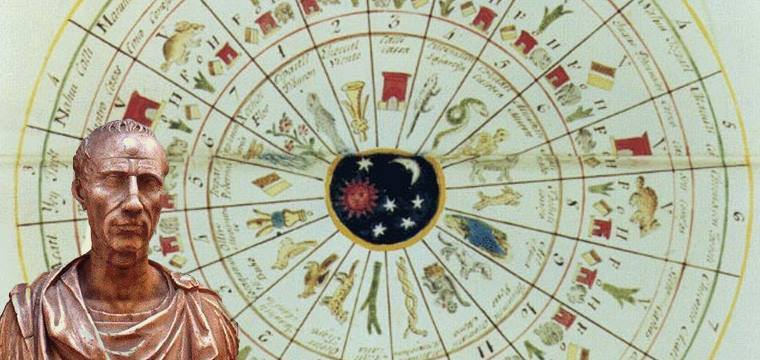

### 2020

> No dobre rozpoczęcie nowego roku i dekady przypominamy, że przez najbliższe 9 lat (a właściwie nieco ponad 8) czekają nas 3 halvingi bitcoina. Roczna inflacja w bitcoinie na koniec tego dziesięciolecia będzie wynosiła około 0,45% a nagroda za blok 1,5625 BTC

### 1988

1988 władze komunistyczne zakończyły wieloletnią akcję zagłuszania Radia Wolna Europa.
Działanie to było prowadzone od roku 1952 czyli już trzy lata po uruchomieniu tej rozgłośni.
Zagłuszanie RWE prowadzono poza granicami Polski. Główne zagłuszarki o mocy dwukrotnie większej niż nadajniki RWE zainstalowano w Samarze, Nikołajewie, Leningradzie oraz Wilnie, ale również i samej Warszawie i Raszynie. Do zakłócania sygnału stosowano urządzenia produkcji polskiej, tak zwane "Szmitówki" nazwane tak od nazwiska ich konstruktora. Tak było do roku 1956. Później zagłuszanie programów nadawanych do Polski prowadzono już wyłącznie z terenu ZSRR i innych państw socjalistycznych: z Bułgarii - do kwietnia 1962, z Węgier - do marca 1963, z Rumunii - do września 1963, z Czechosłowacji - do maja 1964. Gdy w marcu 1970 Warszawa wystąpiła z ostrymi atakami pod adresem RWE z powodu wypaczonego obrazu polsko-zachodnioniemieckich rozmów rządowych, to w grudniu 1970 Polska zaczęła nadawać "programy muzyczne" (Trójkę PR) na falach RWE. Jednakże ze względu na słabe pokrycie kraju sygnałem zakłócającym trzeba było szukać innego rozwiązania technicznego. Państwowa Inspekcja Radiowa dostała wówczas polecenie sprawdzenia jakości odbioru polskich audycji Radia Moskwa w Polsce, a następnie w oparciu o wyniki polskiego nasłuchu (zleconego rozgłośniom Polskiego Radia), w Moskwie podjęto decyzję o włączeniu do zagłuszania Rozgłośni Polskiej RWE wytypowanych nadajników krótkofalowych ZSRR. Treścią zagłuszającą audycje RWE były nagrania różnych zespołów, począwszy od folklorystycznych aż po jazzowe, zrealizowane w Polskim Radiu. Fonogramy i kilka magnetofonów studyjnych Polskie Radio przekazało Międzymiastowej Stacji Telefonicznej w Warszawie przy ul. Nowogrodzkiej. Stamtąd „program muzyczny” odgrywany na magnetofonach szedł kablem do Moskwy i dalej do nadajników emitujących na Polskę.
Podobnych sprytnych modyfikacji było do roku 1988 jeszcze bardzo dużo.
Na zdjęciu demontaż zagłuszarki w Wilnie, kwiecień 1989.

### 1941

1941 roku w Londynie utworzona została placówka polskiego oficera łącznikowego przy Dowództwie Lotnictwa Bombowego RAF Bomber Command. Była ona zalążkiem polskiego Sztabu Dowództwa Lotnictwa Bombowego. Dowódcą mianowany został pułkownik pilot Stanisław Karpiński.

  

### 1919

1919 roku w Homlu urodził się Marek Edelman (zdjęcie)- polski lekarz kardiolog, działacz polityczny, jeden z przywódców powstania w gettcie warszawskim. W czasie okupacji był żołnierzem Żydowskiej Organizacji Bojowej. W czasie Powstania Warszawskiego walczy w podporządkowanym Armii Ludowej plutonie ŻOB na Starym Mieście. W roku 1951 ukończył studia na Akademii Medycznej w Łodzi, gdzie mieszkał prawie do końca życia. W latach 70 tych był współpracownikiem Komitetu Obrony Robotników. Był jednym z sygnatariuszy tzw "Listu 101"-protestu skierowanego do władz PRL przeciwko zmianom w konstytucji. W latach 80 tych był działaczem Solidarności. W 1983 odmówił władzom PRL udziału w Honorowym Komitecie Obchodów 40-leciaPowstania w Getcie, natomiast SB uniemożliwiła mu udział w obchodach. W roku 1988 przewodniczył Komisji ds. Mniejszości Narodowych w ramach Komitetu Obywatelskiego przy Lechu Wałęsie .
Uczestniczył w obradach podzespołu do spraw zdrowia w ramach rozmów Okrągłego Stołu. Kawaler Orderu Orła Białego (1998), doktor honoris causa Uniwersytetu Medycznego w Łodzi i Uniwersytetu Yale.
Zmarł 2 października 2009 roku w Warszawie.

  

### 1918

https://en.wikipedia.org/wiki/Hyperinflation

### 1860

W Królestwie Polskim został wprowadzony do obiegu pierwszy polski znaczek pocztowy.
Przedstawiał on herb Królewstwa Polskiego i przeznaczony był tylko do wewnętrzenego obrotu. Do zagranicznego obrotu dopuszczano go tylko w przypadku korespondencji wysyłanej do Rosji. Znaczek ten zastąpił wprowadzone do obiegu dwa lata wcześniej znaczki rosyjskie, a jego cena wynosiła 10 kopiejek.

  

### 1819

1819 roku w Królestwie Polskim zostały wprowadzone tak zwane miary nowopolskie czyli system miar, który zastąpił obowiązujące do tego czasu miary staropolskie.
Podstawowymi jednostkami miar nowopolskich były cal, ćwierć, stopa, łokieć (długość), cal geometryczny, stopa geometryczna, sążeń, pręt, sznur mierniczy (jednoski budowlane), staja i mila (drogowe), pręt kwadratowy i morga (miary powierzchni), łaszt, korzec, ćwierć i garniec (ciała sypkie), stągiew, beczka, kwarta (ciecze), cetnar, kamień, funt, uncja (handlowe).
System ten obowiązywał do roku 1849, kiedy to wprowadzono miary rosyjskie.

  

### 1659

Potop szwedzki: król Jan Kazimierz wjechał triumfalnie do odzyskanego Torunia.

Toruń miał w swej historii okresy wzlotów i upadków, podobnie jak i inne miasta. Wiele ucierpiał od naszych północnych sąsiadów zza Bałtyku. Największe zniszczenia miasto przeżyło w dobie wojen szwedzkich w latach 1626-1629, 1655-1660 i podczas wojny północnej 1700-1721.

W czasie pierwszego najazdu szwedzkiego na Polskę w 1626 r., głównym teatrem działań wojennych było ujście Wisły, przy czym wojna dosięgła też Toruń. 16 i 17 lutego 1629 r. wojska króla szwedzkiego Gustawa Adolfa pod wodzą feldmarszałka Wrangla przypuściły szturm na Toruń. Na całe szczęście atak ten zakończył się niepowodzeniem, co miasto zawdzięczało bohaterskiej postawie płk. królewskiego Gerarda Denhoffa i burmistrza Jana Preussa. Nie obeszło się jednak bez strat materialnych. Uległy zniszczeniu bramy miejskie i mury, a przedmieścia zostały spalone.

Ponownie „czarne chmury” zebrały się nad Toruniem w czasie „potopu” w 1655 r. 26 listopada znów pod miastem stanęli Szwedzi i zaczęło się regularne oblężenie. Tym razem Toruń skapitulował wobec króla Szwecji Karola X Gustawa. Stało się tak 4 grudnia 1655 r. za namową zdrajcy Hieronima Radziejowskiego, który towarzyszył Szwedom. Akt kapitulacji podpisany przez burmistrza Henryka Strobanda powodował, że miasto wypowiadało przysięgę wierności królowi polskiemu Janowi Kazimierzowi i uznawało króla szwedzkiego za nowego pana, ponadto Toruń musiał wpuścić załogę szwedzką i zapłacić kontrybucję. De facto władzę w Toruniu objął gubernator Prus Bengt Oxenstjerna i zaczął się okres okupacji, znaczony uciążliwymi rekwizycjami przez Szwedów.

Na odmianę swego losu gród Kopernika czekał do 1658 r., kiedy został odbity z rąk szwedzkich. Teraz, stroną oblegającą Toruń były oddziały polskie wspierane przez Austriaków. Było o co walczyć, jako że Toruń stanowił klucz strategiczny do kontroli nad dolnym biegiem Wisły. Pod miastem skoncentrowano siły liczące ok. 20 tys. żołnierzy, nad którymi naczelne dowództwo objął Jerzy Lubomirski, marszałek wielki i hetman polny koronny. 26 września rozpoczęło się oblężenie, które po 25 tygodniach doprowadziło załogę szwedzką do kapitulacji 22 grudnia.

1 stycznia 1659 r. wjechał triumfalnie do Torunia król Jan Kazimierz, któremu Rada Miejska musiała złożyć przysięgę wierności. Wprawdzie król udzielił Toruniowi amnestii za kolaborację ze Szwedami, ale nie szczędził mu też gorzkich słów za zdradę Rzeczypospolitej. Końcowy bilans potopu i okupacji szwedzkiej był dla miasta katastrofalny, tym bardziej, że cały czas szalała zaraza. Zniszczenia wojenne, koszty utrzymywania garnizonu szwedzkiego, rekwizycje i zwykłe rabunki doprowadziły Toruń do kryzysu gospodarczego.

Toruń w czasie wojny północnej:

Po potopie szwedzkim Toruń rozpoczął dzieło odbudowy, niestety brutalnie przerwane wybuchem kolejnej wojny – była to wojna północna 1700-1721. I znów na Toruń podobnie jak na całą Polskę spadł jak grom z nieba – najazd szwedzki, któremu przewodził król Szwecji Karol XII. Kiedy Szwedzi podeszli pod toruńską twierdzę i zaczęli intensywne bombardowanie we wrześniu 1703 r., miasto podjęło walkę i przeszło do obrony. Dopiero po prawie miesięcznej blokadzie załoga saska i mieszczaństwo Torunia skapitulowało 14 października 1703 r. Skutki tej honorowej walki były straszliwe – w wyniku bombardowań szwedzkich zapalił się ratusz i spłonęło całe wnętrze oraz zabytkowy hełm wieży. Ofiarą pożaru było też wiele kamienic w obrębie Rynku Staromiejskiego. W sumie znaczna część starówki legła w ruinie. Wszak to nie koniec nieszczęścia – liczne przemarsze obcych wojsk – szwedzkich, saskich, rosyjskich – a także polskich i ich rozboje, rabunki i gwałty dopełniały obrazu grozy. A Toruń znów był dotknięty plagą zarazy w latach 1708-1710, która następnie rozprzestrzeniła się na całe Prusy Królewskie.

Na marginesie wojny północnej warto odnotować, że w jej trakcie w październiku 1709 r. doszło w Toruniu do historycznego spotkania dwóch monarchów: króla Augusta II i cara Piotra I. Ten ostatni zakwaterował się w hotelu „Pod Trzema Koronami”. Obaj przebywali w Toruniu przez dwa tygodnie, a czas upływał im nie tylko na dyskusjach politycznych lecz i setnej zabawie oraz tęgim piciu (ponoć obydwaj mieli „mocne głowy”).

W rodzimej świadomości historycznej przechowywana jest pamięć o najeźdźcach ze wschodu lub zachodu Europy, którzy grabili nasz kraj. Rzadziej zachowujemy pamiętamy o agresorach z północy, jakimi byli Szwedzi. A ci też łupili polską ziemię, ile się tylko dało, a jej skarby wywozili do Szwecji.

### 1345

1345 roku w czasie wojny polsko -czeskiej król Polski Kazimierz III Wielki i cesarz, rzymski Ludwik IV Bawarski zawarli pakt skierowany przeciwko Luksemburgom.
Na jego mocy obaj władcy zobowiązali się do wzajemnej pomocy wojskowej w sile czterystu zbrojnych i tylu samo łuczników. Zobowiązanie ze strony polskiego władcy dotyczyło również synów cesarza, któremu Kazimierz obiecał także uderzenie na wroga swoimi siłami od strony własnego kraju. Polski król zobowiązał się również do nie zawierania sojuszu z Luksemburgami bez zgody swojego sprzymierzeńca.

### 45 r. p.n.e.

Początek biegu kalendarza juliańskiego, wprowadzonego przez Juliusza Cezara.

Kalendarz juliański to kalendarz słoneczny opracowany na życzenie Juliusza Cezara przez astronoma egipskiego Sosygenesa i wprowadzony w życie w roku 45 p.n.e. Kalendarz ten był identyczny z kalendarzem opracowanym w roku 239 p.n.e. przez Aleksandryjczyka Aristarchusa z Samos i oparty był o słoneczny rok z dwunastoma miesiącami i 365 dniami wraz z dodatkowym dniem co 4 lata.

Powodem reformy kalendarza było to, że wcześniej stosowany księżycowy kalendarz rzymski rozregulował się, w wyniku czego w 46 p.n.e. kalendarzowy grudzień wypadał we wrześniu.

Kalendarz juliański utrzymał wszystkie zewnętrzne cechy poprzedniego, księżycowo-słonecznego kalendarza rzymskiego. W wyniku reformy zmianie uległa długość poszczególnych miesięcy. Rok religijny zaczynał się w marcu, więc luty w roku religijnym był miesiącem ostatnim.

- Ianuarius (31) - Styczeń,

- Februarius (28) - Luty,

- Martius (31) - Marzec,

- Aprilis (30) - Kwiecień,

- Maius (31) - Maj,

- Iunius (30) - Czerwiec,

- Iulius (31) - Lipiec,

- Augustus (31) - Sierpień,

- September (30) = Wrzesień,

- October (31) = Październik,

- November (30) = Listopad,

- December (31) = Grudzień,

W IV w. n.e. zaczęto stosować podział miesiąca na tygodnie, które składały się z siedmiu dni:

- Lunae (poniedziałek)

- Martis (wtorek)

- Mercurii (środa)

- Iovis (czwartek)

- Veneris (piątek)

- Saturni (sobota)

- Solis (niedziela)

Średnia długość roku juliańskiego wynosi 365,25 dnia, lecz rzeczywista długość roku astronomicznego wynosi 365,2422 dnia. Kalendarz juliański opóźniał się więc o 1 dzień co 128 lat w stosunku do astronomicznego. W ten sposób do końca wieku XVI zawieruszyło się w kalendarzu juliańskim aż 10 dni. Gdyby kalendarz ten dalej obowiązywał, to w roku 10565 pierwszy dzień wiosny zbiegłby się Nowym Rokiem (1 stycznia).

  

---

<a href="https://github.com/TomaszWaszczyk/historia.waszczyk.com/edit/master/src/content/january-1.md" target="_blank">Edytuj tę stronę dzieląc się własnymi notatkami!</a>
