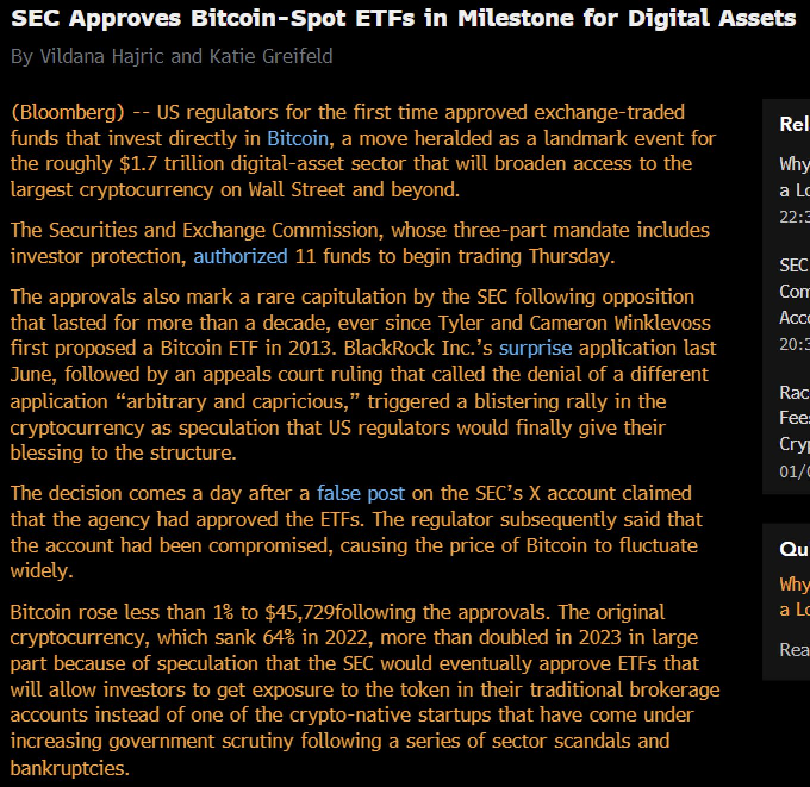
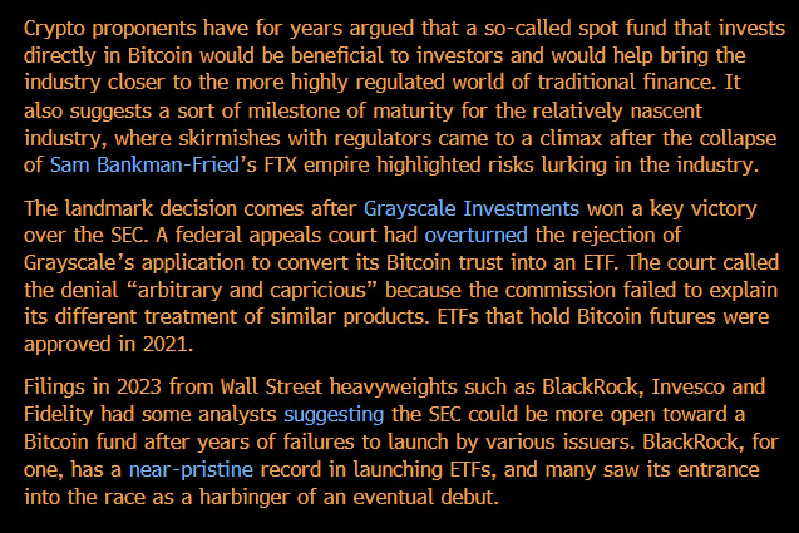
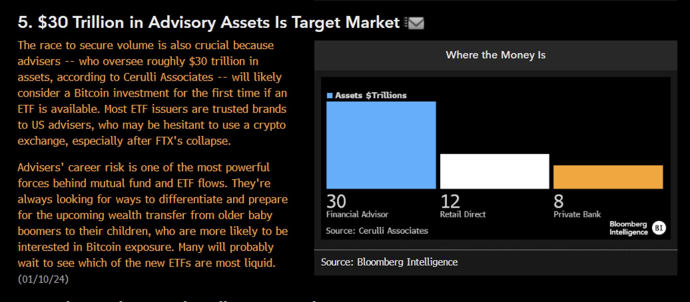
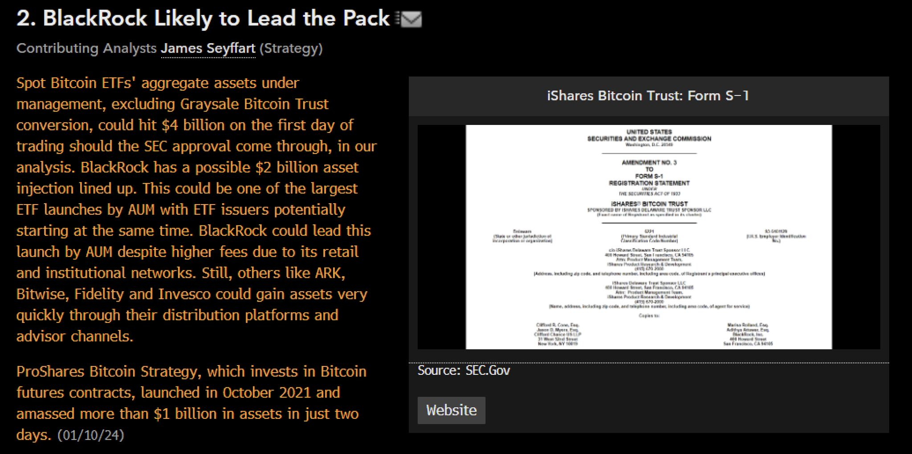
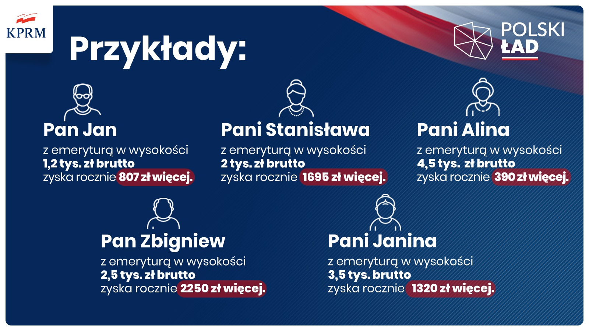
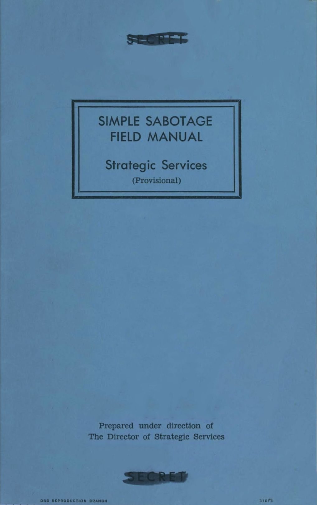

### 2023

  

  

  

  

### 2022

> 94% emerytów zyska na zmianach podatkowych.

  

### 2021

> "Jeżeli popatrzymy na średnioroczną inflację względem 2021 roku, to w 2022 wyniesie ona ok. 7 proc. W mojej ocenie od drugiego półrocza tego roku będziemy obserwowali stopniowe wygaszanie inflacji, więc jej dynamika będzie coraz niższa" - Paweł Borys

---

FAZ: Putin dąży do nowej Jałty i stref wpływu w Europie

Władimir Putin dąży do nowej Jałty i podziału Europy na strefy wpływów. Zachód nie powinien ustępować w kwestii prawa do wolnego wyboru sojuszy. Czy Emmanuel Macron podejmie rozmowy z Kremlem na własną rękę?

---

Amazon Web Services said it was banning Parler due to the “very real risk to public safety”... A więc Amazon usuwa Parlera ze swoich serwerów hostingowych.

John Matze, CEO Parler'a: "W niedzielę o północy, Amazon zamknie wszystkie nasze serwery aby kompletnie usunąć wolność słowa z sieci. Być może nie będziemy obecni nawet przez tydzień gdyż musimy wszystko zacząć budować od zera."

Deep State, będąca de facto systemem nieformalnych powiązań likwiduje przestrzeń swobodnej wypowiedzi. Usuwa integralność swobód obywatelskich z jednostką i przesuwa ją na wyższy, znany w Chinach poziom. To teraz korporacje definiować będą zakres wymiany informacji, jej "jakość". Ale kto personalnie zarządza Big Social Media, że autorytarnie wyłączają one komunikację urzędujacego prezydenta USA z jego wyborcami?

Od początku Covid-19 widać, że instytucje państw, ich politycy są jedynie marionetkami w rękach nielicznych, którzy zarządzają światem. Zlecenia wykonują omijająć, bądź też łamiąc prawo. Mamy więc terror; dziś jedynie komunikacyjny, choć jutro...

W 1947 roku żydokomuna sfałszowała w Polsce wybory. Działalność nielicznych z NKVD/UB skutkowała setkami tyś. ofiar, dekadami niewoli całego polskiego społeczeństwa. Akcja Deep State z 06.01.21 to ofiary i zniewolenie w pełnej, globalnej skali.

---

Po zamieszkach i szturmie na Kapitol w Waszyngtonie policja w Berlinie wzmocni ochronę gmachu niemieckiego parlamentu - Bundestagu. Informuje o tym gazeta „Bild am Sonntag”, która dotarła do pisma przewodniczącego izby Wolfganga Schaeublego do niemieckich deputowanych.

Jak czytamy, Schaeuble poprosił niemieckie ministerstwo spraw zagranicznych o przygotowanie raportu na temat wydarzeń w Waszyngtonie i na jego podstawie, razem z władzami centralnymi oraz władzami Berlina, będzie wyjaśniał jakie wnioski należy wyciągnąć co do bezpieczeństwa Bundestagu.
Schaeuble obwinia Trumpa

W liście do deputowanych przewodniczący Bundestagu obarcza winą za wydarzenia na Kapitolu prezydenta USA Donalda Trumpa. Jak napisał, mieliśmy do czynienia z „atakiem na parlament i demokrację w wykonaniu motłochu podpuszczonego przez odchodzącego prezydenta”.

---

Tomka opinia: W Polsce prawdopodobnie do 6 miesięcy nastąpią protesty spowodowane tzw. lockdown co spowoduje pretekst dla rządu do użycia siły wobec "obywateli".

---

### 2019

WYNAGRODZENIA.
Moi drodzy,
publikuję wcześniej zapowiadany tekst o wynagrodzeniach różnych grup zawodowych i naszej pozycji na ich tle.
Wyrażam swoje osobiste zdanie. Oczywiście nie oceniam zarobków wybranych grup zawodowych (jestem daleki od określania wartości wynagrodzeń czy stwierdzenia: za dużo, za mało, w sam raz), a przedstawiam pewien wzór, na bazie którego można ustalić wynagrodzenia lekarzy (albo opisane poniżej płace uznać za rzeczowe i adekwatne w tym kontekście).
Dane pochodzą z raportu Hays Poland uzyskanego w 2017 roku (grafika).
Pierwsze wartości na grafice dotyczą miesięcznego wynagrodzenia w polskich złotych brutto za przepracowany pełen etat na danym stanowisku. Liczby w nawiasach określają najczęściej proponowane pensje na danym stanowisku.
Przechodząc do meritum. 
Jak zapewne wiecie, na kanwie protestu rezydentów toczącego się na przełomie lat 2017 i 2018 pod patronatem Ogólnopolskiego Związku Zawodowego Lekarzy, wywalczone zostały między innymi podwyżki. I tak, dla lekarzy specjalistów jest to teraz w przeliczeniu na równoważnik jednego etatu (wynagrodzenia innych grup zawodowych uzyskiwane za pracę w tym samym wymiarze czasowym opisuje pierwsza wartość z grafiki) – 6750 złotych brutto miesięcznie. Oczywiście jest to sukces, gdyż przed wzrostem płac mediana miesięcznego wynagrodzenia lekarza specjalisty zatrudnionego na podstawie umowy o pracę wynosiła 3980 złotych brutto.
Czyli obecnie za cały miesiąc pracy (pełen etat) lekarz specjalista otrzymuje 6750 złotych brutto.
Rzecz jasna – mało który lekarz otrzymuje tę „gołą” pensję. A to z uwagi na fakt, że jesteśmy przyzwyczajeni do dorabiania w kilku miejscach, co znacznie podwyższa nasz dochód. Ba, stosunkowo łatwo znaleźć można lekarza specjalistę, który zarobi więcej aniżeli „najbogatsi” wskazani na poniższej grafice.
Po co w takim razie ten felieton? Przecież zarabiamy bardzo dobrze. No właśnie. I znowuż, w mojej opinii…
Lekarze (nie tylko specjaliści), dzięki względnie niekończącej się możliwości podejmowania kolejnych prac stali się… pozornie bogaci. Możemy zarobić 2, 3, a nawet 4 i czasem więcej średnich krajowych. Musimy tylko (aż) pracować w wymiarze 300, 400, a niekiedy 500 i więcej godzin miesięcznie, żeby to osiągnąć. Uważam, że akurat nie tędy droga, nie w tym zawodzie.
Jednym z powodów dlaczego usiadłem, aby napisać ten tekst, były/są oferty pracy, które okresowo otrzymuję z innych krajów: Irlandia, Niemcy, Francja, Skandynawia. W każdej z tych ofert widnieją: wynagrodzenie oraz wymiar czasu pracy (obowiązki, wymagania i benefity również, ale ich przytaczanie jest tutaj zbędne). Kwota, jak się zapewne domyślacie, wysoka, ale wymiar czasu pracy zawsze (w zależności od kraju różni się on o około 2 godziny tygodniowo z powodu dysproporcji w maksymalnym dopuszczalnym tygodniowym wymiarze czasu pracy w danym państwie) około 40 godzin/tydzień (5 dni po 8 godzin). Tyle. 96 tysięcy euro rocznie przy 40 godzinach pracy w tygodniu. 116 tysięcy euro rocznie przy 40 godzinach pracy w tygodniu. 10 tysięcy euro za miesiąc przy 38 godzinach pracy w tygodniu. Et cetera. Naturalnie wszystkie usługi medyczne świadczone ponad limit 40 godzin w tygodniu są dodatkowo (bardzo dobrze) płatne. Dyżury, poradnie etc. Wiem, że tam też się płaci podatki i to wyższe, i wiem, że koszty życia są wyższe. Wszystko to wiem, ale wiem też z pierwszej ręki, że pomimo wyższych kosztów utrzymania, „na życie” pozostaje zdecydowanie więcej niż u nas.
Teraz przeglądam polskie oferty. Standardem jest niskie wynagrodzenie zasadnicze (podstawowe za pełen etat). Czym kusimy? Możliwość wzięcia NIESKOŃCZONEJ liczby dyżurów medycznych! Stawka X zł/godzina. Idę dalej. Możliwość przyjmowania w Poradni Specjalistycznej! Stawka X zł/godzina. Jeszcze dalej. Możliwość przyjmowania w Nocnej Pomocy Lekarskiej! Stawka X zł/godzina. Super. Korzystając z tych wszystkich możliwości rzeczywiście zarobię na dostatnie, nawet godne, życie. Tylko mało kto zastanawia się... ile czasu na to poświęcę. 300 godzin? Może 350 godzin. To już norma. 350 godzin. Praca w wymiarze większym niż dwóch pełnych etatów. Kilkanaście nocek poza domem. Ale szybko spłacę kredyt na samochód i może przy okazji uda mi się zarobić na wkład własny w kupno mieszkania/domu. A rodzina? Nie mam, bo się rozwiodłem/am albo poczekają 5-7 lat. Później będzie lepiej. 250 godzin. No może czasem 300.
Nie straciłem kontaktu z rzeczywistością i zdaję sobie sprawę, że z Polski (w kwestii lekarskich zarobków i nie tylko) nie zrobimy Norwegii, Szwecji, Irlandii czy Francji.
Dążę jednak do tego, żeby pokazać, iż polski lekarz powinien zarabiać DOBRZE pracując w wymiarze jednego pełnego etatu i BARDZO DOBRZE, jeżeli chce pracować więcej (te słowa wypowiedziała też Pani Premier Beata Szydło podczas swojego expose). Nie jest to może wynagrodzenie na poziomie ww. krajów, ale jest akceptowalne oraz osiągalne.
Naprawdę uczciwe byłyby płace lekarzy układające się następująco (miesięcznie brutto za pełen etat):
1. Lekarze stażyści – 1 średnia krajowa.
2. Lekarze w trakcie szkolenia specjalizacyjnego – 2 średnie krajowe.
3. Lekarze specjaliści – 3 średnie krajowe.
Adekwatne tym bardziej, że poniżej prezentowany ułamek wynagrodzeń wybranych grup zawodowych kształtuje się w taki sposób, że wskazywane wyżej pensje raczej nie zaburzyłyby siatki płac.
To ponadto wartości postulowane od bardzo wielu lat przez OZZL, którego teraz jestem członkiem, i z którym zamierzam o ich wprowadzenie walczyć.
Przestudiowałem trochę zagranicznego piśmiennictwa i w każdym z krajów, w którym lekarze są dobrze wynagradzani, są również chwaleni i lubiani przez pacjentów. Paradoksalnie (bo nam się w głowie nie mieści, jak można dawać lekarzom więcej i więcej, przecież już i tak mają bardzo dużo, nieważne jakim kosztem) – podwyższenie podstawowego uposażenia lekarzy mogłoby mieć korzystny wpływ na opiekę nad pacjentem. I w żadnym wypadku nie piszę tutaj o tym, że lekarze zarabiają mało, dlatego źle leczą, lecz w przypadku wzrostu płacy zasadniczej wielu z nas skończyłoby z dorabianiem skupiając się na pracy w jednym miejscu w zamian za bieganie pomiędzy 3-4 placówkami, może przeszlibyśmy z sektora prywatnego do publicznego, może część z kolegów i koleżanek, którzy wyemigrowali w poszukiwaniu lepszego jutra wróciłaby do kraju (rozmawiałem z kilkoma, którzy jednoznacznie wskazują na chęć powrotu do ojczyzny, natomiast czekają na poprawę warunków pracy i wynagrodzeń w naszym kraju, bo właśnie fatalna wręcz sytuacja w tych dwóch zakresach zmusiła ich do wyjazdu) etc. To zwiększyłoby dostępność do bardziej wypoczętych lekarzy, co mogłoby przełożyć się na lepszą opiekę nad pacjentem.
Inwestujmy w zdrowie.
Zbliżając się do końca. Dużymi krokami nadchodzi Akcja-Mobilizacja (zapisy do Ogólnopolskiego Związku Zawodowego Lekarzy) organizowana przez OZZL. Wysokie uzwiązkowienie (o czym wiedzą obywatele krajów lepiej rozwiniętych od naszego) wyposaża nas w realne narzędzia potrzebne w walce o poprawę bytu danej grupy zawodowej. Wśród lekarzy (wstyd przyznać) liczba ta oscyluje wokół 10%. Obecnie naszym celem jest uzyskanie przynależności do Organizacji Związkowej 1 na 4 medyków. Dla kontrastu dodam, że Skandynawowie mają ok. 65%, Francuzi i Belgowie ok. 70%, a Islandczycy… 92% pracowników należących do związków zawodowych. Pokażmy, że potrzebujemy zmian w publicznej ochronie zdrowia. Niech pierwszą manifestacją w tym jakże ważnym roku będzie zwiększenie uzwiązkowienia.
I na koniec ode mnie:
Polecam przygotować się (przede wszystkim finansowo) do pracy w wymiarze jednego pełnego etatu podczas zbliżających się wyborów parlamentarnych (wrzesień, październik, listopad). Odpoczniecie, poprawicie swoje samopoczucie, odnowicie kontakt z rodziną, a przy okazji, może 1lekarz - 1etat będzie głównym przyczynkiem wzrostu wynagrodzenia do poziomu postulowanego od wielu lat. Jedni protestują idąc na zwolnienie, my możemy pracować w wymiarze jednego etatu.
To rok wyborczy, jedyne takie „okienko transferowe”. Akcja – Mobilizacja i 1lekarz – 1 etat!

Pozdrawiam
B. Fiałek

PS Przy wyborze celowo nie zdecydowałem się na ujawnienie najwyższych wynagrodzeń w danej branży (główni kierownicy, dyrektorzy, prezesi) ani maksymalnych wynagrodzeń na danym stanowisku – nawet dla wybranych grup zawodowych (wybrałem minimalne – za pełen etat oraz najczęściej proponowane na danym stanowisku). Zachęcam do prześledzenia całego raportu i umieszczenia na nim 6750 złotych brutto dla lekarza specjalisty.
PPS Poniekąd sami sobie jesteśmy winni temu, że nasze podstawowe uposażenia są niezbyt wysokie. Pracujemy bardzo dużo, więc zarabiamy sporo, nikogo nie interesuje, że za cały etat dostajemy realnie marne grosze (kiedy zaczynałem pracę 4 lata temu, to na rękę za wymiar całego etatu dostawałem 2215 złotych; teraz po protestach jest lepiej – 3500). Sami przestaliśmy szanować ten „pełen etat” żyjąc za dorobione pieniądze. Etat, który powinien być bazą do oceny naszych wynagrodzeń.

### 2010

Chińskie media poinformowały, że w 2009 roku Chiny wyprzedziły Niemcy i zostały największym eksporterem na świecie.

Całkowita wartość chińskiego eksportu wyniosła 1,2 bln, a niemieckiego 1,17 bln dolarów.

### 1944

In 1944, the CIA wrote a handbook on how to sabotage (enemy) organizations from the inside. A few interesting tips:

(1) Insist on doing everything through “channels.” Never permit short-cuts to be taken in order to expedite decisions.

(2) Make “speeches.” Talk as frequently as possible and at great length.

(3) When possible, refer all matters to committees, for “further study and consideration.” Attempt to make the committees as large as possible—never less than five.

(4) Bring up irrelevant issues as frequently as possible.

(5) Haggle over precise wordings of communications, minutes, resolutions.

(6) Refer back to matters decided upon at the last meeting and attempt to re-open the question of the advisability of that decision.

(7) Demand written orders.

(8) “Misunderstand” orders. Ask endless questions or engage in long correspondence about such orders. Quibble over them when you can.

(9) Do everything possible to delay the delivery of orders. Even though parts of an order may be ready beforehand, don’t deliver it until it is completely ready.

(10) In making work assignments, always sign out the unimportant jobs first.

(11) Insist on perfect work in relatively unimportant products; send back for refinishing those which have the least flaw. Approve other defective parts whose flaws are not visible to the naked eye.

(12) When training new workers, give incomplete or misleading instructions.

(13) To lower morale and with it, production, be pleasant to inefficient workers; give them undeserved promotions. Discriminate against efficient workers; complain unjustly about their work.

(14) Hold conferences when there is more critical work to be done.

(15) Multiply paper work in plausible ways.

(16) Start duplicate files.

(17) Multiply the procedures and clearances involved in issuing instructions, pay checks, and so on. See that three people have to approve everything where one would do.

(18) Apply all regulations to the last letter.

(19) Do your work poorly and blame it on bad tools, machinery, or equipment. Complain that these things are preventing you from doing your job right.

(20) Never pass on your skill and experience to a new or less skillful worker.

(21) Snarl up administration in every possible way. Fill out forms illegibly so that they will have to be done over; make mistakes or omit requested information in forms.

(22) Give lengthy and incomprehensible explanations when questioned.

(23) Act stupid.

(24) Be as irritable and quarrelsome as possible without getting
yourself into trouble.

(25) Misunderstand all sorts of regulations concerning such matters as rationing, transportation, traffic regulations.

  

### 1916

https://pl.wikipedia.org/wiki/Henryk_Wendrowski

### 1569

Na zamku w Lublinie rozpoczęły się trwające pół roku obrady Sejmu, których efektem było podpisanie Unii Lubelskiej czyli polsko-litewskiego porozumienia w wyniku którego powstało państwo znane jako Rzeczpospolita Obojga Narodów.
Obradom przewodniczył marszałek Stanisław Sędziwój -Czarnkowski.
Obrady zakończyły się 1 lipca 1569 roku. Trzy dni pózniej Unia Polsko-Litewska stała się rzeczywistością na tyle przerażającą dla Rosji, że o powstaniu takiego państwa jeden z posłów rosyjskich powiadomił od razu cara Ivana IV Groźnego.
Mapa przedstawia Rzeczpospolitą Obojga Narodów.

  

---

<a href="https://github.com/TomaszWaszczyk/historia.waszczyk.com/edit/master/src/content/january-10.md" target="_blank">Edytuj tę stronę dzieląc się własnymi notatkami!</a>
