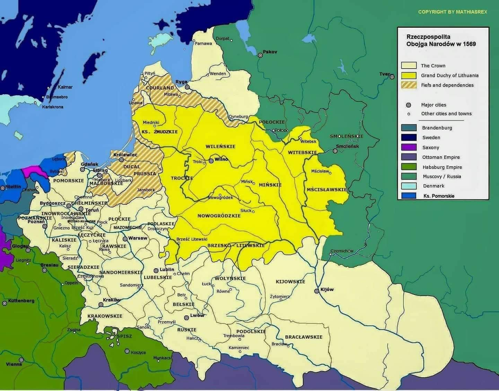

### 1569

Na zamku w Lublinie rozpoczęły się trwające pół roku obrady Sejmu, których efektem było podpisanie Unii Lubelskiej czyli polsko-litewskiego porozumienia w wyniku którego powstało państwo znane jako Rzeczpospolita Obojga Narodów.
Obradom przewodniczył marszałek Stanisław Sędziwój -Czarnkowski.
Obrady zakończyły się 1 lipca 1569 roku. Trzy dni pózniej Unia Polsko-Litewska stała się rzeczywistością na tyle przerażającą dla Rosji, że o powstaniu takiego państwa jeden z posłów rosyjskich powiadomił od razu cara Ivana IV Groźnego.
Mapa przedstawia Rzeczpospolitą Obojga Narodów.

  

---

<a href="https://github.com/TomaszWaszczyk/historia.waszczyk.com/edit/master/src/content/january-10.md" target="_blank">Edytuj tę stronę dzieląc się własnymi notatkami!</a>
