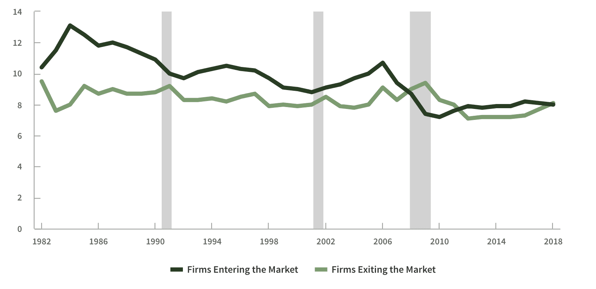
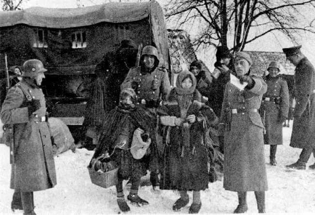

### 2021

Minister zdrowia Adam Niedzielski przyznał, że „prowadzone są prace nad koncepcją centralizacji szpitali”. – Jedną z nich, najpoważniejszą, jest przejęcie własności nad podmiotami przez Skarb Państwa – stwierdził.

---

Rząd postanowił dobić MŚP przedłużając lockdown BEZ ŻADNEGO KONKRETNRGO, TWARDEGO UZASADNIENIA. Jedynie dlatego, że tak jest u innych.
Nie wiem, jak to nazwać. To znaczy wiem, ale się jeszcze hamuję.

---

Zanikająca przedsiębiorczość, rodzący się świat **tylko** czeboli:

  

The Congressional Budget Office (CBO) has rang the alarm bell on a key component of the economy, expressing concern about the “continued decline of entrepreneurship over the past four decades and the implications for economic growth.”

CBO said new businesses formed decreased from 10 percent of all firms that existed in 1982 to 8 percent in 2018. In addition:

“New firms (defined here as those less than five years old with at least one employee on the payroll) constituted 38 percent of all businesses in 1982 but were only 29 percent of them in 2018.

---

### 1940

Zanotowano najniższą temperaturę w historii Polski: - 40 C.

Pomimo ówczesnej okupacji niemieckiej zachodniej Polski i systematycznej eksterminacji polskiej elity w Piaśnicy oraz zajęcia wschodnich terenów RP przez żydo - komunistyczny aparat NKVD Rosji, na okupowanych terenach prowadzono pomiary warunków meteorologicznych. Nie była to jednak działalność komercyjna. Badania służyły obu okupantom tworzyć na podbitych terenach Polski infrastrukturę obozów śmierci.
Siemion Moisiejewicz Kriwoszein, ros. Семён Моисеевич Кривошеин, – radziecki dowódca wojskowy pochodzenia żydowskiego, generał porucznik wojsk pancernych Armii Czerwonej, po zdobyciu polskiego Brześcia odpowiadał między innymi za sprawność logistyczną wywozu polskiej elity do bolszewickich łagrów na Syberii. Prognozy pogody były niezbędne..

Ówcześnie stosowane modele matematyczne pozwalały na prognozowanie pogody na 3 dni. Dzisiejsze wsparcie komputerów opartych na krzemie pozwalają prognozować pogodę na 7 dni. Polskim inżynierem, który wynalazł metodę produkcji monokryształu krzemu był Polak, prof. Jan Czochralski, twórca dzisiejszej elektroniki. Wojnę przeżył, przeżył żydo - komunistyczny terror lat 1945-1956.

  

Weather forecast oparty o komputery kwantowe to przyszłość, która dzieje się dziś.

### 1934

https://en.wikipedia.org/wiki/Tony_Hoare => https://en.wikiquote.org/wiki/C._A._R._Hoare

> There are two ways of constructing a software design: One way is to make it so simple that there are obviously no deficiencies, and the other way is to make it so complicated that there are no obvious deficiencies. The first method is far more difficult.

### 1924

Sejm uchwalił ustawę o naprawie skarbu i reformie walutowej, w wyniku której wprowadzony zostały złoty o parytecie równy frankowi szwajcarskiemu.

### 1755

https://pl.wikipedia.org/wiki/Alexander_Hamilton

---

<a href="https://github.com/TomaszWaszczyk/historia.waszczyk.com/edit/master/src/content/january-11.md" target="_blank">Edytuj tę stronę dzieląc się własnymi notatkami!</a>
