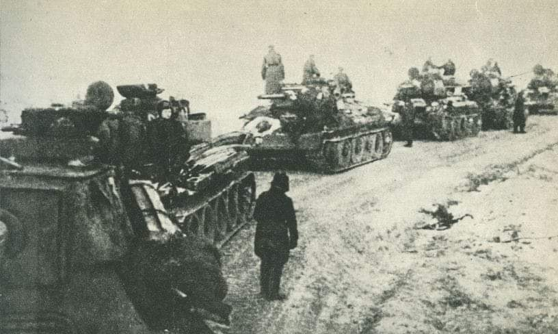

### 1945

Wojska radzieckie rozpoczęły operację wiślańsko-odrzańską. Liczące łącznie 2 miliony 200 tysięcy żołnierzy oddziały 1. Frontu Białoruskiego pod dowództwem marszałka Georgija Żukowa oraz 1. Frontu Białoruskiego dowodzone przez marszałka Iwana Koniewa podjęły ofensywę przeciwko 400 tysiącom żołnierzy niemieckich Grupy Armii "A" oraz "Środek". W skład wojsk 1. Frontu Ukraińskiego wchodziły również oddziały 1. i 2. Armii Wojska Polskiego.
Atak, przypuszczony z przyczułków nadwiślańskich przerwał istniejącą od listopada 1944 roku linię frontu przebiegającą na Wiśle i Narwii. Siły radzieckie prowadziły działania na liniach Warszawa -Poznań (Front Białoruski) oraz dwukierunkowo Kielce-Częstochowa-Wrocław-Kraków-Górny Śląsk (Front Ukraiński).
Rosjanie przyjęli taktykę, którą umożliwiała im spora przewaga tak w sprzęcie, jak i w ludziach. Nie wdawali się w ciężkie boje i przewlekłe walki, silniejsze zgrupowania przeciwnika okrążano prąc dalej na zachód i licząc na ich poddanie się, wynikające z beznadziejnej sytuacji, bądź powolną likwidację w późniejszym terminie.
Działania radzieckie spowodowały, że w ciągu trwającej 23 dni ofensywy granica frontu przesunięta została o 500 kilometrów w stronę Odry.
W wyniku przeprowadzonych działań wyzwolono zachodnią część Polski oraz opanowano ziemie niemieckie po Odrę.
Tak na łamach Czerwonej Gwiazdy do ofensywy wiślańsko-odrzańskiej odnosił się sowiecki pisarz i publicysta żydowskiego pochodzenia Ilja Erenburg:
„Nie licz dni, nie licz kilometrów. Licz tylko zabitych przez siebie Niemców - o to się modli twoja matka. Zabij Niemców - o to woła twoja rosyjska ziemia. Nie wahaj się. Nie ustawaj. Zabijaj"

 

---

<a href="https://github.com/TomaszWaszczyk/historia.waszczyk.com/edit/master/src/content/january-1.md" target="_blank">Edytuj tę stronę dzieląc się własnymi notatkami!</a>
