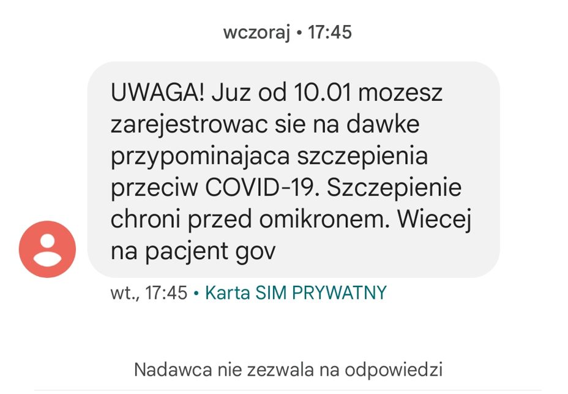
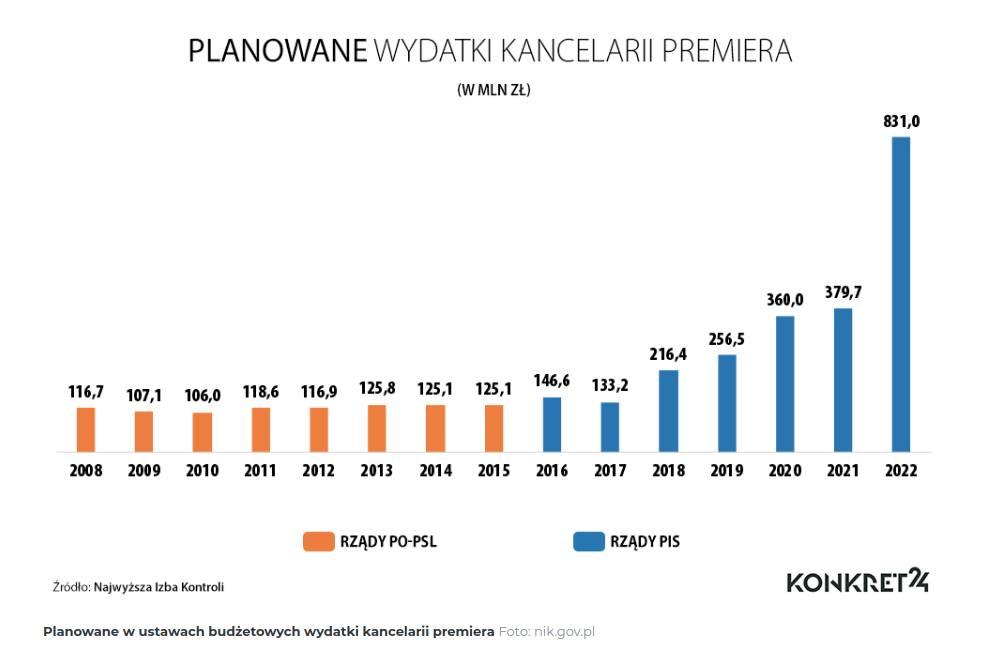
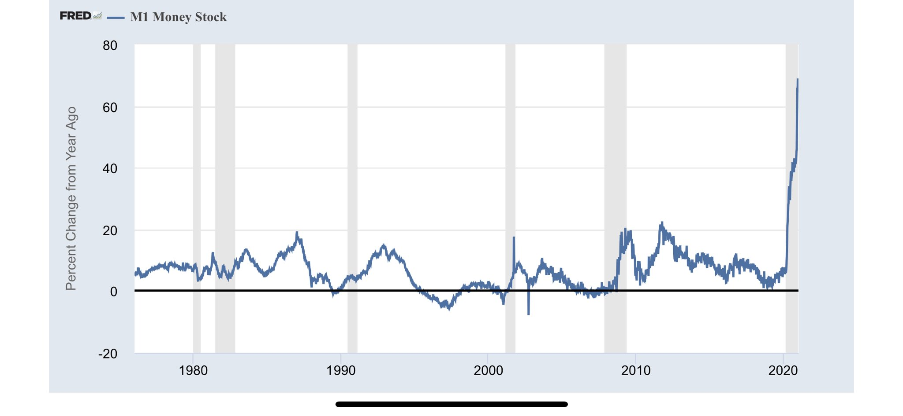
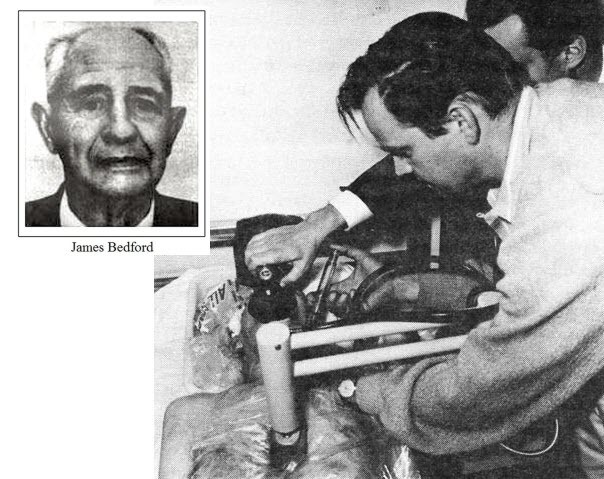

### 2022

  

---

mBank:

  

---

<video width="640" height="480" controls>
<source src="./movies/january/apelacjapremiera.mp4" type="video/mp4">
Your browser does not support the video tag.
</video>

---

Dyrektor generalny Pfizer: "Dwie dawki szczepionki zapewniaja bardzo ograniczona ochrone, jesli w ogole..Pracujemy wiec nad nowa szczepionka".

<video width="640" height="480" controls>
<source src="./movies/january/newversion.mp4" type="video/mp4">
Your browser does not support the video tag.
</video>

---

  

---

### 2021

  

> Just 39% of Americans would be able to cover an unexpected $1,000 expense, according to a new report from http://Bankrate.com.
> That's down from 2020, when 41% of people said they could cover a $1,000 cost with their savings.

---

Czesi dementują informacje ministra Niedzielskiego: Nie ma "czeskiej mutacji" koronawirusa

W Republice Czeskiej nie zaobserwowano rzekomej "czeskiej mutacji" koronawirusa - oświadczyła czeska ambasada w Warszawie.

Podczas poniedziałkowej konferencji prasowej minister zdrowia Adam Niedzielski poinformował, że w Polsce nie potwierdzono oficjalnie znalezienia brytyjskiego wariantu Sars-CoV-2, ale w naszym kraju wystąpił tzw. wariant czeski. 

Do słów polskiego ministra odnieśli się czescy dyplomaci.

"W Czechach żadna kompetentna instytucja nie potwierdziła pojawienie się jakiejkolwiek mutacji koronawirusa COVID-19" - czytamy w oświadczeniu wystosowanym przez czeską ambasadę w Warszawie.

Czescy dyplomaci powołują się na Jana Kynčla, kierownik Wydziału Epidemiologicznego Chorób Zakaźnych Państwowego Instytutu Zdrowia, który miał potwierdzić, iż nie posiada informacji, by coś takiego jak "czeska mutacja" koronawirusa istniało.

---

Imperium kontratakuje!

Biały Dom uderza w Twittera. Portal społecznościowy stracił tzw. zabezpieczenie z Sekcji 230. Oznacza to, że blokując dostęp do treści publikowanych przez użytkowników, Twitter staje się "wydawcą". Idąc dalej, ponosi on odpowiedzialność za swoje działania i publikowaną treść, a lista zarzutów jest bardzo długa. Sekcja 230 chroni media społecznościowe przed odpowiedzialnością, a Twitter właśnie ją utracił (pożyczony komentarz od Geopolityka Pro)

Wzmaga się konflikt na lini public vs private, Jack Dorsey (Twitter) usunął Trumpa z platformy, konflikt będzie się z czasem jedynie eskalował, w między czasie corps konsekwentnie prywatyzują pieniądz - długoterminowo "public" zniknie włącznie z powiązaniem pieniądza z państwem.

---

### 1967

Zmarł James Bedford profesor psychologii na University of California, autor książek z dziedziny doradztwa zawodowego. Jest pierwszą osobą, której ciało po stwierdzeniu zgonu zostało poddane tzw. krioprezerwacji, i jest nadal utrzymywane w kriostazie. Czyli kazał się zamrozić kilka godzin po zgonie – w nadziei, że kiedyś nauka pozwoli na przywrócenie mu życia.

  

### 1945

Wojska radzieckie rozpoczęły operację wiślańsko-odrzańską. Liczące łącznie 2 miliony 200 tysięcy żołnierzy oddziały 1. Frontu Białoruskiego pod dowództwem marszałka Georgija Żukowa oraz 1. Frontu Białoruskiego dowodzone przez marszałka Iwana Koniewa podjęły ofensywę przeciwko 400 tysiącom żołnierzy niemieckich Grupy Armii "A" oraz "Środek". W skład wojsk 1. Frontu Ukraińskiego wchodziły również oddziały 1. i 2. Armii Wojska Polskiego.
Atak, przypuszczony z przyczułków nadwiślańskich przerwał istniejącą od listopada 1944 roku linię frontu przebiegającą na Wiśle i Narwii. Siły radzieckie prowadziły działania na liniach Warszawa -Poznań (Front Białoruski) oraz dwukierunkowo Kielce-Częstochowa-Wrocław-Kraków-Górny Śląsk (Front Ukraiński).
Rosjanie przyjęli taktykę, którą umożliwiała im spora przewaga tak w sprzęcie, jak i w ludziach. Nie wdawali się w ciężkie boje i przewlekłe walki, silniejsze zgrupowania przeciwnika okrążano prąc dalej na zachód i licząc na ich poddanie się, wynikające z beznadziejnej sytuacji, bądź powolną likwidację w późniejszym terminie.
Działania radzieckie spowodowały, że w ciągu trwającej 23 dni ofensywy granica frontu przesunięta została o 500 kilometrów w stronę Odry.
W wyniku przeprowadzonych działań wyzwolono zachodnią część Polski oraz opanowano ziemie niemieckie po Odrę.
Tak na łamach Czerwonej Gwiazdy do ofensywy wiślańsko-odrzańskiej odnosił się sowiecki pisarz i publicysta żydowskiego pochodzenia Ilja Erenburg:
„Nie licz dni, nie licz kilometrów. Licz tylko zabitych przez siebie Niemców - o to się modli twoja matka. Zabij Niemców - o to woła twoja rosyjska ziemia. Nie wahaj się. Nie ustawaj. Zabijaj"

 

---

Oddziały Armii Czerwonej rozpoczęły operację „Wisła – Odra". Po przełamaniu niemieckiej linii obrony wzdłuż Wisły szybko ruszyły na Berlin. Kilka dni później przekroczyły przedwojenną granicę niemiecką. Tuż za oddziałami frontowymi podążały – niczym druga armia – liczące około 100 tys. osób komanda trofiejne.

Wkrótce zasilały je kolejne dziesiątki tysięcy mężczyzn i kobiet, wśród których znajdowali się sowieccy fachowcy, byli robotnicy przymusowi, „zmobilizowani" niemieccy cywile i jeńcy wojenni.

Grupy te realizowały na rozkaz Stalina systematyczną i szeroko zakrojoną operację rabunkową. Z racji swego zasięgu usunęła ona w cień wszystkie dotychczasowe wyprawy tego typu, znane z podręczników historii. Do lipca 1945 r. ta ogromna operacja koncentrowała się na terenach dzisiejszej Polski. Stalin osobiście czuwał nad przebiegiem tego rabunku.

Zarządzenia generalissimusa

Najbardziej atrakcyjnym kąskiem dla Sowietów był przemysł Górnego Śląska. Już 31 stycznia 1945 r. Stalin wydał rozporządzenie, aby rozpoznać stan przemysłu w tym regionie. W tym samym dniu marszałek Żukow zameldował Stalinowi, że zakłady przemysłowe na terenach właśnie „wyzwolonej" Polski (na zachód od Wisły) prawie nie ucierpiały, ponieważ Niemcy nie mieli czasu, aby je zniszczyć, a tym bardziej ewakuować. Podobnie było na pozostałych terenach na wschód od Odry.

20 lutego1945 r. Stalin wydał rozporządzenie nr 7558 dotyczące polskich spraw, w tym także granicy zachodniej, którą sam wytyczył wzdłuż linii Odry i Nysy Łużyckiej ze Szczecinem po stronie polskiej. Natomiast punkt 6b stanowił, że wywozowi do Związku Radzieckiego z terytorium Polski podlegają urządzenia, materiały oraz produkty konieczne do prowadzenia wojny, które pochodzą z niemieckich zakładów lub też zakładów rozbudowanych przez Niemców w czasie wojny. Dotyczyło to także zakładów na ziemiach niemieckich, które miały wejść w skład Polski.

Tym samym wszystkie fabryki i zakłady, cały przemysł ciężki (metalurgiczny, zbrojeniowy, budowy maszyn, chemiczny itd.) na terenie Polski zostały uznane za zdobycz wojenną i podlegały wywozowi do Związku Sowieckiego. W czasie wojny Niemcy dla potrzeb wojennych rozbudowywali istniejące polskie zakłady na terenie całej Polski, a zwłaszcza na Górnym Śląsku. Tereny te były bowiem względnie bezpieczne przed bombardowaniami alianckimi oraz leżały stosunkowo blisko frontu wschodniego.

Definicja „na potrzeby prowadzenia wojny" oznaczała praktycznie cały przemysł, ponieważ w czasie wojny cała gospodarka pracuje na potrzeby frontu – np. przemysł gorzelniczy, bo przecież zapotrzebowanie Armii Czerwonej na wódkę było ogromne.

25 lutego Stalin powołał specjalną strukturę zajmującą się zdobyczami wojennymi, czyli Komitet Specjalny przy Państwowym Komitecie Obrony (GKO) pod kierownictwem Gieorgija Malenkowa, jednego z zaufanych Stalina. Do zadań Komitetu Specjalnego należało: „a) Ustalenie i rejestracja podlegających wywozowi do ZSRS z terytorium Niemiec, a także z terytorium Polski [...] urządzeń, szyn kolejowych, parowozów, wagonów, statków parowych oraz innych rodzajów środków transportu, surowców oraz gotowych produktów". Komitet Specjalny musiał ponadto zorganizować demontaż oraz wywóz tych urządzeń i materiałów do Związku Sowieckiego.

Już 2 marca1945 r. Stalin podpisał siedem pierwszych rozporządzeń dotyczących demontażu i wywozu całych zakładów z terenów Polski, a przygotowanych przez zespół Malenkowa. Pierwsze rozporządzenie, nr 7608, dotyczyło urządzeń z walcowni rur w Gliwicach, które zostały wywiezione do zakładów imienia Lenina w Dniepropietrowsku. Następne dwa rozporządzenia dotyczyły urządzeń z Huty Julia w Bobrku koło Bytomia, które trafiły do zakładu imienia Dzierżyńskiego, również w Dniepropietrowsku, oraz z walcowni w Łabędach, które znalazły się w zakładach Dnieprospecstal w mieście Zaporoże.

Rozporządzenie nr 7611 dotyczyło wywozu z Górnego Śląska stali walcowanej, w sumie 26 tys. ton, 2 tys. ton rur i 4 tys. 560 ton innych rodzajów stali. Rozporządzenie nr 7612 nakazywało wywóz 86 ton rtęci z Chrzanowa. Rozporządzenie nr 7614 regulowało wywóz ze Śląska 19 turbin o mocy 507 tys. kW oraz 32 kotłów wysokociśnieniowych. Następne rozporządzenia dotyczące demontażu i wywózek Stalin podpisał 6 marca. Przedmiotem ich zainteresowania były między innymi fabryki sztucznego kauczuku w Oświęcimiu, fabryki dynamitu w Bydgoszczy, 2000 km linii kolejowych wraz z całym oporządzeniem (stacje, łączność itd.), urządzenia z zakładów zbrojeniowych Osthütte oraz Graf Renard w Sosnowcu, a także inny sprzęt z zakładów w Gliwicach, Dąbrowie Górniczej, Siemianowicach, Chorzowie, Częstochowie, Katowicach czy Poznaniu.

Z kolei rozporządzenie przyjęte 9 marca dotyczyło demontażu i wywozu urządzeń oraz materiałów z zakładów znajdujących się m.in. w Gliwicach, Bytomiu, Chorzowie, Blachowni Śląskiej, Zdzieszowicach, Oleśnicy, Elblągu, Dębnie, Sosnowcu i Dęblinie.

24 marca komanda trofiejne przejęły 105 maszyn w Hucie Bankowa w Katowicach, 360 obrabiarek w Hucie Zgoda w Świętochłowicach i sześć maszyn w sosnowieckiej Hucie Milowice. Od dyrektora chorzowskiej Huty Batory zażądano oddelegowania do prac demontażowych 60 pracowników. Ostatecznie huta straciła 80 proc. obrabiarek z warsztatów mechanicznych, 10 suwnic, 18 wsadzarek, prasę hydrauliczną o nacisku 2 tys. ton, prasę do hartowania blach pancernych i młot przeciwbieżny. Z Huty Baildon w Katowicach wywieziono 427 obrabiarek i dwa wielkie piece, natomiast z łagiewnickiej Huty Zygmunt nieopodal Bytomia – 94 wagony ze sprzętem, w tym 200 obrabiarek, kable i przewody.

Przemysłowe rozbrojenie

W marcu 1945 r. prace demontażowe realizowane były siłami Zarządu Majątku Zdobycznego Armii Czerwonej. W kwietniu do akcji wkroczyły także specjalnie do tych celów założone zarządy montażowe (OMU) od numeru 1 do 4. Na Śląsku operował OMU nr 1 z siedzibą w Bytomiu, który otrzymał zadanie przeprowadzenia rozbiórki tamtejszych zakładów w ramach programu „Przemysłowe rozbrojenia Niemiec" oraz zorganizowania transportu przejętych urządzeń i materiałów do ZSRS.

Przykładami szczególnie spektakularnych demontaży są akcje przeprowadzone w kombinatach benzyny syntetycznej w Blachowni Śląskiej, Zdzieszowicach i Policach. W styczniu 1945 r. wartość zakładów w Blachowni Śląskiej oceniano na 550 mln marek. Rząd „polski" wysłał wprawdzie do Moskwy delegację, która miała przekonać Sowietów, aby zaniechali demontażu sprzętu w Blachowni Śląskiej, ale usłyszała ona jedynie, że decyzja w tej sprawie zapadła „na najwyższym szczeblu". Faktycznie, rozporządzenia osobiście wydał Stalin.

OMU nr 1 rozpoczął prace w Blachowni Śląskiej 3 maja. Trwały one przez cztery miesiące – do początku września. W rozbiórce brało udział 2462 żołnierzy z oddziałów trofiejnych Armii Czerwonej, ponadto 2650 byłych pracowników przymusowych (repatriantów) oraz 2786 Niemców, w tym wiele kobiet zmobilizowanych przez sowieckie wojska okupacyjne. W pracach demontażowych uczestniczyli także specjaliści i siła robocza z ZSRS.

W ciągu czterech miesięcy OMU nr 1 pozyskał z Blachowni Śląskiej łącznie 74 575 ton towarów, w tym 43 759 ton urządzeń mechanicznych, technologicznych i sanitarno-technicznych, 2014 ton konstrukcji żelaznych, 17 006 ton rur i urządzeń wydobywczych, 3106 dźwigów i urządzeń dźwigowych, 4470 ton sprzętu elektrycznego oraz instrumentów kontrolnych i pomiarowych, 3417 ton innych materiałów itp. Pozostałe urządzenia tego kombinatu zostały zdemontowane przez oddziały trofiejne Armii Czerwonej. Ogółem wywieziono stamtąd w 9723 wagonach 164 400 ton urządzeń i materiałów.

Oprócz fabryki w Blachowni Śląskiej OMU nr 1 demontował w tym samym czasie zakłady benzyny syntetycznej firmy Schaffgotsch-Benzin w Zdzieszowicach. Prace demontażowe trwały tam półtora miesiąca. Łącznie sowieckie komanda wywiozły ze Zdzieszowic 30 300 ton (1714 wagonów) urządzeń.

Z dużo większym rozmachem prowadzony był demontaż w fabryce benzyny syntetycznej w Policach pod Szczecinem. Do marca 1946 r. sowieckie komanda zdemontowały tam 180 tys. ton (13 856 wagonów) maszyn i urządzeń z ponad 400 hal produkcyjnych. Było wśród nich m.in. 1540 silników elektrycznych, 40 transformatorów o łącznej mocy 41 tys. kW, 1200 pomp, 80 kompresorów, 50 generatorów gazu. Elektrownia fabryki w Policach została natomiast zdemontowana przez Ludowy Komisariat (Ministerstwo) Przemysłu Elektrycznego. Łączna waga wywiezionych urządzeń wynosiła 193 tys. ton. Rozbiórka i załadunek wszystkich maszyn oraz urządzeń zostały zakończone 1 listopada 1946 r.

Ilość sprzętu z zakładów benzyny syntetycznej w Blachowni Śląskiej, Policach i Zdzieszowicach (łącznie 25 283 wagony, nie licząc wyposażenia elektrowni – w samej Blachowni było to co najmniej 1100 wagonów) przewyższała kilkakrotnie ilość wyposażenia, które sowieckie komanda zdemontowały na całych Węgrzech (2800 wagonów) i w Czechosłowacji (6500 wagonów). Natomiast z Austrii Sowieci wywieźli w sumie 31 200 wagonów ze sprzętem i z maszynami.

Dla was tylko mury i goła ziemia

Akcja konfiskowania zakładów i urządzeń przemysłowych na zachodnich terenach dzisiejszej Polski największe rozmiary przybrała w okresie od marca do czerwca 1945 r., co znajduje odzwierciedlenie w decyzjach GKO z tego okresu. Po rozporządzeniach z 2, 6 i 9 marca przyszedł czas na kolejne. W sumie Stalin podpisał do 8 lipca około 100 rozporządzeń regulujących demontaże na terenach dzisiejszej Polski, przede wszystkim na Górnym i Dolnym Śląsku.

Jednak większość wyposażenia zakładów zlokalizowanych na terenach dzisiejszej Polski wywieziono bez odpowiednich rozporządzeń. W samym tylko Wrocławiu OMU nr 1 przejął majątek ośmiu zakładów bez żadnej „podstawy prawnej". Według danych sowieckiego Centralnego Urzędu Statystycznego (CUS) komanda trofiejne zdemontowały w granicach dzisiejszej Polski łącznie 1119 przedsiębiorstw przy około setce odpowiednich rozporządzeń.

Rozmiar sowieckich demontaży znajduje swoje odzwierciedlenie także w raportach polskich władz komunistycznych. W kwietniu 1945 r. Przemysłowa Grupa Operacyjna działająca przy „polskim" rządzie raportowała: „Obecnie ma miejsce [w Gliwicach] na wielką skalę zakrojona akcja demontażu i wywożenia maszyn, urządzeń i surowców, nie tylko z wielkich i średnich, lecz nawet i małych zakładów. Wywóz odbywa się bez przerwy samochodami i koleją, przy czym zabierane są wszelkie maszyny. Ładunek ma miejsce i w dni świąteczne. W toku rozmowy [z sowieckimi przedstawicielami] słyszeliśmy niejednokrotnie: »Oddamy wam tylko mury i gołą ziemię, wszystko pozostałe wywieziemy«„.

Zarząd Miejski w Gliwicach wycenił straty miasta powstałe w wyniku demontaży na blisko 35 mln zł (8,75 mln dol.). Wywiezione zostało m.in. kompletne wyposażenie dwóch szpitali, a także urządzenia rzeźni miejskiej i dwóch budynków przepompowni wody. W rzeźni miejskiej rozmontowane zostało wszystko – od maszynowni po urządzenia biurowe i telefoniczne. Jeszcze wyższe straty odnotowano w Bytomiu. Sowieckie komanda trofiejne obok całych fabryk przejmowały również warsztaty, młyny, tartaki, cukrownie, elektrownie, przedsiębiorstwa miejskie, centrale telefoniczne, tramwaje, maszyny rolnicze, zwierzęta gospodarskie (krowy i konie), tory i urządzenia kolejowe. Plądrowały szpitale, zamki, majątki ziemskie, domy i mieszkania, biblioteki oraz muzea. Ich łupem padło wiele przedmiotów artystycznych, archiwaliów i innych zabytków kultury.

Demontaże w kolejnictwie, które i tak mocno ucierpiało podczas wojny, były również dotkliwe. Komanda trofiejne przejmowały tory, urządzenia i maszyny pochodzące z warsztatów kolejowych, lokomotywy i wagony. Z Katowic wywieźli warsztaty kolejowe z całym wyposażeniem – taki sam los spotkał stawiających opór strażników kolejowych. Zgodnie z sowieckimi danymi w zakładach remontowych parowozów w Gliwicach Sowieci przejęli w sumie 5370 ton, w zakładach remontowych parowozów w Oleśnicy – 4835 ton, w zakładach remontowych wagonów w Opolu 2910 ton, a w zakładach remontowych wagonów w Gliwicach – 2045 ton maszyn i urządzeń itd., itp.

8 lipca kremlowski dyktator podpisał rozporządzenie nr 9484 GKO o całkowitym demontażu zelektryfikowanej linii Wrocław – Zgorzelec o długości 393 km, wraz z należącym do niej wyposażeniem, czyli także szynami, siecią trakcyjną, lokomotywami elektrycznymi, wagonami silnikowymi i warsztatami naprawczymi. Pozyskany w ten sposób sprzęt Sowieci zamierzali wykorzystać do budowy kolei w Karagandzie.

Wszystkie przedsiębiorstwa, linie i urządzenia kolejowe zlokalizowane na terytorium kraju przeszły pod polski zarząd dopiero na mocy postanowienia GKO z 7 lipca. Sowieccy „wyzwoliciele" zdemontowali na ziemiach dzisiejszej Polski blisko 5500 km normalnotorowych linii kolejowych.

Grabieże, dewastacje i podpalenia

Do strat spowodowanych demontażami dochodziły jeszcze umyślne zniszczenia dokonywane przez czerwonoarmistów po zakończeniu działań wojennych. Po uprzedniej grabieży podpalali oni ulice i całe dzielnice. Tak było w Legnicy, Gdańsku, Szczecinie, Olsztynie i w wielu innych miastach oraz gminach. Powstałych w ten sposób szkód nie da się już dziś dokładnie oszacować. W komunistycznej Polsce o owych zniszczeniach mówiono, że były spowodowane walkami lub celowymi działaniami niemieckimi. Zainstalowany przez Stalina rząd „polski" próbował interweniować, widząc powszechny rabunek urządzeń, materiałów oraz infrastruktury na obszarach, które miały wejść w skład kraju, oraz na przedwojennym polskim terytorium. Niekiedy interwencje te kończyły się sukcesem. Niestety – najczęściej tylko na papierze.

Od początku lipca 1945 r. demontaże na ówczesnych wschodnich terenach niemieckich zaczęły powoli tracić rozmach, a 8 lipca Stalin podpisał ostatnie rozporządzenie dotyczące konfiskat w fabrykach znajdujących się w nowych granicach Polski. Chodziło o zakłady traktorowe Famo we Wrocławiu, z których Stalin nakazał wywieźć 700 obrabiarek oraz innych narzędzi i materiałów do zakładów traktorowych w Charkowie.

W tym czasie akcja demontażowa przeniosła się ostatecznie do sowieckiej strefy okupacyjnej Niemiec, na teren byłej NRD, gdzie Sowieci zdemontowali według własnych danych 2955 zakładów. W ten sposób zarówno tereny byłej NRD, jak i Śląska zostały faktycznie zdeindustrializowane, czyli „przemysłowo rozbrojone", co też było celem Stalina. 21 lipca 1945 r. Stalin zatwierdził rozporządzenie nr 9534 GKO o przekazaniu wyposażenia przedsiębiorstw „niemieckich" zlokalizowanych na terytorium Polski oraz na terytorium Niemiec przechodzących w granice Polski pod zarząd „polskiego" rządu. Znamienny jest fakt, że Stalin podpisał ten dokument 8 lipca jako rozporządzenie nr 9477, następnie go wycofał, a 13 dni później opatrzył numerem 9534. Powodem były opóźnienia w realizacji prac demontażowych w Polsce.

Skala rabunku

Według wewnętrznych sowieckich danych do 2 sierpnia 1945 r. komanda trofiejne wywiozły z terytorium niemieckiego, które weszło w skład Polski, 142 400 wagonów ze sprzętem i materiałami, a w okresie od 3 sierpnia 1945 do 1 stycznia 1948 r. kolejnych 69 200 wagonów. Do tego należy doliczyć urządzenia i materiały z przedsiębiorstw zlokalizowanych na ziemiach należących do Polski  przed 1939 r. Z sowieckich danych pochodzących z wiosny 1948 r. wynika, że do 2 sierpnia 1945 r. Sowieci wywieźli z tych terenów 35 800 wagonów z urządzeniami oraz 36 761 wagonów z materiałami. Jednak demontaże na tych terenach były kontynuowane także po 2 sierpnia 1945 r.

Według polskich wyliczeń z 1946 r. w okresie od lipca 1944 do 20 czerwca 1946 r. Sowieci skonfiskowali na terenach dzisiejszej centralnej i wschodniej Polski dobra materialne o wartości 1,5 mld zł (375 mln dol.). Powyższe szacunki obejmują także konfiskaty dokonywane przez wojska Armii Czerwonej na potrzeby własne oraz rabunek. Są one jednak niekompletne, ponieważ nie uwzględniają danych z województwa białostockiego, a także jednego powiatu w województwie kieleckim i dwóch w województwie krakowskim. Dodać jeszcze należy, że na blisko 1,17 mld zł (292,5 mln dol.) szacowana była wartość szkód wyrządzonych przez wojska sowieckie. Podana kwota nie uwzględnia zniszczeń powstałych w wyniku działań wojennych.

Na byłych terenach niemieckich straty spowodowane przez demontaże, rabunek i umyślne zniszczenia były wielokrotnie wyższe. Według polskich szacunków same tylko demontaże uszczupliły majątek tych terenów o 2 mld dol. (według cen z 1938 r.).

Jak należy interpretować masowy rabunek dokonany w Polsce? Nie była ona przecież krajem, który wspólnie z Niemcami napadł w 1941 r. na ZSRS. Wręcz przeciwnie, to Polska stała się pierwszą ofiarą sowieckiego imperializmu. We wrześniu 1939 r. ZSRS dokonał aneksji połowy jej przedwojennego terytorium i zatrzymał swój łup także po wojnie (z wyjątkiem obszarów wokół Łomży i Białegostoku). Ziemie zachodnie miały być odszkodowaniem dla Polski za poniesione straty terytorialne na wschodzie – tak brzmiała i brzmi do dzisiaj wersja oficjalna. Kresy Wschodnie, w porównaniu z przejętymi przez nią ziemiami zachodnimi, miały być zacofane pod względem przemysłowym i cywilizacyjnym.

Według polskich wyliczeń majątek niemieckich ziem wschodnich, które po wojnie zostały przyłączone do Polski, był wart w 1939 r. 59 mld zł (przedwojennych), natomiast majątek Kresów Wschodnich, przejętych przez ZSRS, posiadał wartość 31 mld zł. Na dodatek przemysł na ziemiach przyłączonych (szczególnie na Śląsku) uległ podczas wojny potężnej rozbudowie. Mimo to majątek narodowy tych obszarów skurczył się z 59 mld zł w 1939 r. do 37,4 mld zł w roku 1945. Był to przede wszystkim skutek zniszczeń wojennych, sowieckich demontaży, grabieży i umyślnych dewastacji.

Przejęcie przez Polskę niemieckich ziem wschodnich powinno dać ogromne wzmocnienie jej gospodarki, czego obawiano się w Moskwie, co wynika z dostępnych dzisiaj źródeł. Stalin zdecydował więc, aby przekazać Polsce niemieckie tereny dopiero po ich uprzednim „rozbrojeniu przemysłowym" i wywiezieniu zrabowanych dóbr do ZSRS.

Co gorsza, przeprowadzane na ogromną skalę demontaże, trwający przez wiele dziesięcioleci wyzysk przez ZSRS i narzucony system gospodarczy zrujnowały Polskę pod każdym względem. Zadziwia więc powielane do dzisiaj przez różne środowiska (postkomunistyczne, endeckie) hasło propagandy stalinowskiej, jakoby Polska zyskała na przejęciu niemieckich terenów wschodnich w zamian za Kresy.

Zrabowane natomiast w Polsce i w Niemczech obrabiarki, maszyny oraz ogromna liczba innych urządzeń przemysłowych umożliwiły Związkowi Sowieckiemu nie tylko odbudowę, ale wręcz rozbudowę jego własnej gospodarki i przemysłu zbrojeniowego. Zdobycze wojenne zapewniły Związkowi Sowieckiemu skok modernizacyjny i dynamikę wzrostu, których on sam nigdy by nie zdołał wypracować własnymi siłami.

Autor jest badaczem dziejów Niemiec, Polski i Rosji w XX w., zwłaszcza w okresie II wojny światowej i w latach międzywojennych. Autor książek: „Rozstrzelać elementy kontrrewolucyjne! Brutalizacja wojny niemiecko-sowieckiej latem 1941 r." oraz „Na zachód po trupie Polski". Właśnie nakładem wydawnictwa Zysk i S-ka ukazała się jego nowa  monografia „Wojna Stalina".

---

### 1893

https://pl.wikipedia.org/wiki/Alfred_Rosenberg

---

<a href="https://github.com/TomaszWaszczyk/historia.waszczyk.com/edit/master/src/content/january-12.md" target="_blank">Edytuj tę stronę dzieląc się własnymi notatkami!</a>
