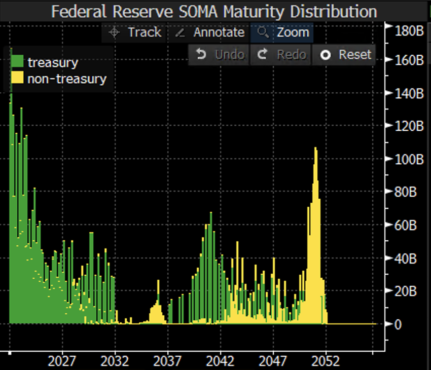
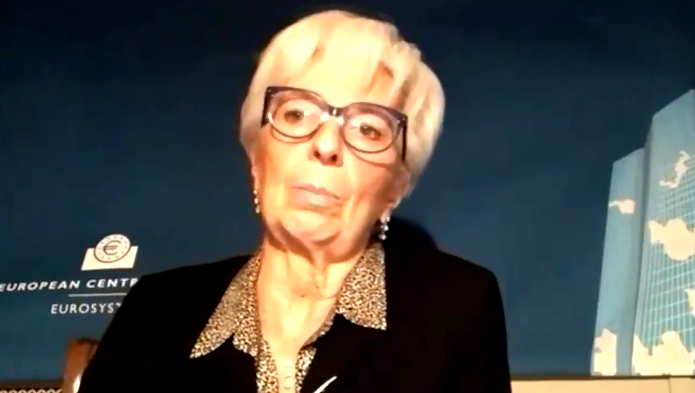
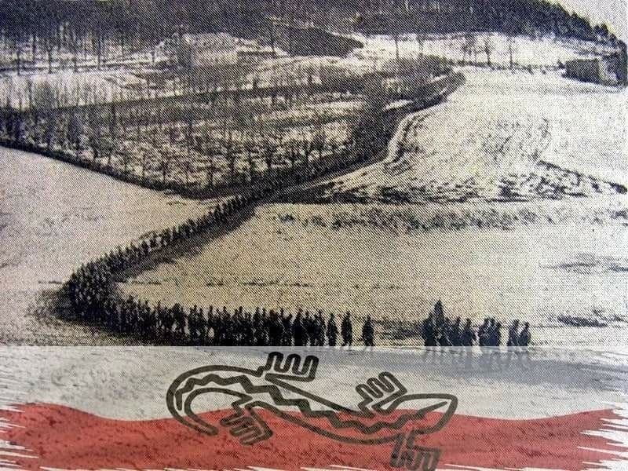

### 2022

Wygląda na to, że rząd będzie budował hale do e-sportu aby dzieci nie siedziały przed komputerami.

<video width="640" height="480" controls>
<source src="./movies/january/esport.mp4" type="video/mp4">
Your browser does not support the video tag.
</video>

---

<video width="640" height="480" controls>
<source src="./movies/january/au.mp4" type="video/mp4">
Your browser does not support the video tag.
</video>

---

!!!!!!!!!!!!!!!

QT pace question into context:  2.5T of US Treasuries maturing until end of '24, a monthly run-off pace up to 70bn/month if everything was allowed to mature w/out reinvestment. MBS long-dated (frequently pre-paid). Fed wants to normalize MBS more than USTs. Tttl Fed assets 8.8trn

  

---

Bank centralny Rosji opublikował strukturę swoich aktywów rezerwowych. Na znaczeniu zyskały euro i juany, tracił natomiast dolar. Prominentną rolę odgrywało złoto.

---

### 2021

Większy kapitał zamożniejszych trafi do świata cyfrowych aktywów za... 3...2....1.. + insitutional inflow

ZURICH, Jan 12 (Reuters) - UBS will begin charging clients with cash balances above 250,000 Swiss francs ($280,646.61) a 0.75% interest rate fee from July, Switzerland’s biggest bank said in an internal memo on Tuesday.

“It’s becoming increasingly clear that we’ll have to contend with negative interest rates for years to come. That’s why we decided to lower the threshold for deposit fees,” Swiss banking head Axel Lehmann told employees in the memo.

The bank would factor in mortgages and investments clients had with the bank to determine whether to apply the charge.

“In the end, less than 5% of our clients will be affected,” Lehmann said in the memo seen by Reuters and confirmed by a bank spokeswoman. ($1 = 0.8908 Swiss francs) ($1 = 0.8232 euros) (Reporting by Brenna Hughes Neghaiwi)

---

ECB's Lagarde calls for regulating Bitcoin's "funny business".

ECB President Christine Lagarde called for global regulation of #Bitcoin
, saying the digital currency had been used for money laundering activities in some instances and that any loopholes needed to be closed.

  

---

### 1945

W godzinach popołudniowych 13 stycznia 1945 r. pod dowództwem płk. Antoniego Szackiego ps. "Bohun”, nastąpił wymarsz Brygady Świętokrzyskiej NSZ na Zachód. Następnego dnia osiągnęła rejon wsi Kępie – Marcinkowice – Pogwizdów gdzie jej żołnierze stoczyli walki z Niemcami.
Exodus zakończył się 7 maja 1945 r. na terenie Czech. Brygada dołączyła do wojsk amerykańskich gen. Pattona. Dwa dni wcześniej, 5  maja, żołnierze Brygady wyzwolili niemiecki obóz koncentracyjny dla kobiet w Holiszowie, ratując ok. 700-800 więźniarek od niechybnej śmierci, w tym 167 Polek.

  

### 2016

https://www.3301archive.com/liber-primus/

### 1898

https://en.wikipedia.org/wiki/Dreyfus_affair

---

<a href="https://github.com/TomaszWaszczyk/historia.waszczyk.com/edit/master/src/content/january-13.md" target="_blank">Edytuj tę stronę dzieląc się własnymi notatkami!</a>
