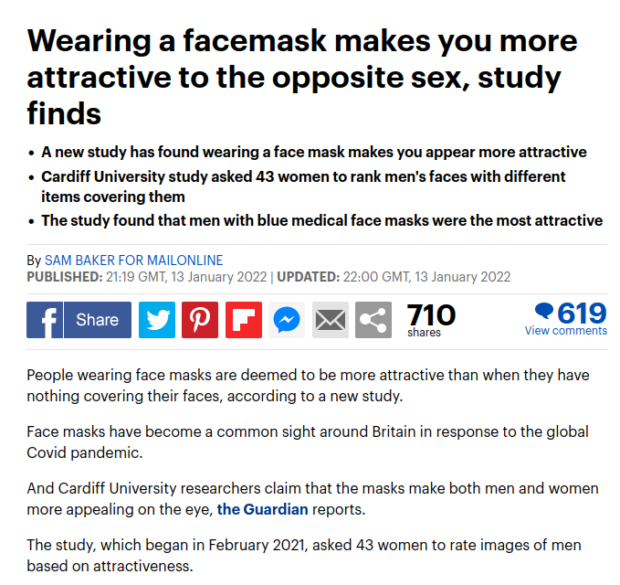
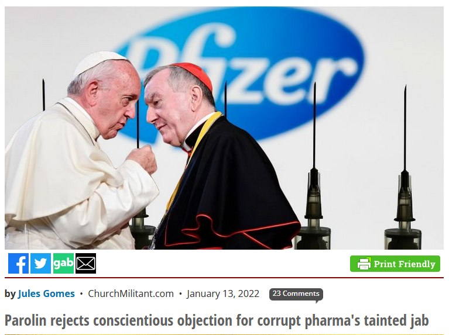
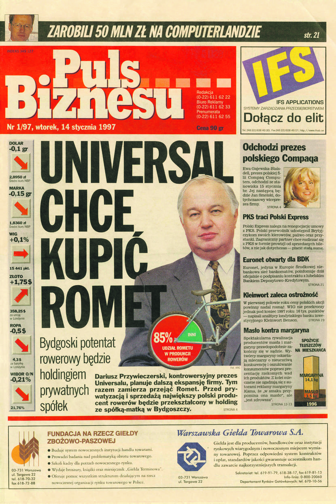

### 2022

Trzynastu z siedemnastu członków Rady Medycznej rezygnuje z doradzania rządowi w sprawie epidemii.

---

Clown world:

  

---

Nie ma co chować głowy w piasek. O tym się pisze i mówi. A zawłaszcza teraz, kiedy Watykan odmówił prawa wolności sumienia swojemu personelowi, który nie chciał poddać się obowiązkowemu szczepieniu przeciwko Covid-19, argumentując, że Pfizer wykorzystał w przeszłości komórki płodu z abortowanego dziecka do testów, ale nie do produkcji aktualnej szczepionki https://tiny.pl/91jld
Instrukcja "Dignitas personae", dotycząca niektórych problemów bioetycznych, nie wprowadza rozróżnienia między produkcją a testowaniem. Pomijając nawet ten fakt, to są jeszcze inne poważne racje, które mogą sprawić, że katolik może mieć wątpliwości co do etycznego postępowania tej firmy. Pfizer zapłaci rekordową sumę 2,3 miliarda USD, żeby zakończyć spór z władzami amerykańskimi, dotyczący niedozwolonych metod marketingowych https://tiny.pl/91j1n
Dodajmy do tego jeszcze m. in. raport Oxfamu z 2018 r., który skrytykował firmę Pfizer za "systematyczne" przechowywanie zysków w zagranicznych rajach podatkowych. Według tego raportu Pfizer przechowywał 199 miliardów dolarów  za granicą i był na drugim miejscu ze wszystkich amerykańskich korporacji, które w ten spośób postępowały. Warto o tym przypomnieć, ponieważ Papież Franciszek wzywa światowych przywódców do walki z rosnącą globalną nierównością gospodarczą, a watykańskie media często przywołują raporty Oxfamu dla poparcia nauczania papieża. 
W tym samym czasie, kiedy kard. Parolin nie uwzględnia sprzeciwu sumienia watykańskich pracowników, którzy nie chcą przyjąć szczepionki, firma Boeing zastanawia się, co zrobić, gdyż 11 tys. pracowników, co stanowi 9% wszystkich zatrudnionych, złożyła wniosek o zwolnienie od obowiązku szczepienia się, motywując go wymogami religijnymi lub kwestiami medycznymi i grozi odejściem z pracy. Wszystko wskazuje na to, że problem sam się rozwiąże. Sąd Najwyższy w USA orzekł wczoraj, że wymóg obowiązkowych szczepień oraz stosowania obowiązkowych testów dla pracowników firm zatrudniających powyżej 100 osób, jest niezgodny z konstytucją.
Rozwiąże się w USA, a co w Watykanie? Myślę, że potrzeba pamiętać zarówno o dobru wspólnym, jak i o nakazach sumienia. Dobrze uformowane sumienie nie może wykluczać dobra wspólnego w swoim rozeznaniu. Podobnie dobru wspólnemu nie można służyć, odmawiając ludziom prawa do wolności sumienia.

  

---

### 2021

Maybe true, maybe not

> The Pakistan government is to fund two state-backed Bitcoin mining farms in the Khyber Pakhtunkhwa (KP) province.

...but for sure it is the direction.

### 1997

Pierwsze wydanie gazety ukazało się we wtorek, 14 stycznia 1997 r.

  

### 1934

W Warszawie urodził się Marek Hłasko - prozaik i scenarzysta filmowy, aktor, pilot, powieściopisarz, jeden z najzdolniejszych pisarzy młodego pokolenia, symbol nonkonformizmu.
Jako pisarz zadebiutował w 1954 roku opowiadaniem "Baza Sokołowska". W latach 1955-57 zatrudnił się w redakcji "Po Prostu". Zimą 1958 roku opuścił kraj i wyjechał do Paryża, aby wydać swoje powieści zatytułowane "Cmentarze" i "Następny do raju", tym samym uniemożliwił sobie powrót do Polski Ludowej. Przebywał: w Izraelu, Niemczech Francji i USA, gdzie pracował m. in. jako pracownik fizyczny i pilot samolotów.
W życiu prywatnym upodabniał się do bohaterów swych utworów, romantycznych tudzież twardych outsiderów Uwielbiał Humphreya Bogarta i Fiodora Dostojewskiego. Jego proza była wyrazem sprzeciwu wobec schematyzmu i zakłamania, które przejawiała literatura socrealistyczna. Opowiadał o buncie natury moralnej. Znakomicie opisywał środowisko, w którym panuje beznadzieja i cynizm. W Polsce Ludowej zakaz dotyczący druku jego utworów obowiązywał przez 20 lat. Był współscenarzystą filmów: Koniec nocy (1957), Pętla (1957), Spotkania (1957), Ósmy dzień tygodnia (1958) i Baza ludzi umarłych (1958). Zmarł 14 czerwca 1969 roku w Wiesbaden. Jego grób znajduje się na Cmentarzu Powązkowskim w Warszawie (kwatera b-II-1)

### 1887

https://pl.wikipedia.org/wiki/Hugo_Steinhaus

---

<a href="https://github.com/TomaszWaszczyk/historia.waszczyk.com/edit/master/src/content/january-14.md" target="_blank">Edytuj tę stronę dzieląc się własnymi notatkami!</a>
