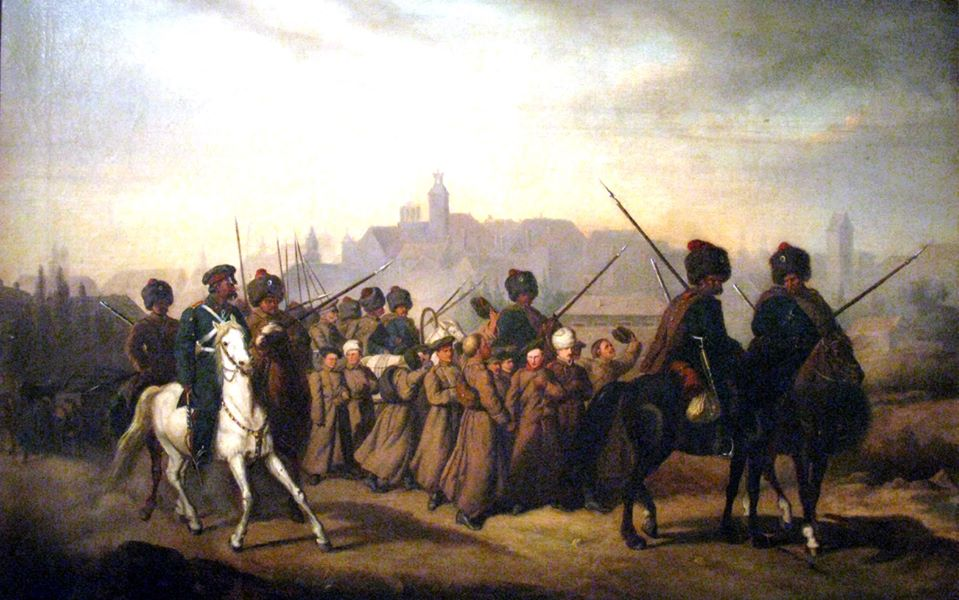

### 2021

WSPÓŁCZESNA KONCEPCJA  HOMO SOCIO-OECONOMICUS

> Klasyczne  i  neoklasyczne  ujęcie  koncepcji  **homo  oeconomicus**,  niejedno-krotnie  krytykowane  na  gruncie  ekonomii  instytucjonalnej,  behawioralnej  oraz  społecznej,  wydaje  się  podejściem  nieaktualnym  i  niewystarczającym  w  wyja-śnianiu  zjawisk  dotyczących  dokonywania  rzeczywistych  wyborów  rynkowych  przez  pojedynczego  decydenta  we  współczesnej  gospodarce.  Potrzeba  modyfi-kacji oraz rozbudowy klasycznie pojmowanego „człowieka ekonomicznego” jest zatem  nieunikniona,  co  zresztą  znajduje  się  w  kręgu  zainteresowań  współcze-snych ekonomistów. W miejsce tradycyjnego **homo oeconomicus** zaproponowa-no  już  wiele  koncepcji  alternatywnych,  w  tym  koncepcjęhomo  sociologicus, która nie wyczerpuje jednak wszelkich wątpliwości.

### 2019

Grin is a cryptocurrency focused on privacy without censorship in its implementation of Mimblewimble. According to their website, the developers want Grin to be usable by everyone regardless of borders, culture, skills or access. Without address information or amounts stored on the blockchain, the chain is meant to be lean and scalable. Grin was launched without a premine, ICO, or founders rewards and relies on donations to support the long-term development of the project.

### 1863

W nocy z 14 na 15 stycznia przeprowadzono w Warszawie brankę, która przyspieszyła wybuch powstania styczniowego.

By sparaliżować działalność organizacji spiskowych, władze rosyjskie zarządziły w połowie stycznia 1863 roku niespodziewany pobór do wojska rosyjskiego tzw. brankę. Branka młodych polskich mężczyzn do wojska rosyjskiego w nocy z 14 na 15 stycznia 1863 w Warszawie odbyła się na podstawie imiennych list, a nie jak zwykle poprzez losowanie.

Branka miała przeciwdziałać wybuchowi powstania [nazywanego później styczniowym], ale przyspieszyła tylko jego wybuch. Mimo że utrzymywano pobór w tajemnicy, część młodzieży opuściła Warszawę i sformowała pierwsze oddziały. W celu zapobieżenia brance na prowincji wyznaczono termin wybuchu powstania na 22 stycznia 1863 roku.

Czym była służba w wojsku carskim i branka?

Pobór w Rosji odbywał się na podstawie ukazów cara Piotra I zapoczątkowanych w 1700 roku a zakończonych w 1705 ustawą o poborze. W wyniku tych reform dokonano całkowitej reorganizacji rosyjskiej armii.

System ten istniał aż do drugiej połowy XIXw.

W Rosji ustawa z 1705 roku określała, że szeregi armii będą uzupełniane przez rekrutów wydzielanych na zasadzie powołania zależnie od potrzeby po jednym z 10 - 20 zagród chłopskich. Wcielani oni byli do piechoty, dragonii i częściowo jazdy regularnej początkowo - później objęto to całość regularnych sił zbrojnych. Kadrę dowódczą, przynajmniej tę z niższego szczebla tworzono ze szlachty, szkolonej w szkołach utworzonych przez Piotra I.

Przeciwieństwie do systemu polskiego był on:

1) wyłącznym systemem uzupełniania wojsk regularnych, obowiązującym stale;

2) żołnierz powoływany był do służby dożywotniej;

3) koszty jego wyposażenia i utrzymania ponosiło państwo.

Na miejsce żołnierza zabitego, zmarłego lub zbiega (dezertera) dana liczba zagród, z której go wybrano, obowiązana była dostarczyć następnego rekruta. Rekrutów gromadzono w partie i stawiano przed specjalną komisją. Pobory ogłaszała rada senatu, nieraz kilkakrotnie w ciągu roku. Służbę wojskowa z dożywotniej na 25 letnią zmieniono w 1793 roku. W 1831 roku ustawą wprowadzono możliwość zwolnienia żołnierza po 15 latach "nieskazitelnej służby", ale rzadko stosowano to w praktyce.

Generalnie pobór przebiegał następująco:

Powinien obejmować wszystkich mieszkańców dóbr zarówno państwowych jak i prywatnych. Przy czym szlachta, kupcy, inteligencja, mieszczaństwo byli w zależności od okresu bądź całkowicie z niego zwolnieni, bądź też dawali zastępców.

W zależności od poboru szlachta w swoich dobrach, władze gminne w państwowych wyznaczały dowolnie rekrutów spośród mieszkańców płci męskiej w wieku od 20 do 35 lat, zabierały ich przemocą i stawiały przed komisją poborową, która badała ich przydatność pod względem zdrowotnym.

Służba trwała lat 25, a człowiek opuszczał swoją wieś z reguły na zawsze. Szlachta nie chciała się zgodzić na skrócenie służby, ponieważ odrywałoby to jej poddanych od pracy na roli w najbardziej produktywnym młodym wieku.

Cały ten proceder był powszechnie znienawidzony, a prowadzony zbyt często powodował bunty chłopskie. Dlatego prowadzono go nie periodycznie (dotyczy to XIX wieku), ale dopiero wtedy, gdy braki w oddziałach w wyniku śmiertelności czy też dezercji stawały się zbyt wielkie.

W 1831 roku ustawą poborową podzielono kraj na dwie części wschodnią i zachodnią. Pobory zaczęto przeprowadzać naprzemiennie w zachodniej i wschodniej części. W "zwykłe lata" pobór obejmował do 7 rekrutów z 1000 mieszkańców, w lata "wzmocnione" od 7 do 10 osób, natomiast w lata "nadzwyczajne" (wojny) powyżej 10 osób z 1000 obywateli. Przy ówczesnym ludzkim rezerwuarze Rosji 6,5 miliona poborowych pobory roczne wynosiły około 45 000 ludzi rocznie w zwykłe lata i ponad 65 000 w lata nadzwyczajne. Okres służby wojskowej od 1834 roku został skrócony z 25 lat do 20 lata (w gwardii z 22 do 20 lat), po zakończeniu, których żołnierze byli zwalniani na 5 lat w "бессрочный отпуск". Ci żołnierze ponownie mogli być powoływani w przypadku najwyższej konieczności. Od 1839 roku służba wynosiła 19 lat. Od 1854 roku służba wynosiła 15 lat.

W 1859 r. ukazała się Ustawa o powinności zaciągowej, która precyzowała wszelkie obowiązki administracji cywilnej wszystkich szczebli i wojskowych służb wyspecjalizowanych związane ze spisem i poborem. Ustawa bardzo dokładnie określała zasady przebiegu losowania, dbała by do wojska wcielani byli wyłącznie mężczyźni, którzy nie założyli rodziny, rozszerzała instytucje zastępstwa przez wprowadzenie zastępstwa rządowego oraz dawała możliwość wykupu. Ustawa wyłączała od poboru szlachtę rosyjską osiedloną w Królestwie po 1836r., polską szlachtę dziedziczną, która nabyła szlachectwo na podstawie ukazu z 1836r., szlachtę dziedziczną dawniejszą, przez 10 lat pełniącą służbę cywilną, duchownych wszystkich wyznań, służbę kościelną przy cerkwiach, cudzoziemców, mennonitów i braci morawskich oraz żydów, którzy przyjęli religię chrześcijańską przed ogłoszeniem poboru.

Zwolnienie od poboru na czas pełnienia funkcji bądź pracy zawodowej przysługiwało m.in. urzędnikom, lekarzom, przedstawicielom wolnych zawodów, a także rabinom zatwierdzanym przez rząd oraz żydom-rolnikom.

Wydawane w następnych latach manifesty carskie w zasadzie podtrzymywały postanowienia ustawy z tą zmianą, iż całkowity wykup od służby wojskowej można było uzyskać wpłacając do kasy gubernialnej kwotę 1 tys. rubli.

W latach 1832-1873 do wojska rosyjskiego wcielono blisko 309 tys.

poborowych z Królestwa Polskiego, z których ok. 75% zmarło. Tak wysoka śmiertelność wynikała przede wszystkim z powodu fatalnych warunków służby. Około 13% pozostało w Rosji, a tylko 12% wróciło do kraju.

  

---

<a href="https://github.com/TomaszWaszczyk/historia.waszczyk.com/edit/master/src/content/january-1.md" target="_blank">Edytuj tę stronę dzieląc się własnymi notatkami!</a>
