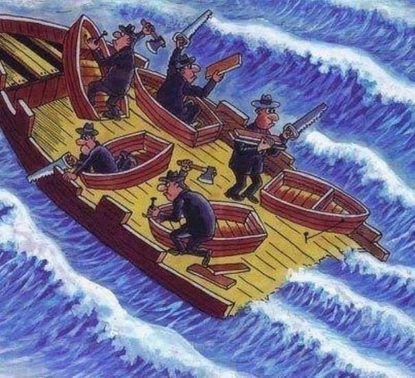
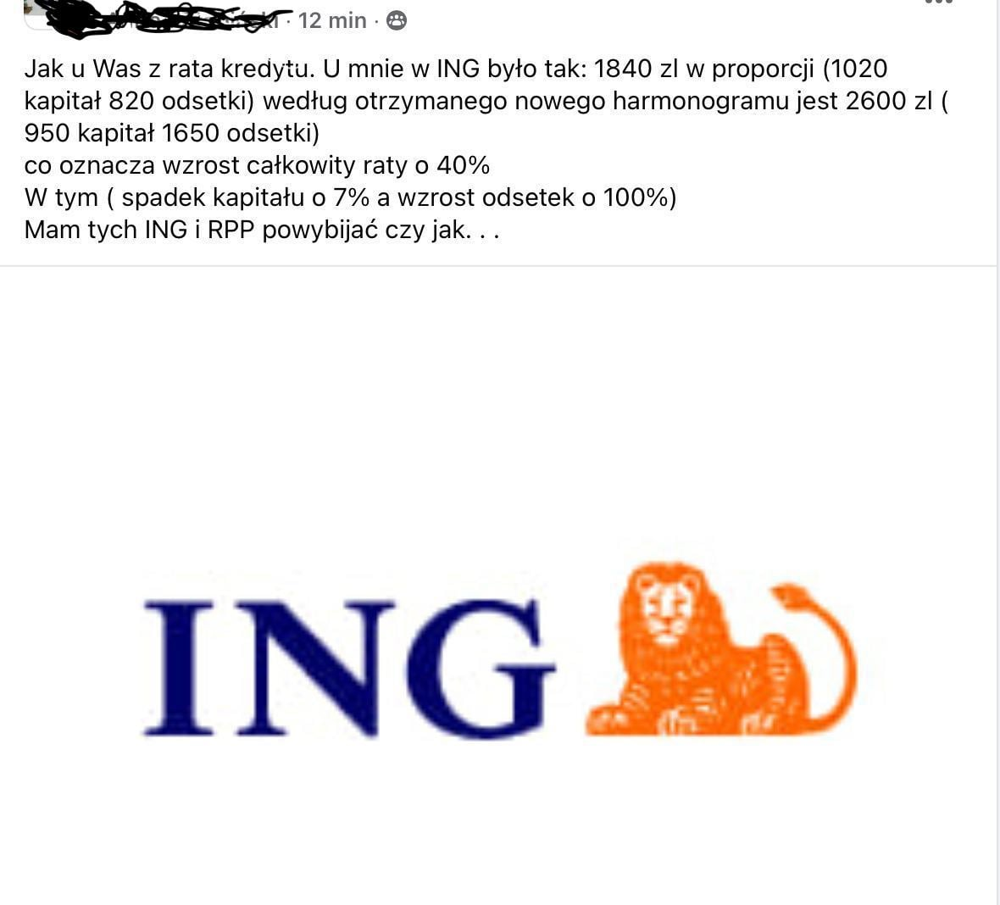
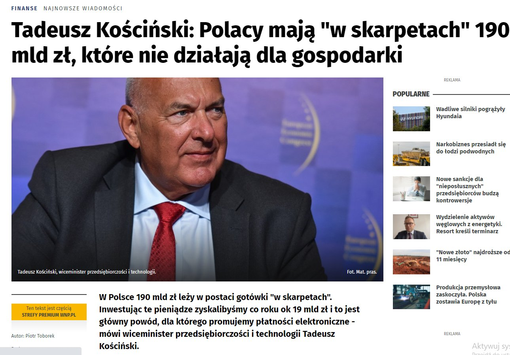
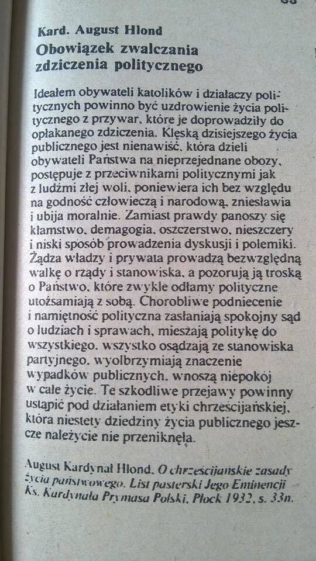
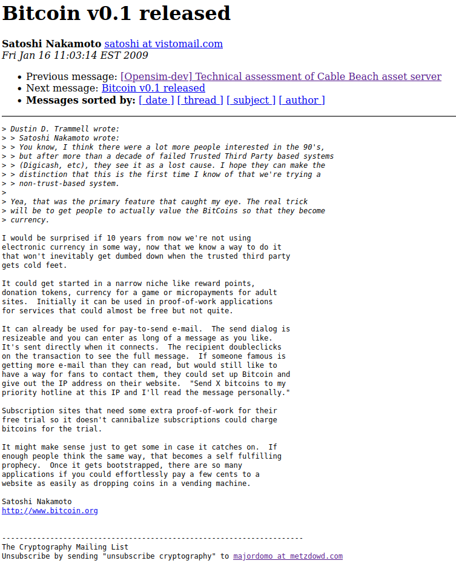
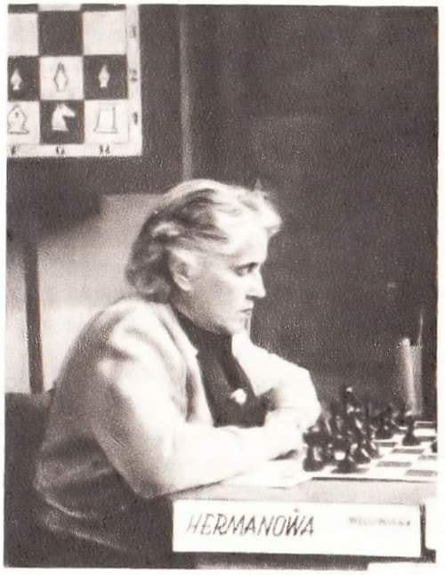

### 2023

Grupa Żywiec po blisko 32 latach notowań znika z warszawskiej giełdy

Heineken International ogłosił przymusowy wykup ostatnich 73.458 akcji (ok. 0,7152 proc. kapitału) Grupy Żywiec, które pozostały w rękach akcjonariuszy mniejszościowych. Po blisko 32 latach notowań producent piwa znika z warszawskiej giełdy.

### 2022

Decentralizacja bankowości oraz świata na jednym obrazku.

  

---

  

---

### 2021

Człowiek który ledwo mówi po polsku widzi duże miejsce do najbardziej mądrego podatku, ale skoro ludzie nie wiedzą co robić to..Kościńskie wie co robić.

  

---

  

---

> Being kind is hard in a rent-seeking, attention-driven economy.

From Heavy by Kiese Laymon: “The nation as it is currently constituted has never dealt with a yesterday or tomorrow where we were radically honest, generous, and tender with each other. It will, though. It will not be reformed. It will be bent, broken, undone, and rebuilt.”

---

Francja zablokowała przejęcie za 20 mld USD przez kanadyjskiego inwestora sieci Carrefour argumentując, że sieć musi zostać we francuskich rękach z powodów bezpieczeństwa żywnościowego państwa. Dopóki w Polsce nie będą podobne standardy, będą nas traktować jak republikę bananową.

---

### 2009

  

More: https://www.metzdowd.com/pipermail/cryptography/2009-January/015014.html

### 2000

Manipulacja:

<video width="640" height="480" controls>
  <source src="./movies/january/janowski.mp4" type="video/mp4">
Your browser does not support the video tag.
</video>

---

UBI/BDG czyli 500+ na sterydach (Universal Basic Income / Bezwarunkowy Dochód Gwarantowany) już na stronach parlamentu polskiego. Tylko ciekawi mnie z czego nasz kraj zamierza to sfinansować 🧐
Nawet jak znacjonalizują 50% własności prywatnej w kraju i zbudują komunizm 2.0 to utrzymanie pensji dla 36 mln pracowników to jakieś 100 mld zł / m-c. 
Takie PKN Orlen generuje 5-10 mld zł zysku rocznie. KGHM jakiś 1 mld zł rocznie. PKO jakieś 2 mld zł. Taka Biedronka 2 mld zł rocznie. Tylko zastanawia mnie co na to akcjonariusze tych spółek. Też ciekawe jaki to będzie miało wpływ na sam rynek.
Doktryna szoku - to doktryna wojenna USA, która pozwala wprowadzać ekstremalne zmiany gospodarcze. Najpierw kryzys, a potem ludzie w desperacji zgodzą się na wszystko.
To co dzieje się obecnie napewno może otworzyć furtkę do ekstremalnych zmian.

<a href="./documents/january/ubi-polska.pdf" target="_blank">UBI w Polsce</a>

---

### 1902

W Łodzi urodziła się Róża Herman (zdjęcie) wybitna polska szachistka żydowskiego pochodzenia, z zawodu lekarka chorób wewnętrznych, absolwentka Wydziału Medycznego Uniwersytetu Warszawskiego.
W latach 1949- 1950 dwukrotnie zdobywała tytuł Mistrzyni Polski Kobiet. W roku 1951 zdobyła srebrny medal. Wcześniej, bo w okresie międzywojennym w roku 1935 zajęła czwarte miejsce w rozgrywanych w Warszawie I Mistrzostwach Polski Kobiet. Była wybitną popularyzatorką gry w szachy wśród dzieci i młodzieży. Za swoje osiągnięcia otrzymała odznakę Zasłużony Działacz Kultury Fizycznej oraz tytuł i odznakę Mistrz Sportu.
Zmarła 7 marca 1995 roku w Łodzi.

  

### 1264

https://pl.wikipedia.org/wiki/Statut_kaliski

---

<a href="https://github.com/TomaszWaszczyk/historia.waszczyk.com/edit/master/src/content/january-16.md" target="_blank">Edytuj tę stronę dzieląc się własnymi notatkami!</a>
