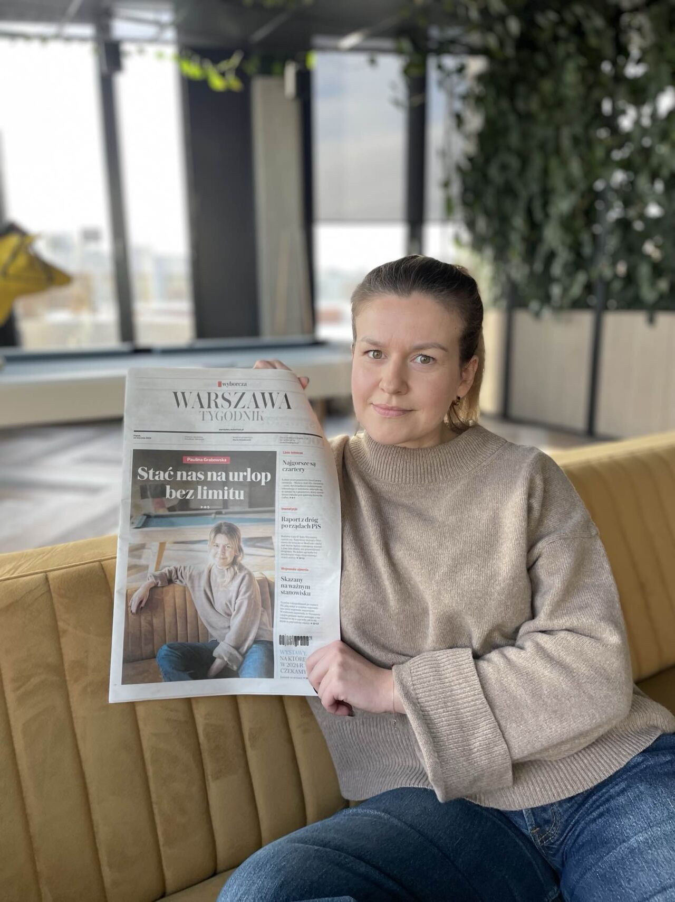

### 2024

Jowita Michalska (Digital European Union Ambassador):

Tworzy się "klasa AI". W ciągu najbliższych dwóch lat zobaczymy, jak pracownicy wiedzy zaczną dzielić się na dwie klasy: ludzi, którzy wykorzystują sztuczną inteligencję w swojej codziennej pracy i ludzi, którzy tego nie robią.

Klasa AI będzie nową klasą o wysokiej wydajności. W ciągu najbliższych pięciu lat "klasa AI" zacznie być awansowana, nagradzana i wynagradzana w wyższym stopniu niż klasa niewykorzystująca AI.

Klasa AI będzie tworzona oddolnie (przez jednostki), a nie odgórnie (przez kierownictwo firmy). Organizacje przejdą do klasy AI, gdy ich pracownicy zaczną z niej korzystać - nie poprzez mianowanie szefa AI.

Zadaniem każdej organizacji jest wprowadzenie siebie i swoich ludzi do klasy AI. Najlepszą rzeczą dla każdej organizacji jest znalezienie sposobów wykorzystania sztucznej inteligencji w celu zwiększenia produktywności, wydajności i jakości pracy. Najlepszą rzeczą dla pracowników jest zdobycie biegłości w sztucznej inteligencji, aby mieli więcej możliwości zatrudnienia, podwyżek i satysfakcjonującej pracy w przyszłości.

Aby stworzyc organizacje opartą o AI, trzeba kwestionować wszystko, co robimy. Nie wprowadzimy siebie ani pracowników do klasy AI, jeśli nie będziemy biegli w sztucznej inteligencji w każdym obszarze działalności. Będzie to musiało oznaczać zmianę sposobu, w jaki organizacja wytwarza, wprowadza na rynek, sprzedaje i dostarcza swoje produkty.

---

<br><br>

---

<br><br>

```
Nielimitowane urlopy a społeczna odpowiedzialność 🕊️

W piątkowym tygodniku Warszawa Wyborcza.pl ukazał się ze mną wywiad dotyczący nielimitowanych urlopów. W SYZYGY mamy je już od przeszło 3 lat. Dalej żyjemy i jest to jedno z rozwiązań, które w całej turkusowej przygodzie generuje imho najmniej napięć. 
Wiadomo: bańka, branża IT, młody, dynamiczny zespół, itp.

Dzisiaj ukazało się wydanie elektroniczne i mówiąc „nie zrobię sobie tego i nie wejdę w komentarze” w tym samym momencie czytałam pierwszy z nich 🤡

I to mnie BOLY! 😓 
Boly mnie, że słysząc „nielimitowany urlop” można słyszeć - „ściema, bzdura, na pewno nie wolno brać więcej niż tyle co ustawa nakazuje”. 
 Smutny obraz Polek i Polaków się z nich maluje.

Najbardziej smucą mnie dwie rzeczy:
👉 powszechne przekonanie, że szef/właściciel na pewno będzie chciał nas zrobić w 🍆
👉 mnie się należy wolne i 🍆 mnie obchodzi co robią i jakie plany mają inni 
 
Smuci mnie, że jako ludzie mamy takie doświadczenia, że inni to zagrożenie, a obroną, która nas przed nimi ochroni, jest myślenie przede wszystkim o sobie i swoim interesie. 
Choć to co mnie najbardziej smuci to, że ciężko się temu dziwić…

Marzy mi się, żeby było inaczej, bo to czego ten kraj dzisiaj bardzo potrzebuje to zrozumienia idei odpowiedzialności społecznej - zwłaszcza w sytuacji, gdy "ustawiłeś się" na górze hierarchii.

Czekam na więcej właścicielek i właścicieli, których stać na odważne ruchy i zmianę myślenia o folwarcznych i feudalnych zależnościach. Hop! Hop! Hop! hashtag#pozdrodlakumatych 🤓

PS zdaję sobie sprawę że ten post jest przedstawieniem tylko części zjawiska, nie każdy musi mieć takie przekonania i być „złym szefem” ;) 

```

### 2023

Grupa Żywiec po blisko 32 latach notowań znika z warszawskiej giełdy

Heineken International ogłosił przymusowy wykup ostatnich 73.458 akcji (ok. 0,7152 proc. kapitału) Grupy Żywiec, które pozostały w rękach akcjonariuszy mniejszościowych. Po blisko 32 latach notowań producent piwa znika z warszawskiej giełdy.

### 2022

Decentralizacja bankowości oraz świata na jednym obrazku.

<br><br>

---

<br><br>

---

### 2021

Człowiek który ledwo mówi po polsku widzi duże miejsce do najbardziej mądrego podatku, ale skoro ludzie nie wiedzą co robić to..Kościńskie wie co robić.

<br><br>

---

<br><br>

---

> Being kind is hard in a rent-seeking, attention-driven economy.

From Heavy by Kiese Laymon: “The nation as it is currently constituted has never dealt with a yesterday or tomorrow where we were radically honest, generous, and tender with each other. It will, though. It will not be reformed. It will be bent, broken, undone, and rebuilt.”

---

Francja zablokowała przejęcie za 20 mld USD przez kanadyjskiego inwestora sieci Carrefour argumentując, że sieć musi zostać we francuskich rękach z powodów bezpieczeństwa żywnościowego państwa. Dopóki w Polsce nie będą podobne standardy, będą nas traktować jak republikę bananową.

---

### 2009

<br><br>

More: https://www.metzdowd.com/pipermail/cryptography/2009-January/015014.html

### 2000

Manipulacja:

<video width="640" height="480" controls>
  <source src="./movies/january/janowski.mp4" type="video/mp4">
Your browser does not support the video tag.
</video>

---

UBI/BDG czyli 500+ na sterydach (Universal Basic Income / Bezwarunkowy Dochód Gwarantowany) już na stronach parlamentu polskiego. Tylko ciekawi mnie z czego nasz kraj zamierza to sfinansować 🧐
Nawet jak znacjonalizują 50% własności prywatnej w kraju i zbudują komunizm 2.0 to utrzymanie pensji dla 36 mln pracowników to jakieś 100 mld zł / m-c. 
Takie PKN Orlen generuje 5-10 mld zł zysku rocznie. KGHM jakiś 1 mld zł rocznie. PKO jakieś 2 mld zł. Taka Biedronka 2 mld zł rocznie. Tylko zastanawia mnie co na to akcjonariusze tych spółek. Też ciekawe jaki to będzie miało wpływ na sam rynek.
Doktryna szoku - to doktryna wojenna USA, która pozwala wprowadzać ekstremalne zmiany gospodarcze. Najpierw kryzys, a potem ludzie w desperacji zgodzą się na wszystko.
To co dzieje się obecnie napewno może otworzyć furtkę do ekstremalnych zmian.

<a href="./documents/january/ubi-polska.pdf" target="_blank">UBI w Polsce</a>

---

### 1902

W Łodzi urodziła się Róża Herman (zdjęcie) wybitna polska szachistka żydowskiego pochodzenia, z zawodu lekarka chorób wewnętrznych, absolwentka Wydziału Medycznego Uniwersytetu Warszawskiego.
W latach 1949- 1950 dwukrotnie zdobywała tytuł Mistrzyni Polski Kobiet. W roku 1951 zdobyła srebrny medal. Wcześniej, bo w okresie międzywojennym w roku 1935 zajęła czwarte miejsce w rozgrywanych w Warszawie I Mistrzostwach Polski Kobiet. Była wybitną popularyzatorką gry w szachy wśród dzieci i młodzieży. Za swoje osiągnięcia otrzymała odznakę Zasłużony Działacz Kultury Fizycznej oraz tytuł i odznakę Mistrz Sportu.
Zmarła 7 marca 1995 roku w Łodzi.

<br><br>

### 1264

https://pl.wikipedia.org/wiki/Statut_kaliski

---

<a href="https://github.com/TomaszWaszczyk/historia.waszczyk.com/edit/master/src/content/january-16.md" target="_blank">Edytuj tę stronę dzieląc się własnymi notatkami!</a>
