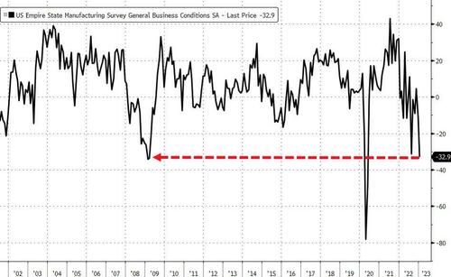
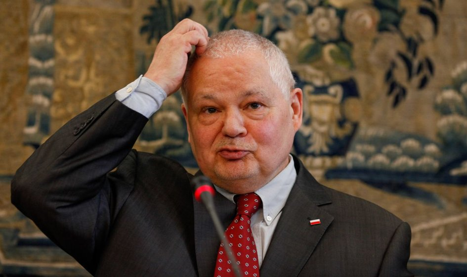
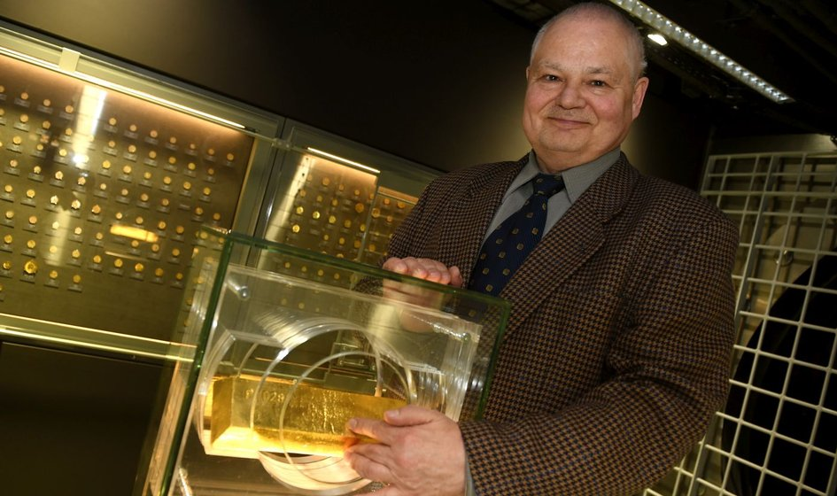
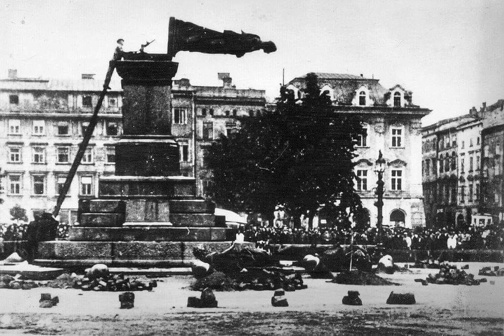
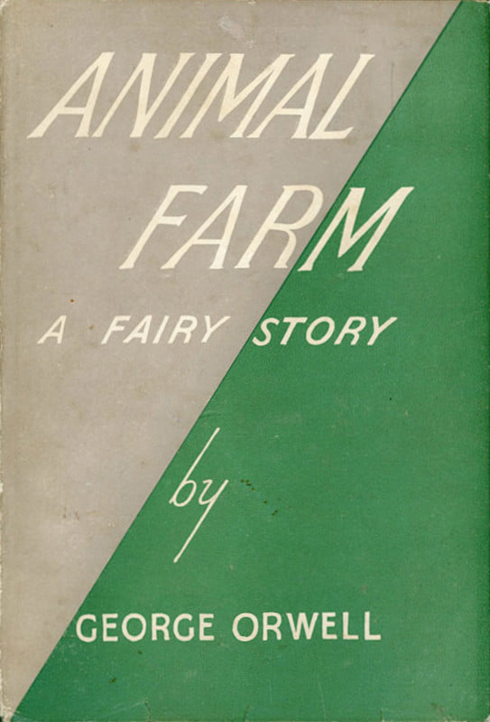
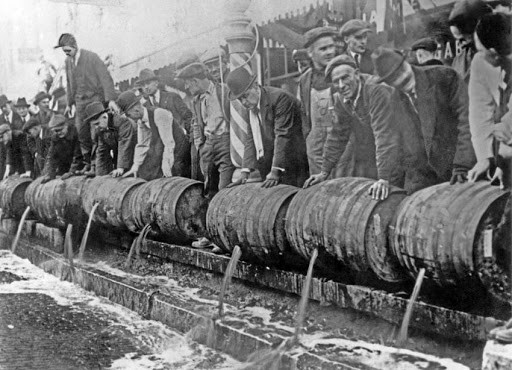
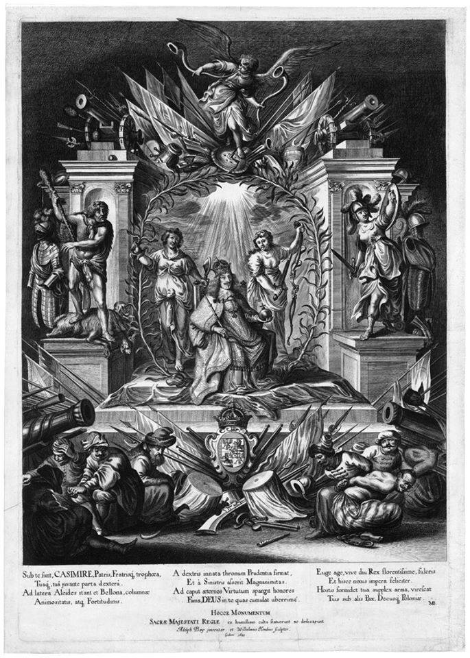

### 2023

FED M2, nie ma gotówki w gospodarce, konsumpcja na dnie jak w 2008

  

### 2021

Mamy to! Oficjalnie pierwsza zapowiedź ujemnych stóp procentowych w Polsce! Oficjalnie! Waluta do zera w ~10lat.

> Dopuszczam dalsze obniżenie stóp procentowych, dopuszczam także stopy ujemne - powiedział w piątek podczas konferencji prezes NBP Adam Glapiński. Dodał, że ewentualna obniżka stóp będzie zależna od sytuacji gospodarczej. Ewentualną podwyżkę stóp prezes nazwał "abstrakcją".

Na posiedzeniach między 17 marca a 28 maja 2020 r. Rada Polityki Pieniężnej trzykrotnie obniżyła stopę referencyjną, łącznie o 140 pb., w krokach po 50, 50 i 40 pb., do poziomu 0,10 proc.

Pod koniec grudnia 2020 r. prezes NBP w wywiadzie dla "Obserwatora Finansowego" powiedział, że "obecny poziom stóp procentowych jest właściwy i najlepiej odpowiada obecnej sytuacji". "Jednak w pierwszym kwartale następnego roku możliwe jest dalsze obniżenie stóp. Prowadzimy w NBP odpowiednie analizy możliwych okoliczności i potencjalnych skutków takiego obniżenia" - wskazał.

Glapiński pytany w piątek na konferencji o ten wywiad przekazał, że dopuszcza dalsze obniżenie stóp procentowych, a także stopy ujemne.

> "Generalnie rzecz biorąc - tak, dopuszczam obniżenie stóp, tak, dopuszczam stopy ujemne, które - przypomnę - są w całej strefie euro. W Europie nie są żadnym ewenementem" - powiedział prezes.

  

---

Bill Gates, obecnie czwarty najbogatszy człowiek na świecie, jest właścicielem 242000 akrów (prawie 100 tys. hektarów) ziemi uprawnej w różnych częściach USA - informuje "Forbes". Dzięki temu stał się największym, prywatnym właścicielem ziemi rolnej w tym kraju.

---

https://pl.wikipedia.org/wiki/Walter_Eucken

---

Glapiński: Chciałbym, żeby złoto w jeszcze większym stopniu znalazło się w naszych rezerwach

  

Podwojenie rezerw złota i sprowadzenie ich części do Polski to nie koniec „złotych planów” kreślonych przez prezesa NBP Adama Glapińskiego. Jego zdaniem, udział kruszcu w polskich rezerwach walutowych powinien się podwoić.

### 2011

<a href="./documents/january/emer_przeglad_pl.pdf" target="_blank">Przegląd systemu emerytalnego</a>

### 1961

<video width="640" height="480" controls>
<source src="./movies/january/Eisenhower-Farewell-Military-Industrial-Complex.mp4" type="video/mp4">
Your browser does not support the video tag.
</video>

### 1940

Dziś Niemcy usunęli pomnik Adama Mickiewicza. To jest wielki cios dla Polaków. Gdy zdejmowano pomnik, przyleciały bociany i krążyły nad rynkiem, co jest bardzo dziwne.
--- zapis pochodzi z pamiętnika Ireny Szczęście, żydowskiej dziewczynki.

  

Foto: 17 sierpnia 1940. Kraków. Niemcy niszczą pomnik Adama Mickiewicza.

### 1945

https://en.wikipedia.org/wiki/Raoul_Wallenberg

---

W nakładzie 4500 egzemplarzy w Wielkiej Brytanii ukazała się powieść "Folwark zwierzęcy" George’a Orwella.
Orwell, jak stwierdził w ukraińskiej przedmowie do wydania Folwarku zwierzęcego, chciał stworzyć opowieść demaskującą sowiecki mit, którą mógłby zrozumieć każdy.
Ksiązkę Orwell ukończył pod koniec 1944 r. lecz kilku wydawców odmówiło jej publikacji ze względu na sugestię pochodzącą z brytyjskiego Ministerstwa Informacji, które zaznaczało jej antyrosyjski charakter. Dziś uważa się, że osobą odpowiedzialną za wydanie takiej opinii był Peter Smolka - dziennikarz, wydawca i agent sowiecki.
W Polsce powieść była niemal do końca PRLu zakazana przez cenzurę, pierwsze jej krajowe wydanie ukazało się w 1988 r. 
Ponadczasowe:
"Zwierzęta w ogrodzie patrzyły to na świnię, to na człowieka, potem znów na świnię i na człowieka, ale nikt już nie mógł się połapać, kto jest kim."

  

### 1920

W USA została wprowadzona prohibicja. Dziś ustawę o prohibicji uważa się za jedno z najgłupszych rozwiązań prawnych XX wieku.
Sekcja pierwsza poprawki stanowiła, że po upływie roku od ratyfikacji produkcja, sprzedaż, transport napojów alkoholowych, a także import i eksport na całym terytorium Stanów Zjednoczonych jest zakazany. Przepis ten nie ograniczał jednak produkcji ani sprzedaży alkoholu w celach przemysłowych.
Prohibicja była eksperymentem powziętym w celu zredukowania przestępczości i korupcji, rozwiązania problemów społecznych, poprawy higieny i zdrowia wśród Amerykanów. Rezultat tego eksperymentu był jednak żałosny na każdej płaszczyźnie.
Wprowadzanie XVIII Poprawki do Konstytucji rozpoczęło się bez rozgłosu i z bardzo małym oporem społeczeństwa. Z czasem zaczęto zdawać sobie jednak sprawę, że wymuszanie respektowania prawa będzie coraz trudniejsze. Kiedy było już wiadomo, że Ustawa Prohibicyjna wejdzie w życie, bogaci Amerykanie zaczęli wykupywać zapasy alkoholu. Ivy league i Yale Club były tak przewidujące, że zrobiły zapasy, które normalnie starczyłyby im na 14 lat. Na trzy miesiące przed wprowadzeniem Prohibicji, alkohol wart pół miliona dolarów został skradziony z rządowych magazynów. Liczba strażników wzrastała, ale alkohol ciągle znikał.
Już w czerwcu 1920 roku sąd w Chicago był bezsilny i zawalony sprawami. Ponad 600 spraw czekało na rozprawę. Wiele spośród nich dotyczyło skorumpowanych agentów, mających stać na straży Prohibicji. Prawdziwe łamanie prawa miało się jednak dopiero rozpocząć.
Korupcja wśród funkcjonariuszy publicznych osiągnęła swoje apogeum. Wszyscy, począwszy od polityków do policjantów, mający stać na czele egzekwowania prawa, pobierali łapówki od nielegalnych wytwórni i rozlewni, przywódców gangów i innych krętaczy. Biuro do spraw Prohibicji było podatne na korupcję i samo musiało zostać zrestrukturyzowane. Według Doradcy Sekretarza Skarbu Lincolna C. Andrews'a - podziemie alkoholowe było bardzo dobrze rozbudowane, zorganizowane, finansowane i całkiem sprytnie zarządzane.
Do egzekwowania nowego prawa powstało nie tylko Biuro d/s Prohibicji, ale również nastąpił drastyczny wzrost liczebności i władzy innych agencji rządowych. Między rokiem 1920-1930 zatrudnienie w Urzędzie Celnym (Custom Service) wzrosło o 45, a budżet agencji o 123 procent. W Straży Przybrzeżnej (Coast Guard) ten wzrost wyniósł 188 procent, a budżet zwiększył się pięciokrotnie. Niemniej agenci byli źle wyszkoleni, słabo opłacani i nader często skorumpowani.
Biuro d/s Prohibicji nie cieszyło się powodzeniem również z innego powodu - zgodziło się na zanieczyszczenie alkoholu wykorzystywanego do produkcji przemysłowej, co było równoznaczne z udziałem w zabójstwach. Dodatkowo duża część wytwarzanego pokątnie alkoholu była bardzo złej jakości. Ludzie tracili wzrok, zdrowe zmysły, zostawali sparaliżowani lub umierali po spożyciu zanieczyszczonego trunku*. Tylko w październiku 1928 roku taki alkohol zabił w Nowym Jorku 25 osób. Policjanci i agenci prohibicyjni byli również znani z tego, że bardzo często, zamiast niszczyć wytworzony przez nielegalnie wytwórnie alkohol, zabierali go ze sobą, a przemytnicy stali się częstymi gośćmi w budynkach rządowych**. Przestępczość zorganizowana była w tym czasie pod parasolem skorumpowanych polityków, a olbrzymie zyski w części przeznaczano na przekupywanie policjantów, prokuratorów, burmistrzów i sędziów. Tylko dla jednego gangu w Chicago pracowało prawie 400 policjantów.
Najbardziej alarmującym rezultatem była jednak przestępczość zorganizowana. Bezwzględne gangi działały w Ameryce przez wiele lat, zastraszając lokalną społeczność, rabując, oszukując, prowadząc nielegalne kasyna. Prohibicja spowodowała wzrost liczebności i zwiększyła władzę takich grup, umożliwiając im działalność z niewielkim ryzykiem poniesienia kary, ale za to, z pewnym zyskiem. Nie było również społecznej stygmatyzacji, tak jak to miało miejsce w przypadku pospolitych napadów, czy kradzieży. Gangsterzy byli wspierani przez rozwój broni maszynowej, a dzięki Edisonowi również telefonów, które pozwalały łatwo kontrolować im całe miasta. Al Capone, niepodzielnie działający w Chicago, dla którego pracowało około 10 tysięcy szmuglerów, na Prohibicji zarobił 20 milionów dolarów.
Po kilku długich latach bezskutecznych prób stosowania prawa, Prezydent Hoover powołał Komisję Wickershama ( 1929-1931), do zbadania problemu***. Jej wnioski były następujące: "Społeczeństwo przestało mieć negatywne odczucia w stosunku do przestępców, ponieważ uważa, że spełniają oni jego oczekiwania. Nikt nie wysuwa żądań do postawienia ich w stan oskarżenia. Nie można nakazać ludziom, by nie robili tego, czy tamtego, ponieważ są niespełna rozumu. Oni po prostu chcą się napić".
Skuteczne środki walki z bezprawiem zostały podjęte dopiero przez FBI we wczesnych latach 30. Nawet Al Capone został w końcu aresztowany, ale nie za łamanie prawa o Prohibicji, ale za unikanie płacenia podatków.
5 grudnia 1933 roku większość stanów ratyfikowała XXI poprawkę do Konstytucji, która usuwała XVIII poprawkę, kończąc w ten sposób eksperyment zwany Prohibicją.
*Jeden z takich producentów podał przepis na szmuglowany alkohol (ang. moonshine) - był on produkowany z cukru, wody, drożdży i śmieci
**George Ramus został nagrany w pokoju hotelowym podczas przekupywania ponad 40 agentów federalnych, policjantów, sędziów. Nigdy nie został jednak oskarżony, ponieważ ci, którzy mogli to zrobić zostali również przekupieni
***Prezydent Herbert Hoover ocenił, że bez co najmniej 250 tysięcy policjantów, nie ma co marzyć o egzekwowaniu prawa. W 1929 roku powołał Krajową Komisję Oceny i Przestrzegania Prawa, na której czele stanął George W. Wickersham.

  

### 1649

Jan II Kazimierz Waza został koronowany w katedrze wawelskiej na króla Polski.
Ostatni przedstawiciel dynastii Wazów na polskim tronie rozpoczął swe blisko dwudziestoletnie panowanie – jedno z najsmutniejszych i najbardziej dramatycznych w naszej historii.
Urodził się 22 III 1609 r., zmarł 16 XII 1672 r. Przyszły król miał bardzo barwną przeszłość. Jan Kazimierz brał udział w wojnie trzydziestoletniej jako pułkownik wojsk cesarskich. Oskarżony przez Francuzów o szpiegostwo, dwa lata spędził w więzieniu (lata 1638-1640). W 1643 r. trafił do zakonu jezuitów w Rzymie. Po trzech latach (1646 r.) z rąk papieża otrzymał godność kardynała. Gdy się okazało, że za tytułem nie idą żadne apanaże, szybko zrzekł się tytułu i powrócił do Polski. Tron polski objął w bardzo trudnej dla kraju chwili - cała Ukraina objęta była już powstaniem Chmielnickiego. Po elekcji (20 XI 1648 r.) i koronacji (17 I 1649 r.) nowy król stanął przed problem rozwiązania kwestii kozackiej. Jeszcze nie zakończono jednej wojny gdy, Rzeczpospolitą zaatakowała Moskwa (w 1654 r.), a następnie rozpoczął się potop szwedzki (1655 r.). Jan Kazimierz został zmuszony opuścić na kilka miesięcy granice Rzeczypospolitej. Odsunięcie realnej groźby rozbioru państwa przez sąsiadów przyszło drogo opłacić. Traktatami wielawsko-bydgoskimi (19 IX 1657 r.) Polska zrezygnowała z lenna pruskiego, a elektor brandenburski Fryderyk Wilhelm I uzyskał suwerenność Prus Książęcych w zamian za odstąpienie od Szwedów. W 1658 r. z Rzeczpospolitej wyrzucono arian, oskarżanych o sprzyjanie Szwedom. Za panowania Jana Kazimierza pojawiły się pierwsze symptomy rozpadu ustroju Rzeczypospolitej. W 1652 r. sejm został zerwany przez liberum veto. Próby reform, szczególnie pomysł wyboru króla za życia poprzednika (vivente rege), spotkały się ze zdecydowanym sprzeciwem szlachty. Rokoszanie pod wodzą Jerzego Lubomirskiego, hetmana polnego i marszałka wielkiego koronnego (stąd rokosz Lubomirskiego) w bitwach pod Częstochową (1665 r.) i Mątwami (1666 r.) pobiły armię królewską. Król nie widząc możliwości porozumienia się ze swymi poddanymi, abdykował 16 IX 1668 r. Jan Kazimierz przeniósł się do Francji, gdzie zmarł. W 1675 r. ciało króla przewieziono do Polski i złożono na Wawelu.

  

---

<a href="https://github.com/TomaszWaszczyk/historia.waszczyk.com/edit/master/src/content/january-17.md" target="_blank">Edytuj tę stronę dzieląc się własnymi notatkami!</a>
