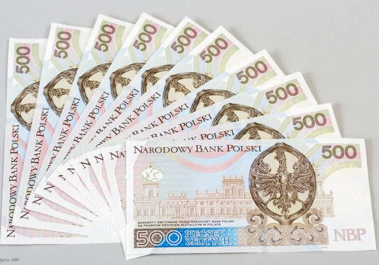
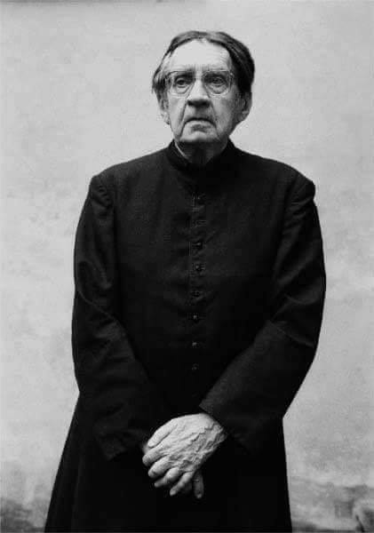

### 2021

> Banknot 1000 złotych już na horyzoncie

Przygotowanie Polaków (śpiących, niemyślących, analfabetów ekonomicznych) do zostania milionerami! Każdy milionerem do ~10lat.

NBP zapowiada wprowadzenie nowego nominału. Już wkrótce będziemy płacić banknotem 1000 zł

> Prezes NBP Adam Glapiński w trakcie specjalnego briefingu prasowego oświadczył, że już niedługo w Polsce pojawi się banknot o nowym nominale. – Myślę, że następny prezes, a mam nadzieję ja w następnej kadencji, ale każdy prezes który przyjdzie, będzie wprowadzał banknot 1000 zł w pewnym momencie – powiedział Glapiński.

  

Ciekawe czy inflacja zostanie rozgrzana w Polsce jako peryferyjnej gospodarce w celu przetestowania cyfrowych systemów czy jednocześnie globalnie? Ciężko stwierdzić teraz.

Tomek myśli: Ciekawe czy Glapiński wytrzyma psychicznie to czego się dowiedział "z zewnątrz" czy odejdzie dla zachowania zdrowia i zostanie wybrany "młody i ambitny". Generalnie może być tak, że inflacja zostanie w granicach Polski, ale Euro wcale silniejsze nie jest (chociaż gospodarka za walutami zdecydowanie tak), chociaż EBC może trzymać na siłę wartość Euro i zostanie USD oraz EUR jako waluty które zostaną przetransformowane do nowego systemu na końcu. Jeśli inflacja pojawi się jedynie w granicach Polski skutki będą prównywalne do konsekwencji wojny konwencjonalnej - zanik insytucji państwa per se, zupełny.

---

### 2006

W warszawskim szpitalu przy ul. Banacha zmarł 90- letni ksiądz Jan Twardowski.
Przeszedł do historii jako autor słów: ,,Śpieszmy się kochać ludzi, tak szybko odchodzą''. Przylgnęło do niego określenie ,,ksiądz Jan od biedronek'', ponieważ w swoich wierszach uwagę poświęcał każdemu stworzeniu, nawet temu najmniejszemu. Był odnowicielem konwencji literatury religijnej. Debiutował w 1937 roku tomikiem ,,Powrót Andersena''. W czasie okupacji niemieckiej był żołnierzem Armii Krajowej. Walczył w Powstaniu warszawskim na Woli w III Obwodzie "Waligóra" Warszawskiego Okręgu Armii Krajowej. Z powstańczego okresu pochodzę jego wiersze ,,Matka Boska Powstańcza'' i ,,Kolumna Zygmunta''. W sierpniu został ranny. To właśnie w szpitalu na Woli podjął decyzję o wstąpieniu do seminarium duchownego. W 1948 roku otrzymał święcenia kapłańskie. Przez trzy lata pracował jako wikariusz w parafii w Żbikowie k. Pruszkowa. Zajmował się nauczaniem religii w szkole specjalnej. Od 1959 roku aż do emerytury był rektorem kościoła sióstr Wizytek w Warszawie, gdzie głosił kazania dla dzieci. Był również wieloletnim wykładowcą i wychowawcą pokoleń kleryków w warszawskim seminarium. Wydał tomy poezji: "Wiersze" (1959), "Znak ufności" (1970), "Zeszyt w kratkę. Rozmowy z dziećmi i nie tylko z dziećmi" (1973), "Niebieskie okulary" (1980), "Który stwarzasz jagody" (1983), "Na osiołku" (1986), "Nie przyszedłem pana nawracać. Wiersze 1939-85" (1986), "Sumienie ruszyło" (1989), "Niecodziennik" (1991), "Nie martw się" (1992), "Wiersze" (1993). W 1980 roku otrzymał Nagrodę PEN Clubu im. Roberta Gravesa za całokształt twórczości.

  

### 1936

Urodził się Józef Kossecki: https://pl.wikipedia.org/wiki/J%C3%B3zef_Kossecki

https://pl.wikipedia.org/wiki/W%C5%82odzimierz_Zag%C3%B3rski_(genera%C5%82)

---

<a href="https://github.com/TomaszWaszczyk/historia.waszczyk.com/edit/master/src/content/january-18.md" target="_blank">Edytuj tę stronę dzieląc się własnymi notatkami!</a>
