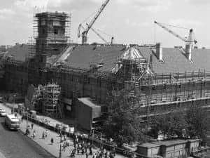
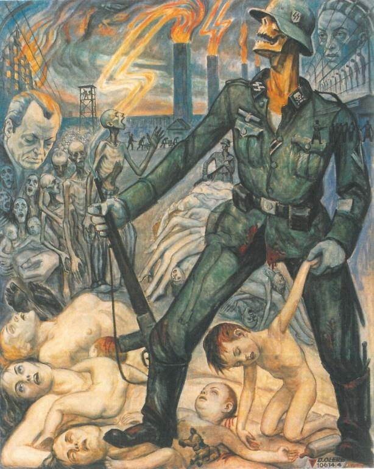
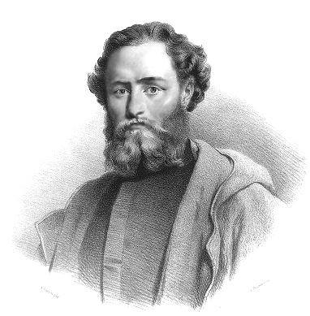

### 1971

Biuro Polityczne Komitetu Centralnego Polskiej Zjednoczonej Partii Robotniczej podjęło decyzję o odbudowie Zamku Królewskiego w Warszawie.
Przypomnijmy, że zabytek ten został zbombardowany przez lotnictwo niemieckie we wrześniu 1939 roku.
Pierwsze przymiarki do odbudowy Zamku podjęto już w roku 1945, kiedy to w Biurze Odbudowy Stolicy powołano Pracownię Odbudowy Zamku Królewskiego. W ciągu czterech lat opracowana została tam koncepcja odbudowy zakładająca odtworzenie budowli w niemal pierwotnej formie. Jesienią 1949 rozpoczął się cykl konsultacji poświęconych odbudowie, do których Kancelaria Cywilna Prezydenta RP Bolesława Bieruta – przyszłego lokatora Zamku – dopuściła także przedstawicieli władz konserwatorskich. Stanowisko Bieruta, w znacznym stopniu polegające na dosyć krytycznym podejściu do pomysłów architektonicznych budowniczych, którym trudno było zaakceptować pomysł zaadaptowania obiektu dla potrzeb prezydenta spowodowało odsunięcie od prac projektowych niektórych z nich oraz odwleczenie planów odbudowy o kolejny rok, kiedy to w grudniu 1951 roku Sekretariat KC PZPR podjął uchwałę o przeprowadzeniu konkursu na odbudowę Zamku z przeznaczeniem go na siedzibę Rady Ministrów. Kolejny konkurs na odbudowę Zamku ogłoszono jednak dopiero w roku 1954. Autorom prac wynaczono kryterium, które polgać miało na podkreśleniu dominującej nad otoczeniem roli Zamku.
Lata 1956 -1970 były czasem zastoju i marazmu w planach odbudowy Zamku. Wynikało to głównie z krytycznego podejścia do tego tematu samego Władysława Gomułki. Rok 1971 okazał się być jednak przełomowym. Zaledwie miesiąc wcześniej do władzy doszedł Edward Gierek oraz miały miejsce wydarzenia Grudnia 1970 roku, które nie pozostały bez znaczenia w kwestii odbudowy. Nowa władza bardzo szybko zdecdowała się na podjęcie decyzji o wybudowaniu Zamku, w sporej mierze chcąc w ten sposób załagodzić społeczny gniew. Została zorganizowana ogólnpolska zbiórka, na którą złożyła się również polonia z całego świata.
Tak o odbudowie Zamku mówiła inżynier architekt Irena Oborska:
" Mieliśmy, wbrew pozorom, ogromny materiał. Leżały wszystkie fragmenty kamienne, które można było zmierzyć. A na podstawie łamigłówki, układania poszczególnych elementów, można było wywnioskować jakiej wysokości były np. okna. W tej chwili mamy przebadane gabaryty zamku. Mieliśmy wszystkie zdjęcia, więc na ich podstawie mogliśmy odczytać dokładne rzuty zamkowe, a zachowane fragmenty pozwoliły nam ustalić prawidłową skalę wnętrza."

  

### 1946

https://pl.wikipedia.org/wiki/Mi%C4%99dzynarodowy_Trybuna%C5%82_Wojskowy_dla_Dalekiego_Wschodu

### 1945

Żołnierze Armii Krajowej! Daję Wam ostatni rozkaz. Dalszą swą pracę i działalność prowadźcie w duchu odzyskania pełnej niepodległości Państwa i ochrony ludności polskiej przed zagładą. Starajcie się być przewodnikami Narodu i realizatorami niepodległego Państwa Polskiego. W tym działaniu każdy z Was musi być dla siebie dowódcą,
W przekonaniu, że rozkaz ten spełnicie, że zostaniecie na zawsze wierni tylko Polsce oraz by wam ułatwić dalszą pracę - z upoważnienia Pana Prezydenta Rzeczypospolitej Polskiej zwalniam Was z przysięgi i rozwiązuję szeregi AK. W imieniu służby dziękuję Wam za dotychczasową ofiarną pracę. Wierzę głęboko, że zwycięży nasza Święta Sprawa, że spotkamy się w prawdziwie wolnej i demokratycznej Polsce. Niech żyje Wolna, Niepodległa, Szczęśliwa Polska!"
Tym wydanym 19 stycznia 1945 roku rozkazem generał Leopold Okulicki rozwiązał Armię Krajową.
Formacja ta o charakterze konspiracyjnym powstała 14 lutego 1942 roku na mocy rozkazu Naczelnego Wodza Polskich Sił Zbrojnych generała Władysława Sikorskiego o przemianowaniu Związku Walki Zbrojnej na Armię Krajową.
Rozwiązanie Armii Krajowej podyktowane było coraz trudniejszą sytuacją po przegranym powstaniu warszawskim oraz obawami o bezpieczeństwo działających w niej żołnierzy. Sowiecki wywiad przy pomocy komunistycznej Polskiej Partii Robotniczej i jej zbrojnej organizacji Gwardii Ludowej (przemianowanej na Armię Ludową) w czasie wojny zgromadzili bogatą dokumentację o polskim podziemiu patriotycznym. Po wkroczeniu do Polski, Rosjanie aresztowali i zesłali do gułagów w ZSRR blisko 50 tysięcy członków Armii Krajowej. Sam Okulicki zaś został podstępnie uprowadzony i zamordowany w Moskwie.

### 1902

David Olère urodził się 19 stycznia 1902 r. w Warszawie zmarł 21 sierpnia 1985 r. pod Paryżem. Studiował w Akademii Sztuk Pięknych w Warszawie. W 1918 r. wyjechał do Berlina, a następnie do Paryża, gdzie osiadł już na stałe. Należał do tzw. szkoły paryskiej. Pracował dla różnych wytwórni filmowych (tworzył scenografie, kostiumy i plakaty reklamowe) m.in. Paramount Pictures, Fox, Gaumont.
20 lutego 1943 r. ze względu na żydowskie pochodzenia został aresztowany przez policję francuską i umieszczony w obozie Drancy. Stamtąd 2 marca deportowano go do niemieckiego nazistowskiego obozu koncentracyjnego i zagłady Auschwitz, gdzie oznaczono go numerem 106 144. Przez cały okres pobytu w obozie pracował w Sonderkommando, specjalnej grupie roboczej zmuszonej przez Niemców do obsługi krematoriów i komór gazowych.
"David Olère jest jedynym więźniem Sonderkommando, który swoje traumatyczne przeżycia w cieniu kominów krematoryjnych przelał na papier i płótna. Stąd ich całkowicie unikatowa wartość, jako dokumentów ilustrujących dzieje Zagłady. Pochodzą od naocznego świadka i ukazują zarówno codzienność pracy Sonderkommando, jak i siłę traumy oraz wolę życia mimo wszystko osoby, która przeszła przez najciemniejsze z obozowych doświadczeń."

  

### 1863

Powstał Tymczasowy Rząd Narodowy – centralny organ władz rozpoczętego 22 stycznia powstania styczniowego.

Tymczasowy Rząd Narodowy ogłosił Ludwika Mierosławskiego dyktatorem powstania, które ma wybuchnąć za trzy dni. Mierosławski, weteran powstania listopadowego, wybitny działacz emigracyjny, naczelny wódz powstania poznańskiego w 1848 r., przebywał w tym czasie w Paryżu. Do Królestwa Kongresowego przekradł się 17 lutego i objął dowództwo nad jednym z oddziałów partyzanckich. 19 lutego przegrał potyczkę pod Krzywosądzem na Kujawach i wycofał się do nieodległej Nowej Wsi. 21 lutego partyzantów Mierosławskiego dopadły tam wojska rosyjskie pułkownika Schuldnera, zmusiły do opuszczenia pola bitwy i przekroczenia granicy pruskiej. Po tej porażce Mierosławski złożył funkcję dyktatora i wrócił do Paryża.

  

---

<a href="https://github.com/TomaszWaszczyk/historia.waszczyk.com/edit/master/src/content/january-19.md" target="_blank">Edytuj tę stronę dzieląc się własnymi notatkami!</a>
