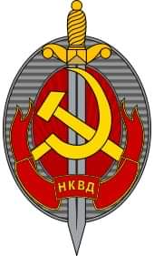
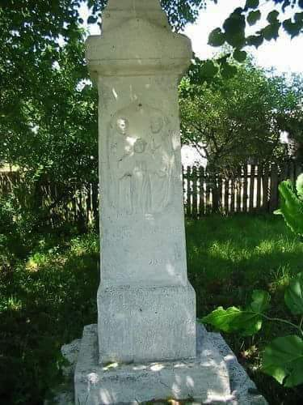
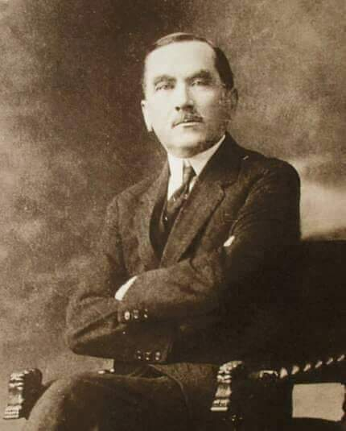
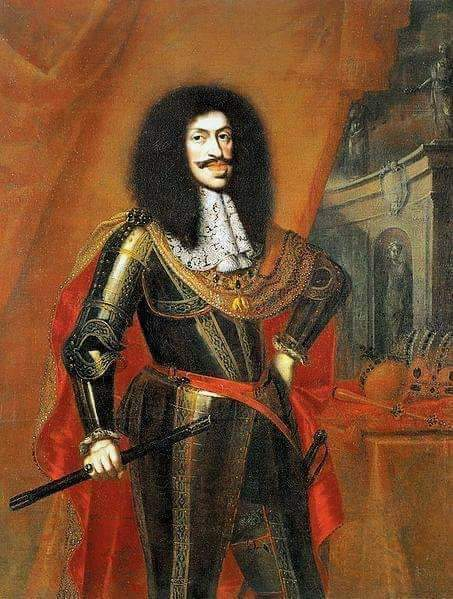
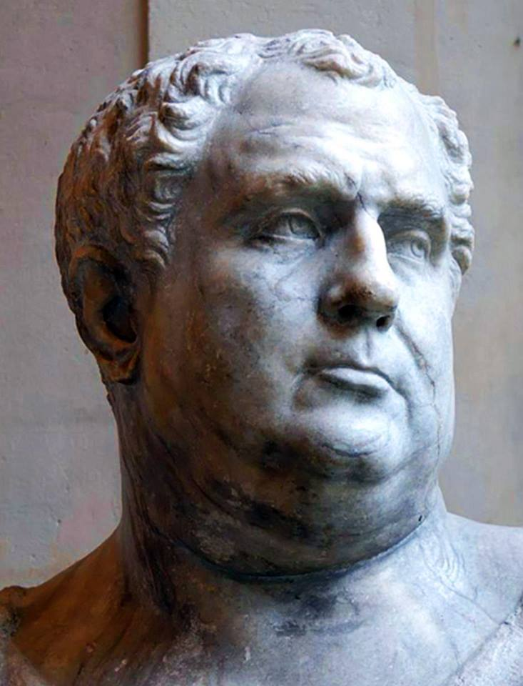

### 1945

NKWD (Ludowy Komisariat Spraw Wewnętrznych) rozpoczął aresztowania Polaków zamieszkujących we Lwowie. Szacuje się, że podczas akcji trwającej trzy dni w więziennych celach znalazło się 17 tysięcy ludzi. Część z nich została po pewnym czasie zwolniona do domu, jednak większość wysłano w głąb Związku Radzieckiego.

 

### 1944

W Bołdurach w powiecie brodzkim w województwie tarnopolskim 200 sotnia UPA dokonała mordu na zamieszkujących tę liczącą około 1000 mieszkańców miejscowość ludność polską i ukraińską.
Bandyci podzielili się na liczące po około 10 osób grupy, które włamywały się do polskich i ukraińskich zabudowań. Najgorsze jest to, że wielu morderców pochodziło z tej samej wsi lub okolic. Ci z nich, którzy znali osobiście swoje przyszłe ofiary lub ich miejsce zamieszkania wskazywali je innym zbrodniarzom. Ludzi mordowano przy użyciu broni palnej, ale również, co charakterystyczne, przy użyciu siekier, toporów i wideł. Po dokonaniu masakry do wsi wjechały furmanki, na które upowcy oraz okoliczni chłopi ukraińscy ładowali mienie zabitych. Zabierano także inwentarz. Przy okazji dobijano rannych oraz przeszukiwano obejścia w celu wykrycia ukrywających się. Ograbione gospodarstwa podpalano, jeśli nie graniczyły z domami ukraińskimi. W ten sposób spalono około 30 gospodarstw; spaliły się w nich niektóre ofiary.
Dane dotyczące ilości zabitych nie są spójne i według różnych źródeł wynosi od 60 do 100 zabitych Polaków i Ukraińców.
Zdjęcie przedstawia figurę znajdującą się obok polskiej kaplicy w Bołdurach.

 

### 1939

"Jestem Polakiem Jestem nim nie dlatego tylko, że mówię po polsku, że inni mówiący tym samym językiem są mi duchowo bliżsi i bardziej dla mnie zrozumiali, że pewne moje osobiste sprawy łączą mnie bliżej z nimi niż z obcymi, ale także dlatego, że obok sfery życia osobistego, indywidualnego znam zbiorowe życie narodu, którego jestem cząstką, że obok swoich spraw i interesów osobistych znam sprawy narodowe, interesy Polski, dla których należy poświęcić to, czego dla osobistych spraw poświęcić nie wolno. Jestem Polakiem – to znaczy, że należę do narodu polskiego na całym Jego obszarze i przez cały czas jego istnienia zarówno dziś, jak w wiekach ubiegłych i w przyszłości. To znaczy, że czuję swą ścisłą łączność z całą Polską"

Powyższy tekst to słowa zmarłego 2 stycznia 1939 roku w wieku 75 lat przywódcy Narodowej Demokracji Romana Dmowskiego (zdjęcie).
W swojej polityce Dmowski początkowo postulował, jako formę przejściową zjednoczenie ziem polskich pod protektoratem Rosji,co doprowadziło do poróżnień z Józefem Piłsudskim, który Rosji nienawidził. Jednak po wybuchu rewolucji w 1917 roku Dmowski diametralnie zmienił zdanie, by w 1919 roku razem z Ignacym Paderewskim podpisać Traktat Wersalski.
W roku 1926 założył Obóz Wielkiej Polski ,
starając się zjednoczyć cały ruch narodowy i
prawicowy w Polsce – w opozycji do programu
jej sanacji. Do końca życia wywierał ogromny
wpływ na działalność Stronnictwa Narodowego.
"Kurier Warszawski" o śmierci Dmowskiego pisał:
"Zgasł jeden z największych umysłów politycznych na szlaku dzienów Polski".
Pogrzeb odbył się 7 stycznia 1939 roku na Cmentarzu Bródnowskim w Warszawie.

 

### 1683

Austriacki książę cieszyński i Święty Cesarz Rzymski Leopold I (grafika) wysłał do Polski dwóch delegatów; Karola Ferdinanda de Wildstein i Jana Zierowskiego, by ci przekonali króla Jana III Sobieskiego do walki przeciwko Turcji. Efektem tego działania było zawarte przez nich 1 kwietnia 1683 roku porozumienie,w którym strona polska zobowiązała się do walki z Imperium Osmańskim.

 

### 69 r.n.e.

Legiony z Germanii Górnej obwołały Witeliusza cesarzem rzymskim.

Jako młodzieniec Witeliusz cieszył się opinią rozpustnika, znawcy powożenia rydwanów jak i świetnego kompana do gry w kości. Był (jak większość hulaszczej młodzieży) przyjacielem Nerona. To za jego panowania otrzymał namiestnictwo Afryki. O dziwo wywiązywał się wzorowo z funkcji administratora.

Za krótkiego panowania Galby otrzymał kolejna namiestnictwo, tym razem Germanii Dolnej. W stosunku do żołnierzy stacjonujących nad Renem zawsze odnosił się w sposób niezwykle życzliwy, dzięki czemu uzyskał sporą popularność w szeregach. Byli oni natomiast niechętni Galbie, a później także Othonowi. Dlaczego, przecież prawie ich nie znali? Głównie przez zawiść, że o to najpierw jacyś żołnierze z Hiszpanii wybierają cesarza, a później pretorianie. Przecież to oni są główną siłą militarną w imperium i to do nich powinien należeć decydujący głos. Chcieli mieć własnego cesarza ...

Jeszcze przed zabiciem Galby, 3 stycznia obwołali cesarzem rzymskim swojego wodza, Witeliusza. Ten nie mógł już zrezygnować. Kiedy do władzy doszedł Othon postanowił interweniować zbrojnie.

Kiedy jego główne siły mierzyły się z othonowskimi on sam przebywał w Lyonie, biernie przyglądając się rozwojowi wypadków. Szczęśliwie dla niego Othon popełnił samobójstwo, dzięki czemu stał się jedynym (co miało się zaraz zmienić) panem całego imperium. Przybywszy na miejsce bitwy wykazał się niezwykłym okrucieństwem; na tysiące rozkładających się już ciał żołnierzy patrzył z nieukrywaną satysfakcją.

Wjazd do stolicy był niemal tryumfem. Towarzyszyli mu żołnierze znad Renu wśród nich wielu barbarzyńskich Germanów, opasanych zwierzęcymi skórami. Oczywiście wywołało to wielkie zaciekawienie wśród ludu. Nie długo po tym dowiedział się, że w imperium nie ma jedynowładztwa ...

Swoje rządy Witeliusz rozpoczął roztropnie. Odwołał pretorianów, którzy obalili Galbę (obawiał się bowiem, że jeżeli zabili jednego cesarza mogą i to uczynić z drugim), do senatu odnosił się w kurtuazyjnym tonie; starał się podtrzymywać fikcję, jakoby rządził wespół z tym republikańskim urzędem. Lud skłonił do siebie licznymi igrzyskami. Jednak sielankowemu początku zaszkodziła jedna wiadomość. Otóż 2 legiony przybywające w Egipcie obwołały cesarzem niejakiego Wespazjana. Bunt błyskawicznie rozszerzył się na cały Bliski Wschód, cesarz musiał interweniować.

Główne siły przeciwników zmierzyły się pod Bedriacum, gdzie kilka miesięcy temu Witelianie pokonali oddziały Othona. Tym razem jednak się nie udało. Górą był Wespazjan. Następny tok wydarzeń był już oczywisty. Żołnierze ze wschodu wdarli się do stolicy gdzie napotkali zaciekły i wręcz heroiczny opór ze grafika resztek popleczników Witeliusza. Jednak obrona musiała się złamać. Witeliusza zabito, a zmasakrowane zwłoki wrzucono do Tybru. Kto zamachem stanu wojuje, od zamachu stanu ginie.

 

---

<a href="https://github.com/TomaszWaszczyk/historia.waszczyk.com/edit/master/src/content/january-2.md" target="_blank">Edytuj tę stronę dzieląc się własnymi notatkami!</a>
