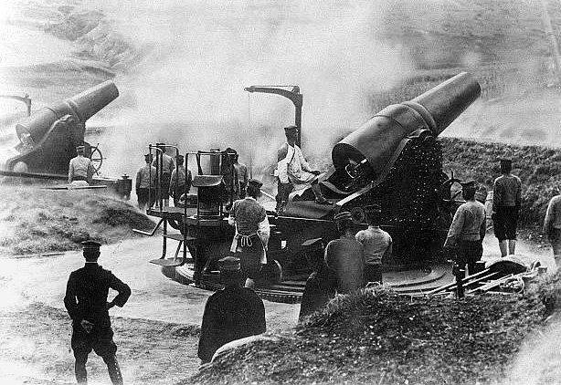
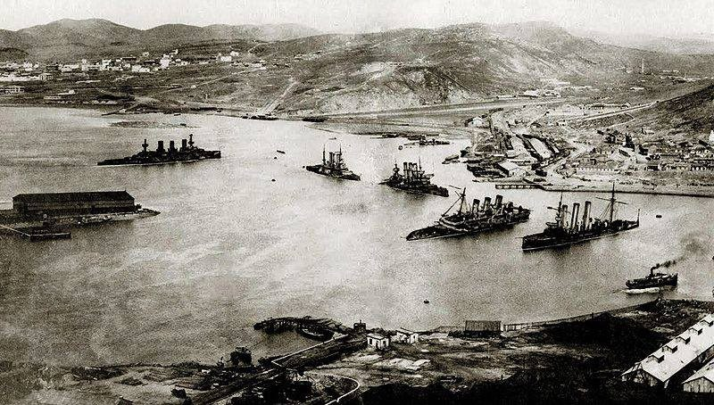
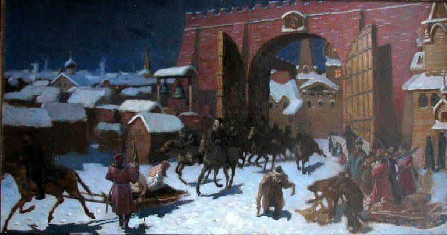
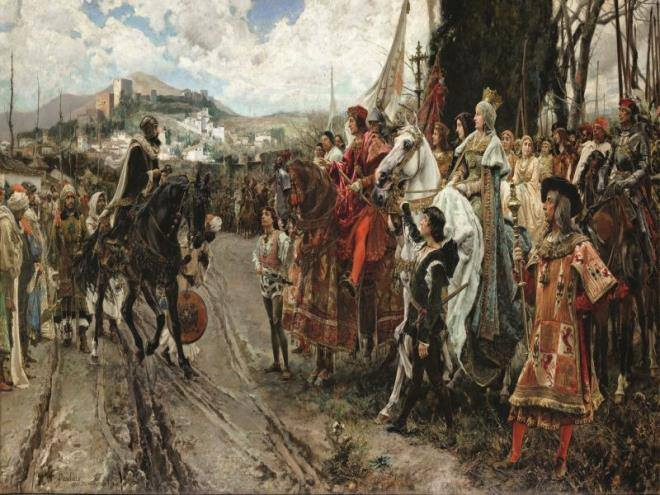

### 2020

Minister Finansów RP zmienił interpretację podatkową, nakładając podatek VAT 23% na usługi sortowania, liczenia, pakowania, transportu gotówki, a także zasilania wpłat i wypłat z bankomatów oraz kas banków.

Kwestią czasu pozostaje zatem tylko kiedy banki wprowadzą opłaty za wpłaty i wypłaty gotówki. Zdrożeją prawdopodobnie także wszelkie płatności internetowe z użyciem procesorów płatności np. PayU itp. na co wskazuje doradca podatkowy Deloitte Romania Raluca Bâldea. Podobnie jak podatek bankowy, także i ten zostanie przerzucony na klientów.

### 1945

NKWD (Ludowy Komisariat Spraw Wewnętrznych) rozpoczął aresztowania Polaków zamieszkujących we Lwowie. Szacuje się, że podczas akcji trwającej trzy dni w więziennych celach znalazło się 17 tysięcy ludzi. Część z nich została po pewnym czasie zwolniona do domu, jednak większość wysłano w głąb Związku Radzieckiego.

 

### 1944

W Bołdurach w powiecie brodzkim w województwie tarnopolskim 200 sotnia UPA dokonała mordu na zamieszkujących tę liczącą około 1000 mieszkańców miejscowość ludność polską i ukraińską.
Bandyci podzielili się na liczące po około 10 osób grupy, które włamywały się do polskich i ukraińskich zabudowań. Najgorsze jest to, że wielu morderców pochodziło z tej samej wsi lub okolic. Ci z nich, którzy znali osobiście swoje przyszłe ofiary lub ich miejsce zamieszkania wskazywali je innym zbrodniarzom. Ludzi mordowano przy użyciu broni palnej, ale również, co charakterystyczne, przy użyciu siekier, toporów i wideł. Po dokonaniu masakry do wsi wjechały furmanki, na które upowcy oraz okoliczni chłopi ukraińscy ładowali mienie zabitych. Zabierano także inwentarz. Przy okazji dobijano rannych oraz przeszukiwano obejścia w celu wykrycia ukrywających się. Ograbione gospodarstwa podpalano, jeśli nie graniczyły z domami ukraińskimi. W ten sposób spalono około 30 gospodarstw; spaliły się w nich niektóre ofiary.
Dane dotyczące ilości zabitych nie są spójne i według różnych źródeł wynosi od 60 do 100 zabitych Polaków i Ukraińców.
Zdjęcie przedstawia figurę znajdującą się obok polskiej kaplicy w Bołdurach.

 

### 1939

"Jestem Polakiem Jestem nim nie dlatego tylko, że mówię po polsku, że inni mówiący tym samym językiem są mi duchowo bliżsi i bardziej dla mnie zrozumiali, że pewne moje osobiste sprawy łączą mnie bliżej z nimi niż z obcymi, ale także dlatego, że obok sfery życia osobistego, indywidualnego znam zbiorowe życie narodu, którego jestem cząstką, że obok swoich spraw i interesów osobistych znam sprawy narodowe, interesy Polski, dla których należy poświęcić to, czego dla osobistych spraw poświęcić nie wolno. Jestem Polakiem – to znaczy, że należę do narodu polskiego na całym Jego obszarze i przez cały czas jego istnienia zarówno dziś, jak w wiekach ubiegłych i w przyszłości. To znaczy, że czuję swą ścisłą łączność z całą Polską"

Powyższy tekst to słowa zmarłego 2 stycznia 1939 roku w wieku 75 lat przywódcy Narodowej Demokracji Romana Dmowskiego (zdjęcie).
W swojej polityce Dmowski początkowo postulował, jako formę przejściową zjednoczenie ziem polskich pod protektoratem Rosji,co doprowadziło do poróżnień z Józefem Piłsudskim, który Rosji nienawidził. Jednak po wybuchu rewolucji w 1917 roku Dmowski diametralnie zmienił zdanie, by w 1919 roku razem z Ignacym Paderewskim podpisać Traktat Wersalski.
W roku 1926 założył Obóz Wielkiej Polski ,
starając się zjednoczyć cały ruch narodowy i
prawicowy w Polsce – w opozycji do programu
jej sanacji. Do końca życia wywierał ogromny
wpływ na działalność Stronnictwa Narodowego.
"Kurier Warszawski" o śmierci Dmowskiego pisał:
"Zgasł jeden z największych umysłów politycznych na szlaku dzienów Polski".
Pogrzeb odbył się 7 stycznia 1939 roku na Cmentarzu Bródnowskim w Warszawie.

 

### 1905

Wojna rosyjsko-japońska: wojska japońskie zdobyły twierdzę Port Artur.

Miasto portowe i twierdza leżące na samym południowym krańcu Półwyspu Liaotung, zwanego także Kwantung, nad Morzem Żółtym, ważny punkt strategiczny na Dalekim Wschodzie w Chinach. W latach 1888-1892 umocniony przez Chińczyków, stał się główną bazą ich floty. Podczas wojny chińsko-japońskiej (1894-95) zajęty przez Japończyków, ale po zawarciu pokoju zwrócony Chinom. 27.03.1898 roku Rosja na podstawie konwencji zawartej z Chinami w Pekinie otrzymała w dzierżawę na 25 lat Półwysep Kwantung wraz z Port Artur i Dalnij (Dalien). Wkrótce rozpoczęto modernizację twierdzy, która stała się główną bazą rosyjskiej floty na Dalekim Wschodzie.

W bezpośrednim obrębie twierdzy stacjonował silny garnizon wojskowy, który tuż przed wybuchem wojny liczył ok. 42.000 żołnierzy dysponujących 646 działami i 62 karabinami maszynowymi. Nie budził natomiast specjalnego entuzjazmu swoimi talentami wojskowymi komendant twierdzy generał Anatol M. Stoessel, który zarówno w pierwszych miesiącach konfliktu, jak i zresztą i później nie wykazywał się inwencją twórczą i mało dbał o odpowiednie zabezpieczenie obrony. Twierdza od strony lądu była słabo umocniona i fortyfikowała się właściwie dopiero w okresie pierwszych miesięcy wojny, przy czym największe zasługi na tym polu położył naczelnik obrony lądowej Port Artur, generał Roman Kondratienko. To dzięki jego staraniom i wysiłkom była możliwa tak długa obrona twierdzy. Generał Kondratienko był głównym filarem i orędownikiem nieugiętej i mężnej jej obrony.

Jak już była mowa o tym wcześniej, wojska japońskie już pod koniec maja odcięły całkowicie lądowe połączenia Port Artur z armią rosyjską w Mandżurii, dotarły one bowiem do przesmyku Cinczou, będącego najwęższym miejscem całego Półwyspu Kwantung (Liaotung). Było to bardzo dogodne miejsce do obrony, gdzie niewielka liczba żołnierzy mogła z powodzeniem powstrzymać znacznie większe siły. W tym właśnie miejscu przebiegała I linia rosyjskiego frontu obronnego, który już od 26.05. blokował dalszą drogę na południe wojskom japońskim. Atakiem w kierunku Port Artur kierował generał M. Nogi, dowódca 3 Armii, liczącej początkowo tylko ok. 26.000 żołnierzy. Siły te były jednak systematycznie wzmacniane i wkrótce przewaga ilościowa była po stronie japońskiej. Generał Nogi miał także dość liczną i silną artylerię złożoną z 204 dział oblężniczych i 180 dział górskich i polowych.

Rosyjska obrona na przesmyku Cinczou nie trwała jednak długo. W wyniku japońskiego panowania na morzu na południe od przesmyku, pod portem Dalnij wylądował 30.05. silny desant wojsk japońskich, które już 01.06. opanowały port i miasto. Dalsza obrona Cinczou była bezcelowa. Obrona rosyjska zaczęła się organizować znacznie dalej na południe od zajętego przez przeciwnika Dalnij, na dalszych przedpolach Port Artur. Po otrzymaniu posiłków (siły japońskie wzrosły do ok. 80.000 ludzi) i zakończonej koncentracji 26.06. 3 Armia podjęła natarcie na południe, dopiero od tej chwili rozpoczęły się tak naprawdę walki o Port Artur. Wojska japońskie usiłowały zakończyć walki w bardzo szybkim tempie bez wikłania się w długotrwałe boje, jednak okazało się to nie tak proste do wykonania. Wojska rosyjskie utworzyły 26.07. dość stabilny front obronny na dalekim przedpolu twierdzy i powstrzymały tym samym dalszy marsz japoński na południe.

W wyniku częstych i nieustępliwych ataków japońskich, Rosjanie zmuszeni zostali 30.07. na skrócenie frontu obrony i wycofali się jeszcze bardziej na południe, już w bliskie zaplecze twierdzy. Blokując Port Artur na lądzie i morzu 12.08. Japończycy opanowali wzgórza na podejściach do portu, i wkrótce rozpoczęli z nich ostrzał artyleryjski znajdujących się w nich okrętów rosyjskich. Generał Nogi usiłował wziąć Port Artur z marszu. Pierwsza próba zrealizowania tego zamiaru została podjęta 07.08. Był to pierwszy próbny szturm, który zakończył się niepowodzeniem w dniu następnym. Generał japoński niezrażony tym niepowodzeniem, nie rezygnował z uzyskania szybkiego zwycięstwa. Po starannym i skrupulatnym przygotowaniu się do tego zadania, wojska japońskie 19.08. rozpoczęły bez powodzenia drugi, tym razem generalny szturm twierdzy, trwający nieustannie przez 6 dni i nocy. W czasie tych ciągle ponawianych ataków 3 Armia japońska straciła ok. 1/3 swych sił (kilkanaście tysięcy żołnierzy – w zabitych i rannych), straty rosyjskie były znacznie mniejsze. W wyniku tego pierwszego wielkiego i nieudanego ataku generał japoński zmuszony został przejść do regularnego oblężenia.

Wojska japońskie zajęły się tworzeniem silnie umocnionych rubieży i pozycji wokół Port Artur, które dość znacznie nasycone były stanowiskami dział i artylerii oblężniczej. W dalszych kolejnych dniach wzrastało natężenie ognia tej artylerii, która nieustannie ostrzeliwała stanowiska obronne wojsk rosyjskich. Po solidnych prawie miesięcznych przygotowaniach, w między czasie których trwał ciągły ostrzał pozycji obrońców, Japończycy rozpoczęli 15.09. drugi szturm generalny, który był jeszcze dłuższy niż pierwszy.

Przez 2 tygodnie trwały nieustanne bardzo krwawe i zażarte walki, odziały japońskie ponosiły wielkie straty, ale obrońcy pod ich naporem musieli powoli, ale systematycznie wycofywać się na nowe pozycje obronne, które z wielką zaciętością i uporem były fortyfikowane i umacniane pod niezłomnym kierownictwem generała Kondratienki. Bardzo krwawe walki ustały 30.09. Japończycy okupili je stratą 7.500 zabitych, straty rosyjskie były znacznie mniejsze i wynosiły 1.500 ludzi.

W dniu 1.10., po przybyciu pod Port Artur japońskiej ciężkiej artylerii, złożonej z 280 mm haubic, wzrosło natężenie i skuteczność działania ostrzału pozycji rosyjskich.

Ważące 227 kg pociski czyniły wielkie spustoszenia wśród obrońców i czyniły wielkie wyłomy w ich umocnieniach i fortyfikacjach. Zniszczenia obejmowały także już nie samo przedpole twierdzy, ale też same miasto i port, gdzie tym samym rozpoczęła się agonia resztek rosyjskich okrętów. Wiele jednostek odniosło poważne uszkodzenia. W dniach 30.10 – 01.11 trwał, tym razem krótki, czwarty wielki szturm japoński na twierdzę, który jak i poprzednie również zakończył się niepowodzeniem. Generał Nogi nie zważając na wielkie straty nie szczędził swoich żołnierzy i wciąż ponawiał ataki. Kolejny piąty już wielki szturm miał miejsce 26.11., w którym Japończykom udało się opanować jedno ze wzgórz, które znacznie dominowało nad twierdzą od pozostałych. Dowództwo rosyjskie zdawało sobie sprawę z groźnego dla niego położenia i postanowiło odbić utracone pozycje.

Między 27.11. a 05.12. trwały zacięte i bardzo krwawe, wyniszczające walki o odzyskanie tego wzgórza, zwanego też wzgórzem 265, lub Górą Wysoką. Wojska rosyjskie ponawiały szturm za szturmem, Japończycy odpowiadali kontratakami, samo wzgórze przechodziło kilkakrotnie z rąk do rąk. Ostatecznie wojskom japońskim, po wielkich stratach w ludziach (12.000 poległych) udało się utrzymać wzgórze we własnym posiadaniu. Wkrótce potem zostało ono dość znacznie umocnione, a na jego stokach ustawiono najcięższą artylerię, która mogła już z odległości 4.000 metrów ostrzeliwać ogniem bezpośrednim stojące w porcie okręty rosyjskie, to był ostateczny koniec rosyjskiej eskadry. Między 05 a 09.12. cztery pancerniki („Połtawa”,”Retwizań” „Pereswet”, „Pobieda”) i krążownik („Bajan”), które już wcześniej doznały już wielu uszkodzeń, zostały zatopione częściowo od ognia japońskiego, częściowo przez własne załogi. Jedynie dowódca pancernika „Sewastopol”, komandor N. Essen, nie chcąc by jego okręt mógł być później wydobyty przez wroga, wyprowadził go na zewnętrzną redę portu. Towarzyszyła mu mała kanonierka „Otważnyj” i tam oba okręty dzielnie broniły się przed atakami kilkunastu torpedowców japońskich, z których dwa zatopiono, po czym po otwarciu zaworów dennych i wyokrętowaniu załóg oba okręty rosyjskie poszły na dno morza.

Wojska japońskie po ostatnich sukcesach zajmowały pozycje już w bezpośrednim pobliżu twierdzy i jej wewnętrznych fortów. Czas i nieustanne walki i bombardowanie artyleryjskie zaczęły jednak robić swoje. Garnizon rosyjski ponosił coraz większe straty, fortyfikacje nie wytrzymywały najcięższych pocisków. Oblężeni mieli coraz mniej nadziei na jakąkolwiek pomoc czy odsiecz, jednak duch dalszej walki i oporu był nadal, podtrzymywany niezłomnie przez generała Kondratienkę. Dowództwo japońskie wierzyło, już w zbliżający się koniec walk jednak nie mogło przewidzieć, kiedy to ostatecznie nastąpi. Od 10.12. trwają japońskie ataki na poszczególne rosyjskie forty wokół twierdzy. W czasie ich trwania 15.12. zginął bohaterski generał Kondratienko. Sytuacja garnizonu rosyjskiego była bardzo ciężka, jednak był on jeszcze zaopatrzony w dość liczne zapasy amunicji i żywności, mógł więc jeszcze długo odpierać ataki Japończyków, tym bardziej, że żołnierze garnizonu wykazywali chęć i wolę nieugiętej dalszej walki. W kolejnych dniach nadal trwały zaciekłe boje o poszczególne forty i wzgórza, jednak z chwilą śmierci generała Kondratienki, komendant twierdzy generał Stoessel, który do tej pory niczym szczególnym się nie wykazał, nie miał zbytniego entuzjazmu, co do kontynuowania dalszej walki.

Pod koniec grudnia 1904 roku rozpoczął on z japońskim generałem Nogi rozmowy o poddaniu twierdzy. Mimo, że członkowie Rady Obrony Twierdzy wypowiadali się za dalszym prowadzeniem walki i mimo możliwości dalszej obrony generał Stoessel zdecydował się na zakończenie, jego zdaniem bezsensownej już walki i 02.01.1905 roku poddał Port Artur Japończykom. W ten sposób dobiegły końca półroczne bardzo krwawe i zacięte zmagania o twierdzę, w których żołnierze rosyjscy wykazali się bohaterstwem, męstwem i odwagą (w ich szeregach było też wielu Polaków). 04.01.1905 r. w obręb twierdzy wkroczyły pierwsze oddziały japońskie. Ogółem straty wojsk japońskich były olbrzymie, w walkach o Port Artur stracili 112.000 żołnierzy (zabici i ranni), po stronie rosyjskiej straty ludzkie były zdecydowanie mniejsze ok. 27.000.(w tym 15.000 rannych) Pozostała część rosyjskiego garnizonu w dostała się do japońskiej niewoli. Generał Stoessel wraz z trzema jeszcze oficerami za swą dwuznaczną i mało chlubną postawę w trakcie obrony Port Artur, po zakończeniu wojny i powrocie z niewoli do Rosji, stanął w lutym 1908 roku przed sądem wojennym i został skazany na śmierć. Wyrok złagodzono, zamieniając go na 10 lat więzienia, z którego jednak wyszedł bardzo szybko.

Dzięki opanowaniu Port Artur dowództwo japońskie mogło przeznaczyć uczestniczące w walkach wojska oblężnicze do wzmocnienia sił walczących do tej pory w Mandżurii. Upadek Port Artur był wstrząsem, jakiego Rosja dawno nie przezywała. Zdawano sobie sprawę, że zwycięstwo w tej wojnie jest już raczej wątpliwe i wręcz wykluczone i to powiększało grozę sytuacji. Jednocześnie zaczęto coraz jaśniej dostrzegać cały ogrom winy, ciążącej na tych, którzy rządzili krajem. W rosyjskim społeczeństwie, wkrótce po wieści o kapitulacji Port Artur, narastało napięcie i wrzenie, które już niebawem miało się przyczynić do wybuchu pierwszej rewolucji.

 

 

### 1683

Austriacki książę cieszyński i Święty Cesarz Rzymski Leopold I (grafika) wysłał do Polski dwóch delegatów; Karola Ferdinanda de Wildstein i Jana Zierowskiego, by ci przekonali króla Jana III Sobieskiego do walki przeciwko Turcji. Efektem tego działania było zawarte przez nich 1 kwietnia 1683 roku porozumienie,w którym strona polska zobowiązała się do walki z Imperium Osmańskim.

 

### 1570

W zemście za tajne pertraktacje rady miejskiej Nowogrodu Wielkiego z Litwą do miasta wkroczył car Iwan Groźny na czele oddziałów opriczników, którzy rozpoczęli trwające 5 tygodni grabieże i mordy tysięcy mieszkańców.

Gdy arcybiskup Pimen, witając w Nowogrodzie Wielkim cara Iwana Groźnego, próbował go pobłogosławić, władca odmówił i nazwał duchownego zdrajcą. Monarcha doczekał do końca nabożeństwa, a następnie ograbił cerkiew Pimena, jego samego zaś pozbawił całego majątku. Potem Iwan i jego oprycznicy (członkowie oddziałów powołanych do tłamszenia bojarskiej opozycji) rozpoczęli grabież i rzeź miasta. Wrzucali związanych mieszkańców, w tym kobiety i dzieci, pod lód skutej rzeki Wołchow albo zabijali ich toporami i rohatynami. Powodem masakry było podejrzenie cara, że miasto chce się oddać pod opiekę Litwy po cofnięciu mu przywilejów. Historycy szacowali, że zamordowanych zostało kilkadziesiąt tysięcy ludzi, ale nowsze ustalenia mówią o kilku lub kilkunastu.

 

### 1492

Rekonkwista: wojska chrześcijańskie zdobyły Emirat Grenady, ostatni bastion Maurów na Półwyspie Iberyjskim.

W roku 1479 doszło do zawarcia małżeństwa między infantką Izabellą, od 1474 królową Kastylii i następcą tronu aragońskiego Ferdynandem, królem Aragonii od roku 1479 i zarazem do unii personalnej pomiędzy królestwami Kastylii i Aragonii. Parę tę zwano królami katolickimi, (los reyes catolicos). Pod rządami Izabelli I Kastylijskiej oraz Ferdynanda II Katolickiego doszło do zjednoczenia Hiszpanii oraz upadku muzułmańskiej Grenady w roku 1492. Tym samym zakończona została hiszpańska rekonkwista.

Los reyes catolicos w roku 1478 powołali, za zgodą papieża Sykstusa IV, hiszpański odłam inkwizycji, której działania skierowane były najczęściej przeciwko nawróconym Żydom i Maurom oskarżanym o potajemne praktykowanie dawnych religii. Po wielogodzinnych torturach karano ich zwykle śmiercią przez uduszenie albo spalenie na stosie. Ponadto w latach 1492 i 1502 para królewska wydała dwa dekrety, na mocy których doszło do masowych wypędzeń niechrześcijan z Półwyspu Iberyjskiego.

 

### 69 r.n.e.

Legiony z Germanii Górnej obwołały Witeliusza cesarzem rzymskim.

Jako młodzieniec Witeliusz cieszył się opinią rozpustnika, znawcy powożenia rydwanów jak i świetnego kompana do gry w kości. Był (jak większość hulaszczej młodzieży) przyjacielem Nerona. To za jego panowania otrzymał namiestnictwo Afryki. O dziwo wywiązywał się wzorowo z funkcji administratora.

Za krótkiego panowania Galby otrzymał kolejna namiestnictwo, tym razem Germanii Dolnej. W stosunku do żołnierzy stacjonujących nad Renem zawsze odnosił się w sposób niezwykle życzliwy, dzięki czemu uzyskał sporą popularność w szeregach. Byli oni natomiast niechętni Galbie, a później także Othonowi. Dlaczego, przecież prawie ich nie znali? Głównie przez zawiść, że o to najpierw jacyś żołnierze z Hiszpanii wybierają cesarza, a później pretorianie. Przecież to oni są główną siłą militarną w imperium i to do nich powinien należeć decydujący głos. Chcieli mieć własnego cesarza ...

Jeszcze przed zabiciem Galby, 3 stycznia obwołali cesarzem rzymskim swojego wodza, Witeliusza. Ten nie mógł już zrezygnować. Kiedy do władzy doszedł Othon postanowił interweniować zbrojnie.

Kiedy jego główne siły mierzyły się z othonowskimi on sam przebywał w Lyonie, biernie przyglądając się rozwojowi wypadków. Szczęśliwie dla niego Othon popełnił samobójstwo, dzięki czemu stał się jedynym (co miało się zaraz zmienić) panem całego imperium. Przybywszy na miejsce bitwy wykazał się niezwykłym okrucieństwem; na tysiące rozkładających się już ciał żołnierzy patrzył z nieukrywaną satysfakcją.

Wjazd do stolicy był niemal tryumfem. Towarzyszyli mu żołnierze znad Renu wśród nich wielu barbarzyńskich Germanów, opasanych zwierzęcymi skórami. Oczywiście wywołało to wielkie zaciekawienie wśród ludu. Nie długo po tym dowiedział się, że w imperium nie ma jedynowładztwa ...

Swoje rządy Witeliusz rozpoczął roztropnie. Odwołał pretorianów, którzy obalili Galbę (obawiał się bowiem, że jeżeli zabili jednego cesarza mogą i to uczynić z drugim), do senatu odnosił się w kurtuazyjnym tonie; starał się podtrzymywać fikcję, jakoby rządził wespół z tym republikańskim urzędem. Lud skłonił do siebie licznymi igrzyskami. Jednak sielankowemu początku zaszkodziła jedna wiadomość. Otóż 2 legiony przybywające w Egipcie obwołały cesarzem niejakiego Wespazjana. Bunt błyskawicznie rozszerzył się na cały Bliski Wschód, cesarz musiał interweniować.

Główne siły przeciwników zmierzyły się pod Bedriacum, gdzie kilka miesięcy temu Witelianie pokonali oddziały Othona. Tym razem jednak się nie udało. Górą był Wespazjan. Następny tok wydarzeń był już oczywisty. Żołnierze ze wschodu wdarli się do stolicy gdzie napotkali zaciekły i wręcz heroiczny opór ze grafika resztek popleczników Witeliusza. Jednak obrona musiała się złamać. Witeliusza zabito, a zmasakrowane zwłoki wrzucono do Tybru. Kto zamachem stanu wojuje, od zamachu stanu ginie.

 

---

<a href="https://github.com/TomaszWaszczyk/historia.waszczyk.com/edit/master/src/content/january-2.md" target="_blank">Edytuj tę stronę dzieląc się własnymi notatkami!</a>
