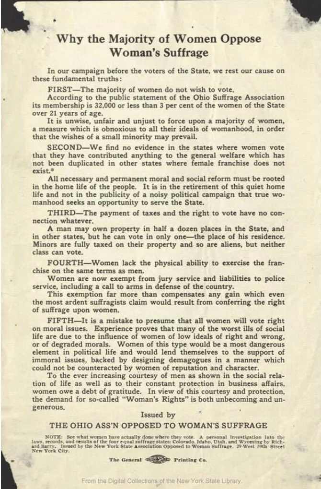
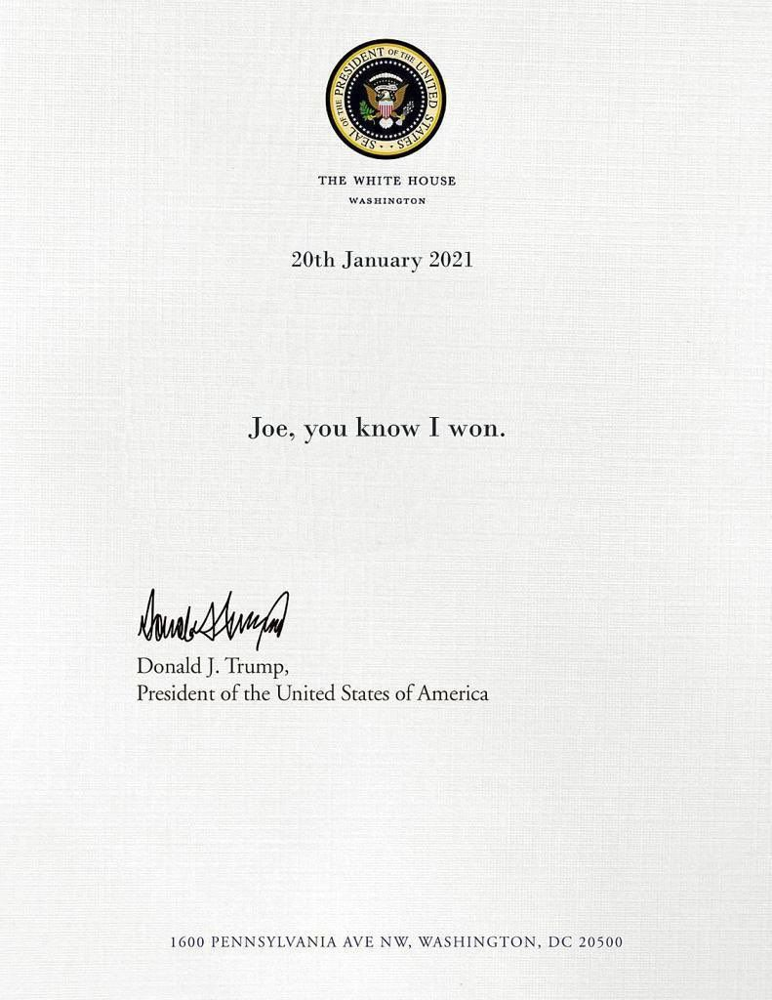
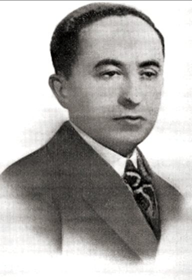
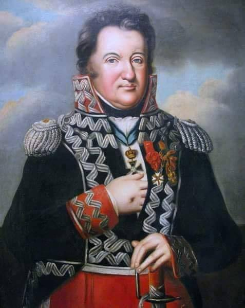

### 2024

<video width="640" height="480" controls>
<source src="./movies/january/chat-gpt.mp4" type="video/mp4">
Your browser does not support the video tag.
</video>

  

  

### 2023

  

---

  

---

### 2022

Astar Network

  

  

---

> Płatne staże w IKEA dla uchodźczyń i uchodźców

Jednym z najważniejszych czynników utrudniających uchodźczyniom i uchodźcom zbudowanie dobrego, bezpiecznego życia w Polsce są trudności w znalezieniu stabilnego zatrudnienia. Wynika to często z braku doświadczenia zawodowego na lokalnym rynku pracy, słabej znajomości języka polskiego, nieznajomości procedur i ograniczonego dostępu do informacji. Nie pomagają również obawy pracodawców oraz uprzedzenia i stereotypy na temat uchodźczyń i uchodźców, które funkcjonują w społeczeństwie.

Projekt jest realizowany w ramach globalnej inicjatywy IKEA „Refugee Skills for Employment” (“Zwiększanie kompetencji zawodowych uchodźców i uchodźczyń”). IKEA jest Partnerem Strategicznym Fundacji Ocalenie.

### 2021

  

### 1956

To właśnie w 1956 r. niemiecki filozof żydowski Günther Anders napisał tę wstępną refleksję:
„Aby zawczasu zdusić jakąkolwiek rewoltę, należy przede wszystkim nie podchodzić do tego w sposób brutalny. Archaiczne metody, takie jak te Hitlera, są wyraźnie przestarzałe. Wystarczy stworzyć kolektywne uwarunkowanie tak silne, że sama idea buntu jest nie przyjdzie jeszcze bardziej do głowy mężczyzn. Ideałem byłoby formowanie jednostek od urodzenia poprzez ograniczanie ich wrodzonych zdolności biologicznych...
Następnie kontynuowalibyśmy warunkowanie poprzez drastyczne obniżenie poziomu i jakości edukacji, aby przywrócić ją do formy integracji zawodowej. Osoba niewykształcona ma tylko ograniczony horyzont myślowy i im bardziej jego myśl ogranicza się do materialnych, przeciętnych trosk, tym mniej może się buntować. Musimy zadbać o to, by dostęp do wiedzy stawał się coraz trudniejszy i elitarny… by pogłębiała się przepaść między ludźmi a nauką, by informacje przeznaczone dla ogółu były znieczulane na wszelkie treści o charakterze wywrotowym. Przede wszystkim brak filozofii. Tutaj znowu musimy użyć perswazji, a nie bezpośredniej przemocy: będziemy nadawać masowo, za pośrednictwem telewizji, ogłupiającą rozrywkę, zawsze schlebiającą emocjom, instynktownym.
Zajmiemy umysły tym, co daremne i zabawne. Dobrze jest z paplaniną i nieustanną muzyką, aby umysł nie zastanawiał się, nie myślał, zastanawiał się.
Seksualność zostanie umieszczona na czele ludzkich zainteresowań. Jako znieczulenie społeczne nie ma nic lepszego. Ogólnie rzecz biorąc, postaramy się odrzucić powagę egzystencji, wyszydzić wszystko, co ma wysoką wartość, stale przepraszać za lekkość; aby euforia reklamy, konsumpcji stała się standardem ludzkiego szczęścia i wzorem wolności.
Uwarunkowanie w ten sposób samo z siebie wytworzy taką integrację, że jedyną obawą (którą trzeba będzie podtrzymywać) będzie strach przed wykluczeniem z systemu, a tym samym brakiem dostępu do warunków materialnych niezbędnych do szczęścia. Tak wytworzony człowiek masowy musi być traktowany jako to, czym jest: produktem, cielęciem i musi być nadzorowany jak stado. Wszystko, co usypia przytomność umysłu, duch krytyczny jest społecznie dobre, wszystko, co może go obudzić, musi być zwalczane, wyśmiewane, tłumione...
Każda doktryna kwestionująca system musi najpierw zostać oznaczona jako wywrotowa i terrorystyczna, a ci, którzy ją wspierają, muszą być następnie tak traktowani.

Gunther Anders "starzenie się człowieka" 1956" Via Stephanie VibraSens

### 1942

Fragment wspomnień urodzonego w Płocku Hermana Kruka (zdjęcie) żydowskiego bibliotekarza, kronikarza wileńskiego getta.
20 stycznia 1942 Tej niedzieli, tu w getcie utworzony został Związek Literatów i Artystów. Już teraz w Związku zarejestrowano 20 pisarzy  żydowskich, 22 artystów scenicznych, 16 muzyków i śpiewaków oraz malarzy. Poza tym istnieje lista 15 rodzin pozostałych po wywleczonych siłą pisarzach i artystach. Zadania związku : samopomoc i pobudzenie do artystycznej twórczości w getcie, opracowanie kroniki wprowadzonych żydowskich pisarzy, artystów i intelektualistów, zbieranie ich zagubionej twórczości.

  

### 1797

generał Jan Henryk Dąbrowski (grafika) wydał odezwę do Polaków zachęcającą ich do wstąpienia w szeregi tworzących się we Włoszech Legionów Polskich.
Oto jej treść:
" Wierny ojczyźnie aż do ostatniej chwili,
walczyłem za jej wolność pod
nieśmiertelnym Kościuszką. Upadła ona
wprawdzie, lecz zostaje nam pocieszająca
pamięć, żeśmy wylewali krew naszą za
kraj naszych przodków, i żeśmy widzieli
nasze sztandary tryumfujące pod
Dubienką, Racławicami, Warszawą i
Wilnem. Polacy! nadzieja nas jednoczy.
Francya tryumfuje; walczy ona za sprawę
narodów. Starajmyż się osłabiać jej
nieprzyjaciół; zapewnia ona nam
schronienie, oczekujmy lepszych
przeznaczeń dla naszego kraju; stawajmy
pod jej chorągwiami, są one chorągwiami
honoru i zwycięstw. Legiony polskie
formują się we Włoszech, na tej ziemi
niegdyś świątyni wolności. Już oficerowie
i żołnierze towarzysze prac waszych i
waszej waleczności, są zemną; już
organizują się bataliony. Przychodźcie
towarzysze moi! rzućcie broń którą was
nosić zmuszono. Walczmy za wspólną
sprawę narodów, za sprawę wolności pod
walecznym Buonapartem, zwycięzcą
Włoch. Trofea Rzeczypospolitej
francuskiej są naszą jedyną nadzieją,
przez nią tylko i jej sprzymierzonych,
odzyskamy te drogie ogniska nasze, które
opuściliśmy ze łzami. W kwaterze
głównej w Medyolanie dnia 20 stycznia
1797r. - l go Pluviose roku Vgo
Rzeczypospolitej francuskiej polski
Jenerał - porucznik (-) Jan Dąbrowski."

  

---

<a href="https://github.com/TomaszWaszczyk/historia.waszczyk.com/edit/master/src/content/january-20.md" target="_blank">Edytuj tę stronę dzieląc się własnymi notatkami!</a>
