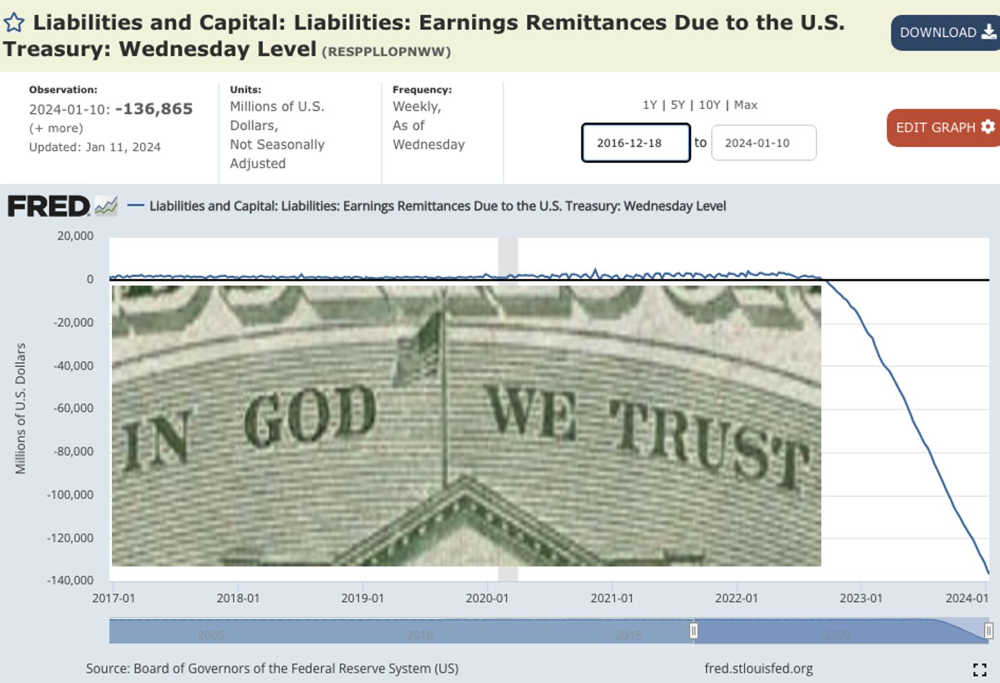
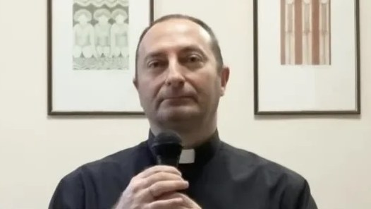
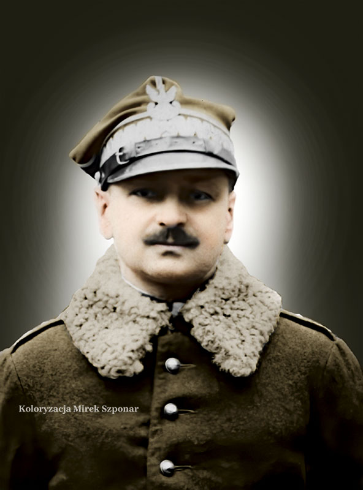
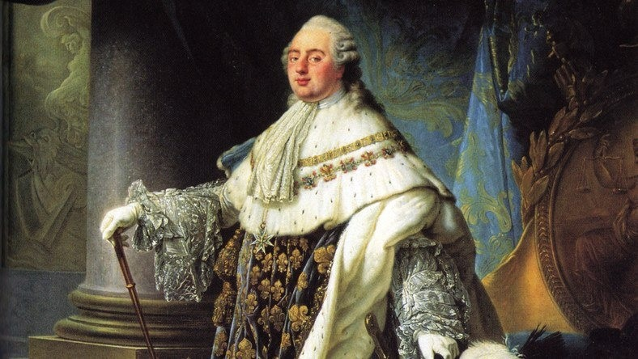

### 2024

  

`
$136bn. That's how much money the Federal Reserve has lost since September 2022. 

To put that amount into perspective, it's more than three times the Fed's capital and reserves. Losses continue to accumulate at the rate of around $2 billion a week.

The Fed is apparently insolvent. Is that a problem? Answer: No.

This is because the Fed claims the "loss" is actually an "asset". Huh?

You might be gasping in surprise. After all, if you, or an ordinary company, lost money, it's hardly an asset. It's simply gone. It reduces your reserves until you can't pay your creditors and you go out of business.

Not as far as the Fed is concerned. The accumulated loss at the Fed is treated as an "asset". Or rather a "Deferred Asset". Is this false accounting? Not at the Fed!

The authority for treating a loss as if it were an asset is derived from the 2023 version of the "Financial Accounting Manual for Federal Reserve Banks". Here's the quote from rule 11.96 contained on page 46 of that manual:

"11.96 Deferred Asset (240-925) If a Reserve Bank’s earnings are not sufficient to provide for the costs of operations, remittances to the Treasury would be suspended. A deferred asset is recorded in this account."

Who authorised this? According to the Accounting Manual: "Accounting principles for entities with the unique powers and responsibilities of the nation's central bank have not been formulated by accounting standard-setting bodies. The Board of Governors has developed specialized accounting principles and practices that it considers to be appropriate for the nature and function of a central bank. These accounting principles and practices are documented in this manual."

So there you have it. The special accounting rule was formulated by the Fed's Board of Governors. The Chairman of the seven member Board of Governors is Jerome Powell. 

So, if at the Fed, losses are "assets", then "The bigger the losses, the richer the Fed gets". 

The more they spend, the richer they get. I wish that applied to the rest of us!

If this wonderful accounting rule had applied to Worldcom and Enron, they might never have gone bankrupt.

Who cares anyway? 

The Fed's balance sheet is highly leveraged with assets and liabilities 180x its capital and reserves or around $7.7tn.

One of those liabilities is $2.289tn of Federal Reserve notes (Cash in circulation). You can't take your cash back to the Fed and get gold. So, unless the losses exceed the cash they have issued, it's really not a problem. 

Or is it?

The Fed's assets include $4.751tn of Treasury Securities, and $2.431tn of Mortgage backed securities, as well as some other bonds. How much has the Fed lost on these? According to Note 2 of the Fed's quarterly balance sheet to 30th September 2023. the loss was $1.301tn. 

They can't afford to lose another trillion.

"In God we Trust"
`

---

Priest excommunicated for claiming Pope is a masonic impostor Father Ramon Guidetti described Francis as the anti-pope and ‘a Jesuit linked to world powers’

  

An Italian priest has been excommunicated for claiming that the Pope is a usurper with a “corpse-like stare” who is pretending to be pope.

---

### 2023

  

### 2021

  

---

  

---

US Debt increases per presidential term:

Reagan 1: $0.8T
Reagan 2: $1.0T
Bush 1:      $1.5T
Clinton 1:  $1.1T
Clinton 2:  $0.4T
Bush 1:      $2.0T
Bush 2:     $3.4T
Obama 1:  $5.6T
Obama 2:  $2.1T
Trump 1:    $7.8T

---

Pięciu lekarzom zza wschodniej granicy minister zdrowia, Adam Niedzielski, wręczył prawo wykonywania zawodu na podstawie uproszczonej ścieżki dostępu do zawodu. W kolejce jest kolejnych 34 lekarzy i 12 lekarzy dentystów.

Prawo do wykonywania zawodu lekarza i lekarza dentysty w trybie uproszczonym zostało wprowadzone pod koniec 2020 r. Przepisy definiują trzy warianty uzyskania tego uprawnienia. Lekarz lub lekarz dentysta, który uzyskał kwalifikacje medyczne poza terytorium państw członkowskich UE i nie uzyskał specjalizacji, otrzymuje czasowe pozwolenie do wykonywania zawodu.

Przypomnijmy, że wcześniej nowe przepisy i ułatwiony dostęp do zwodu oprotestowała m.in. Naczelna Izba Lekarska. Jak argumentowała, trudno sprawdzić kwalifikacje takiego medyka, no i nie ma on obowiązku składania oświadczenia, że zna język polski.

---

### 2023

<video width="640" height="480" controls>
<source src="./movies/january/covid-dance.mp4" type="video/mp4">
Your browser does not support the video tag.
</video>

### 2016

Ciemna strona Żabki nadal nieznana. Autorka bała się procesów i wstrzymała druk oskarżycielskiej książki.

Ta książka miała wszystko. Sensacyjną, emocjonalną i tragiczną treść, kampanię promocyjną w mediach, 16 tys. zł dotacji od internautów na druk, a nawet zaprojektowaną okładkę. Ale na razie się nie ukaże. Autorka i wydawca boją się procesów o odszkodowania ze strony sieci handlowej Żabka.
"Dekada ajentów" o dramatycznych losach sklepikarzy z Żabki miała wstrząsnąć polskim kapitalizmem. Pokazać, jak wielka firma może żerować na naiwnym zapale przedsiębiorców, by wepchnąć ich w otchłań długów. Niestety.

### 1940

W Czortkowie (obecnie Ukraina) wybuchło powstanie antyradzieckie. Było ono inicjatywą działającego na Kresach Stronnictwa Narodowego czyli polskiej organizacji konspiracyjnej pod kierownictwem Tadeusza Bańkowskiego, Henryka Kamińskiego i Heweliusza Malawskiego.
Powstańcy – głównie młodzież gimnazjalna i
licealna – zamierzali opanować najważniejsze
budynki w mieście: koszary, szpital, posterunek
NKWD, milicji, sąd, pocztę i dworzec kolejowy, a
następnie zdobytym pociągiem dotrzeć do
Rumunii, gdzie planowali dołączenie do polskich oddziałów. Liczyli też na jednoczesny wybuch powstania we Lwowie i Stanisławowie.
Powstanie to zostało przez Sowietów bardzo szybko zdławione, a w znacznej mierze przyczyniła się do tego jego zła organizacja oraz słabe uzbrojenie Polaków.
Na rozkaz samego szefa NKWD Ławrientija Berii oraz pod bacznym okiem Stalina zamordowano podczas trwającego miesiąc tak zwanego "śledztwa"zabito dziesiątki spośród aresztowanych 540 osób.
Grafika przedstawia ulicę Mickiewicza w Czortkowie.

  

### 1935

W Warszawie zmarł gen. Bolesław Jaźwński. W wojnie 1920 dowódca 11 Dywizji Piechoty, od 1920 do 1926 szef Wojskowego Instytutu Geogr. W przewrocie majowym opowiedział się po stronie rządowej. Więziony bez wyroku sądu i bez postawionych zarzutów.

  

### 1874

https://pl.wikipedia.org/wiki/Wincenty_Witos

### 1793

Rewolucja francuska: zgilotynowano skazanego na śmierć za zdradę stanu króla Ludwika XVI.
Małoletni Ludwik stał się następcą tronu francuskiego w 1765 roku po śmierci swojego ojca Ludwika Ferdynanda . Panujący wówczas we Francji dziadek delfina - Ludwik XV Burbon nie cieszył się sympatią poddanych. Feudalna Francja borykała się z problemami gospodarczo-finansowymi, a narastająca bieda pozostawała w sprzeczności z ogromnymi wydatkami na dwór królewski w Wersalu. Nadzieje na zmianę tej sytuacji Francuzi upatrywali w osobie młodego następcy tronu, nazywając go ,,upragnionym'. Niestety nadzieje te okazały się płonne i wkrótce zmalała sympatia do jego osoby, by w końcu przekształcić się w nienawiść do całej rodziny królewskiej. Dlaczego? Niewątpliwie z powodu tego, że król nie spełnił pokładanych w nim nadziei i nie wyprowadził kraju z kryzysu. Podejmowane przez 20-letniego władcę próby reform polegające na ograniczeniu podatków i regulacji cen nie przyniosły żadnych efektów. Innym powodem niepopularności władzy monarszej był wystawny tryb życia i ogromne wydatki na utrzymanie dworu (do czego skutecznie przyczyniała się jego rozrzutna małżonka Maria Antonina Austriaczka ). Deficyt budżetowy powiększał się również z powodu wydatków wojennych. W 1777 roku Ludwik XVI przystąpił do wojny z Wielką Brytanią o niepodległość kolonii amerykańskich, angażując duże środki na wysłanie kilkutysięcznej armii i zakup broni dla powstańców.
Na mocy traktatu pokojowego w 1783 roku Francja odzyskała część kolonii w Afryce i Indiach. Nie wpłynęło to niestety na zahamowanie rosnącego kryzysu i społecznego niezadowolenia.
W celu wprowadzenia nowych podatków król zwołał Stany Generalne, powołane po raz pierwszy przed blisko pięcioma wiekami przez Filipa IV Pięknego , składające się z przedstawicieli trzech stanów: duchowieństwa, szlachty i mieszczaństwa. Obrady, które rozpoczęły się w Wersalu 5 maja 1789 roku jaskrawo ujawniły rozbieżności poglądów i interesów przedstawicieli różnych warstw feudalnego społeczeństwa. Przy poparciu ludu paryskiego i części posłów innych stanów doszło do przekształcenia się stanu trzeciego w Zgromadzenie Narodowe, które rozpoczęło prace nad nową konstytucją. Ludwik XVI próbował bezskutecznie powstrzymać te poczynania za pomocą wojska, ale doprowadził jedynie do wybuchu zamieszek ulicznych. Ludność Paryża zaatakowała arsenały i uzbrojona zaczęła organizować komitety rewolucyjne. Dzień zdobycia Bastylii w dniu 14 lipca 1789 roku, obchodzony obecnie jako święto narodowe Francji, przyjmuje się za datę rozpoczęcia Wielkiej Rewolucji.
Zgromadzenia Narodowego i został zmuszony do przeniesienia się z Wersalu do Paryża. W czerwcu 1791 roku monarcha wraz z rodziną podjął próbę ucieczki z objętej zamieszkami Francji. Po jej ujawnieniu okrzyknięto go zdrajcą i oddano pod kontrolę władz rewolucyjnych. Zmiana konstytucji ustrojowej przez Zgromadzenie Narodowe we wrześniu 1791 roku spowodowała powstanie we Francji monarchii konstytucyjnej. W zaistniałej sytuacji Ludwik XVI musiał przysięgać na wierność konstytucji. Niedługo mógł się jednak cieszyć zagwarantowanymi mu w ustawie uprawnieniami, bo już w następnym roku został pozbawiony władzy królewskiej. Monarchia we Francji została zlikwidowana i została proklamowana republika.
Ta sytuacja oraz oskarżenia króla o kontakty z wrogami Francji przypieczętowała los Ludwika XVI i całej jego rodziny. Król wraz z żoną Marią Antoniną i dziećmi - Maria Teresą i Ludwikiem Karolem został osadzony w wieży Temple - dawnym klasztorze templariuszy.
Odtąd ze względu na to, że w czasie rewolucji zaprzestano używać tytułów arystokratycznych, nazywano Ludwika XVI obywatelem Kapet od nazwiska pierwszych władców Francji.
Przed Parlamentem odbył się proces Ludwika XVI, którego oskarżano głównie o zdradę, ale i wysuwano inne zarzuty takie jak np. deptanie trójkolorowych kokard, które były symbolem rewolucji, finansowe wspieranie emigrantów francuskich, czy też magazynowanie mąki, kawy i cukru w królewskich magazynach w trudnej sytuacji ekonomicznej kraju. Pomimo żywiołowych starań obrońców króla, znikomą większością głosów obywatel Kapet został skazany na śmierć. Wyrok wykonano w Paryżu na Placu Rewolucji (obecnie Plac Zgody) w dniu 21 stycznia 1793 roku przez zgilotynowanie.
Po jego śmierci rojaliści ogłosili królem Ludwikiem XVII jego małoletniego syna - Ludwika Karola. Niestety chłopiec, tak jak i cała rodzina królewska pozostawał w rękach republikanów. Został on oddzielony od matki Marii Antoniny, która wkrótce podzieliła los męża tracąc życie na gilotynie. Dziecko oddano do rodziny paryskiego szewca, a potem znów uwięziono w Temple gdzie zmarł mając 10 lat.
Egzekucja Ludwika XVI nie zakończyła rewolucji, ani też nie spowodowała, że Francja pozostała na zawsze republiką. Po straceniu króla rewolucja pokazała swoje krwawe oblicze i terror jaki nie był znany w ówczesnej Europie. Zgilotynowane zwłoki króla, a później również ciało Marii Antoniny zostały pochowane w masowym grobie na cmentarzu Św. Magdaleny. Po upadku Napoleona nastąpiła restauracja monarchii, na tronie zasiadł Ludwik XVIII, brat straconego króla. Po ponad 20 latach od egzekucji w 1815 roku na jego polecenie, odnaleziono i ekshumowano szczątki króla i jego żony Marii Antoniny. Zostały one złożone w krypcie nekropoli królów Francji - Bazylice Saint-Denis.
Ciekawa historia związana jest z odnalezieniem szczątków królewskiej pary. Miejsce ich pochówku miało bowiem zostać nieoznaczone, ale rojalista Desclozeaux, który mieszkał w pobliżu cmentarza wsadzał rośliny oznaczając miejsce złożenia królewskiej pary. W miejscu znalezienia szczątków Król Ludwik XVIII zlecił architektowi Fontaine postawienie kaplicy. Powstała w latach 1816-26 Kaplica Pokutna ocalała pomimo kilkakrotnych prób jej zburzenia i obecnie jest wpisana na listę zabytków Francji.

  

---

<a href="https://github.com/TomaszWaszczyk/historia.waszczyk.com/edit/master/src/content/january-21.md" target="_blank">Edytuj tę stronę dzieląc się własnymi notatkami!</a>
