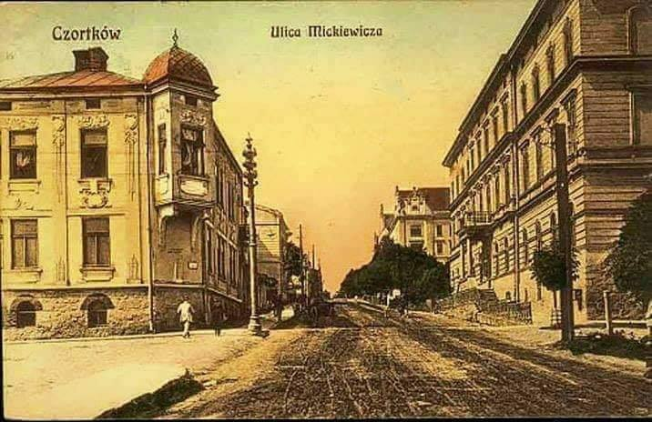

### 1940

W Czortkowie (obecnie Ukraina) wybuchło powstanie antyradzieckie. Było ono inicjatywą działającego na Kresach Stronnictwa Narodowego czyli polskiej organizacji konspiracyjnej pod kierownictwem Tadeusza Bańkowskiego, Henryka Kamińskiego i Heweliusza Malawskiego.
Powstańcy – głównie młodzież gimnazjalna i
licealna – zamierzali opanować najważniejsze
budynki w mieście: koszary, szpital, posterunek
NKWD, milicji, sąd, pocztę i dworzec kolejowy, a
następnie zdobytym pociągiem dotrzeć do
Rumunii, gdzie planowali dołączenie do polskich oddziałów. Liczyli też na jednoczesny wybuch powstania we Lwowie i Stanisławowie.
Powstanie to zostało przez Sowietów bardzo szybko zdławione, a w znacznej mierze przyczyniła się do tego jego zła organizacja oraz słabe uzbrojenie Polaków.
Na rozkaz samego szefa NKWD Ławrientija Berii oraz pod bacznym okiem Stalina zamordowano podczas trwającego miesiąc tak zwanego "śledztwa"zabito dziesiątki spośród aresztowanych 540 osób.
Grafika przedstawia ulicę Mickiewicza w Czortkowie.

  

---

<a href="https://github.com/TomaszWaszczyk/historia.waszczyk.com/edit/master/src/content/january-1.md" target="_blank">Edytuj tę stronę dzieląc się własnymi notatkami!</a>
