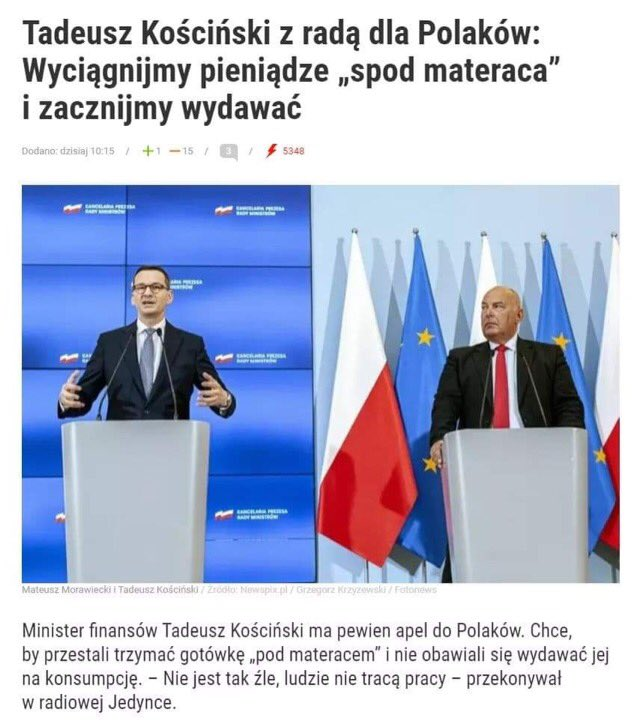

### 2021

  

---

  

---

US Debt increases per presidential term:

Reagan 1: $0.8T
Reagan 2: $1.0T
Bush 1:      $1.5T
Clinton 1:  $1.1T
Clinton 2:  $0.4T
Bush 1:      $2.0T
Bush 2:     $3.4T
Obama 1:  $5.6T
Obama 2:  $2.1T
Trump 1:    $7.8T

---

Pięciu lekarzom zza wschodniej granicy minister zdrowia, Adam Niedzielski, wręczył prawo wykonywania zawodu na podstawie uproszczonej ścieżki dostępu do zawodu. W kolejce jest kolejnych 34 lekarzy i 12 lekarzy dentystów.

Prawo do wykonywania zawodu lekarza i lekarza dentysty w trybie uproszczonym zostało wprowadzone pod koniec 2020 r. Przepisy definiują trzy warianty uzyskania tego uprawnienia. Lekarz lub lekarz dentysta, który uzyskał kwalifikacje medyczne poza terytorium państw członkowskich UE i nie uzyskał specjalizacji, otrzymuje czasowe pozwolenie do wykonywania zawodu.

Przypomnijmy, że wcześniej nowe przepisy i ułatwiony dostęp do zwodu oprotestowała m.in. Naczelna Izba Lekarska. Jak argumentowała, trudno sprawdzić kwalifikacje takiego medyka, no i nie ma on obowiązku składania oświadczenia, że zna język polski.

---

### 1940

W Czortkowie (obecnie Ukraina) wybuchło powstanie antyradzieckie. Było ono inicjatywą działającego na Kresach Stronnictwa Narodowego czyli polskiej organizacji konspiracyjnej pod kierownictwem Tadeusza Bańkowskiego, Henryka Kamińskiego i Heweliusza Malawskiego.
Powstańcy – głównie młodzież gimnazjalna i
licealna – zamierzali opanować najważniejsze
budynki w mieście: koszary, szpital, posterunek
NKWD, milicji, sąd, pocztę i dworzec kolejowy, a
następnie zdobytym pociągiem dotrzeć do
Rumunii, gdzie planowali dołączenie do polskich oddziałów. Liczyli też na jednoczesny wybuch powstania we Lwowie i Stanisławowie.
Powstanie to zostało przez Sowietów bardzo szybko zdławione, a w znacznej mierze przyczyniła się do tego jego zła organizacja oraz słabe uzbrojenie Polaków.
Na rozkaz samego szefa NKWD Ławrientija Berii oraz pod bacznym okiem Stalina zamordowano podczas trwającego miesiąc tak zwanego "śledztwa"zabito dziesiątki spośród aresztowanych 540 osób.
Grafika przedstawia ulicę Mickiewicza w Czortkowie.

  

### 1935

W Warszawie zmarł gen. Bolesław Jaźwński. W wojnie 1920 dowódca 11 Dywizji Piechoty, od 1920 do 1926 szef Wojskowego Instytutu Geogr. W przewrocie majowym opowiedział się po stronie rządowej. Więziony bez wyroku sądu i bez postawionych zarzutów.

  

### 1874

https://pl.wikipedia.org/wiki/Wincenty_Witos

---

<a href="https://github.com/TomaszWaszczyk/historia.waszczyk.com/edit/master/src/content/january-21.md" target="_blank">Edytuj tę stronę dzieląc się własnymi notatkami!</a>
