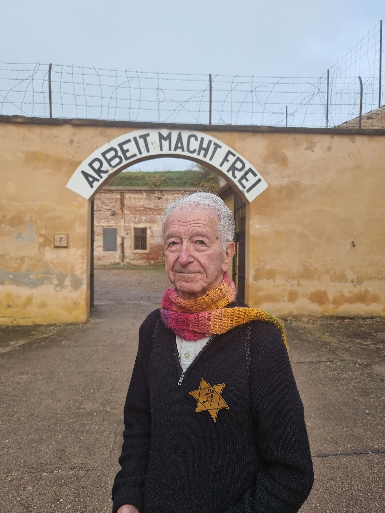

### 2024

Gidon Lev, a Holocaust survivor who was interned at the German Nazi ghetto of Theresienstadt between the ages of 6 and 10 is with Elon Musk and Ben Shapiro visiting KL Auschwitz.

  

---

  

<video width="640" height="480" controls>
<source src="./movies/january/alex-soros.mp4" type="video/mp4">
Your browser does not support the video tag.
</video>

---

<video width="640" height="480" controls>
<source src="./movies/january/meeeeeeee.mp4" type="video/mp4">
Your browser does not support the video tag.
</video>

---

### 2021

Premier Morawiecki zapowiadał, że w styczniu zaprezentuje swój nowy plan społeczno-gospodarczy, który ma być odpowiedzią na wyzwania, które będą nas czekać po kryzysie wywołanym walką z wirusem. Na czym ma polegać ten nowy ład? Póki co możemy się tylko domyślać, ale wiele wskazuje na to, że nowy model gospodarczy ma prowadzić do odbicia po kryzysie w kształcie litery K. Korporacje i spółki Skarbu Państwa mają iść w górę, jak prawe ramię tej litery, a drobny, polski biznes w dół, jak jej noga.
Co to tym świadczy? Spójrzmy na owoce tego co tu się wyprawia od miesięcy. Biedronka, Lidl i Auchan mogą cały czas działać, a sklep z ubraniami na franczyzie nie. Do McDonald's ustawiają się długie kolejki, a cała reszta właśnie zmierza ku bankructwu. Hotele są zamknięte, a oferty ich wykupienia składają korporacje i państwo. A kto stracił na opodatkowaniu spółek komandytowych? Polskie rodzinne firmy.
Od miesięcy drobny, lokalny biznes jest gnojony, a korporacje  w spokoju sobie działają, korzystając z tanich kredytów i lobbując dla siebie wyłączenia z obostrzeń.
Teraz zza horyzontu wyłaniają się kolejne czarne chmury dla małych firm i młodych ludzi. Media donoszą, że trwają prace nad ozusowaniem wszystkich umów zlecenie i umów o dzieło. Według dziennikarzy, ta drastycznie podnosząca koszty pracy zmiana, może wejść jeszcze w pierwszym kwartale 2021 roku. Jakie będą efekty? Koszty, a więc i ceny wzrosną, już najwyższa w UE inflacja będzie jeszcze wyższa, a wynagrodzenia spadną. Najbardziej po tyłku dostaną małe firmy, a państwo z korporacjami przejmą jeszcze większą część rynku.
Zapamiętajcie kształt litery K, symbolizujący los, jaki wam szykuje premier Morawiecki, jeżeli macie nieszczęście być na prawej nodze tej złowieszczej litery.

---

Jak mówi, tak zrobi:

  

---

### 1973

> "Społeczeństwo Zachodu, w każdym razie Europa, po prostu nie będzie chrześcijańskie. Tym bardziej więc wierzący będą musieli zabiegać o to, aby dalej formować i utrzymać świadomość istnienia wartości oraz życie według wiary. (...) Wzrośnie ciężar odpowiedzialności."

  

---

### 1867

Karol Marks popiera utworzenie państwa Polskiego.

W Cambridge Hall Gmina Centralna Londyńskiego Zjednoczenia Emigracji Polskiej zorganizowała wiec dla uczczenia piątej rocznicy wybuchu powstania styczniowego. Jednym z mówców był Karol Marks, filozof i współtwórca Międzynarodowego Stowarzyszenia Robotników, który dowodził, że odzyskanie niepodległości przez Polskę leży w interesie państw Zachodu: „Jedna tylko alternatywa pozostała Europie. Albo barbarzyństwo azjatyckie pod moskiewskim przywództwem zaleje ją jak lawina, albo musi ona odbudować Polskę tak, aby między nią a Azją stanęło dwadzieścia milionów bohaterów i by dzięki temu zyskała ona na czasie na dokonanie swego społecznego odrodzenia”.

### 1863

w Warszawie Komitet Centralny Narodowy wydał manifest ogłaszający rozpoczęcie powstania styczniowego. Autor tego dokumentu Jan Maykowski pisał w nim:
"Nikczemny rząd najezdniczy rozwścieklony
oporem męczonej przezeń ofiary postanowił
zadać jej cios stanowczy - porwać kilkadziesiąt
tysięcy najdzielniejszych, najgorliwszych jej
obrońców, oblec w nienawistny mundur
moskiewski i pognać tysiące mil na wieczną
mękę i zatracenie".
W czasie powstania styczniowego stoczono ponad 1200 mniejszych lub większych bitew. Początkowo nawet wiele z nich wygrywały wojska polskie, ale w końcowym rozrachunku wygrana stała się udziałem Rosjan,a kilkadziesiąt tysięcy Polaków trafiło na Syberię.
Za datę końca powstania styczniowego przyjmuje się aresztowanie generała Romualda Traugutta 10 kwietnia 1864 roku, ale to data jego stracenia na stoku warszawskiej Cytadeli na oczach 30 tysięcznego tłumu 5 sierpnia 1864 roku zapisała się w zbiorowej pamięci Polaków.

  

Powstańcy styczniowi w II RP byli traktowani niemal jak święci. III RP żołnierzy walczących o wolność Polski potraktowała po macoszemu.
Jeżeli młody chłopak poszedł na powstanie, mając 18 lat, to w momencie odzyskania niepodległości miał lat 73. Na terytoriach Polski, które ostatecznie weszły w skład II Rzeczypospolitej, znalazło się około 3700 powstańców styczniowych. W roku 1923 było ich blisko dwa tysiące, w roku 1933 – 258, a przed wybuchem II wojny światowej – 52. Ostatni, Feliks Bartczuk, zmarł 9 marca 1946 r. w zniewolonym przez komunistów kraju. Miał ponad 100 lat.

Józef Dragun - Weteran Powstania Styczniowego 1863 r.
Fotografia z 1929 roku:

  

---

### 1719

https://en.wikipedia.org/wiki/William_Paterson_(banker)

### 1632

Wojna trzydziestoletnia: wojska szwedzkie zdobyły Wismar nad Bałtykiem, przejmując całą tzw. flotę wismarską Ligi Katolickiej, której podstawą była polska flota wojenna Zygmunta III Wazy.

Po bitwie pod Oliwą, czyli smutne losy polskiej floty.

Co się stało z polską armadą po wspaniałym zwycięstwie pod Oliwą w 1627 roku? Nieczęsto porusza się ten wstydliwy temat, gdyż prawda jest bolesna. Król Zygmunt III Waza zwyczajnie oddał osławioną zwycięstwem flotę pod rozkazy Habsburgów … tak po prostu. Zaiste trudno zrozumieć głupotę władcy, który wyczynia takie rzeczy.

Dlaczego tak zrobił? Ponieważ dał się zwieść obietnicom (uwaga!) przysłania hiszpańskiej floty na Bałtyk:) Nawet skrajny naiwniak nie uwierzyłby w te brednie, jednak Zygmunt III uwierzył! Gdy cesarz Ferdynand II obiecywał jeszcze sypnąć złotem, by pomóc w odzyskaniu korony szwedzkiej, Zygmunt był uszczęśliwiony. Gdy na dodatek mianował swego głównego dowódcę, Albrechta von Wallensteina, admirałem Morza Bałtyckiego (sic!), to losy polskiej floty zostały już przesądzone. Wiem, że to brzmi jak komedia, jednak tak naprawdę było.

Tymczasem przy pomocy tej floty Rzeczpospolita mogła odciąć źródło finansowania Szwecji w tej wojnie, bo tym źródłem były wysokie cła pobierane z polskiego handlu … Polska flota była wystarczająca do tego, by zabezpieczyć nasz interesy handlowe, zaburzyć szwedzkie linie komunikacyjne i poprawić skuteczność działania polskich wojsk na lądzie … ale nie o to chodziło Zygmuntowi III. On w swych rojeniach widział ogromną flotę inwazyjną, na czele której zdobywa upragnioną koronę szwedzką. Więc gdy Habsburgowie zaproponowali mu przysłanie w nieokreślonej przyszłości 24 okrętów, radośnie przystał na natychmiastowe udostępnienie im swoich własnych …

Decyzja o ich wysłaniu zapadła już w 1628 roku, i to pomimo pojawienia się w pobliżu Gdańska wrogiej eskadry, złożonej z okrętów szwedzkich i angielskich. Polskie załogi początkowo odmówiły, zasłaniając się niewypłaceniem zaległego żołdu. Później pogoda nie pozwalała na ich wypłynięcie. Jednak w końcu osiem polskich okrętów ruszyło do Wismaru, by tam służyć Habsburgom. Siedem z nich: flagowy „Król Dawid”, „Tygrys” (zdobyty pod Oliwą jako Tigern), „Wodnik”, „Arka Noego”, „Delfin”, „Panna Wodna” i „Biały Pies”, przybyły do portu przeznaczenia 8 lutego 1629 roku. Ósmy – „Feniks”, który odłączył się podczas burzy, dopłynął kilka dni później.

To, że cesarz nie zamierzał walczyć na Bałtyku w interesie Rzeczypospolitej, było chyba oczywiste. Kilkoma idiotycznymi obietnicami zdobył nowoczesną flotę z załogami zaprawionymi w boju. Warto zauważyć, że na swoich pokładach polska flota miała 148 dział różnych działomiarów. Król Dawid, Tygrys, Wodnik i Arka Noego, mimo iż ustępowały znacznie pod względem wielkości największemu cesarskiemu okrętowi Hans von Wismar, to jednak wszystkie one z osobna dysponowały podobną albo większą siła ognia (!), były znakomicie wyposażone w inną broń, nie mówiąc o większej szybkości i zwrotności. Taki Król Dawid miał 31 wobec 18 dział cesarskiego kolosa! To zdecydowanie najhojniejszy prezent ze wszystkich, jakie Zygmunt III kiedykolwiek ofiarował Habsburgom …

Polska flota pod nieudolnym dowództwem nie zapisała już żadnej chwalebnej karty. Gdy Gustaw II Adolf przeprowadził ofensywę na północne Niemcy i zdobył garnizon w Wismarze, polskie okręty dostały się w jego ręce. Były już w opłakanym stanie, rozgrabione przez habsburskie wojska, bez większości armat, które zostały zdjęte w celu wzmocnienia obrony Wismaru. Król Dawid, który podczas jednej z nieudanych operacji zawinął do portu w Travemunde, został zarekwirowany przez lubeczan.

Taki był oto smutny koniec wspaniałej polskiej floty. Naczelny architekt tej katastrofy, czyli król Zygmunt III Waza, przez pewien czas domagał się od Habsburgów zwrotu floty, a po zajęciu Wismaru od Szwedów …

Bitwa pod Oliwą w 1627 roku (stoczona na redzie Gdańskiej) jest jedną z najchlubniejszych kart polskiej wojskowości. Zwykle jest rozpatrywana jedynie pod kątem „propagandowości” zwycięstwa, które nie przyniosło tak naprawdę żadnych korzyści. Jest to wyjątkowo głupie i krzywdzące. Młoda polska flota odniosła bądź co bądź niemal popisowe zwycięstwo, udowadniając np. przybyłym specjalnie obserwatorom (i ewentualnym negocjatorom) z Niderlandów, że góruje nad szwedzkimi okrętami i szwedzkimi załogami, zarówno jeśli chodzi o sztukę wojenną jak i bitność załóg i piechoty morskiej. Zaskakujący atak wraz z poranną bryzą i właściwy wybór miejsca (uniemożliwiający wejście okrętów szwedzkich na ich tyły), wystawiają dobre świadectwo naszej armadzie. Dodać do tego należy też zdecydowaną dominację, jeśli chodzi o salwę burtową i w walce bezpośredniej. Najlepszym przykładem jest abordażowanie dużego szwedzkiego okrętu Solen przez znacznie mniejszy polski Wodnik.

Analizując przebieg tej bitwy, można wytknąć kilka błędów, jak nie do końca dopracowany plan operacji. Ale tak naprawdę podczas walk na morzu każda flota popełnia błędy. W przypadku bitwy Oliwskiej było ich niewiele i nie wpłynęły na one znacząco na wynik bitwy.

Po zwyczajowo trudnym początku przy organizacji i wspaniałym chrzcie bojowym nasza flota przekroczyła punkt, po którym mogło być już tylko lepiej:) Oczywiście nie była ona zdolna do wielkich podbojów, ale z pewnością mogła stać się strażnikiem naszych interesów, związanych z handlem. Prawdziwym jej entuzjastą był hetman Koniecpolski, potrafiący docenić zalety współpracy wojsk lądowych z flotą. Bardzo szybko mogła ona zostać powiększona o nowe jednostki, nie tylko zdobywane na wrogu ale też zakupywane, czy budowane. Gdańsk, po tym gdy zobaczył jej siłę, chętnie stałby się uczestnikiem w tej grze, gdyż straty jakie odniósł przez szwedzką blokadę były ogromne.

Szwedzi dzięki swemu panowaniu na morzu nie tylko poważnie osłabiali Rzeczpospolitą, ale też sami uzyskiwali ogromne dochody, finansujące ich działania w Inflantach. Po rozejmie w Altmarku (Starym Targu) Szwecja uzyskała prawo do pobierania 3,5 % cła z całego handlu przechodzącego przez Gdańsk. Warto zauważyć, że rozejm został zawarty 26 września 1629 roku, a na haniebne z naszego punktu widzenia warunki duży wpływ miała nieobecność polskiej floty. Szwecja nie byłaby w stanie finansować wojen z Rzeczpospolitą bez pieniędzy, jakie zarabiała właśnie na Rzeczypospolitej.

Jeszcze jedna historia doskonale pokazująca znaczenie Gdańska, floty wojennej, no i charakter polskich Wazów:

Po rozejmie w Sztumskiej Wsi (1635) Szwecja zgodziła się zrezygnować z pobierania cła, zaś prawo do jego pobierania na dwa lata zyskał nasz następny król Władysław IV Waza (w zamian zrezygnował z prawa do szwedzkiej korony). Cło miało być dużo niższe od szwedzkiego, ale i tak znacząco wsparłoby skarb. Gdańszczanie jednak znali charakter Władysława IV i zaoferowali mu wprost do jego rąk 800 tys. złotych okupu. Była to łapówka śmiesznie mała w porównaniu ze spodziewanymi dochodami z ceł, jednak natychmiastowa i do samych rąk króla, więc ten się zgodził. 450 tys. faktycznie dostał ale resztę musiał sobie dobrać z kasy Rzeczypospolitej, która taką właśnie brakującą sumę była winna Gdańskowi. To się nazywa interes:)

Ale to nie koniec. Władysław IV po roku zmienił zdanie i nakazał pobieranie cła przymusowo. Bardzo szybko interweniowała … flota duńska. Okręty Chrystiana IV wpłynęły do portu i rozpoczęły ostrzał. Załogi statków, które miały pilnować bezpieczeństwa a które nie sposób nazwać wojennymi, natychmiast się poddały. Rzeczpospolita została upokorzona, jej skarb stracił ogromne kwoty, król Władysław IV zaś otrzymane pieniądze nierządnicom rozdał … To nie brzydki żart, król kiedyś jawnie zapowiedział, gdy sejm odmówił dalszego finansowania jego planów wojennych, że dotychczas zebrane pieniądze kurwom rozda … dosłownie.

  

---

<a href="https://github.com/TomaszWaszczyk/historia.waszczyk.com/edit/master/src/content/january-22.md" target="_blank">Edytuj tę stronę dzieląc się własnymi notatkami!</a>
