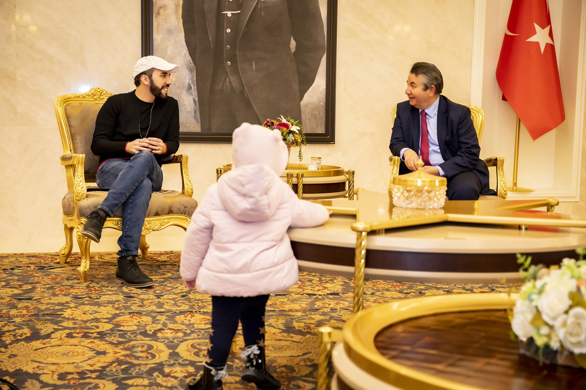

### 2024

Obawa ogarnia polskich obywateli w obliczu możliwości wcielenia do pomocy armii ukraińskiej. Wołodymyr Zełenski, prezydent Ukrainy, poinformował, że armia potrzebuje dodatkowych pięćset tysięcy osób. Czy to oznacza, że zwiększenie liczby powołań żołnierzy aktywnej rezerwy w Polsce wiąże się ze wsparciem dla ukraińskiej armii? Kwalifikacja wojskowa rozpocznie się niedługo i obejmie aż dwieście trzydzieści tysięcy osób. Wojsko planuje wezwać prawie ćwierć miliona Polaków na kwalifikację wojskową w 2024 roku.

<video width="640" height="480" controls>
<source src="./music/january/wojna-na-ukrainie.mp3" type="video/mp4">
Your browser does not support the video tag.
</video>

---

  

---

<video width="640" height="480" controls>
<source src="./movies/january/wspomnienia-auschwitz.mp4" type="video/mp4">
Your browser does not support the video tag.
</video>

---

<video width="640" height="480" controls>
<source src="./movies/january/avueira.mp4" type="video/mp4">
Your browser does not support the video tag.
</video>

---

### 2022

  

### 2018

> "Bitcoin is rat poison" – Warren Buffet

### 1793

Caryca Katarzyna II i Fryderyk Wilhelm II podpisali traktat podziałowy znany dziś jako drugi rozbiór Polski.
Bezpośrednią przyczyną rozbioru były rzekome obawy Rosji i Prus przed rewolucyjnym zagrożeniem ze strony Polski oraz podjęta przez nią w czasie Sejmu Czteroletniego próba uniezależnienia się od Rosji.
Na mocy tego traktatu oddziały pruskie dowodzone przez feldmarszałka Joachima Heinricha von Möllendorfa zajęły Wielkopolskę, a wojska rosyjskie wschodnią część Polski.
W wyniku podziału Prusy opanowały - Gdańsk oraz Toruń, Wielkopolskę, Kujawy
i Mazowsze, razem 58 tys. km2 i ponad 1 mln mieszkańców.

---

<a href="https://github.com/TomaszWaszczyk/historia.waszczyk.com/edit/master/src/content/january-23.md" target="_blank">Edytuj tę stronę dzieląc się własnymi notatkami!</a>
