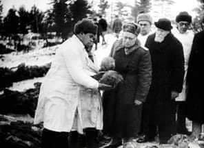
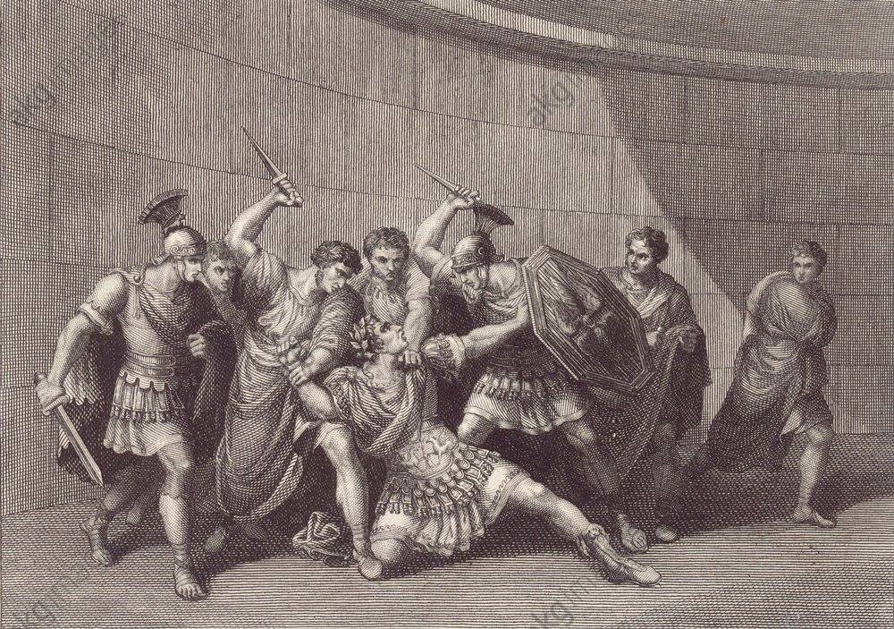

### 2022

  

  

---

"Na razie gasimy ten pożar"

Z kolei dopytywany o to, czy może okazać się, że w przy rozliczeniu rocznym podatnicy będą musieli dopłacać znaczne kwoty, minister finansów odpowiedział:

Na razie gasimy ten pożar, żeby pieniądze były dziś na rachunkach. Później będziemy sprawdzać, czy nie ma żadnych luk.

Zrobię wszystko co mogę, żeby to skorygować - dodał.

Nie można nic wykluczyć - stwierdził Kościński pytany o to, czy inflacja przekroczy 10 proc. - Oczywiście robimy wszystko, by schłodzić inflację, by nie rosła tak szybko - dodał.

**Inflacja to w dużym procencie emocje. Jak będziemy mówili, że będzie wysoka inflacja, to będzie wysoka inflacja. Jeśli będziemy podchodzić do tego racjonalnie, spokojnie, to ta inflacja nie będzie tak szybko rosła, nie będzie presji i naturalnie spadnie - stwierdził minister finansów.**

  

---

### 2021

Alija do Erec zatrzymana - pierwszy raz od 1948..

---

Europejską "pretendującą klasę średnią" można porównać do zagubionych dzieci którzy zeszli 20lat temu z pól (zwłaszcza w Polsce) żyjącą filmami Disneya, jeśli Alija jest zatrzymywana to co?

1. ~5 lat rozpędzanie inflacji + rządy coraz bardziej autorytarne + wojna wewnętrzna w USA

2. ~3 lata dogorywania gospodatek zwłaszcza w Europie + szukanie winnych za granicami poza wirusem

3. Może kryzys żywnościowy + "otwarta wojna walutowa"

4. Wojna konwencjonalna w Europie? - pierwszy raz to piszę otwarcie albo wieloletnie dogorywanie gospodarek w połączeniu z godziną policyjną??

---

Is it time to start worrying about inflation?

> While vaccines are being deployed around the world, it will be many months before they stem the Covid-19 pandemic. That’s why the Federal Reserve says it’s not going anywhere and will keeping juicing the US economy. President-elect Joe Biden wants Congress to open up its wallet for a third package of aid amounting to $1.9 trillion. The US needs a robust response—its economy is in a deep hole, with the unemployment rate stuck stubbornly at nearly 7%. The concern is whether the government’s response to the crisis will have unintended consequences.

  

### 1996

https://pl.wikipedia.org/wiki/Afera_Olina

---

### 1944

w Katyniu po jedenastu dniach zakończyła prace "Specjalna komisja do spraw ustalenia i przeprowadzenia śledztwa okoliczności rozstrzelania w lesie katyńskim polskich jeńców wojennych przez niemiecko-faszystowskich najeźdźców".
Twór ten, którego już sama nazwa mówiła, kto według strony radzieckiej stoi za tą zbrodnią powołany został przez Komitet Centralny Wszechzwiązkowej Komunistycznej Partii (bolszewików). Na czele komisji stał Naczelny Chirurg Armii Czerwonej i członek Akademii Nauk Związku Radzieckiego Nikołaj Nilowicz Burdenko.
Raport końcowy opracowany przez Rosjan stwierdzał, że winę za mord katyński ponoszą Niemcy, którzy mieli dokonać go między wrześniem, a grudniem 1941 roku.
Sam Burdenko, już na łożu śmierci przyznał, że jako szef komisji wykonywał wytyczne Stalina i że jako doświadczony lekarz dobrze wiedział, że podany w raporcie czas śmierci polskich oficerów nie zgadza się conajmniej o jeden rok.

  

### 41

Spiskowcy zamordowali cesarza rzymskiego Kaligulę, jego żonę Cezonię i córkę Julię Druzyllę.
Gajusz Juliusz Cezar, zwany Kaligulą objął rządy nad największym imperium starożytnego świata w wieku zaledwie dwudziestu pięciu lat. Po długim panowaniu niepopularnego Tyberiusza, który z przebiegłego - choć wyniosłego wobec otoczenia polityka i sprawnego administratora - zmienił się w pogrążonego w najpotworniejszych żądzach starca, młodzieniec został powitany jak wyzwoliciel i zbawca. Zacytujmy „Żywoty Cezarów” Swetoniusza: „Tak uzyskawszy tron, spełnił najgorętsze życzenia narodu rzymskiego lub, powiem raczej, całego rodu ludzkiego, jako władca szczególnie upragniony przez większość mieszkańców prowincyj i żołnierzy, gdyż znali go przeważnie jeszcze jako niemowlę”. Dalej rzymski historyk daje nam opis wiwatujących tłumów, wznoszonych na cześć Kaliguli ołtarzy – ponoć w ciągu zaledwie trzech miesięcy w podziękowaniu bogom złożono ofiary ze stu sześćdziesięciu tysięcy sztuk bydła.
Ten nagły wybuch spontanicznej (nie ma powodu w to wątpić) radości daje się wytłumaczyć nie tylko niechęcią senatorów, ekwitów i plebsu do starego Tyberiusza. Największym politycznym kapitałem młodego Cezara było znakomite pochodzenie oraz… współczucie. Tym trudniej zrozumieć, dlaczego panowanie, z którym wiązano tyle oczekiwań, zakończyło się tak dramatycznie.
Chłopiec w sandałach:
Ojciec Kaliguli, najbardziej znany pod imieniem Germanika, jako wnuk Liwii, żony Augusta, należał (podobnie jak Tyberiusz) do rządzącej dynastii nazwanej przez historyków julijsko-klaudyjską. W roku 14 n.e., tuż po śmierci Augusta, nie przyjął władzy cesarskiej ofiarowanej mu przez zbuntowane, stacjonujące w Germanii legiony.
W tym miejscu warto wyjaśnić pochodzenie imienia, czy raczej przydomka, pod którym Gajusz przeszedł do historii. Otóż przebywając w obozie wojskowym z rodzicami i rodzeństwem, paradował w specjalnie dla niego uszytym uniformie, które częścią były maleńkie caligae, podbite ćwiekami żołnierskie sandały – stąd Kaligula, czyli sandałek, jak nazywali chłopczyka legioniści. Zresztą Germanik potrafił wykorzystać miłość, jaką żołnierze otaczali jego syna – groźba, że zostanie wraz z matką wywieziony w inne, bardziej bezpieczne niż obóz zbuntowanych legii miejsce, miała swego czasu otrzeźwić zrewoltowane żołdactwo.
Germańska kampania ojca Kaliguli, mimo wysiłków wodza i żołnierzy, nie okazała się wielkim sukcesem. Jednak Rzymianie odnieśli wrażenie, że trzy wycięte w pień legiony (bitwa w lesie teutoburskim, 9 r. n.e.) zostały godnie pomszczone. Następnie Germianik został wysłany na wschód, by przywrócić dyscyplinę w tamtejszych legionach i zaprowadzić porządek na granicy. W roku 19 n.e., w wieku zaledwie 34 lat, zmarł po długiej chorobie w Antiochii. Powracająca wciąż plotka głosiła, że Germanik został otruty, za wiedzą, a może i na rozkaz zazdrosnego o jego popularność Tyberiusza. Powszechna żałoba w całym imperium, oraz nieudawana rozpacz po śmierci Germanika, czyniły jego rodzinę w oczach Tyberiusza więcej niż podejrzaną.
I rzeczywiście, na skutek pałacowych intryg matka Kaliguli, Agrypina Starsza, została wygnana na maleńką wyspę (została przy tym tak brutalnie pobita przez żołnierzy, że straciła oko), gdzie zagłodziła się na śmierć. Dwaj starsi bracia Kaliguli również zostali zgładzeni z przyczyn politycznych – Klaudiusz Neron, ponoć zaszczuty przez strażników, popełnił samobójstwo na zasłaniu, Druzus został zagłodzony w podziemiach Palatynu. A przecież każda z tych osób była spokrewniona z Augustem! (Agrypina była jego wnuczką.)
Kaligula, ostatni z żyjących potomków Germanika, również znajdował się pod stałą obserwacją dworu Tyberiusza. Zmuszono go do przebywania w bezpośredniej bliskości cesarza, w jego „samotni” na wyspie Capri, w której, wedle świadectw historyków, Tyberiusz, z dala od Rzymu i senatu, w sposób nieskrępowany oddawał się najbardziej wyuzdanym praktykom. Dziewiętnastoletni Kaligula, otoczony przez szpiegów i dworaków czyhających na każde jego nieostrożne słowo, „swoje własne cierpienia krył pod maską niewiarygodnej obojętności”. Wreszcie, 16 marca 37 r. n.e. Tyberiusz wyzionął ducha (w czym podobno wydatnie pomógł mu sojusznik Kaliguli i jednocześnie prefekt gwardii pretoriańskiej Makron). Senat wbrew woli Tyberiusza nie uznał małoletniego wnuka Tyberiusza współwładcą – Kaligula objął samodzielnie ster cesarskiej władzy.
Wielkie nadzieje:
Jego rządy rozpoczęły się w sposób, który udowadniał, że Kaligula jest godzien pamięci swojego wspaniałego i ciągle kochanego przez Rzymian ojca. Natychmiast zawiesił wszystkie procesy polityczne, zabronił wykonywania ustawy o obrazie majestatu (rzecz śmiertelnie niebezpieczna, bowiem trudno było się obronić przed oskarżeniem delatora, która niemal zawsze kończyło się śmiercią pomówionego), okazywał wzgardę donosicielom, rehabilitował skazanych, a wygnanych za przestępstwa polityczne wezwał na powrót do Rzymu.
Wznowiono wydania ksiąg znajdujących się na indeksie. Wreszcie, w akcie największej wielkoduszności, nowy Cezar kazał publicznie spalić akta procesu swojej matki, pokazując w ten sposób, że nie zamierza mścić się na tych, którzy przyczynili się do jej wygnania i śmierci. Senat, żyjący dotąd w ciągłym lęku przed podstępnymi faworytami Tyberiusza, może odetchnąć spokojnie. Łaski ludu Kaligula zaskarbił sobie podarunkami i organizacją wspaniałych igrzysk, od udziału w których (inaczej niż gardzący takimi rozrywkami poprzednik) wcale się nie wzbraniał. Załatwiwszy najważniejsze sprawy, Kaligula, nie zważając na niebezpieczeństwo żeglugi po wzburzonym morzu, wsiada na okręt i udaje się w podróż po szczątki matki i brata, złożone później w grobowcu w trakcie wzruszającej, dowodzącej synowskiej miłości, uroczystości.
Idylla trwa do jesieni. Pod koniec roku Kaligula poważnie zachorował, powszechnie obawiano się o jego życie, obywatele składali ofiary; byli też tacy, którzy obiecywali w intencji wyzdrowienia cesarza walczyć na arenie jako gladiatorzy lub wręcz oddać bogom swoje własne życie. Nie wiemy, na co zachorował Kaligula; jednak historycy, w tym i cytowany już Swetoniusz uznali, że moment ten stanowi cezurę w życiu cesarza – kiedy przyszedł do zdrowia, ukazał światu zupełnie inne, znane dziś wszystkim oblicze tyrana i potwora. Niektórzy z tej gwałtownej zmiany wnioskują o charakterze choroby – być może zapaleniu opon mózgowych lub innej przypadłości neurologicznej – wszystko to jednak są tylko spekulacje.
Tak czy inaczej, ozdrowiały Kaligula rozpoczął drugi etap swoich rządów od czterech politycznych mordów, czy ściślej – rozkazów popełnienia samobójstwa. Pierwszą ofiarą stał się Tyberiusz Gamellus, wspomniany już wnuk cesarza Tyberiusza, który miał być wedle testamentu współrządzącym imperium. Kaligula adoptował Tyberiusza, by wkrótce, korzystając z uprawnień, jakimi dysponował rzymski pater familias (również decydowania o życiu lub śmierci swoich dzieci), nakazać mu odebranie sobie życia. Następnymi ofiarami byli: teść Kaliguli (jego pierwsza żona zmarła bardzo wcześnie) oraz wszechwładny dotąd prefekt Makron i jego żona.
Potwór na tronie:
W tym miejscu żywota Kaliguli historyk Swetoniusz zaczyna swoje wyliczenie szaleństw i niegodziwości młodego cezara. Nieustające widowiska, towarzyszące im rozdawnictwo (najzupełniej typowa praktyka dla miejsca i epoki) i niesłychanie wystawny tryb życia (kazał, naśladując Kserksesa, wybudować ze statków most na morzu, po którym jeździł konno w zbroi wyciągniętej z grobowca Aleksandra; podróżował wzdłuż brzegu Italii na okrętach, których rufy zdobiono szlachetnymi kamieniami czy też namiętne zamiłowanie do picia… pereł rozpuszczonych w occie) miały w błyskawicznym tempie opróżnić skarbiec, zapełniony uprzednio przez zapobiegliwego i skąpego Tyberiusza – Kaligula miał w niecały rok wydać astronomiczną sumę dwóch miliardów siedmiuset milionów sestercji (dla porównania – za sestercję można było kupić dwa bochenki chleba, za pięćset osła, za dwa tysiące zdrową niewolnicę; miesięczny żołd legionisty wynosił dwadzieścia denarów, czyli osiemdziesiąt sestercji).
Okazało się również, że Kaligula ma niepohamowany temperament seksualny, połączony z całkowita pogardą dla konwenansu, prawa i obyczaju. Żadna kobieta i żaden chłopiec w Rzymie nie mieli być bezpieczni od jego żądz; odbierał żony senatorom, zmuszając je do jednorazowych, komentowanych zresztą przez siebie publicznie stosunków. Miał zmusić do płatnego nierządu swoje siostry (z wyjątkiem ukochanej Druzylli, z którą miał sam utrzymywać intymne stosunki), by następnie wygnać je na wyspy pod zarzutem… niemoralnego prowadzenia się. Nie ma zresztą powodu wymieniać dalej szaleństw Kaliguli – opowiadane wciąż na nowo są znacznie lepiej znane niż dokonania wszystkich pozostałych jedenastu cezarów (jeśli za podstawę naszych rozważań weźmiemy tylko dzieło Swetoniusza) razem wziętych.
Okazało się również, że spalone uprzednio akta procesu Agrypiny, matki Kaliguli, zostały skrupulatnie skopiowane. Cesarz, starając się widowiskami i rozdawnictwem pozyskać sobie rzymski plebs, rozpoczął jednocześnie otwartą wojnę z senatem, dla którego członków nadeszły czasy najtrudniejszej próby – nie dość, że Kaligula stał się panem ich życia lub śmierci, to jeszcze nie oszczędzał im żadnego upokorzenia. Stąd zapewne opowieść o Incitatusie, ulubionym koniu cesarza, który nie tylko mieszał w marmurowej stajni, ubierany był w purpurę i miał własnych niewolników, ale także „podobno (Kaligula) miał zamiar wyznaczyć go na konsula”.
Wojna z drzewami:
Kaligula podjął tylko jedną wyprawę zbrojną – w 39 r. n.e., naśladując swego sławnego ojca udał się na podbój Germanii. Eskapada ta, bo trudno ją nazwać kampanią wojenną, była jednym z największych dziwactw krótkiego, bo zaledwie niespełna czteroletniego panowania szalonego cesarza. Mimo ściągnięcia wojsk z niemal każdego zakątka państwa i podjętych z wielkim rozmachem przygotowań, armia imperium nie wykonała żadnych ruchów zaczepnych, jeśli nie liczyć cesarskich wygłupów w rodzaju ścinania młodych drzew na laury zwycięstwa czy pogoni za wysłanymi wcześniej z własnego obozu „Germanami”. Nie znaczy to jednak, że legiony nie poniosły strat w skutek zadziwiającej kampanii – dowodzący armią w Germanii Getulik stracił życie, podobny los spotkał wielu ludzi z jego otoczenia. Kaligula podjął też próbę, podobno nieudaną, przeprowadzenia decymacji (zdziesiątkowania) germańskich legii. Wiosną następnego roku wybrał się na podbój Brytanii, który zakończył się… zbieraniem muszelek przez żołnierzy.
Powrót do Rzymu odbył się pod znakiem gróźb wobec senatu. Uporczywie powtarzana plotka głosiła, że Kaligula przygotował dwie listy proskrypcyjne, osobno dla tych, którzy mają zginąć od miecza i tych, dla których przeznaczono sztylet. Stąd można wnosić, że zamach, który pozbawił życia Kaligulę, był w zasadzie aktem senatorskiej samoobrony. Zacytujmy znów Swetoniusza: „Wobec takich szaleństw i rozbojów niejednemu przyszło na myśl zamordować go. Jeden i drugi spisek został wykryty. Inni chętni zwlekali z braku sposobności.”
Śmierć tyrana:
Zadania, jak wiemy, podjął się trybun oddziałów pretorianów Kasjusz Cherea, weteran, który karierę wojskową rozpoczynał jeszcze pod dowództwem Germanika. Cherea miał własne powody, by nienawidzić Kaliguli, który wyśmiewał się ze starego żołnierza i podważał jego autorytet wśród podkomendnych – na przykład podając jako hasło dnia wyrazy obelżywe, które Cherea musiał przekazywać strażom. Ta zabawa miała się okazać niezwykle kosztowna – nigdy nie należy stroić sobie żartów z kogoś, kto zawodowo trudni się zabijaniem.
I tu wracamy znów do 24 stycznia 41 r. n.e., trzeciego dnia Igrzysk Palatyńskich, na których cesarz musiał i chciał być obecny. Trudność zadania spiskowców polegała przede wszystkim na tym, że cesarza strzegła oddana mu na śmierć i życie gwardia germańska. Był to oddział szczególny, utrzymywany w niezwykle surowej dyscyplinie i żyjący w zupełnej izolacji – żołnierzom nie wolno było uczyć się łaciny, by nikt nie zdołał się z nimi porozumieć za plecami dowódcy. Plan spiskowców zakładał wykonanie zamachu w ciasnej, zadaszonej galerii, przez którą cesarz mógł nieniepokojony swobodnie opuścić cyrk. Kaligula miał zginąć w drodze na obiad – gwardzistów miał zatrzymać pod jakimś pretekstem ich (O tempora, o mores!) rzymski - również należący do spisku - dowódca. Zamachowcy zajęli już stanowiska. Okazało się jednak, że cesarz nie był głodny – tu zainterweniował ktoś z jego otoczenia, namawiając Kaligulę do zażycia kąpieli.
I znów zwłoka, szarpiąca napięte do granic wytrzymałości nerwy spiskowców – cesarz w przejściu natknął się na grupę dzieci, „sprowadzonych z Azji na popisy sceniczne” i już miał zamiar wracać, by obejrzeć występ, gdy kierownik grupy poskarżył się na dojmujące zimno i poprosił o zwłokę. Cesarz ruszył w głąb galerii. W tym momencie Parki przecięły nić życia Kaliguli – Cherea zadał pierwszy, ale nie śmiertelny cios. „Reszta spiskowców dobiła go trzydziestoma ciosami. Mianowicie hasło wszystkich brzmiało: powtórz. Niektórzy wbili żelazo nawet w organy męskie. Na pierwszy odgłos walki zbiegli się tragarze lektyki z drągami oraz przyboczna gwardia germańska i położyli trupem niektórych spośród morderców, nawet kilku niewtajemniczonych senatorów.”
Republika nieodrodzona:
W tym momencie zaczęła się trudniejsza część przedsięwzięcia – trzeba było uspokoić tłumy, domagające się ukarania morderców oraz przejąć władzę w mieście. O ile pierwsze zadanie udało się wykonać – następnego dnia plebs, zapewne nie bez zachęty sprawnych prowokatorów, powywracał posągi Kaliguli, o tyle z drugim senatorowie zupełnie sobie nie poradzili.
Spiskowcy stali się ofiarami swojego sukcesu. Najbardziej ogólny plan zakładał restaurację Republiki, jednak kto konkretnie miał przejąć władzę wykonawczą i - co najważniejsze - w jaki sposób przekonać armię, a nade wszystko stacjonujące w mieście kohorty pretorianów – o tym nie pomyślano. I właśnie pretorianie, zainteresowani utrzymaniem dającego im uprzywilejowaną pozycję w armii i państwie status quo, sami znaleźli rozwiązanie. W trakcie poszukiwań morderców w pałacu cesarskim jeden z żołnierzy dostrzegł wystające zza kotary stopy. Po odsłonięciu zasłony okazało się, że należały one do ukrywającego się Klaudiusza, stryja Kaliguli, a więc członka rodziny cesarskiej. Pretorianie nie zważając na protesty, złapali Klaudiusza i zanieśli na barkach do swojego ufortyfikowanego obozu. Mając i legalnego następcę tronu, i wystarczającą siłę militarną, narzucili go senatowi jako nowego cesarza.
Klaudiusz, nad wyraz rozsądnie obwieścił, że nie zamierza karać osób zamieszanych w spisek. Jednak morderców musiała dosięgnąć cesarska sprawiedliwość – Kasjusz Cherea i kilku innych spośród bezpośrednich wykonawców zamachu dało gardła.
A Kaligula, którego grobowiec być może właśnie odkryto? Zwłoki cesarza, byle jak spalone na małym pogrzebowym stosie, zakopano w płytkim grobie. Dopiero jego siostry, po powrocie z wygnania, urządziły mu przyzwoity pogrzeb. Trzeba koniecznie przytoczyć jeszcze jeden fakt – tuż po śmierci Kaliguli wysłano oficera z rozkazem zgładzenia jego żony Cezonii i córki Julii Druzylli. Cezonia została przeszyta mieczem, Druzyllę centurion „roztrzaskał o ścianę”. O dziewczynce Swetoniusz pisze, że mimo młodego wieku, już odznaczała się okrucieństwem upodabniającym ją do ojca – ponoć w trakcie zabawy potrafiła wydrapać oczy innemu dziecku.
Zwracam uwagę czytelnika na ten fakt nie dla epatowania okrucieństwem. Otóż po zestawieniu dat okaże się, że ten potwór w ciele małej dziewczynki miał w chwili śmierci zaledwie czternaście miesięcy. Czy zatem w tym miejscu relacja Swetoniusza jest prawdziwa, czy może drastyczny szczegół, którego nie da się zresztą obronić, ma usprawiedliwić senatora, wydającego wyrok śmierci na dziecko, będące jeszcze niemowlęciem? I tu dochodzimy do kwestii najważniejszej – wiarygodności nielicznych źródeł, którymi dysponuje historyk.
Uzasadnione wątpliwości:
Tak się bowiem nieszczęśliwie składa, że większość z tego, co wiemy o Kaliguli pochodzi z „Żywotów Cezarów” Swetoniusza. Niestety, odpowiednie księgi „Roczników” Tacyta, historyka znacznie bardziej wnikliwego niż Swetoniusz, nie zachowały się do naszych czasów. Zatem relacja tego ostatniego, opatrzona tak wielką liczbą skandalicznych szczegółów, musiała zdominować pamięć o szalonym cesarzu. Dotyczy to zarówno późniejszego, nie tylko antycznego dziejopisarstwa, jak i współczesnej kultury, by wspomnieć tylko słynną historyczną powieść Roberta Gravesa „Ja, Klaudiusz” i nakręcony na jej podstawie znakomity brytyjski serial czy skandalizujący, na poły pornograficzny film „Kaligula” w reżyserii Tinto Brassa z Malcomem McDowellem w roli tytułowej.
Ale historycy mają coraz więcej wątpliwości wobec relacji Swetoniusza, dostrzegając w niej sprzeczności, przeinaczenia i jawne nieprawdy. Na marginesie można dodać, interpretacja „wprost” dzieła Swetoniusza została odrzucona przez historyków, toczy się też spór o interpretację „Żywotów”, które - być może - należy traktować mniej dosłownie, a bardziej metaforycznie – jako przedstawienie nieuchronnej degrengolady sytemu władzy, który nazywamy cezaryzmem. Być może jako opowieść z drugim dnem, ukrytym – z lęku przed cesarską zemstą – pod najbardziej oczywistą interpretacją.
Z całą pewnością możemy stwierdzić, że dzieło Swetoniusza należy do nurtu tak zwanej historiografii senatorskiej, dalekiej od naukowego obiektywizmu (którego antycznym wzorem może być Tukidydes). W sporze pomiędzy kolejnymi Cezarami a senatem ów nurt publikacji zawsze reprezentuje stanowisko tego drugiego.
Są wreszcie historycy, jak biograf Kaliguli Roland Auget, którzy wprost odrzucają tezę o szaleństwie następcy Tyberiusza, starając się udowodnić, że niezbyt rzetelne relacje starożytnych historyków opisują w rzeczywistości dwie rzeczy – dążenie Kaliguli do dokonania zemsty na mordercach matki i braci (co raczej nie jest dowodem choroby psychicznej), oraz czysto polityczny konflikt pomiędzy dwoma konkurencyjnymi, a wrogimi sobie ośrodkami władzy. Roland Auget punkt po punkcie zbija najbardziej oczywiste argumenty. Na przykład: stan finansów państwa w momencie śmierci Kaliguli (owe ponad dwa miliardy sestercji) był najzupełniej normalny, czego dowodzi fakt, że Klaudiusz po objęciu władzy, nie musiał stosować żadnych nadzwyczajnych środków w celu ich naprawy.
Zdaniem pisarza, egzekucja Getulika, dowódcy legii stacjonujących w Germanii była wynikiem wykrycia spisku, którego Getulik miał być uczestnikiem (przypomnijmy: „jeden i drugi spisek został wykryty”). Zesłanie dwóch sióstr Kaliguli, spiskujących przeciwko niemu, wiązało się z tą samą sprawą. Zresztą – czy państwo pod rządami despoty-szaleńca mogło sprawnie działać?
Tymczasem – skarb jest pełny, granice nie płoną, dyscyplinę w Germanii przywraca surowy generał Galba (nikt nigdy nie zakwestionował jego kompetencji), Rzym nie głoduje. Z całą pewnością Kaligula był okrutny wobec swoich wrogów. Ale oceniając go na tle epoki i państwa, w imię podboju lub utrzymania pax romana zabijanego najokropniejszą śmiercią dziesiątki, jeśli nie setki tysięcy ludzi, którzy nie mieli szczęścia urodzić się obywatelami Rzymu, Kaligula wcale nie wydaje się być takim zwyrodnialcem.
Jeśli założymy, że przeciwnicy tezy o szaleństwie Kaliguli mają rację, to okaże się, że cała relacja Swetoniusza jest niczym więcej, niż tylko próbą (jak najbardziej udaną) usprawiedliwienia morderców. Byłby to nie jedyny zresztą przykład w historii skutecznej w działaniu „czarnej legendy”. Dla czytelnika to przestroga i przykład – zawsze warto wątpić w prawdy, które wydają się nam niepodważalne i uświęcone wielokrotnym powtarzaniem.

  

---

<a href="https://github.com/TomaszWaszczyk/historia.waszczyk.com/edit/master/src/content/january-24.md" target="_blank">Edytuj tę stronę dzieląc się własnymi notatkami!</a>
