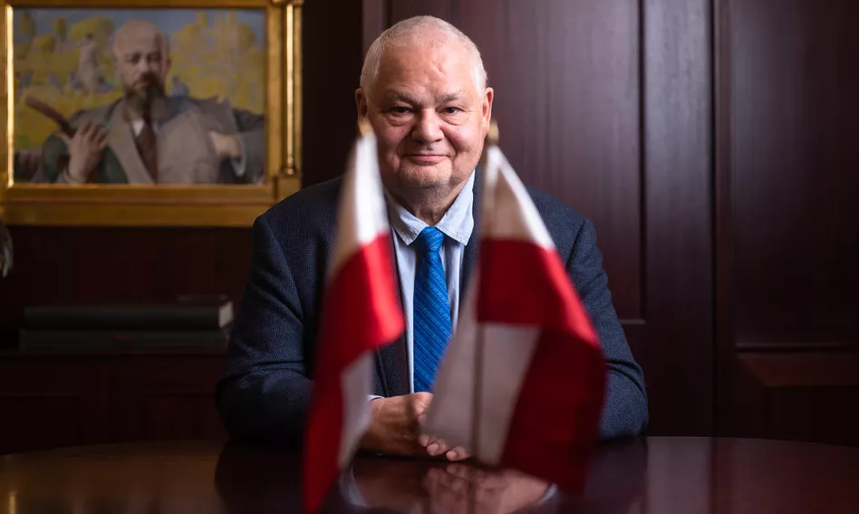
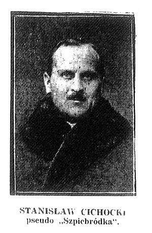
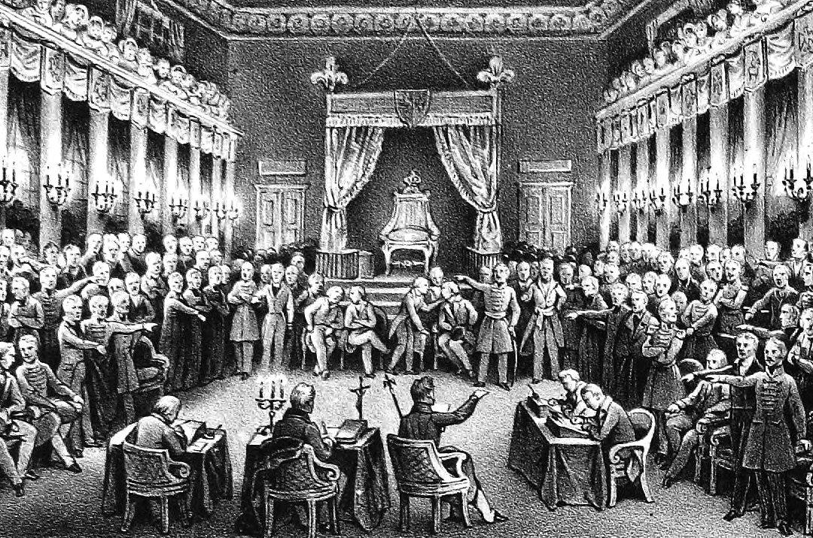

### 2022

Czy czekają nas najszybciej rosnące stopy procentowe w historii Polski?

> Piątkowa wypowiedź prezesa Narodowego Banku Polskiego Adama Glapińskiego wywarła duże wrażenie na uczestników rynku finansowego. Mocno w górę poszły rentowności polskich obligacji skarbowych. Złoty po początkowym umocnieniu zaczął tracić względem euro.

> **Stopy procentowe w Polsce powinny wzrosnąć mocniej, niż obecnie oczekuje rynek,** biorąc pod uwagę ostatnie dane makro – powiedział, cytowany przez agencję Bloomberg, prezes NBP Adam Glapiński. To bardzo zaskakująca wypowiedź prezesa Glapińskiego, który przez całą pierwszą kadencję jako szef NBP dał się poznać jako zwolennik jak najniższych stóp procentowych. Jeszcze we wrześniu prezes NBP mówił, że „wzrost inflacji jest przejściowy” i że podniesienie stóp procentowych byłoby „szkolnym błędem”.

> Przed piątkową wypowiedzią Adama Glapińskiego rynek terminowy spodziewał się, że do końca roku Wibor dojdzie w pobliże 4%. W poniedziałek rano kontrakty FRA 6x9 implikowały wzrost stopy procentowej w Polsce w pobliże 4,40%. W rezultacie mocno wzrosły rentowności polskich obligacji skarbowych. Papiery 10-letnie znów płacą prawie 4%. Także rentowność obligacji 5-letnich znalazła się w okolicach 4%. Warto dodać, że te ostatnie jeszcze pół roku temu płaciły nieco ponad 2%.

  

Zestawienie wypowiedzi pana G., zestawienie nie jest moje, lecz znalezione w sieci:

1. 03-2020 "Jesteśmy doskonale przygotowani do obecnego kryzysu, złoty jest stabilny"
2. 04-2020 "W obecnych warunkach inflacja jest ostatnim problemem, a w oczy zagląda nam groźba deflacji."
3. 09-2020 "W przyszłym roku czeka nas prawdopodobnie dalszy spadek inflacji, co w obecnych uwarunkowaniach makroekonomicznych nie dziwi"
4. 01-2021 "Nie rozumiem, skąd ogromne zaniepokojenie obserwatorów rzekomą groźbą inflacji"
5. 04-2021 "Inflację podbijają czynniki, na które polityka NBP nie ma wpływu"
6. 07-2021 "Inflacja jest przejściowa, nie ma przesłanek do zmian stóp"
7. 10-2021 "My naprawdę, trzeba w to uwierzyć, jesteśmy taką średnią potęgą gospodarczą. Od czasów rozbiorów nie mieliśmy takich sukcesów" "My w tej chwili żadnej pożyczki nie bierzemy, jako kraj, ani jako Narodowy Bank Polski. Żadnej. To do nas przychodzi cały świat i chce od nas pożyczać"
8. 12-2021 "Zmieniam retorykę. Inflacja nie jest przejściowa, inflacja jest uciążliwa"
9. 01-2022 "Inflacja jest przejściowa. Szczyt w połowie roku - powyżej 8 proc"

### 2021

Czy to wstęp do wprowadzania otwarcia dla społeczeństw (docelowego stanu) Self-Sovereign?

Szwajcaria przeprowadzi referendum w sprawie cofnięcia rządowi uprawnień do nakładania blokad z powodu pandemii

Obywatele Szwajcarii wypowiedzą się w sprawie odebrania rządowi prawa do nakazania blokad związanych z pandemią.

Szwajcaria przeprowadzi referendum w sprawie cofnięcia rządowi uprawnień do nakładania blokad i innych ograniczeń z powodu epidemii koronawirusa.

Głosowanie może się odbyć już w czerwcu i jest testem dla prawnych uprawnień rządu i najnowszym przykładem demokracji bezpośredniej w Szwajcarii.

Liczący 8,5 miliona ludzi kraj jest niezwykły, bo daje obywatelom prawo głosu w sprawie ważnych działań politycznych, a referenda odbywają się, jeśli odpowiednia liczba osób podpisze stosowną petycję.

### 1930

Policja zatrzymała Stanisława Cichockiego ps. „Szpicbródka”. udaremniając jednocześnie przygotowywane przez niego włamanie do placówki Banku Polskiego w Częstochowie.
Gang Stanisława Cichockiego ps. „Szpicbródka” był już prawie gotowy do skoku na Bank Polski w Częstochowie, ale potrzebował jeszcze pieniędzy na dokończenie przygotowań. Napadli więc na warszawskiego jubilera i w trakcie śledztwa w tej sprawie policja odkryła u jednego z podejrzanych schemat systemu alarmowego. Po nitce do kłębka członkowie szajki zostali aresztowani, 25 stycznia „Szpicbródka” trafił do częstochowskiego aresztu. Urodzony ok. 1890 r. Cichocki, terminował u odeskich włamywaczy. Później uczestniczył w napadach m.in. na banki w Berlinie i Rostowie, w latach 20. przybył do Polski i kontynuował karierę, prowadząc też bogate życie towarzyskie. Z aresztu w Częstochowie zdołał uciec, w 1932 r. znów został aresztowany, a w 1937 r. dostał cztery lata. Gdy wybuchła wojna, znalazł się w ZSRR, z którego ewakuował się z armią Andersa, a następnie zniknął. W 1978 r. powstało komediowo-kryminalny film który inspirowany był działalność Stanisława Cichockiego -Hallo Szpicbródka, czyli ostatni występ króla kasiarzy. W roli głównej m.in. Piotr Fronczewski.

  

### 1831

Powstanie listopadowe: Sejm ogłosił detronizację Mikołaja I.
Królestwo Polskie powstało na mocy decyzji kongresu wiedeńskiego. Konferencja mocarstw zdecydowała, że nowe państwo będzie połączone z Rosją osobą władcy. Car nadał Królestwu osobną konstytucję. W myśl jej przepisów państwo posiadało odrębną władzę, sejm, wojsko oraz skarb.
Nowi władcy Królestwa Polskiego - Aleksander I, a następnie Mikołaj I - od początku łamali konstytucję. Wkrótce wprowadzono cenzurę, mnożyły się aresztowania opozycjonistów. Działalność dowódcy armii, wielkiego księcia Konstantego, potęgowała niezadowolenie. W nocy 29 listopada 1830 roku wybuchło powstanie, rozpoczęte przez sprzysiężenie podchorążych, kierowane przez por. Piotra Wysockiego. Dyktatorem insurekcji został gen. Józef Chłopicki, a dotychczasowa Rada Administracyjna przekształciła się w Rząd Tymczasowy. Przedstawiciele władz wątpili w szanse powodzenia ruchu, lecz działali pod wpływem radykałów i warszawskiej ulicy.
Na 18 grudnia zwołano sejm. Posłowie i senatorowie pod wpływem hardej postawy Mikołaja, który zażądał bezwarunkowej kapitulacji, uznali powstanie za narodowe. Sejm nie chciał detronizować cara, wiedząc, że oznacza to złamanie porządku wiedeńskiego. Posłowie ustąpili jednak pod wpływem radykalizmu ludu stolicy i 25 stycznia podjęli uchwałę o detronizacji cara. Akt ten oznaczał pewną wojnę z Rosją.

  

---

<a href="https://github.com/TomaszWaszczyk/historia.waszczyk.com/edit/master/src/content/january-25.md" target="_blank">Edytuj tę stronę dzieląc się własnymi notatkami!</a>
