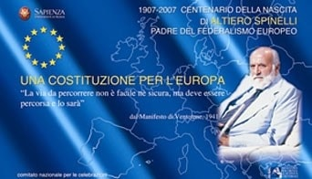
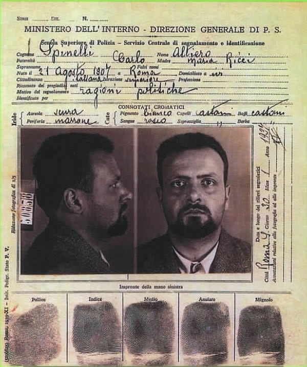
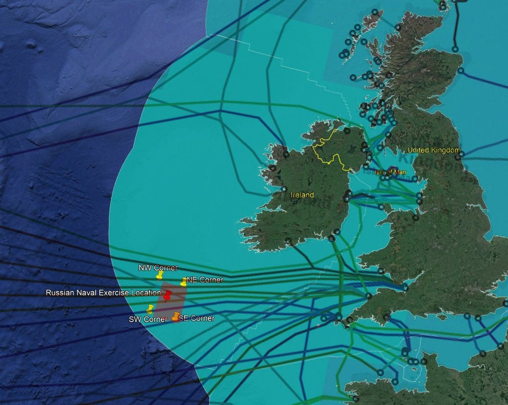
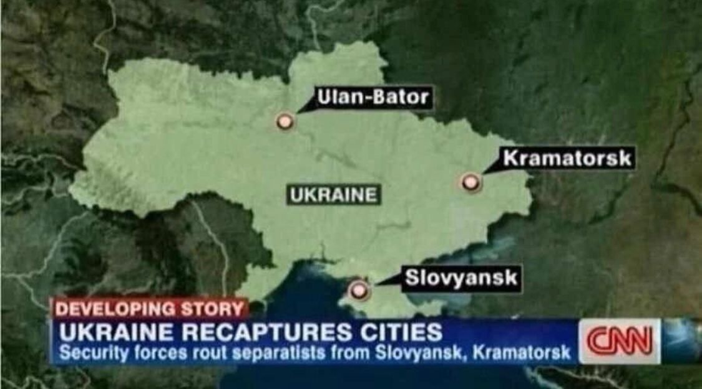
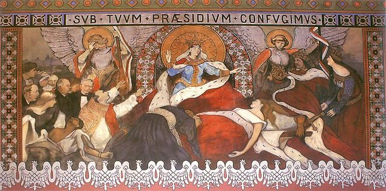

### 2024

> “Anybody who can throw coal into a furnace can learn how to program for God’s sake!”

<video width="640" height="480" controls>
<source src="./movies/january/everyone-can-program.mp4" type="video/mp4">
Your browser does not support the video tag.
</video>

---

"Gdyby nad wejściem do Parlamentu Europejskiego umieszczono nazwisko Stalina, Pol Pota lub Mao-Tse Tunga, zapewne każdy zwróciłby na to uwagę i zaczął zastanawiać się, czym jest Unia Europejska. Film opowiada o włoskim komuniście Altiero Spinellim, jego Manifeście z Ventotene, czyli programie założycielskim współczesnej Unii Europejskiej i Grupie Spinelli w PE dążącej do pełnej federalizacji (kolektywizacji) Europy.
Udało się wmówić ludziom, iż po 1989 r. nastąpiła tzw. transformacja ustrojowa i że teraz żyją w - mniej lub bardziej doskonałej - demokracji, a demokracja jest takim hasłem-pałką, z którą trudno dyskutować. Tymczasem ta "transformacja" ustrojowa miała miejsce znacznie wcześniej na Zachodzie i była transformacją kapitalizmu do komunizmu - tyle tylko, że ładniej nazwanego. Wprawdzie komunizm nigdy nie został tak napiętnowany, jak np. nazizm, ale gdyby w społeczeństwie powszechniejsza była wiedza o tym, że z Zachodu przyszedł do nas nie kapitalizm, ale komunizm (tyle tylko że pewexowski), poparcie dla zmian byłoby chyba nieco większe. Oczywiście taka wiedza działa na zasadzie kropli drążącej skałę, ale jednak działa.
O Spinellim w Polsce nic nie wiadomo, jeszcze mniej o Manifeście z Ventotene i czysto komunistycznej ideologii Unii Europejskiej. Myślę, że wiedza o tym, czym jest Unia Europejska zwiększałaby poparcie społeczne dla dokonywanych w Polsce zmian, z którymi Unia dopiero zaczyna walczyć. Polskie konflikty z ubecją łatwo jest interpretować jako rozgrywki personalne czy formę odwetu - brak jest świadomości, że chodzi o coś więcej. W sumie rzecz sprowadza się do jednego - zapomina się, że komunizm wymyślono na Zachodzie!
Reasumując:
1. Polska nie wstępowała do Unii Europejskiej, tylko do Wspólnoty Europejskiej (czego nikt nie wie i nie odróżnia),
2. Unia Europejska powstała dopiero w 2009 r. (jw.)
3. Tendencje federalistyczne, czyli bolszewickie istniały w Unii od czasów aktywności Spinelliego (projekt Konstytucji), ale były skutecznie blokowane. Teraz wspiera je Komisja Europejska i Grupa Spinelli, wykorzystując zmianę pokoleniową i niewiedzę - również posłów.
4. Chodzi o to, żeby nie przekształcać Unii w coś, do czego Polska nie wstępowała, czyli w kołchoz.
Jednym słowem - Polska chce pozostać w takiej wspólnocie, do jakiej wstępowała, ale powinna przeciwstawiać się jej przekształcaniu w państwo komunistyczne."
Krzysztof Karoń
Autorem koncepcji komunistycznej integracji europejskiej był włoski komunista Altiero Spinelli (1907-1986). Spinelli wstąpił do Włoskiej Partii Komunistycznej jako nastolatek, w 1927 r., po delegalizacji włoskiej opozycji został aresztowany i kolejnych 10 lat spędził w więzieniu. W wyniku prowadzonych w Rosji czystek opowiedział się przeciwko stalinizmowi i w 1937 r. został usunięty z partii pod zrzutem trockizmu (czyli leninowskiego komunizmu internacjonalistycznego). W 1940 r. Spinelli został internowany na wyspie Ventotene, gdzie wspólnie z Ernesto Rossim napisał tzw. Manifest z Ventotene, czyli sformułowany jeszcze w rewolucyjnym języku marksistowskim projekt zjednoczonej Europy antykapitalistycznej.
Istota integracji zawarta w Manifeście sprowadza się do dwóch punktów.
Pierwszy przewidywał sposób zjednoczenia Europy - powinna ono powstać w wyniku wykorzystania krótkiego okresu powojennego chaosu, gdy „dobrze zorganizowany ruch rewolucyjny” wprowadzi przygotowaną wcześniej konstytucję. Oznacza to, że zanim ukonstytuuje się nowy, powojenny ład polityczny i zanim określa się państwa narodowe, powinno powstać jedno nowe państwo europejskie (konstytucję może mieć tylko państwo).
Drugi przewidywał stworzenie „instytucji i środków”, które zdolne byłyby zapewnić skuteczność działania tego nowego państwa, czyli policja, armia, służba bezpieczeństwa i cenzura, które siłą, ale już zgodnie z narzuconą wcześniej konstytucją zdolne będą tłumić tendencje separatystyczne, czyli niepodległościowe dążenia narodów do samostanowienia. Rola wyznaczona w tym schemacie dla aktywistów federalistycznych jest dokładnie taka sama, jaką Karol Marks wyznaczył komunistom w Manifeście Komunistycznym – dbanie o to, żeby globalny cel rewolucji dominował nad partykularnymi interesami proletariatów w poszczególnych krajach.
Ponieważ wszystkie narodowości z definicji stają się w państwie federacyjnym mniejszościami, zasada interesu większości jest zgodna z zasadą demokratyzmu – co jest istotą leninowskiego centralizmu demokratycznego.
Napisany w 1941 r. Manifest został przemycony na kontynent, krążył w środowisku włoskiego ruchu oporu i stał się programem założonego przez Spinelliego w 1943 r. ruchu pn. Movimento Federalista Europeo (MFE).

  

  

  

### 2023

Jeżeli masz milion zł kredytu i nie możesz spłacić to masz problem. Jeżeli masz miliard zł kredytu i nie możesz spłacić, to bank ma problem.

### 2022

> The International Monetary Fund’s executive board has recommended El Salvador no longer use Bitcoin as a legal tender, citing potential risks to financial stability and consumer protection. The country’s use of Bitcoin could make it difficult for it to get a loan from the IMF.

  

  

---

Toksyczne opcje barierowe hitem sezonu?

Coraz więcej banków zachęca eksporterow do kupowania opcji barierowych PUT EUR/PLN.

Tym razem bariera OUT jest ustawiona na wysokości 4,40.

Co ciekawe wszystkie banki oferują dokładnie tę samą barierę. Znakiem tego, źródło jest wspólne, a polskie banki jedynie działają jako lokalni dystrybutorzy.

Poprzednio bariery były ustawiana na 4,53 i jak wiemy już jakiś czas temu się aktywowały - pozostawiając eksporterow bez ubezpieczenia z „ręką w nocniku”.

Czyżby teraz zaczęła się wędrówka w dół do 4,40 aby i te bariery aktywować i powyłączać ubezpieczenia?

---

Rosjanie zapowiedzieli w dniach 3-8 lutego ćwiczenia morskie na Atlantyku z użyciem ostrej amunicji w wyłącznej strefie ekonomicznej Irlandii.

Niby nic, ale ktoś zadał sobie trudu, i nałożył na mapę pobliskie kable i światłowody telekomunikacyjne łączące Europę z USA.

A od siebie dodam (pracujący w branży IT mogą potwierdzić w komentarzach), że w Irlandii i UK znajdują się potężne centra danych.
Centra danych mają tam korporacje odpowiedzialne za obsługę większości biznesu w Europie (Microsoft, Amazon, Facebook, Google, IBM etc).

  

---

Andrzej Sadowski:

"Po doświadczeniach ponad dwóch dekad widać, że przyjęcie euro przez kraje UE było sukcesem, ale wyłącznie politycznym. Przypomnijmy, że euro było przede wszystkim instrumentem integracji politycznej, która była i jest głównym celem europejskiej biurokracji. Państwa, które przyjęły euro zanotowały zauważalne obniżenie tempa wzrostu gospodarczego, a z drugiej strony nawet skokowy wzrost bezrobocia. Jednocześnie kraje te nie odniosły tych korzyści, na które wskazywano w raporcie NBP, czyli zmiana kolorów farby na banknotach, które są w obiegu nie zwiększyła sama z siebie wzrostu gospodarczego, ani też nie uporządkowała finansów publicznych, wręcz przeciwnie. Grecja jest przykładem, że mając euro można zbankrutować. Euro potraktowano jako odnowienie religii złotego cielca, do którego zaczęto modlić się o dobrobyt. Spekulacyjny krach finansowy 2007-2008 roku udowodnił, że euro nie jest tzw. bezpieczną przystanią. (...) Państwa strefy euro nie wyszły jeszcze z kryzysu tego roku mimo bilionów dodatkowo wpompowanych euro w ich gospodarki. Warto znać tak elementarne informacje o euro i nie taktować przyjęcia tej waluty jako sposobu do uwolnienia się od odpowiedzialności za własne państwo”.

---

Ułan Bator na Ukrainie według CNN:

  

---

Prawdziwy dramat Polaków. Z dnia na dzień muszą płacić o 1000 zł

Adam Glapiński, prezes Narodowego Banku Polskiego, w wypowiedzi dla Agencji Bloomberga wskazał, że należy się spodziewać dalszego wzrostu stóp. Oliwy do ognia dodały słowa, iż "podwyżka może być zaskakująca i przekroczyć rynkowe oczekiwania". Walka z szalejącą inflacją powoduje, że obrywają kredytobiorcy. Ich miesięczne raty rosną o setki złotych.

---

### 2021

Jan 26, 2021: Yellen Says U.S. Faces Climate, Economic Crises on Top of Covid

June 27, 2017: Yellen sees no new financial crisis in 'our lifetimes'

...

  

<!-- Większość ludzi ma w dupie,  ale co jest niezrozumiałe dla CIEBIE !!!!..??
To tylko maska..
To tylko 1,5 metrów..
To tylko na dwa tygodnie..
To są tylko niepotrzebne firmy..
To tylko niepotrzebni pracownicy..
To tylko puby..
To tylko restauracje..
To tylko impreza i wesele, których Wam zakażemy..
To tylko do momentu, kiedy liczba zarażonych spadnie..
To tylko po to, żeby zmniejszyć zużycie szpitali..
Zostało tylko kilka tygodni..
To tylko kościoły..
To tylko dopóki nie przyjdzie szczepienie..
To tylko bransoletka śledząca..
To tylko aplikacja..
To tylko system rozpoznawania twarzy..
To tylko po to, żeby ludzie wiedzieli, że obok ciebie jest bezpiecznie..
To tylko po to, żeby wiedzieć, kogo spotykasz..
Zostało tylko kilka miesięcy..
To tylko niewygodny film, który został skasowany..
To tylko post, który zaraz zostanie zbanowany..
To tylko e-mail..
To niewiele cenzury..
To są tylko przeciwnicy Corona..
To tylko naziści..
To tylko anarchiści..
To tylko chip i czujnik..
To tylko informacje medyczne..
To tylko po to, żebyś mógł podróżować..
To tylko po to, żebyś mógł robić zakupy..
To tylko po to, żebyś mógł głosować..
To tylko na kilka lat..
To tylko TWOJA WOLNOŚĆ, KTÓRA CODZIENNIE ZNIKA , a ty nawet tego nie widzisz..
To tylko koniec życia, jakie znaliśmy jeśli przyzwolenie społeczne będzie nadal bierne na rzeczy, które się dzieją.😞 -->

---

“At the World Economic Forum’s (WEF) virtual Davos Agenda summit on Tuesday, French President Emmanuel Macron declared that in the wake of the Chinese coronavirus modern capitalism “can no longer work”.

Appearing before a question and answer session conducted with ‘Great Reset’ architect and founder-chairman of the WEF, Klaus Schwab, Mr Macron said that while capitalism has historically driven down poverty globally, he claimed that it came with the cost of furthering inequality.”

---

W poniedziałek podczas wystąpienia na Światowym Forum Ekonomicznym w Davos przywódca Chin Xi Jinping przestrzegł przed „nową zimną wojną” i dążeniem do globalnej dominacji. Wystąpienie generalnie jest bardzo ciekawe i warto się z nim zapoznać. Xi po pierwsze zaczyna wystąpienie od stwierdzenia, iż pandemia jest daleka od zakończenia. Następnie wymienia cztery główne wyzwania stojące przed światem.

1. Wzmocnienie koordynacji polityki makroekonomicznej i wspólne promowanie silnego, trwałego, zrównoważonego i sprzyjającego wyłączeniu społecznemu wzrostu gospodarki światowej.

2. Porzucenie ideologicznych uprzedzeń i wspólne podążanie drogą pokojowego współistnienia, wzajemnych korzyści i współpracy typu win-win.
3. Likwidacja przepaści między krajami rozwiniętymi a rozwijającymi się i wspólne doprowadzenie do wzrostu gospodarczego i dobrobytu dla wszystkich.
4. Zjednoczenie się przeciwko globalnym wyzwaniom i wspólne tworzenie lepszej przyszłości dla ludzkości.
Dalej Xi jako sposób na rozwiązanie tych problemów podkreśla rolę podtrzymania multilateralizmu oraz daje konkretne cztery rozwiązania:
1. Należy pozostać przywiązanym do otwartości i inkluzywności zamiast zamknięcia i wykluczenia. Podkreśla iż w multilateralizmie chodzi o to, aby sprawy międzynarodowe były rozwiązywane w drodze konsultacji, a o przyszłości świata decydowali wszyscy, którzy ze sobą współpracują. Ostrzega iż, tworzenie małych kręgów współpracy skończy się rozpoczęciem nowej zimnej wojny.
2. Pozostanie wierności prawu międzynarodowemu i międzynarodowym zasadom, zamiast dążyć do supremacji jednego z krajów lub kręgów. Ostrzega, iż bez poszanowania międzynarodowego prawa i międzynarodowych zasad, które są tworzone i uznawane przez globalną społeczność, świat może powrócić do prawa dżungli, a konsekwencje tego byłyby katastrofalne dla ludzkości!
3. Zaangażowanie w konsultacje i współpracę, a nie w konflikt i konfrontację. Przypomina, iż rzeczywistość wielokrotnie jasno pokazała, że błędne podejście polegające na antagonizowaniu i konfrontacji, czy to w formie zimnej wojny, gorącej wojny, wojny handlowej, czy wojny technologicznej, ostatecznie zakończyły się niekorzystnie dla każdej ze stron.
4. Nadążać za zmianami, zamiast je odrzucać. Xi przekazuje, iż aby podtrzymać multilateralizm w XXI wieku, powinniśmy promować jego piękną tradycję, przyjąć nowe perspektywy i patrzeć w przyszłość. Podkreśla rolę Światowej Organizacji Zdrowia w budowaniu globalnej wspólnoty zdrowia dla wszystkich. Przypomina o konieczności wywiązywania się z porozumienia paryskiego w sprawie zmiany klimatu i promowaniu rozwoju ekologicznego. 
Na koniec swojego wystąpienia XI informuje, iż Chiny są na dobrej drodze do ukończenia budowy umiarkowanie zamożnego społeczeństwa pod każdym względem, a Chiny będą współpracować z innymi krajami w celu zbudowania otwartego, integrującego, czystego i pięknego świata, który cieszy się trwałym pokojem, powszechnym bezpieczeństwem i wspólnym dobrobytem. Podkreśla, iż Chiny będą więcej inwestować w naukę i technologię, rozwijając i umożliwiając systemy innowacji jako priorytet, przekształcając w szybszym tempie przełomowe odkrycia naukowe i technologiczne w rzeczywistą wydajność oraz wzmacniając ochronę własności intelektualnej, a wszystko to w celu wspierania napędzanego innowacjami wzrostu gospodarczego o wyższej jakości. "Gra o sumie zerowej" lub "Zwycięzca bierze wszystko" nie jest filozofią przewodnią narodu chińskiego.

---

### 2013

W Cheseaux-sur-Lausanne w Szwajcarii zmarł 84-letni Stefan Kudelski, elektronik i wynalazca, twórca pierwszych przenośnych i niezwykle odpornych na eksploatację magnetofonów o nazwie ,,Nagra'', które stały się podstawowym typem magnetofonów używanych przez reporterów radiowych, telewizyjnych, studia filmowe, a nawet agentów służb specjalnych na całym świecie. Stefan Kudelski otrzymał za swój wynalazek m.in. cztery nagrody amerykańskiej Akademii Filmowej (dwie nagrody naukowo-techniczne i dwie statuetki Oscara) oraz dwie nagrody przemysłu rozrywkowego Emmy. W 1983 roku został laureatem John Grierson International Gold Medal, dołączając do takich zasłużonych dla filmu postaci jak Louis Lumiere, Thomas Edison, czy Walt Disney.

  

### 1972

Na wysokości 10 km przy granicy NRD z Czechosłowacją w samolocie ✈ McDonnell Douglas DC-9 jugosłowiańskich linii lotniczych wybuchła bomba🧨, prawdopodobnie podłożona przez chorwackich nacjonalistów . Samolot , a następnie runął na ziemię 🛬. Zginęło 27 osób.

Czy ktokolwiek mógł przeżyć katastrofę oraz upadek z 10 km❓ TAK, cudem przeżyła jedna stewardesa, Vesna Vulović.

Gdy na pokładzie doszło do eksplozji, maszyna rozpadła się na dwie części.

Vulović znajdowała się w ogonie samolotu. Wózek od cateringu przygniótł ją do ściany, dzięki czemu nie została wyssana na zewnątrz. Ponadto, uderzenie w zalesiony stok 🏞 oraz warstwa śniegu❄ znacznie wyhamowała zderzenie.

Vulović przeżyła jako jedyna osoba na pokładzie. Mimo pękniętej czaszki, złamanych trzech kręgów i obu nóg. Stewardessę znaleziono wśród fragmentów samolotu i ciał innych ofiar podniebnej tragedii.

Przypadek Vesny Vulović jest powszechnie uznawany za cud, za coś co nie miało prawa się wydarzyć. Stewardessa twierdziła jednak, że nie miała szczęścia, ale ogromnego pecha.

Bohaterka trafiła także do Księgi Rekordów Guinnessa jako osoba, która wykonała skok bez spadochronu z najwyższej wysokości.

### 1938

Gen. Tadeusz Kutrzeba określił w przedstawionych marszałkowi Edwardowi Rydzowi-Śmigłemu założeniach planu wojny z Niemcami. Przewidywano w nim, że do 1941 r. potencjał wojenny Niemiec będzie trzykrotnie wyższy od osiągniętego w tym samym czasie przez Polskę.
W polskiej historiografii utarło się przekonanie, że Polska nie miała żadnych szans w starciu z Wehrmachtem. Koncepcja Naczelnego Wodza – Marszałka Edwarda Rydza-Śmigłego o tzw. bitwie granicznej z całą pewnością ułatwiła III Rzeszy zwycięstwo w kampanii wrześniowej. W polskiej generalicji był jednak człowiek, który miał zupełni inną wizję wojny obronnej z Niemcami. Był nim generał Tadeusz Kutrzeba. Jego śmiały plan mógł zmienić losy kampanii wrześniowej. Dlaczego więc nie pozwolono mu go zrealizować?
Potencjał militarny Polski i Niemiec w 1939 roku zdecydowanie korzystniej wypadał na rzecz III Rzeszy. Nasz kraj nie był jednak pozbawiony szans w starciu „Dawida z Goliatem”. Jeden z najwybitniejszych dowódców wojskowych okresu międzywojnia – generał Tadeusz Kutrzeba, już w 1938 roku trafnie przewidział możliwości obronne Rzeczypospolitej.
Polski rząd, jak również dowództwo wojskowe świadome zagrożenia ze strony Rzeszy Niemieckiej liczyło na pomoc Wielkiej Brytanii i Francji. Pomoc, która jak się okazało nigdy nie nastąpiła. Brytyjczycy nie byli bowiem w stanie we wrześniu 1939 roku stawić czoła Wehrmachtowi, z kolei Francja teoretycznie miała wystarczające siły, aby podjąć skuteczną ofensywę przeciwko Niemcom. Niestety pamięć wydarzeń z okresu I wojny światowej w latach 1914-1918 sparaliżowała nie tylko rząd, ale również społeczeństwo francuskie. Jedyną wówczas szansą na obronę był sojusz brytyjsko-francusko-polsko-radziecki. Gdyby doszło do jego podpisania zmieniłby on całkowicie układ sił w Europie. Był on jednak całkowicie nierealny. Miałby on sens wówczas, gdyby wojska radzieckie miały możliwość interwencji przeciwko Niemcom, a więc prawo przejścia przez terytorium Polski. Na to rząd polski nigdy nie wyraził zgody. Ponadto sojusz byłby korzystny wyłącznie dla państw zachodnich. Wielka Brytania i Francja trzymałyby w szachu Niemcy, narzucając im prawo kontynuowania zbrojeń do wysokości określonej traktatami. Doskonale to obrazuje traktat brytyjsko-niemiecki z 1935 roku, określający granice rozbudowy niemieckiej floty. Silna Polska oraz kontrolowane Niemcy byłyby wówczas zaporą nie do przejścia dla wojsk sowieckich w razie agresji na zachód.
W oparciu o traktaty sojusznicze z Francją i Wielką Brytanią opracowany został również plan obrony Rzeczypospolitej przez agresją niemiecką. Traktat z Wielką Brytanią zawierał bowiem zastrzeżenie, że warunkiem pomocy udzielonej Polsce przez Brytyjczyków, jest podjęcie przez wojska polskie zbrojnej obrony, co oznaczało, że nasz kraj musi stawić wyraźny opór Niemcom, aby otrzymać pomoc sojusznika. Ten warunek był dla naszych strategów podstawą do opracowania koncepcji tzw. bitwy granicznej. Jej celem było wprowadzenie w pierwszych dniach wojny, jak największej ilości wojsk do walki tak, aby nie było wątpliwości, że nasz kraj podjął walkę z wrogiem. Plan ten z punktu widzenia politycznego był w pełni uzasadniony, jednak z punktu widzenia wojskowego miał katastrofalne skutki we wrześniu 1939 roku. Jak się bowiem okazało, część polskiej armii wykrwawiała się w ciężkich walkach z Niemcami, zaś część pozostawała nie atakowana. Tak było między innymi z armią „Poznań” dowodzoną przez gen. Tadeusza Kutrzebę, którego przypuszczenia potwierdziły się już 1 września 1939 roku. Armia „Poznań” nie była bowiem atakowana, a meldunki wskazywały jednoznacznie, że niemieckie dywizje szły z północy i południa. Ponadto rozpoznanie sił armii „Poznań” w pobliżu przejścia granicznego Geyersdorf wykazało, że przed armią gen. Kutrzeby nie ma większych sił. Natomiast w trudnym położeniu znalazła się armia „Łódź” w stronę której posuwała się niemiecka 8. armia gen. Johanna Blaskowitza. Jego celem była koncentracja sił, która miała na celu przeprowadzenie jak najszybszego uderzenia na Warszawę. Blaskowitz nie dostrzegał jednak, że spiesząc się do stolicy Rzeczypospolitej zapomniał o ubezpieczeniu lewego skrzydła swojej armii.
Tą nieuwagę dowódcy 8. armii zauważył gen. Tadeusz Kutrzeba. Podjął on śmiały plan połączenie sił armii „Poznań” i armii „Pomorze” pod swoim dowództwem. Umożliwiłoby to stworzenie związku liczącego ok. 150 tysięcy żołnierzy, który był w stanie zagrozić wojskom Blaskowitza. Niestety bez zgody Naczelnego Wodza Marszałka Edwarda Rydza-Śmigłego dowódca armii „Poznań” nie mógł przejąć pod kontrolę armii „Pomorze” i przejść do ofensywy. Plan gen. Kutrzeby nie zyskał aprobaty Naczelnego Dowództwa, a marsz. Rydz-Śmigły popełnił fatalny błąd, uniemożliwiając stworzenie frontu mogącego zatrzymać przeciwnika, zadając mu poważne straty. Rozkazem dowództwa gen. Kutrzeba rozpoczął wycofywanie się z Wielkopolski w stronę Warszawy, nie porzucając jednak odważnego planu uderzenia na 8. armię, która toczyła krwawe boje z armią „Łódź”. Pogarszająca się sytuacja wojskowa w Polsce spowodowała zgodnie z wcześniej opracowanym planem ewakuację rządu, która rozpoczęła się z 4 na 5 września. Dwa dni później Kwaterę Główną opuścił Naczelny Wódz Marszałek Edward Rydz-Śmigły. Wciąż jednak istniała szansa na zmianę losów kampanii wrześniowej. Wojska generała Blaskowitza parły w kierunku Warszawy rozciągając swe wojska na całej długości, odsłaniając tym samym swoje skrzydło. W razie niespodziewanego ataku nie były w stanie odeprzeć uderzenia. To właśnie chciał wykorzystać gen. Kutrzeba, dlatego nadal upierał się przy planie wspólnego uderzenia armii „Poznań” i „Pomorze” na rozciągnięte wojska Blaskowitza. Wstępna zgoda generała Wacława Stachiewicza na rozpoczęcie akcji umożliwiła rozpoczęcie działań, które całkowicie zaskoczyły wojska niemieckie.
9 września na rozkaz generała Tadeusza Kutrzeby do walki ruszyła Grupa Operacyjna gen. Edmunda Knoll-Kownackiego. Po raz pierwszy Polacy mieli przewagę, którą zaczęli wykorzystywać. Polską ofensywę nad Bzurą skutecznie rozpoczęła Wielkopolska Brygada Kawalerii, uderzając na nieprzygotowaną do obrony niemiecką 30. dywizję. Już pierwszego dnia walk Niemcy stracili 800 zabitych, 750 rannych oraz ok. 3000 wziętych do niewoli. Potężne i niespodziewane uderzenie dwóch polskich armii było dla Niemców ogromnym zaskoczeniem. Żołnierze niemieccy podążający w stronę Warszawy musieli zatrzymać się i skręcić na północ, aby odeprzeć polskie natarcie. To się jednak nie udało. Armie „Poznań” i „Pomorze” odbijały zajęte już przez Niemców miasta, jak: Łęczyca, Sochaczew, Stryków, Łowicz, Głowno oraz Ozorków. Podjęta przez wojsko polskie ofensywa nad Bzurą osiągnęła apogeum 12 września. Ten dzień zapadł jednak w pamięci Polaków z zupełnie innej przyczyny. W Abbeville 12 września premier Francji – Edouard Daladier i premier Wielkiej Brytanii – Neville Chamberlain podjęli decyzję o nie udzieleniu pomocy Polsce w walce z Niemcami. W Polsce niestety nikt o tym nie wiedział, a decyzja podjęta setki kilometrów od naszych granic, oznaczała dla naszego kraju klęskę w starciu z wojskami hitlerowskimi.
Brak pomocy zachodnich sojuszników skazywał nasz kraj na „pożarcie” niemieckich armii, które wzmocnione dwiema cofniętymi spod Warszawy dywizjami pancernymi uderzyły na armię „Poznań” i „Pomorze”. Piętnaście dużych jednostek wojskowych oddanych pod dowództwo gen. Blaskowitza stanowiło siłę nie do odparcia dla wojsk polskich. Generał Kutrzeba bezskutecznie oczekiwał pomocy gen. Juliusza Rómmla, który przygotowywał się do obrony stolicy. Ponadto Niemcy rzucili przeciwko armii „Poznań” i „Pomorze” swoją najpotężniejszą broń, której wojsko polskie nie mogło się przeciwstawić – Luftwaffe. Uderzenie niemieckie zepchnęło polskie oddziały, które cofały się w kierunku stolicy. 17 września na Polskę spadł cios w plecy – wschodnią granicę Rzeczypospolitej zaatakowały wojska sowieckie.
Tym samym wypełnił się pakt Ribbentrop – Mołotow z 23 sierpnia 1939 roku. Wobec agresji z obydwu stron nasz kraj był bezradny. Już 19 września generał Kutrzeba nakazał swoim wojskom przebijać się w stronę Warszawy. Po dotarciu do stolicy został zastępcą gen. Juliusza Rómmla. W niecałe dziesięć dniu później – 28 września gen. Kutrzeba rozpoczął rozmowy kapitulacyjne z gen. Blaskowitzem. W niewielkim autobusie na Rakowcu podpisany został akt kapitulacji bohatersko walczącej Warszawy. Kilka dni później wojsko polskie stoczyło w październiku 1939 roku ostatnią bitwę kampanii wrześniowej pod Kockiem. Podzielona już wówczas między Niemcy i Związek Radziecki Rzeczpospolita, po raz kolejny znikła z mapy Europy.
Przewidywania generała Tadeusza Kutrzeby w pełni się potwierdziły podczas bitwy nad Bzurą. Jego śmiały plan początkowo odrzucony przez Naczelnego Wodza w pełni się sprawdził. Zaskoczone wojska 8. armii niemieckiej nie były w stanie odeprzeć polskiej ofensywy. Niemcy musieli najpierw zdusić polskie natarcie, co oznaczało opóźnienie ataku na Warszawę. Niestety zbyt późno podjęta decyzja przesądziła o losach operacji. Dzisiaj możemy jedynie gdybać, co by się stało w przypadku wyrażenia zgody przez Naczelnego Wodza w początkowej fazie kampanii wrześniowej.
Fragmenty opracowania gen. Kutrzeby "Wojna bez walnej bitwy"
"Niestety, nie mogły w tym czasie decydować zamiary i chęci nasze, lecz jedynie wytworzone położenie. O jakimkolwiek transporcie kolejowym nie można było myśleć wobec bezwzględnej przewagi powietrznej Niemców. Nie można było też marzyć o własnym powodzeniu tam, gdzie występowały większe ilości czołgów nieprzyjaciela. W takich obszarach mogliśmy jedynie się bronić i to tylko wówczas, jeśli natrafiliśmy na sprzyjające warunki terenowe. Lasy,miasta,nadawały się do czasowej obrony, chociaż ulegały zniszczeniu. Jedynym obszarem, w którym około 6 września posiadaliśmy nienaruszone siły, był obszar objęty linią: Płock - Gopło- Łęczyca -Łowicz, czyli obszar operacyjny armii "Poznań". Armia ta była jeszcze nienaruszona, miała więc znaczne siły do dyspozycji (cztery DP, dwie BK). Do tego rejonu można było łatwo ściągnąć, marszami pieszymi, oddziały armii "Pomorze" w sile około czterech dywizji."
"Decydującą rzeczą było - wygrać bitwę na zachód od Wisły. Aby to umożliwić, musiałyby sąsiadujące armie: gen Przedrzymirskiego na północy i gen Szylinga na południu, nie dopuścić do jej zagrożenia, Armia Przedrzymirskiego musiała by wówczas powstrzymać siły niemieckie wychodzące z Prus Wschodnich i kierujących się na Wisłę, trzymając się silnie na zachodzie, a folgując na wschodzie. Armia Szylinga nie powinna dopuścić, by siły niemieckie ze Śląska wkroczyły do naszej bitwy nad Bzurą, w kierunku na Łódź, Radom czy Warszawę. Kierunek Kraków - Lwów był, w stosunku do tej bitwy, był drugorzędny. Zamiar wycofania wojska do Rumunii lub Węgier trzeba było zarzucić".
"Nie chcę malować wizji dalszych, operacyjnych skutków owej "walnej bitwy". Sądząc najskromniej, byłaby to klęska 8 armii niemieckiej. Klęska ta mogła być przez Niemców zlokalizowana, co skończyło by się naszą przegraną, albo klęska 8 armii mogła spowodować również niepowodzenie 10 armii niemieckiej. W tym wypadku, ofensywa niemiecka musiała by się zatrzymać dla przegrupowania frontów natarcia, które się bardzo rozeszły. Ale nawet w wypadku niepowodzenia tej naszej kontrofensywy, chcącej sięgnąć głębiej tj. przez Wisłę do Małopolski Wschodniej, kampania polsko - niemiecka przedłużyła by się o sporo dni. Krwawe straty niemieckie były by znaczne. Warszawa była by ocalała. Armia polska uległa by w całości, ale w bitwie w otwartym polu".

  

### 1934

W Berlinie Polska i Niemcy podpisały porozumienie o niestosowaniu przemocy.
Sygnatariuszem ze strony polskiej był poseł Józef Lipski, ze strony niemieckiej minister spraw zagranicznych Konstantin von Neurath.
Deklaracja ta, bo tak właściwie nazywa się to porozumienie wynikła w sporej mierze z przekonania Józefa Piłsudskiego, że sojusznicza pozycja Francji wobec Polski uległa znacznemu osłabieniu, co potwierdziła odmowa Francji przyjęcia tajnej propozycji wojny prewencyjnej przeciw Niemcom w obronie postanowień
traktatu wersalskiego , wysuniętej przez Piłsudskiego w 1933 roku. Jeszcze ciekawsza była motywacja Niemiec. Podpisali oni tę deklarację w celu normalizacji stosunków z Polską? ale też po to, by scenariusz wojny prewencyjnej przeciwko nim nie doszedł do skutku. Obawa ta wynikała z faktu, że kraj ten, na który po zakończeniu I wojny światowej narzucono postanowienia Traktatu Wersalskiego nie był jeszcze na tyle uzbrojony militarnie, by móc stawić czoła nowemu wrogowi. Hitler w tym okresie próbował ponadto skłonić Polskę do sojuszu z Niemcami wymierzonego w ZSRR.
Traktat został zerwany 28 kwietnia 1939 roku po tym jak niemiecki przywódca uznał, że podpisane 6 kwietnia 1939 roku w Londynie przez ministra porozumienie polsko-brytyjskie o gwarancjach wzajemnej pomocy wojskowej na wypadek agresji niemieckiej jest złamaniem deklaracji zawartej z Niemcami.

  

### 1932

W sali Industrie-Club w Düsseldorfie Adolf Hitler wygłosił ponaddwugodzinny odczyt dla 650 przemysłowców.
Powiedział, że wizji jego państwa nie da się pogodzić z zasadą równości i podejmowaniem decyzji większością głosów, ale własność prywatna będzie nienaruszalna. Zapowiedział, że aby odzyskać swoją świetność, Niemcy muszą ponownie stać się „geopolityczną potęgą”. Słuchacze z uznaniem przyjęli oświadczenie, że zamierza „wytępić marksizm w Niemczech do ostatniego korzenia”. W ciągu kilku miesięcy Hjalmar Schacht, były prezes Reichsbanku, uzyskał zgodę Hitlera na powołanie „biura roboczego”, które miało usprawnić kontakty między NSDAP a środowiskiem biznesowym pragnącym finansować nazistów.

  

### 1880

https://pl.wikipedia.org/wiki/Douglas_MacArthur

### 1797

Rosja, Austria i Prusy podpisały w Petersburgu ostateczną konwencję rozbiorową Rzeczypospolitej (konwencja petersburska). Dodany do niej tajny artykuł mówił, że „samo imię Polski będzie na zawsze wymazane z prawa narodów”.

  

### 1521

Wojna pruska: nieudany atak wojsk krzyżackich na Olsztyn, którego obroną dowodził Mikołaj Kopernik.
Wielka bitwa, a może jednak mała potyczka? Co naprawdę Olsztyn zawdzięcza Kopernikowi jako administratorowi?
Zacznijmy od tego, co działo się rok wcześniej. Wielki Mistrz Krzyżacki okupował wówczas Braniewo. Mikołaj Kopernik starał się prowadzić z nim pertraktacje. Niestety, na próżno. Wojska krzyżackie posuwały się na przód i zdobywało miasto po mieście. Pozostali kanonicy warmińscy, do których należał przecież Kopernik, z przerażeniem rozpierzchli się na wszystkie strony. Niektórzy pojechali do Gdańska, inni do Elbląga. Kilku znalazło schronienie na zamku administratora w Olsztynie. Mikołaj Kopernik podjął ważną decyzję. Zdecydował się bronić miasta, naprawił warowne mury i pośpiesznie gromadził amunicję. Z Elbląga zamówił hakownice, żywność, ołów do kul, sól i papier.
W związku z tym, że Olsztyn – w przeciwieństwie do innych miast Warmii – był całkiem dobrze strzeżony, kapituła przywiozła na zamek skarbiec z katedry, a w nim cenne dokumenty, które Kopernik dokładnie skatalogował. Badacze twierdzą, że to kolejny dowód jego gospodarności, a także zamiłowania do porządku.
Źródła historyczne podają, że załoga zamku składała się ze stu zaciężnych polskich pod dowództwem rotmistrza Pawła Dołuskiego. 19 października 1520 roku Krzyżacy oblegli Lidzbark Warmiński, a 15 listopada zajęli Dobre Miasto. W tej sytuacji Olsztynowi nie mógł udzielić pomocy oddział wojsk polskich pod dowództwem Jakuba Sęcygniewskiego, który stacjonował wtedy w oblężonym przez zakonnych Lidzbarku.
Kanonicy postanowili zwrócić się z prośbą o pomoc do króla polskiego Zygmunta I Starego. W tym celu 16 listopada wystosowali błagalny list.
"Pokornie błagamy Wasz Święty Majestat, aby raczył nam jak najśpieszniej przyjść z pomocą i wesprzeć skutecznie. Pragniemy bowiem czynić to, co przystoi ludziom szlachetnym i uczciwym oraz bez reszty oddanym Waszemu Majestatowi, nawet jeśliby przyszło nam zginąć."
List w imieniu kapituły po łacinie napisał Kopernik. Jednak prośba nigdy nie dotarła do adresata, bo została przejęta przez Krzyżaków. Na szczęście król inną drogą dowiedział się o zagrożeniu, które czyhało na główną twierdzę południowej Warmii. Dlatego pod koniec listopada nadesłał posiłki. Z odsieczą przyszedł Henryk Peryka z Janowic, a zanim stu zbrojnych.
Jak podkreślają historycy, mimo dobrego zabezpieczenia zamku, kanonicy nie czuli się bezpiecznie i opuścili Olsztyn. Na stanowisku pozostał tylko Kopernik i kanonik Henryk Snellenberg. Wkrótce nadeszły nowe posiłki królewskie. Ich zadaniem było z kolei śledzenie ruchów wojsk zakonnych.
Stanęło na tym, że Wielki Mistrz Albrecht Hohenzollern wezwał zamek i miasto Olsztyn do kapitulacji. Groził zarządcom, że jeśli odmówią, to on będzie zmuszony go zniszczyć. Polscy dowódcy i administrator Kopernik wykazali się jednak nie lada odwagą i odrzucili wezwanie Albrechta. Pod Dobre Miasto wysłali nawet zbrojnych, którzy wygrali potyczkę i wzięli do niewoli kilku jeńców. Historycy podkreślają, że to utwierdziło Mistrza Zakonu Krzyżackiego w przekonaniu, że warmiński Olsztyn wcale nie ma zamiaru się poddać. Dlatego wojska zakonne przeszły obok Olsztyna i skierowały się na Lubawę, Brodnicę, a następnie na Mazowsze.
Załoga zamku poczuła się pewnie. Można powiedzieć, że nawet odważnie. Podjęto decyzję o wysłaniu grupy jeźdźców pod Dobre Miasto po żywność. Dobre Miasto było oczywiście pod kontrolą Krzyżaków. Natomiast oddział krzyżacki, pod dowództwem Wilhelma von Schaumburga wyprawił się na Olsztyn z zamiarem odebrania zabranego bydła. Rozbili kilku polskich konnych i tu zaczyna się właściwa historia o ataku na olsztyński zamek. Podnieconym tym zwycięstwem Wilhelm postanowił sforsować bramę zamku. Krzyżaccy żołnierze wyłamali furtę młyńską, ale – w związku z tym, że nie mieli drabin – nie potrafili wspiąć się na mury. Olsztyn obronił się.
Warmia nie wyszła jednak z wojny polsko-krzyżackiej cała i zdrowa. Wiele wsi zostało doszczętnie zniszczonych, część miast spalonych. A jak to wszystko się skończyło? Nowy cesarz rzymski Karol V Habsburg wezwał do natychmiastowego działań wojennych. W obliczu nowego wspólnego wroga, najazdu Turków na Węgry podpisano rozejm. 5 kwietnia 1521 roku. Tymczasem cztery lata później doszło już do hołdu pruskiego.
Historycy wskazują, że do prawdziwego oblężenia olsztyńskiego zamku nigdy nie doszło. Nie umniejsza to jednak roli Mikołaja Kopernika. Fakt, że miasto pozostało nieodpartym, nastąpiło przecież jedynie na skutek starannych przygotowań, które pojął astronom – w tym przypadku występujący w roli administratora dóbr kapitulnych. Mikołaju, udowodniłeś, że bitwę można wygrać nawet piórem.

  

---

<a href="https://github.com/TomaszWaszczyk/historia.waszczyk.com/edit/master/src/content/january-26.md" target="_blank">Edytuj tę stronę dzieląc się własnymi notatkami!</a>
