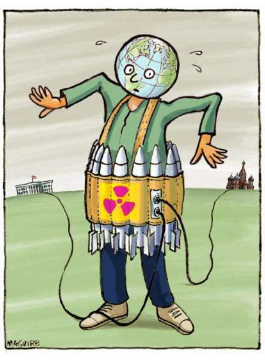

### 2024

Escalating Costs of US Debt: Interest Payments Projected to Triple by 2030

The United States' national debt has reached a staggering $34.1 trillion and is expanding at an alarming rate of nearly $3 trillion annually, far surpassing governmental forecasts. Currently, the annual interest payments on this debt have exceeded $1 trillion. It is projected that these payments will escalate to $1.3 trillion within the next 12 to 18 months. If this trend continues, by 2030, the annual interest expense could soar to $3 trillion.

  

---

<a href="./documents/january/water.pdf" target="_blank">Woda</a>

---

### 2023

> "Dług publiczny Polski spada najszybciej w UE" - ocenił w piątek wiceminister finansów Artur Soboń. Dodał, że w ryzach pozostają deficyt i dług - oba dużo poniżej średniej w unijnej. Eurostat poinformował w poniedziałek, że polski dług publiczny, liczony według metodologii ESA2010, na koniec III kwartału 2022 r.

---

  

Dezinflacji nie będzie. Ma również z tego wynikać zła wiadomość na ten rok. Inflacja bazowa ma być w dryfie poziomym. O dezinflacji można zatem zapomnieć.

Jak wyjaśniła Joanna Tyrowicz w wypowiedzi przytoczonej przez money.pl, efekt bazowy będzie miał ogromne znaczenie. Ma to być powrót cen do poziomu sprzed wzrostu inflacji.

Wg przykładu Tyrowicz, cena produktu w 2021 roku wynosiła 100 złotych, w 2022 wzrosła do 150, a w 2023 obniżyła do 120. Efektem bazowym będzie zatem powrót do ceny 100 złotych - czyli dezinflacja.

---

Current status:

  

  

---

  

---

### 2022

cena gazu: + 650%,
cena energii: +340%,
cena surowców: +/- 100%,
płaca minimalna do góry, ZUS do góry, Paliwo do góry - a co za tym idzie, ceny wszystkich komplementarnych dóbr i usług muszą również wzrosnąć.

Obniżka VAT na trzy miesiące niczego tu nie zmieni.

  

---

Robert Oleniacz, ZWOLNIONY ratownik medyczny UJAWNIA szokujące kulisy działań lekarzy!

Ratownik medyczny Robert Oleniacz został zwolniony ze szpitala w Lubartowie. Powodem był jego udział w proteście przeciwko Covidowej polityce i wypowiedziane na nim słowa. Wcześniej został już zwolniony ze szpitala w Lublinie.
Podczas protestu przeciwko segregacji sanitarnej i obowiązkowi szczepień, organizowanym w sobotę 22 stycznia w Lublinie pod hasłem „Stop przymusowi szczepień, biedzie i bezprawiu”, przed setkami osób wystąpił ratownik medyczny Robert Oleniacz.

---

Soboń: będą kolejne zmiany w podatkowym Polskim Ładzie. "Małe firmy umierają po cichu"

Przygotujemy pakiet zmian do podatkowego Polskiego Ładu w dialogu z rzecznikiem małych i średnich przedsiębiorstw (MŚP) i przedsiębiorcami, będzie tam m.in. kwestia różnic remanentowych i amortyzacji – poinformował w czwartek w Sejmie wiceminister finansów Artur Soboń.

---

### 2021

Podczas wystąpienia na Światowym Forum Ekonomicznym w Davos przywódca Chin Xi Jinping przestrzegł w przed „nową zimną wojną” i dążeniem do globalnej dominacji. Xi po pierwsze zaczyna wystąpienie od stwierdzenia, iż pandemia jest daleka od zakończenia. Następnie wymienia cztery główne wyzwania stojące przed światem.

1. Wzmocnienie koordynacji polityki makroekonomicznej i wspólne promowanie silnego, trwałego, zrównoważonego i sprzyjającego wyłączeniu społecznemu wzrostu gospodarki światowej.

2. Porzucenie ideologicznych uprzedzeń i wspólne podążanie drogą pokojowego współistnienia, wzajemnych korzyści i współpracy typu win-win.

3. Likwidacja przepaści między krajami rozwiniętymi a rozwijającymi się i wspólne doprowadzenie do wzrostu gospodarczego i dobrobytu dla wszystkich.

4. Zjednoczenie się przeciwko globalnym wyzwaniom i wspólne tworzenie lepszej przyszłości dla ludzkości.
Dalej Xi jako sposób na rozwiązanie tych problemów podkreśla rolę podtrzymania multilateralizmu oraz daje konkretne cztery rozwiązania:

1. Należy pozostać przywiązanym do otwartości i inkluzywności zamiast zamknięcia i wykluczenia. Podkreśla iż w multilateralizmie chodzi o to, aby sprawy międzynarodowe były rozwiązywane w drodze konsultacji, a o przyszłości świata decydowali wszyscy, którzy ze sobą współpracują. Ostrzega iż, tworzenie małych kręgów współpracy skończy się rozpoczęciem nowej zimnej wojny.
2. Pozostanie wierności prawu międzynarodowemu i międzynarodowym zasadom, zamiast dążyć do supremacji jednego z krajów lub kręgów. Ostrzega, iż bez poszanowania międzynarodowego prawa i międzynarodowych zasad, które są tworzone i uznawane przez globalną społeczność, świat może powrócić do prawa dżungli, a konsekwencje tego byłyby katastrofalne dla ludzkości!
3. Zaangażowanie w konsultacje i współpracę, a nie w konflikt i konfrontację. Przypomina, iż rzeczywistość wielokrotnie jasno pokazała, że błędne podejście polegające na antagonizowaniu i konfrontacji, czy to w formie zimnej wojny, gorącej wojny, wojny handlowej, czy wojny technologicznej, ostatecznie zakończyły się niekorzystnie dla każdej ze stron.
4. Nadążać za zmianami, zamiast je odrzucać. Xi przekazuje, iż aby podtrzymać multilateralizm w XXI wieku, powinniśmy promować jego piękną tradycję, przyjąć nowe perspektywy i patrzeć w przyszłość. Podkreśla rolę Światowej Organizacji Zdrowia w budowaniu globalnej wspólnoty zdrowia dla wszystkich. Przypomina o konieczności wywiązywania się z porozumienia paryskiego w sprawie zmiany klimatu i promowaniu rozwoju ekologicznego.

Na koniec swojego wystąpienia XI informuje, iż Chiny są na dobrej drodze do ukończenia budowy umiarkowanie zamożnego społeczeństwa pod każdym względem, a Chiny będą współpracować z innymi krajami w celu zbudowania otwartego, integrującego, czystego i pięknego świata, który cieszy się trwałym pokojem, powszechnym bezpieczeństwem i wspólnym dobrobytem. Podkreśla, iż Chiny będą więcej inwestować w naukę i technologię, rozwijając i umożliwiając systemy innowacji jako priorytet, przekształcając w szybszym tempie przełomowe odkrycia naukowe i technologiczne w rzeczywistą wydajność oraz wzmacniając ochronę własności intelektualnej, a wszystko to w celu wspierania napędzanego innowacjami wzrostu gospodarczego o wyższej jakości. "Gra o sumie zerowej" lub "Zwycięzca bierze wszystko" nie jest filozofią przewodnią narodu chińskiego.

Strach się bać. Gaz pała pała gaz.

---

Global ‘hot conflict’ impossible now, Putin hopes Putin added that such conflict would mean "the end of the civilization"

MOSCOW, January 27. /TASS/. A global military conflict in the current era would cause the end of the civilization, Russian President Vladimir Putin believes.

Speaking at the Davos Agenda Week Wednesday, the Russian leader noted that the inability and unwillingness to resolve international problems in substance in the 20th century resulted in the catastrophe of World War II.

"Of course, such global hot conflict is impossible now, I hope. I very much do," Putin said, adding that such conflict would mean "the end of the civilization."

"But the situation can develop unpredictably and uncontrollably if we do nothing to prevent it from happening," the president underscored.

---

JuTjub:

  

---

### 2020 - 75. rocznica

The Shoah (also known as the Holocaust, from a Greek word meaning "sacrifice by fire,") was initiated by the members of the National Socialist (Nazi) Party, which seized power in Germany in 1933. The Nazis believed in a doctrine of racial superiority, centering around the idea that that people of Northern European descent were somehow better than members of all other races – especially the Jews, who were "unworthy of life."

After taking power, the Nazis gradually restricted the rights of German Jewish citizens and encouraged their followers to commit acts of violence and destruction against Jews and their property. During World War II (1939-1945), the Nazis implemented their "final solution," a plan to concentrate and annihilate all European Jews. Jews were first crammed together in ghettoes and slave-labor camps, where disease, brutality, and malnutrition ran rampant. Eventually, they were sent to death camps, where millions were murdered in special facilities designed to kill a tremendous number of people over a brief period of time. In addition to the six million Jews who died - two-thirds of the European Jewish population – the Nazis also killed millions of others, including Roma (Gypsies) and Slavs, political and religious dissidents, the handicapped, and gays and lesbians.

The Holocaust was the largest manifestation of anti-Semitism in recent history. When we speak about the Holocaust today, powerful and horrific images come to mind. We are reminded of the horrors which Jews and other persecuted groups faced: forced labor, starvation, humiliation, and torture which often resulted in death. We see the systematic effort to wipe out an entire population from the face of the earth. We see everyday people turning their backs on neighbors and friends in their plea for help. And we see the collective spirit of the world ignoring these atrocities and denying any responsibility for their outcome.

### 1926

John Logie Baird zaprezentował w Londynie swój nowy wynalazek, nazwany telewizorem.
John Logie Baird (1888-1946), szkocki inżynier, pionier techniki telewizyjnej, zaprezentował w Londynie swój nowy wynalazek, nazwany telewizorem. Znają państwo to urządzenie? W 1924 Baird skonstruował telewizor monochromatyczny, w 1928 przesłał transmisję telewizyjną z Europy do Ameryki Północnej, jak i Południowej, a także stworzył pierwszy system telewizji kolorowej. Wynalazł także noktowizor.

  

---

<a href="https://github.com/TomaszWaszczyk/historia.waszczyk.com/edit/master/src/content/january-27.md" target="_blank">Edytuj tę stronę dzieląc się własnymi notatkami!</a>
