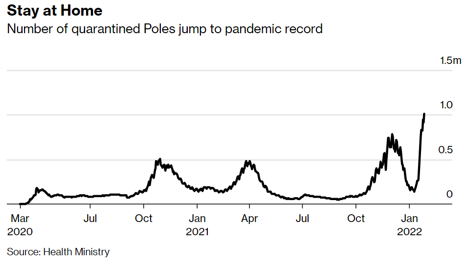
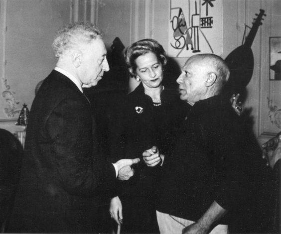
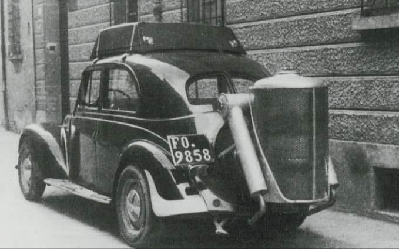
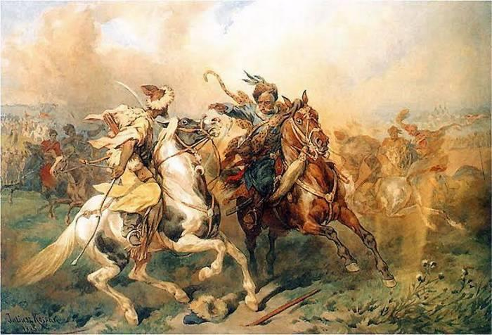

### 2022

// Czy celem jest 38mln?

Liczba osób przebywających na kwarantannie przekroczyła ostatnio milion, a nie wszyscy mogą pracować zdalnie. W jakimś stopniu to będzie oddziaływać na gospodarkę (w jakim?), a perspektywa na luty nie jest lepsza.

  

Trzeci rok z rzędu Państwo nie wypełnia obowiązków i zamyka szkoły rujnując edukację naszym dzieciom. Wszystko działa poza szkołami…to jest ostatni moment na to aby dzieci wróciły do normalnej stacjonarnej nauki. W innym przypadku nie bedzie co zbierac za 10-15 lat! Czy w ktoryms europejskim Panstwie szkoly rowniez zostaly zamkniete ? Jak najszybciej odsunac tych ludzi od decydowania o przyszlosci dzieci.

---

2024 r. nastąpi uwolnienie cen gazu dla ostatniej kategorii odbiorców objętych taryfowaniem – gospodarstw domowych. Politycy i przedstawiciele PGNiG zapewniają, że uwolnione ceny wcale nie muszą automatycznie poszybować w górę. Wszystko jednak zależy po prostu od tego, jak drogi będzie gaz na rynkach. Z tym może być niestety różnie.

---

Jan 28 (Reuters) - Bank of America economists said on Friday that they expect the Federal Reserve to hike rates by 25 basis points seven times this year, beginning in March, adopting one of the most aggressive views on Fed tightening among major banks.

---

Doradcy podatkowi nazywają ją "królową innych ulg". Umożliwia odliczenie od dochodu 500 tys. zł rocznie, a nawet i więcej. Wyjaśniamy, jak działa ulga na zabytki, zwana także "Pałacykie plus".

"Nie zajmujmy się jakąś groszową ulgą dla klasy średniej, skoro mamy 'Pałacyk plus'" – napisała w swoim poście w serwisie LinkedIn doradczyni podatkowa Jowita Pustuł. Chodzi o ulgę na zabytki zawartą w Polskim ŁadzieNowe rozwiązania podatkowe wprowadzają w ustawie PIT ulgę z tytułu wydatków ponoszonych na ochronę i konserwację zabytków. Co daje ulga? Odpowiedź na to pytanie znajdziemy w poście Jowity Pustuł.
"Musisz kupić jakiś dworek lub pałacyk. Cokolwiek. Ważne żeby był wpisany do rejestru zabytków. Następnie wydajesz coś na roboty budowlane, renowację lub konserwację. Nie trzeba dużo. Wystarczy 1 zł" – wyjaśniła doradczyni.
Ile odliczysz od dochodu?
"Odliczasz poniesiony wydatek na nabycie pałacyku, nie więcej niż 500 zł za każdy 1m2 powierzchni użytkowej. Maksymalnie 500 tys. zł rocznie. Dodatkowo odejmujesz 50 proc. wydatków poniesionych na usługi budowlane, renowację, czy konserwację. Tu nie ma limitu. Wydasz 2 mln – odliczysz 1 mln. Wydasz 6 mln – odliczysz 3 mln. Sky is the limit. Dzięki 'Pałacyk plus' możesz obniżyć swój dochód do zera i nie płacić PIT. Przy innych ulgach np. rehabilitacyjnej jest limit (odliczenie - max 6 proc. dochodu), ale 'Pałacyk plus' nie ma limitu. Pałacyki są ważniejsze od niepełnosprawnych. To dlatego" – napisała Pustuł.

---

Robert Oleniacz, ZWOLNIONY ratownik medyczny UJAWNIA szokujące kulisy działań lekarzy! [WIDEO]

– Nazywam się Robert Oleniacz. Jestem ratownikiem medycznym i pracuję w zawodzie od stycznia 2012 roku. Celem mojego działania jest zarówno tutaj, jak i w pogotowiu ratunkowym zachowanie jak największej liczby jednostek przy życiu. Fakty, które przedstawię poniżej występują wyłącznie z moich obserwacji – mówi o sobie i o zaistniałej sytuacji Robert Oleniacz.

  

---

### 2021

  

### 1945

Podczas uroczystości podpisania Karty Narodów Zjednoczonych, dokumentu założycielskiego ONZ w San Francisco, Artur Rubinstein oburzony brakiem polskiej flagi, zmienił program koncertu. "Zagram hymn narodu, którego przedstawicieli tu nie ma, ale który pierwszy chwycił za broń i przeciwstawił się złu" - po wypowiedzeniu tych słów ze sceny wykonał "Mazurka Dąbrowskiego". Wielka Brytania i USA nie zaprosiły przedstawicieli polskiego rządu na uchodźstwie, ponieważ obawiały się reakcji ZSRR.
28 stycznia 1887 r., w Łodzi urodził się Artur Rubinstein, wirtuoz fortepianu, miłośnik cygar, patriota oraz znakomity artysta. Jego największą, życiową pasją była muzyka. Poświecił jej całe swoje życie i to ona uczyniła go wzorem do naśladowań dla wielu pokoleń muzyków. Pianista, zaliczany do najwybitniejszych muzyków XX w., wystąpił na scenie ok. 6 tys. razy. Koncertował w najważniejszych ośrodkach muzycznych całego świata. Propagował muzykę polską, zwłaszcza Fryderyka Chopina i Karola Szymanowskiego. Mawiał; "Kocham mój kraj rodzinny, ale jest to miłość, która nie ma nic wspólnego z nacjonalizmem czy szowinizmem. Małą część życia spędziłem w kraju, ale wszystko, co polskie, ma dla mnie nieodparty urok i często przyprawia mnie o nostalgię. Źródłem tego może być coś, co nazwałbym autentycznością. Pory roku na przykład są tu autentyczne, nie ma mowy o pomyłce, są tym, czym powinna być symfonia, czterema częściami, idealnie ze sobą zharmonizowanymi. Nie ma żadnego pomieszania, każda pora przeżywa swój krótki żywot, osiągając pełnię właściwego dla niej piękna".

 

### 1941

Na warszawskie ulice wyjechały pierwsze taksówki z napędem drzewnym wyposażone w tak zwane gazogeneratory wytwarzające paliwo nazywane określeniem holzgaz. Pojawienie się tych pojazdów było efektem znacznego braku benzyny spowodowanego jej  wzmożonymi dostawami na front. Taksówki te opalane były zwykle drewnem bukowym, z którego na skutek destylacji rozkładowej pozyskiwano gaz napędzający dowolnie przerobiony samochód. 
Jednym z przykładów takiej taksówki jest Mercedes 170 VG, który zużywał 15 kilogramów drewna na 100 kilometrów przy zapasie 30 kg drewna. 
Eksploatacja tych aut przysparzała jednak dosyć dużo problemów, głównie ze względu na to, iż często należało usuwać smołę, a także, że w pojazdach, których silnik powinien dysponować elastycznością w zakresie dysponowanej mocy i obrotów, a generator mający pewną bezwładność w swoim cyklu pracy produkował gazu bądź za mało, bądź za dużo. Do tego dochodził problem rozpalania, a w momencie zatrzymania silnika należało produkowany gaz bądź spalić poza silnikiem, bądź wypuścić do atmosfery.

  

### 1606

Zwycięstwo wojsk polskich pod wodzą hetmana Stanisława Żółkiewskiego nad Tatarami w bitwie nad Udyczem.

"Dwudziestego ósmego stycznia nad rzeką Udycz (lewy dopływ Bohu) pojawili się skośnoocy zwiadowcy, znacząc drogę pochodu pożarami i dymami; za nimi ciężko sunął obładowany jasyrem i bydłem tabor. Tatarzy z bogatymi łupami wracali do swych ułusów. Wiedzieli, że niedaleko gdzieś kręci się Żółkiewski, który już od pewnego czasu szedł równolegle do trasy pochodu Tatarów. Usiłował robić to skrycie, by Tatarzy nie zorientowali się w liczebności i zamiarach jego armii. Prócz łupów pohańcy ciągnęli za sobą istny ogon smrodu, gdyż prawdziwy Tatar był myty tylko trzy razy w dzieciństwie; potem kąpiel zastępowało mu przebywanie rzeki w bród. Był trzaskający mróz, słońce świeciło jasno, skrząc się złotem na niezmierzonych śnieżnych stepach. Zwiadowcy tatarscy, posuwając się z wolna w różnych kierunkach, zerkali podejrzliwie na pokryte czapami śniegu dąbrowy, ale i tam zdradliwe promienie słońca nie błysnęły na pancerzach, szyszakach czy obnażonych mieczach. Uspokojeni ruszyli dalej. Jednak, kiedy kosz nadciągnął nad Udycz, z dąbrowy sprawnie, „cudnym idąc porządkiem", wyszły chorągwie polskie. Pozostanie zagadką, jak swe kilkutysięczne wojsko hetman zdołał zamaskować przed mistrzami walki w stepie. Krążąc zwinnie między hufcami, wzorowo sformował on silne skrzydła; środek zajął tabor uformowany w sześć rzędów. Pierwsze uderzyło skrzydło prawe, „książęce" — Ostrogskich, Różyńskiego, Zbaraskiego. Związało ono walką przeważającą część Tatarów i wtedy hetman "pchnął lewe skrzydło starosty chmielnickiego Mikołaja Strusia. Zaskakujące uderzenie z boku rozwiniętych szyków polskich było tak gwałtowne, że Tatarzy zdołali tylko raz wypuścić strzały z łuków, po czym, nadal oskrzydlani przez hufiec Mikołaja Strusia, zawrócili. Wbrew tatarskim metodom symulowanej ucieczki, ta była bezładna: na przestrzeni paru mil zasieczono kilku murzów i kilkuset ordyńców; jeńców nie brano. Tysiące nieszczęśnic i nieszczęśników z niedawnego jasyru padało na śnieg ze łzami w oczach do kolan wybawicielom i hetmanowi w serdecznej podzięce, dwa tysiące krępych, niezwykle wytrzymałych, choć niedużych koni, bachmatów, wracało do właścicieli bądź — o wiele częściej — wpadało w ręce zdobywców. Wprawdzie Żółkiewski odniósł swe najświetniejsze zwycięstwo nad Tatarami mając przewagę sił, ale wydawało się, że wreszcie znalazł fortel na skuteczną walkę z ordą na większą skalę." Jerzy Besala - Stanisław Żółkiewski

 

---

<a href="https://github.com/TomaszWaszczyk/historia.waszczyk.com/edit/master/src/content/january-28.md" target="_blank">Edytuj tę stronę dzieląc się własnymi notatkami!</a>
