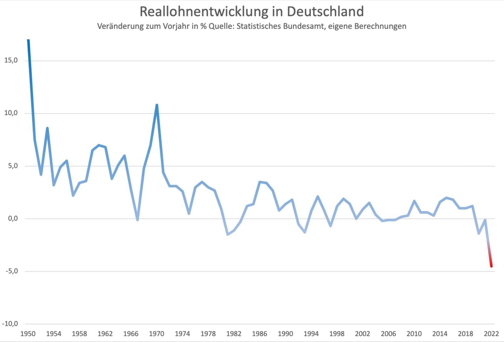
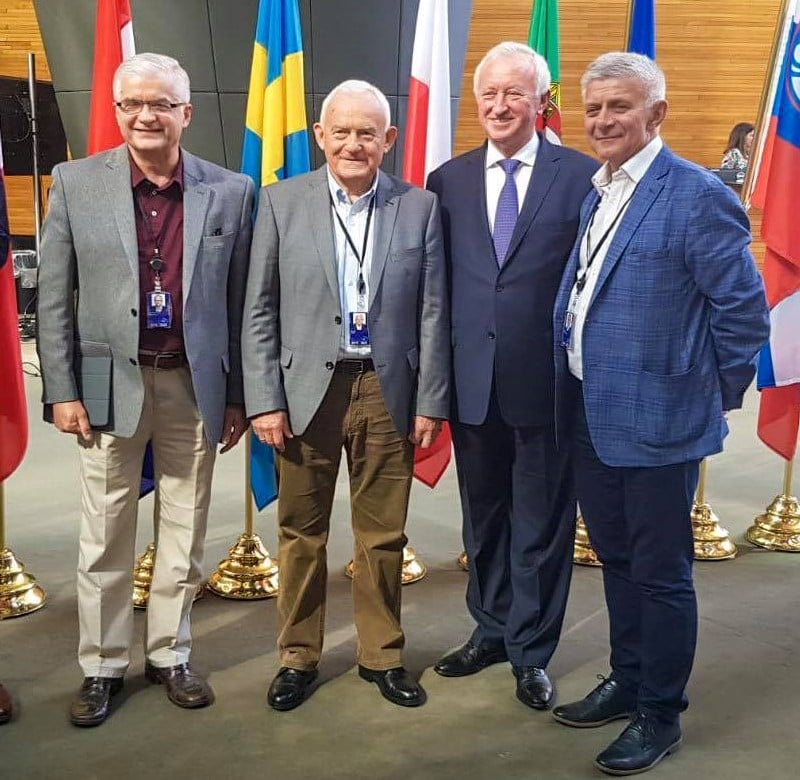

### 2024

<video width="640" height="480" controls>
<source src="./movies/january/german-death-camps.mp4" type="video/mp4">
Your browser does not support the video tag.
</video>

### 2023

Change in real wages in Germany (year-over-year in %). Never in German post-war history have wages lagged so far behind inflation.

  

Harvard Prof. Kenneth Rogoff sieht Deutschland vor einer Wirtschaftskrise. Die Frage sei nur, wie groß sie ausfallen werde. Der Krieg in der Ukraine werde uns weiter belasten, die Inflation geht nicht einfach weg, das Zurückdrehen von Sozialreformen via Bürgergeld sei kontraproduktiv. Rogoff: „Der Staat muss endlich auf Diät, muss weniger Geld ausgeben und die Steuern für Unternehmen und Bürger senken.“

Die Ampel muss dringend handeln, Konjunktur-Optimismus ist unangebracht! Die Regierung muss für bezahlbare und verlässliche Energie sorgen, KKW laufen lassen, die Taschenspielertricks in der Haushaltspolitik einstellen und Bürokratielasten senken. Damit Rogoff nicht Recht behält.

---

🚨Dług Polski wzrośnie na koniec roku o blisko 850 mld zł. Co godzinę zadłużamy się o 12 mln zł. I tak 24 godziny na dobę.

---

### 2022

Ojciec Rydzyk: Zaszczepiłem się trzy razy. Posłuchałem lekarzy

Na sympozjum „Oblicza pandemii”, organizowanym przez należącą do Fundacji Lux Veritatis uczelnię w Toruniu, ojciec Tadeusz Rydzyk wyznał, że przyjął trzy dawki szczepionki przeciw COVID-19. - Ja posłuchałem lekarzy. Już znałem takich, co nie słuchali lekarzy. Wąchają kwiatki od spodu - tłumaczył.

  

### 2021

W 2007 roku minister pracy w rządzie Angeli Merkel – Franz Müntefering określi fundusze hedge mianem szarańczy – wyszukują ofiarę, pożerają i szukają następnej. Od wielu lat, krótka sprzedaż nie ma dobrej passy, a tych, którzy koncentrują się na zarabianiu w dzięki tej technice traktuje się jako najgorszy rodzaj spekulanta. Dzięki instrumentom dostępnym na rynkach, zerowym prowizjom drobni postanowili rozprawić się z „szarańczą”. Pozostając w tej terminologii wygląda na to, że szarańczę zaatakowały jakieś mniejsze organizmy – pasożyty lub bakterie. I świetnie się przy tym bawią. Albo jak w animowanym filmie “Dawno temu w trawie” (A Bug’s Life, 1988) to małe mrówki zbuntowały się przeciw wykorzystywaniu je przez koniki polne. Wystarczyło się tylko zorganizować.
Możemy się na to oburzać, ale przecież na rynku zaistniała taka możliwość. Traderzy od setek lat szukają nowych możliwości. Często na granicy prawa, często prawo jest zmieniane dopiero po urealnieniu się jakichś kłopotów. Jedni grają przeciwko innym, wykorzystując ich błędy, wiedzę o technikach, czy posiadanych pozycjach. Rynek się zmienia i zmienia.

  

---

>> Młode, wykształcone, oświecone, z dużych miast.

  

---

> Czy wiesz że za równoważnik 380PLN w 1990 trzeba było pracować na minimalnym wynagrodzeniu ponad 10 miesięcy? Dziś niecałe 3 dni.

Tak, w 1990r można było kupić dobra o wartości rynkowej 10 miesięcznych minimalnych wynagrodzeń, dziś zaś o wartości rynkowej 3 dni pracy na tym wynagrodzeniu. Uwzględniając deflacyjny charakter rozwijającego się rynku to przy stałej ilości pieniądza rozbieżność powinna być w drugą stronę co jeszcze bardziej uzmysławia skalę odbierania użytkownikom waluty ich wypracowanych owoców pracy przez emitenta waluty.

---

> W 2020 r. w Polsce zmarło najwięcej ludzi od czasów II wojny światowej, a na świat przyszło najmniej dzieci od ponad 15 lat - wynika z szacunków GUS. Liczba ludności Polski zmniejszyła się najmocniej od siedmiu dekad.

Polsko! lecz ciebie błyskotkami łudzą!

Pawiem narodów byłaś i papugą;

A teraz jesteś służebnicą cudzą —

Choć wiem, że słowa te nie zadrżą długo

W sercu — gdzie nie trwa myśl nawet godziny:

Mówię — bom smutny — i sam pełen winy!

...

O Polsko! póki ty duszę anielską

Będziesz więziła w czerepie rubasznym;

Póty kat będzie rąbał twoje cielsko,

Póty nie będzie twój miecz zemsty strasznym!

Póty mieć będziesz hienę na sobie —

I grób — i oczy otworzone w grobie.

---

### 2004

  

Pan od przedsiębiorczości

Nie tylko wrażliwi miłośnicy literatury wiedzą kim w Polsce jest „Pan od poezji”. A kim jest „Pan od przedsiębiorczości”? Profesor Wacław Wilczyński napisał o Nim, że „jest swoją spuścizną bardziej żywy niż wielu żyjących”. Mimo, że nie ma go na tym świecie od 29 stycznia 2004 roku, to jego myśli „są w całej pełni aktualne swą doniosłością intelektualną”. Jakie zatem Jego myśli skłoniły W. Wilczyńskiego, ucznia Edwarda Taylora do napisania wstępu do „Krótkiego kurs ekonomii praktycznej”, który określił jako „Krótki kurs logicznego myślenia”? Bez wątpienia była to rzadko spotykana umiejętność połączona z błyskotliwą inteligencją, przenikania do sedna spraw i widzenia ich takimi, jakimi są naprawdę. W myśleniu o wolności, przedsiębiorczości i gospodarce nie miał sobie równych. Precyzja wywodu, a jednocześnie lekkość w jaki go przedstawiał czyniła z niego godnego następcę Stefana „Kisiela” Kisielewskiego. Obaj byli żarliwymi obrońcami przedsiębiorczości i wolności, wręcz apologetami tych wartości, które czynią pod tym względem polski naród wyjątkowym. „Wolność w tym wypadku, czyli wolność gospodarcza dzisiaj w Polsce oznacza prawo do wykorzystywania swoich talentów i umiejętności w służbie społeczeństwu i innym ludziom. Oczywiście, tak rozumianej wolności w Polsce brakuje” - gorzko konstatował w 2002 roku Pan od przedsiębiorczości.

Jego intelektualne życie to bezpardonowa walka ze stereotypami, które wskazuje swoim adwersarzom: „Autor pada tu ofiarą najpotężniejszego stereotypu współczesnej ekonomii, stereotypu biorącego swój początek w teorii Johna Maynarda Keynesa’a głoszącego za mistrzem, że popyt jest spiritus movens wszelkiej ludzkiej aktywności”.

Nieustannie podkreślał i przypominał, że fałszywa historia jest mistrzynią fałszywej oraz, że „idee mają konsekwencje”. Dzieło pod tym tytułem autorstwa Richarda M. Weavera było jednym najbardziej cenionych przez Niego traktatów. Sparafrazował jego tytuł, że również i „podatki mają konsekwencje”. Było to hasło, którym zapoczątkował w 1994 roku w Centrum im. Adama Smitha „Dzień Wolności Podatkowej”, chcąc zwrócić uwagę na rosnące już wtedy opodatkowanie, zwłaszcza pracy, co skutkowało koniecznością pracy statystycznego Polaka przez pół roku na opłacenie wszystkich podatków. Analizował je nieustannie wykazując daleko idące skutki, wręcz deformacje dla pracy i moralności w Polsce podnosząc, że „prawo do pracy - prawo do realizacji ludzkiego powołania - pozwala na pełne uczestnictwo jednostki w życiu społecznym; to praca właśnie nadaje jednostce społeczny wymiar. Prawo do pracy jest pierwszą i najważniejszą wolnością gospodarczą - wolnością ludzi biednych”. Nie zgadzał się, przede wszystkim z powodów moralnych na nałożenie na pracę tak wysokich podatków jak na papierosy, wódkę i paliwa. Swoista „akcyza na pracę” według przedstawianych przez Niego analiz była głównym powodem dramatycznego bezrobocia, którego źródłem były „mechanizmy ekonomiczne to w naszym przypadku przede wszystkim patologiczny system dochodów publicznych nakładający na pracę obciążenia nie do udźwignięcia”. Nie godząc się na bezradność intelektualną i organizacyjną polityków z dramatem bezrobocia, zainicjował przygotowanie projektu całościowej zmiany systemu podatkowego oraz zmiany finansów publicznych pod nazwą „Ustawy o likwidacji bezrobocia”. Organizacje obywatelskie zebrały pod nim w 2004 r. 100 tys. podpisów. Niestrudzenie walczył o prawo do pracy dla obywateli, aby nie musieli emigrować oraz dla najmniejszych przedsiębiorców, których z nieustającą rewerencją określał „planktonem gospodarczym”.

Zanim tuzy polskiej ekonomii „odkryły kulturę”, recenzując w 1998 roku książkę Ojca Macieja Zięby „Papieże i kapitalizm” zauważył, że „ekonomia jest bowiem jednym ze składników kultury, a obie są od siebie wzajemnie zależne i powinny pozostawać ze sobą - posługując się językiem profesora Feliksa Konecznego - w stosunku współmierności. Upadek jednej z nich musi za sobą pociągnąć klęskę drugiej”.

Krzysztof Dzierżawski pozostawił po sobie głębię myśli, z której pokolenia mogą czerpać wzory logicznego myślenia i analizowania jak u Fryderyka Bastiata, którego był gorącym w Polsce orędownikiem.

### 1990

Na XI Zjeździe PZPR przyjęto uchwałę o zakończeniu działalności partii.🤔 Dziś byli komuniści śmieją się w twarz prawdziwym działaczom Solidarności, którzy umierają w zapomnieniu i biedzie.

  

Ełroposłowie.

### 1982

1982 roku rząd Polskiej Rzeczypospolitej Ludowej przedstawił sekretarzowi generalnemu Organizacji Narodów Zjednoczonych Javierowi Perez de Cuellarowi przyczyny wprowadzenia w życie klauzuli derogacyjnej ( unieważniającej przepisy obowiązujące w Polsce przed wprowadzeniem stanu wojennego). W uzasadnieniu napisano " ze względu na zagrażającą wojnę domową, ekonomiczną anarchię, destabilizację państwa i struktur społecznych, w celu ochrony najwyższego interesu narodowego."
Zdjęcie; Wojciech Jaruzelski w czasie wystąpienia forum, w czasie którego wysunął propozycję opracowania studium o następstwach militaryzacji przestrzeni kosmicznej.

### 1949

1949 roku w Warszawie na karę śmierci został skazany Josef Grzimek (zdjęcie) zbrodniarz nazistowski, SS-Hauptscharführer, komendant kilku hitlerowskich obozów pracy na terytorium okupowanej Polski, jako dowódca ukraińskiej kompanii strażniczej w obozie w Szebniach odpowiedzialny za egzekucje na terenie lasu w Dobrucowej, w których zginęło przez rozstrzelanie około 1600 osób. Kierował również akcją palenia ciał ofiar na specjalnych rusztach zbudowanych z torów kolejowych. Wyrok przez powieszenie wykonano 18 lutego 1950 roku.

W książce "Dziewczynka w zielonym sweterku" wspominała go Krystyna Chiger:
> Naszymi wejściami i wyjściami zaczął wkrótce zawiadywać straszny człowiek, nazywał się Josef Grzimek. Untersturmführer SS, przydzielony do lwowskiego getta. Ten człowiek decydował o naszym życiu i śmierci jako dobrze znany fachowiec od likwidacji. To była jego specjalność (...) Jego szaleństwo wywoływało lęk. Grzimek był gorszy od mordercy, wręcz obłąkany. Nigdy nie dało się przewidzieć, co zrobi. Strzelał do człowieka bez powodu, zmieniał zdanie bez powodu. Zabijał nawet dzieci. Jakże on nienawidził żydowskich kobiet i dzieci, a zwłaszcza "brudnych żydowskich dzieci ".

  

### 1943

W warszawskim getcie w wieku 63 lat zmarła Salomea Kempner (zdjęcie)polska lekarka żydowskiego pochodzenia, specjalistka w dziedzinie psychoanalityki.
Pochodziła z Płocka. Była absolwentką Wydziałów Medycznych Uniwersytetów w Bernie, Krakowie i Zurychu. Tytuł doktora medycyny uzyskała w roku 1909. W latach 1912-1921 pracowała w Kantonalnym Zakładzie Psychiatrycznym w Rheinau. Była członkinią Szwajcarskiego Towarzystwa Psychoanalitycznego oraz Wiedeńskiego Towarzystwa Psychoanalitycznego. W latach 1923- 1939 pracowała w Berlińskim Instytucie Psychoanalitycznym. Była między innymi współautorką polskiego tłumaczenia "Wstępu do psychoanalizy" Zygmunta Freuda.

  

### 1916

Poniższy tekst to fragment notatki z Dziennika "Godzina Polska" z dnia 29 stycznia 1916 roku, odnoszącej się do rozpoczętej 5 sierpnia 1915 roku akcji derusyfikacji Warszawy:

"Zarząd Towarzystwa Literatów i Dziennikarzy Polskich postanowił wystąpić z inicjatywą zmiany nazw ulic Warszawy, na których pozostało narzucone, niechętnie przez ludność widziane piętno pochodzenia rosyjskiego. W tym celu podjęto akcję przeprowadzenia przedsięwzięcia w duchu narodowym i zgodnie z dawnymi tradycjami miasta".

  

### 1912

1912 roku w Kaliszu urodził się Mieczysław Kościelniak, malarz, grafik, rysownik, uczestnik polskiej wojny obronnej 1939, działacz ZWZ, więzień niemieckich obozów koncentracyjnych: Auschwitz, Mauthausen-Gusen, Melk, Ebensee, żołnierz III Armii USA gen. Pattona, a także świadek w procesie beatyfikacyjnym o. Maksymiliana Kolbe.
Pan Mieczysław zaprzyjaźnił się z ojcem Maksymilianem w trakcie pobytu w Auschwitz. Ojciec Maksymilian wyznał mu w tajemnicy: „Ja nie przeżyję obozu, ty go przeżyjesz, ale pamiętaj, że będziesz miał obowiązek jako artysta przekazać to całe piekło obozowe światu”. „Widząc to piekło, postanowiłem malować wszystko, co przeżywałem, ale to było szaleństwo! Skąd wziąć papier, ołówek? Kieszeni nie było w ubraniach, karano za to. Czasem, gdy przyniesiono na apel chorych i umierających, esesman Fitze chwytał leżący pod ścianą kilof i dziurawił nim konających. Tych scen i ich grozy nigdy nie zapomnę! (...) Do olbrzymiego żelaznego walca wypełnionego betonem zaprzęgano ośmiu więźniów, głównie Żydów i księży. Bywało, iż słaby więzień pod wpływem ustawicznego bicia padał, walec miażdżył go. Trudno mi to wspominać, to było straszne - ten «plaster» krwawy oblepiony na walcu, czerwony od krwi. (...) Pracowałem potem w żwirowni i tam zabijano słabych ciężkim stołkiem lub zadeptywano butami. Udało mi się narysować tę scenę i przemycić do rodziny. Miałem już kilka rysunków. Ołówek i papier dostarczył mi kolega pracujący w obozowej kancelarii”. - wspominał niegdyś Mieczysław Kościelniak. Artysta stworzył blisko 300 rysunków ukazujących ogrom bestialstwa w KL Auschwitz. Obecnie prace artysty znajdują się w Państwowym Muzeum Auschwitz-Birkenau. Mieczysław Kościelniak zmarł w 1993 roku w Słupsku. Pochowano go na cmentarzu w Ustce.

  

### 1655

To rocznica jednej z najkrwawszysz bitew polsko - rosyjskich. To rocznica bitwy pod Ochmatowem. Odbyła się ona w 1655 roku. 20 tysięczna armia polska dowodzona przez hetmanów ; Stanisława Potockiego i Stanisława Lanckorońskiego z pomocą 15 tysięcy Tatarów krymskich pokonała ponad 50 tysięczną armię rosyjsko - kozacką dowodzoną przez Bohdana Chmielnickiego i rosyjskich wojewodów Wasyla Szeremietiewa i Wasyla Buturlina . Poległo 9000 Rosjan, zdobyto 30 armat, lecz wskutek siarczystego mrozu Polacy musieli przerwać operację.

---

<a href="https://github.com/TomaszWaszczyk/historia.waszczyk.com/edit/master/src/content/january-29.md" target="_blank">Edytuj tę stronę dzieląc się własnymi notatkami!</a>
