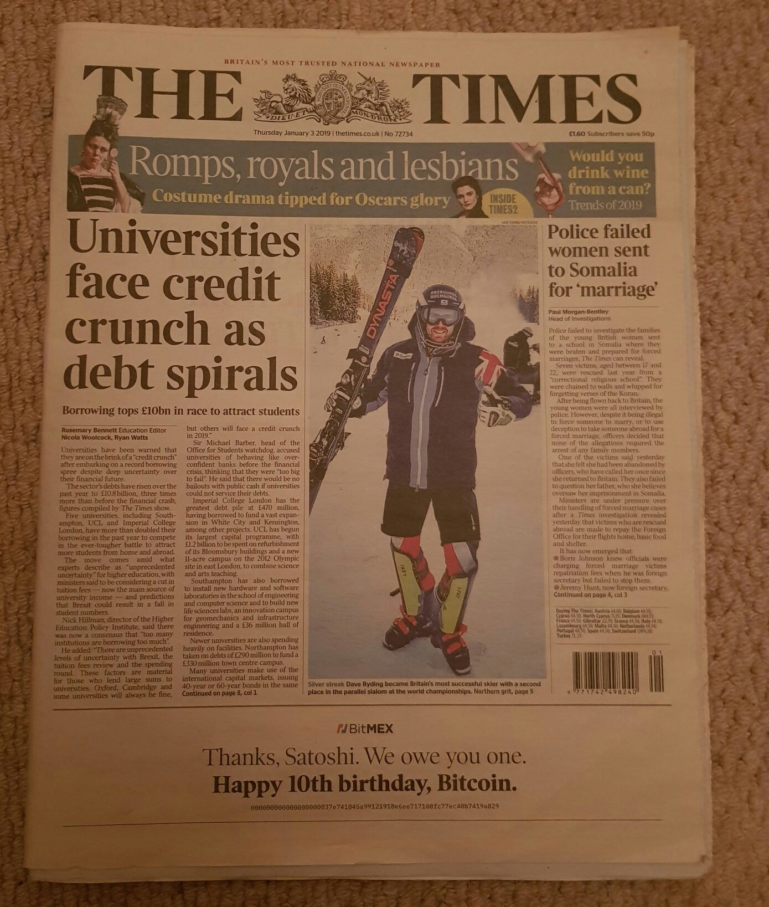
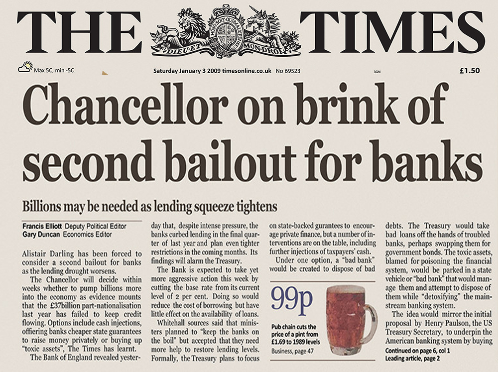
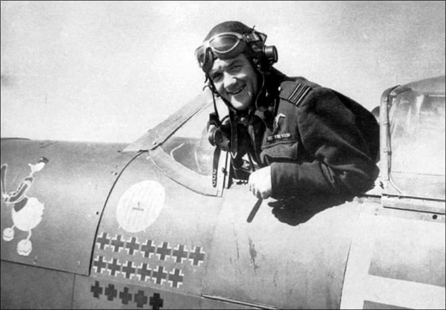
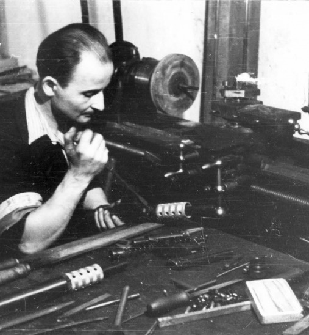
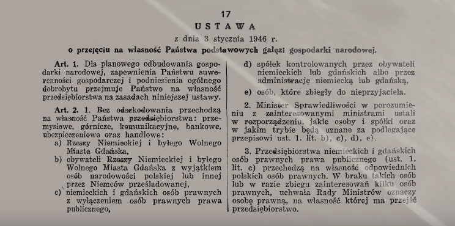
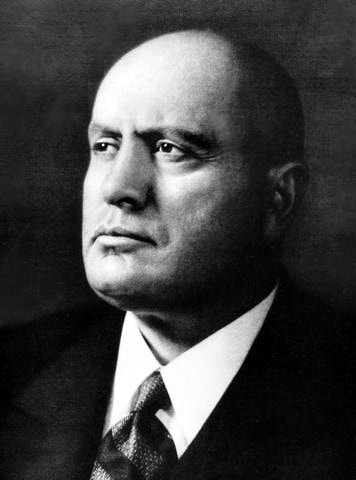
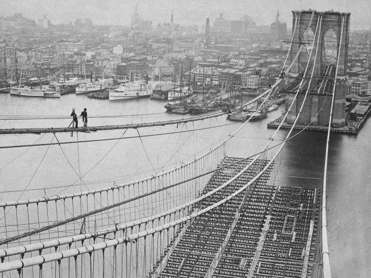
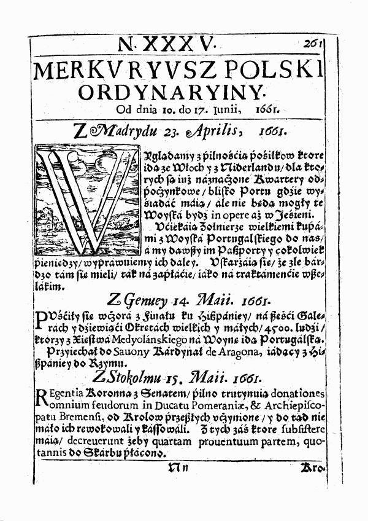

### 2021

## Waluty wirtualne zmienią sposób otrzymywania wynagrodzeń?

Polski Instytut Ekonomiczny ocenia, że od przyszłego roku będą trwać wzmożone prace nad walutami wirtualnymi, które zaoferują banki centralne. Analitycy uważają, że może to zmienić sposób otrzymywania wynagrodzeń. Część środków może być wypłacana w formie cyfrowej.

Eksperci Polskiego Instytutu Ekonomicznego zwrócili uwagę, że banki centralne motywują wprowadzenie waluty cyfrowej (Central Bank Digital Currency - CBDC) brakiem kontroli nad utrzymaniem wartości pieniądza oraz brakiem nadzoru, które występują w przypadku walut prywatnych (kryptowalut).

"W założeniach, CBDC ma działać jak banknot cyfrowy, a jednocześnie stanowić nowe narzędzie polityki pieniężnej" - wyjaśnili analitycy w najnowszym wydaniu "Tygodnika Gospodarczego PIE". Dodali, że w odróżnieniu od sald na tradycyjnych rachunkach bankowych, CBDC funkcjonuje jedynie w formie wirtualnej - nie będzie możliwa jego wymiana na gotówkę.

---

> Pierwsze znaki, że rzeczywiście dzieje się dobrze, będziemy mieć około końca maja, początku czerwca. Na pewno będzie to najpierw widoczne w liczbie zgonów, która zdecydowanie zmaleje. Zmaleje też oczywiście liczba hospitalizacji - powiedziała we "Wstajesz i weekend" epidemiolog profesor Maria Gańczak.

---

### 2019

  

### 2009 - The revolution has started

 

> “The Times 03/Jan/2009 Chancellor on brink of second bailout for banks”

  

  

> The desirable goal of reforming the international monetary system is to create an internation reserve currency that is disconnected from individual nations and is able to remain stable in the long run, thus removing the inherent deficiencies caused by using credit-based national currencies. - Dr Zhou Xiaochuan, Governor of the Poeple's Bank of China

> The central issue is we’re developing into a plutocracy,” he told me. “We’ve got an enormous number of enormously rich people that have convinced themselves that they’re rich because they’re smart and constructive. And they don’t like government, and they don’t like to pay taxes.

3 stycznia 2009 roku został utworzony pierwszy blok (genesis) w sieci Bitcoin. Blok genesis ma znacznie symboliczne, jest symbolem suwerenności monetarnej oraz ucieleśnieniem filozofii Satoshi’ego, gdzie odrzuca się scentralizowaną politykę systemu fiducjarnego na rzecz zdecentralizowanej kryptowaluty.

Nieprzypadkowa jest też data utworzenia pierwszego bloku BTC, który powstał w szczytowym okresie globalnego kryzysu finansowego. Wiadomość wbudowana w kod szesnastkowy bloku bazowego po rozszyfrowaniu brzmi: “The Times 03/Jan/2009 Chancellor on brink of second bailout for banks.”

Powyższa wiadomość odnosi się do nagłówka artykułu w The Times z dnia uruchomienia Bitcoina. Ówczesny kanclerz skarbu Wielkiej Brytanii toczył wtedy debatę nad drugim dofinansowaniem dla banków z Wielkiej Brytanii, które ucierpiały w wyniku kryzysu finansowego.

Satoshi Nakamoto posiadał wiedzę na temat tego, co dzieje się w polityce pieniężnej i jakie zagrożenia dotyczą gospodarek opartych o waluty fiducjarne. Praktyki banków centralnych oraz banków krajowych i prywatnych, które doprowadziły do kryzysu finansowego uznał za zagrożenie zarówno dla zaufania klientów i jak i wyceny tradycyjnych, o czym wspominał w poście z lutego 2009 roku.

### 1986

W Paryżu zmarł Jan Zumbach ps. ,,Kaczor Donald'' - podpułkownik pilot, as Polskich Sił Powietrznych na obczyźnie zajmujący 6 miejsce na ,,liście Bajana'' z dorobkiem 12 i 1/3 zniszczonych samolotów wroga, uczestnik walk we Francji, bitwy o Anglię, dowódca dywizjonu 303 i 133-go Skrzydła Myśliwskiego. Odznaczony Srebrnym Krzyżem Virtuti Militari, 4-krotnie Krzyżem Walecznych i 2-krotnie brytyjskim Zaszczytnym Krzyżem Lotniczym.

Więcej o Janie Zumbach

To nie przypadek, że w obu filmach o Dywizjonie 303 najwięcej uwagi poświęcono Janowi Zumbachowi. Był doskonałym pilotem, dał się też zapamiętać jako niespokojny duch i bawidamek. Po wojnie prowadził życie awanturnika.

O tym, aby opowiedzieć na ekranie niezwykłą historię polskich lotników, którzy wsławili się bohaterską obroną powietrzną Anglii, w 1940 roku, myślało wielu reżyserów i to od lat. Ale dopiero niedawno, w sierpniu na ekranach kin pojawiły się dwa filmy na ten temat: „303. Bitwa o Anglię” oraz „Dywizjon 303”. Pierwszy film to międzynarodowa, superprodukcja barwnie opowiadająca historię legendarnych, polskich lotników z Dywizjonu 303, w ciekawej obsadzie, gdzie Jana Zumbacha zagrał Iwan Rheon znany z filmu „Gra o Tron”, a w postać Johna Kenta, pułkownika Królewskich Sił Powietrznych, wcielił się Milo Gibson (syn Mela Gibsona). Dorociński zagrał pilota Witolda Urbanowicza.

Drugi film to produkcja polska, zrealizowana na podstawie znanej nam książki Arkadego Fidlera „Dywizjon 303”, gdzie w rolach głównych możemy zobaczyć m.in. Piotra Adamczyka i Macieja Zakościelnego.

Haniebna parada:

Postać Jana Zumbacha, legendarnego Dowódcy 303, nie jest papierkowa, ani bez skazy i to czyni jego osobę charyzmatyczną i bliższą sercu. As polskiego myślistwa: 13 zestrzeleń niemieckich samolotów! Za niezwykłe bohaterstwo polski lotnik został odznaczony najwyższymi odznaczeniami państwowymi Anglii. Prasa brytyjska rozpisywała się na temat fenomenalnej polskiej „załogi” z 303.

Niestety po wojnie bardzo duże kontrowersje wywołała uroczysta parada, gdzie nie zaproszono polskich żołnierzy, którzy walcząc w Polskich Siłach Zbrojnych na Zachodzie byli jedną z najliczniejszych grup po stronie wojsk alianckich. Jedyną polską organizacją bojową zaproszoną do udziału w paradzie, ulicami Londynu byli piloci Dywizjonu 303, którzy mieli maszerować w szeregach RAF, ale nasi odmówili po tym, jak dowiedzieli się, że pozostałe polskie oddziały nie zostały zaproszone na paradę. Nawiązując do tej niehonorowej sytuacji, Winston Churchill, powiedział, m.in. :

Wyrażam głęboki żal, że żaden z oddziałów polskich, które walczyły u naszego boku w tylu bitwach i które przelały swoją krew dla wspólnej sprawy, nie zostały dopuszczone do udziału w Paradzie Zwycięstwa. Będziemy w tym dniu myśleli o tym wojsku. Nigdy nie zapomnimy o ich dzielności ani o ich bojowych wyczynach, które związane są z naszą sławą pod Tobrukiem, Cassino i Arnhem.

Od bohatera do przemytnika:

Niestety też nie zapewniono Polakom godnego życia po wojnie w Wielkiej Brytanii. Polscy lotnicy byli skazani na własne siły. W takiej też sytuacji znalazł się Jan Zumbach i jego koledzy piloci. Dlatego nie dziwi fakt, że po wojnie Zumbach różnymi drogami próbował odnaleźć swoje miejsce i poradzić sobie finansowo. Trudno w to uwierzyć, ale bohater Dywizjonu 303 zajmował się „ciemnymi interesami”: był między innymi właścicielem firmy lotniczej, która zajmowała się również… działalność przemytniczą.

Mało tego, Zumbach walczył też jako najemnik w Afryce, nazywając siebie oficjalnie i nieoficjalnie „Johnny Kamikaze Brown”. Przyjął też niezwykłe w swoim rodzaju wyzwanie: utworzenie lotnictwa w maleńkim państwie Katanga i dowodzenia nim. Zorganizował zakup słynnych samolotów, Douglasów A-26, które stały się podstawą lotnictwa tego afrykańskiego kraju. Zumbach werbował też wśród swoich znajomych i nie tylko, pilotów i mechaników. Lotnictwo Katangi pod jego dowództwem bombardowało siły rządowe Kongo. Ale pod koniec 1962 roku siły działającego w ramach ONZ, zniszczyły większość lotnictwa Katangi.

Życie prywatne Jana Zumbacha:

Po upadku secesji Jan Zumbach uciekł z swoimi polskimi pilotami do Angoli. Po kilku latach Zumbach ponownie powrócił do Afryki, tym razem w związku z propozycją dowodzenia lotnictwem Biafry. Zumbach był dowódcą i brał osobiście udział w nalotach bombowców biafryjskich przeciwko nigeryjskim. Były dowódca słynnego dywizjonu najbardziej został zapamiętany jako osoba, która podczas nalotu na lotnisko w Makurdi, zabiła szefa sztabu armii nigeryjskiej. Niestety secesja zakończyła się klęską. Było to spowodowane różnymi nadużyciami, łapówkami i manipulacjami związanej z bronią i sprzętem wojskowym.

Jan Zumbach zmarł nagle 3 stycznia 1986 we Francji, ale został pochowany na Cmentarzu Wojskowym, na Powązkach w Warszawie. Pozostawił po sobie ślad i legendę nieustraszonego wojownika, dla nas niezwyciężonego dowódcy Dywizjonu 303.

Na premierze filmu „303. Bitwa o Anglię”, pojawił się Hubert Zumbach, syn legendarnego dowódcy Dywizjonu 303, który tak wspominał swojego ojca:

Miałem świadomość od dzieciństwa, że to „narodowy bohater”. Ale dla mnie był po prostu ojcem, który stworzył, po wieloletniej tułaczce i poszukiwaniach, normalny, prawdziwy dom. Ojciec zawsze miał jedno i wielkie marzenie, aby powracać do domu, w którym czekają kochane osoby i często mówił o tym mojej matce: abyśmy mogli wspólnie usiąść do stołu i zjeść obiad. To było dla niego ważne: polska i słowiańska mentalność. Wiem też że ta „legenda” taty, zwłaszcza po wojnie była bardzo skomplikowana, delikatnie ujmując temat. Teraz po latach cieszę się, że m.in. jego postać stała się inspiracją dla powstania tego filmu.

Osiągnięcia lotnicze:

Z wynikiem 12 1/2 pewnych zwycięstw, 5 prawdopodobnych i 1 uszkodzonego samolotu Zumbach zajmuje szóste miejsce wśród polskich asów myśliwskich. Wyprzedzają go jedynie Stanisław Skalski, Witold Urbanowicz, Józef Frantisek (który był Czechem, jednak liczony jest z Polakami ze względu na przynależność do dyonu 303), Eugeniusz Horbaczewski i Bolesław Gładych.

Lista zestrzeleń i uszkodzeń:

10 czerwca 1940 - Bf 109

7 września 1940 - 2 x Do 17

9 września 1940 - 2 Bf 109

11 września 1940 - Bf 109

15 września 1940 - Bf 109

26 września 1940 - He-111 i Bf 109

27 września 1940 - 2 x Bf 109

2 lipca 1941 - Bf 109

13 października 1941 - Bf 109 i Fw-190

24 października 1941 - Bf 109

27 kwietnia 1942 - Fw-190

18 sierpnia 1942 - 2 x Fw-190 i He-111

25 września 1944 - Fw-190

Odznaczenia:

Srebrny Krzyż Virtuti Militari (23 września 1940 roku)

4 x Krzyż Walecznych (styczeń i wrzesień 1941 oraz sierpień i grudzień 1942)

Croix de Guerre

Distinguished Flying Cross (październik 1941 oraz wrzesień 1942).

  

### 1903

W Częstochowie urodził się Seweryn Wielanier (zdjęcie) inżynier, uczestnik Powstania Warszawskiego, współkonstruktor polskiego pistoletu maszynowego "Błyskawica". Był żołnierzem Oddziału IV Kwatermistrzowskiego Komendy Głównej Armii Krajowej, gdzie odpowiadał za koordynację służby sanitarnej, geograficznej, uzbrojenia i intendentury.
Po wojnie zamieszkał na warszawskiej Saskiej Kępie.
Zmarł 23 września 1993 roku.
Wspomniany już pistolet maszynowy "Blyskawica", którego konstrukcja opierała się na bazie bazie zrzutowego pistoletu maszynowego Sten MK II i niemieckiego MP 40 stworzył razem z inżynierem Wacławem Zawrotnym. Do czasu wybuchu Powstania wyprodukowano około 700 sztuk tej broni.

  

### 1946

  

### 1945

Umiera Antoni Ossendowski

### 1925

Benito Mussolini rozwiązał włoski parlament i ogłosił się dyktatorem.

  

### 1911

https://en.wikipedia.org/wiki/Siege_of_Sidney_Street

### 1870

Rozpoczęto budowę Mostu Brooklińskiego w Nowym Jorku.

W Nowym Jorku rozpoczęła się tego dnia budowa mostu wiszącego, który połączył dwie dzielnice miasta oddzielone cieśniną East River - Brooklyn i Manhattan. Budowa przeprawy mającej 1834 m długości i 26 m szerokości trwała aż 13 lat, kosztowała astronomiczną jak na owe czasy sumę 15 mln dol. i pochłonęła życie 27 robotników. Zaprojektowany przez słynnego inżyniera Johna Roeblinga most Brookliński był w chwili powstania największą tego typu konstrukcją na świecie - jego główne przęsło miało 486 m długości (najdłuższe w warszawskim moście Siekierkowskim ma 250 m). Przeprawa, która stała się jednym z symboli miasta, jest konstrukcją stalową, ale najbardziej charakterystyczne są jej oba kamienne pylony z neogotyckimi łukami.

  

### 1863

Komitet Centralny Narodowy podjął decyzję o wybuchu powstania styczniowego z chwilą ogłoszenia branki.

„Branka” czyli pobór polskiej młodzieży do armii carskiej powinien powstrzymać wybuch powstania - uważa hrabia Aleksander Wielopolski, naczelnika rządu Królestwa Polskiego. Tymczasem „branka” stała się zapalnikiem. Komitet Centralny Narodowy, czyli kierownictwo stronnictwa „Czerwonych”, które w przeciwieństwie do szlachecko-ziemiańskiego stronnictwa „Białych” w powstaniu widziało jedyną drogę do niepodległości, 3 stycznia zdecydował, że sygnałem do walki będzie ogłoszenie „branki”. W Warszawie doszło do niej w nocy z 14 na 15 stycznia, ale wielu poborowych uciekło do lasu i stworzyło oddziały partyzanckie. By uprzedzić skutki „branki” na prowincji, KCN wyznacza termin rozpoczęcia walki już na 22 stycznia.

### 1661

W Krakowie ukazało się pierwsze wydanie „Merkuriusza Polskiego”.

Z inicjatywy Ludwiki Marii Gonzagi, żony króla Polski Jana Kazimierza, ukazał się w Krakowie „Merkuriusz Polski”, pierwsza polska gazeta periodyczna, czyli wychodząca cyklicznie. Ukazywała się raz lub nawet dwa razy w tygodniu w nakładzie 100-200 egzemplarzy. Miała od 8 do 12 stron, a kosztowała 12 groszy. Autorami tekstów byli sekretarz królewski, pisarz i dyplomata, pochodzący ze Sieny Hieronim Pinocci oraz pisarz, drukarz i rytownik Jan Aleksander Gorczyn. Dopiero drugi numer ukazał się z przymiotnikiem „ordynaryjny”, czyli pospolity. Gazeta informowała o rodach panujących, wojnach i wydarzeniach politycznych, ale miała też dodatek „Continuazione del Mercurio Polacco” o wydarzeniach w Polsce. Ostatni 41. numer ukazał się 22 lipca 1661 r.

  

---

<a href="https://github.com/TomaszWaszczyk/historia.waszczyk.com/edit/master/src/content/january-3.md" target="_blank">Edytuj tę stronę dzieląc się własnymi notatkami!</a>
