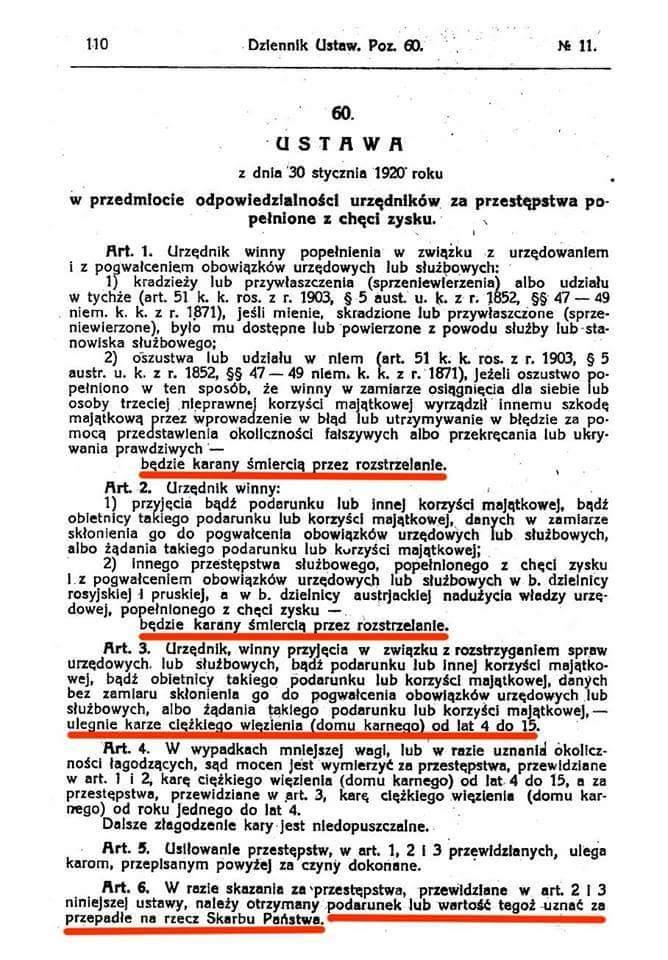

### 2021

Losowa myśl, jedna z dziesiątek: bezdomni w Azji wolą zbierać satoshi za pomocą QR a ludzie tytułującymi się "doktorami" o magistrach już nie wspominając w Europie drwią i śmieszą ich "jakieś tam elektroniczne pieniążki".

Wniosek? Zarobki znacznie przewyższające potrzeby egzystencjalne osłabia 98% populacji i świat zarówno zachodu i wschodu (świat zdenacjonalizowanych koncernów) naprawi to. Już niedługo. Ehh..

---

Myślałem, że tylko członek RPP Łon głosił w swoim uniesieniu patriotycznym tezę o zastąpieniu euro złotym, jako wspólną walutą europejską. Prezes GPW jeszcze aż tak daleko idącej tezy nie głosi, ale kierunek myślenia jest podobny: złoty powinien stać się walutą rezerwową dla wielu innych krajów, a polskie obligacje stanowić cześć rezerw walutowych wielu banków centralnych na świecie. Złotówkę prezes nazywa wręcz jako turbo euro. Tak sobie myślę, by może prezes zaczął wdrażanie tych światłych pomysłów od własnego podwórka: GPW. Na nasz rynek kapitałowy nie garną raczej inwestorzy ze świata, a przydaliby się! Warto czasami w swoim uniesieniu i wizjach skupic się na swoich obowiązkach i zastanowić się, dlaczego od kilku lat nasz rynek kapitałowy nie rozwija się (wbrew trendom światowym). O tym powinien myśleć i tym się zajmować nasz dzielny turboprezes.

## Dlaczego w Polsce nie są prowadzone prace nad cyfrowym środkiem płatniczym? Bo `prawdopodobnie` w dłuższym horyzoncie czasowym waluta ta przestanie istnieć

> The Polish zloty has not lost investors' confidence, it is worth promoting as a reserve currency for other countries, the head of the Warsaw Stock Exchange said on Wednesday.
> Marek Dietl, taking part in the "PAP's Special Guest" programme, said that the Polish zloty "in the short and medium term above all provides a damper for external shocks and freedom to pursue a monetary policy."
> According to Dietl, in the long run, the conclusion from the pandemic crisis is that "the Polish currency has not lost investors' confidence even for a moment," and added that "it seems that this is a good time to promote the zloty as a reserve currency for other countries."

### 2020

https://pl.wikipedia.org/wiki/Brexit

### 1920

  

### 1909

https://pl.wikipedia.org/wiki/Henryk_Magnuski

### 1667

W Andruszowie w województwie smoleńskim Rzeczpospolita i Cesarstwo Rosyjskie podpisały rozejm kończący trwającą od 9 lat wojnę polsko-rosyjską.
W ramach postanowień zawartych w tym poroumieniu Polska odzyskała Inflanty, województwo połockie i witebskie. Straciła natomiast województwo smoleńskie, czernichowskie i zadnieprzańską część województwa kijowskiego razem z jego stolicą, która już nigdy nie wróciła w granice Rzeczpospolitej.
Na zdjęciu Rzeczpospolita w 1667 roku, kolorem ciemnozielonym zaznaczono ziemie
Rzeczypospolitej będące w posiadaniu
Carstwa Rosyjskiego na mocy rozejmu
andruszowskiego.

### 1465

Miała miejsce bitwa pod Rynem na Mazurach - starcie między wojskami krzyżackimi, a miejscowym chłopstwem, które nie godziło się na politykę fiskalną prowadzoną przez władze krzyżackie.
Sprowadzone z Barczewa i Olsztyna wojska krzyżackie krwawo rozprawiły się z oddziałami chłopskimi. Zabito 500 chłopów.
Na zdjęciu zamek w Rynie.

---

<a href="https://github.com/TomaszWaszczyk/historia.waszczyk.com/edit/master/src/content/january-30.md" target="_blank">Edytuj tę stronę dzieląc się własnymi notatkami!</a>
