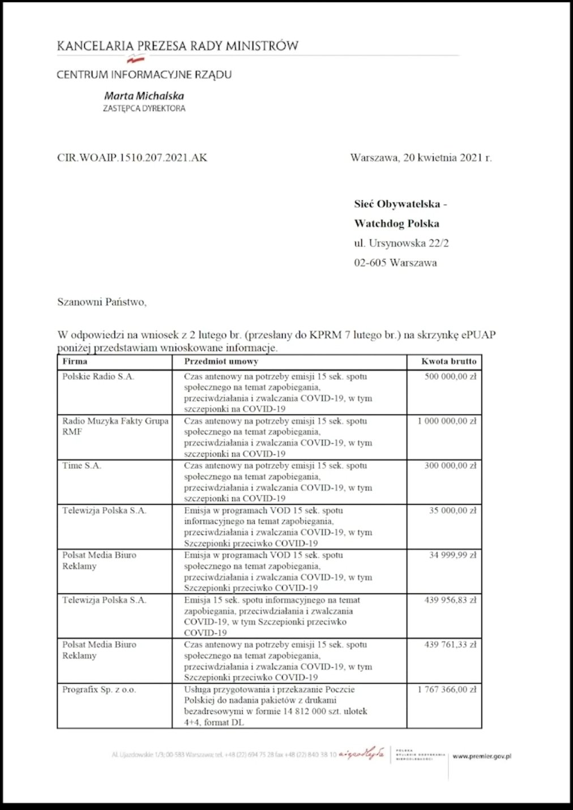
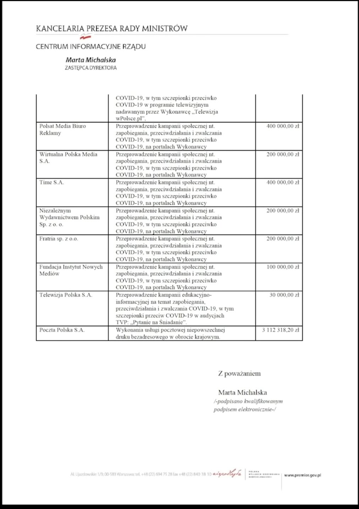
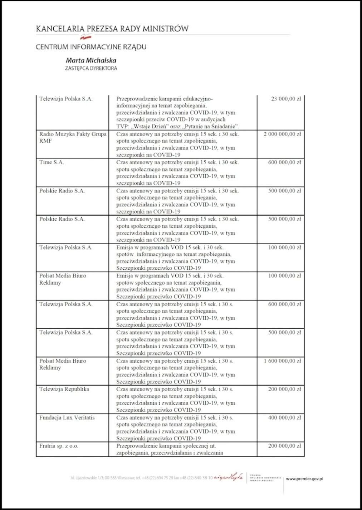
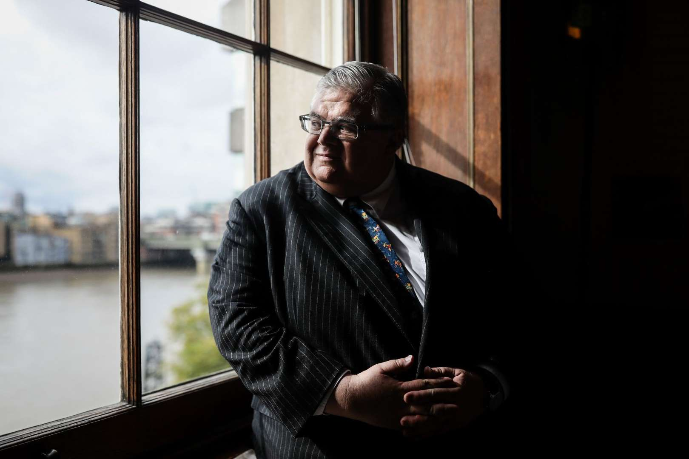
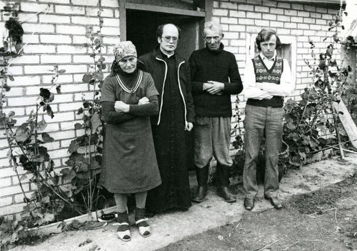
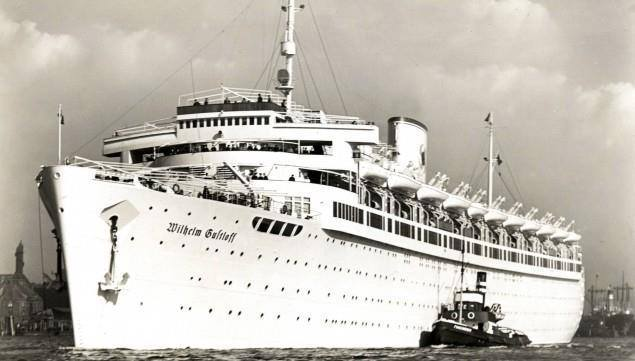
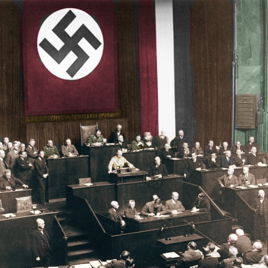

### 2022

Euro w Polsce. Tak naprawdę idea EMU od początku stoi zupełnie w sprzeczności z regułą R. Mundella, która dowodzi, że:
💡 Obszaru obejmującego różne kraje i ich waluty (FX) nie może cechować jednocześnie stałość FX, swoboda przepływów kapitałów oraz autonomiczna polityka pieniężna.
💡 Wnioski z reguły są również takie, że każde państwo również może wybrać tylko 2 spośród 3 ww. swobód.
💡 Sztywny FX ogranicza bardzo wpływ narzędzi monetarnych i fiskalnych państwa na stymulowanie gospodarki.

Reguła znalazła praktyczne potwierdzenie w 1992 r. w UK, kiedy zaatakowany przez G. Sorosa GBP został wycofany z mechanizmu stabilizacji ERM, a Bank Anglii stracił 1 mld USD. Inne zaatakowane kraje musiały poszerzyć pasmo wahań FX tak, że ERM przestał mieć sens.
Po latach powrócono do pomysłu EMU w postaci ERM 2. Tym razem jednak bez GBP... Po ataku z 1992 r. UK popadła w recesję, bo Bank Anglii musiał ratować GBP podwyżkami stóp procentowych. 💡 Odtąd Brytyjczycy już nigdy na poważnie nie rozważali poszerzania integracji z UE.

Drugi raz rysy były widoczne w 2011 r. podczas kryzysu zadłużeniowego w UE. Mając sztywne FX i niewielkie możliwości wpływu polityką pieniężną/fiskalną, Bruksela zdecydowała się ratować EMU przez nowatorskie rozwiązanie tzw. bailouts - ratunek na koszt podatnika.

Dziś kolejna porcja obserwacji i danych nt. € od Janisa Warufakisa. Otóż pod koniec 90s modna stała się globalizacja 💡 EMU miała zacieśniać współpracę i ułatwiać handel wewnątrzwspólnotowy. Standardy życia miały się wyrównać, przebieg cykli miał być łagodniejszy, ceny miały się stabilizować - to tzw. konwergencja. Minęło 20y - ale żadna z tych obietnic się nie ziściła:

📌 od czasu stworzenia € handel w EMU wzrósł tylko o 10%,
📌 kiedy na świecie o 30%,
📌 a pomiędzy DE i PL/CZ/HU aż o 63%.

W 1995 roku na każde 100€ zarobione przeciętnie w DE, Czech zarabiał 17, Portugalczyk 37, a Grek 42€. A jednak do 2020 roku to właśnie dochody w CZ zbliżyły się do DE o 24, podczas gdy POR o 9, a w GR zaledwie o 3€.

Warto przyjrzeć się trzem parom zintegrowanych gospodarek: SWE/NOR, AUS/NZ oraz USA/CAN. Ścisła integracja tych krajów pogłębiała się i nigdy nie była zagrożona dlatego że unikały one unii walutowej. Od 1979 r. inflacja w tych krajach jest podobna, ale FX tych państw ulegały szaleńczym fluktuacjom - wygłuszając wstrząsy wynikające z asymetrycznych recesji. To przyczyniało się do utrzymania zintegrowanych gospodarek w równowadze.
W UE podobna sytuacja ma miejsce między DE a PL, która € nie wprowadziła.
💡 Po pojawieniu się € polski złoty stracił 27%, potem zyskał 50%, a podczas Lehmana ponownie spadł o 30%. W wyniku tego PL uniknęła zarówno (sztucznego) wzrostu napędzanego zadłużeniem zagranicznym, jak i recesji.

Dziś większość inwestycji z DE trafia poza €, zamiast do EMU - o ironio do największej konwergencji doszło w państwach spoza strefy. W ogóle żadnej innej gospodarce nie udało się osiągnąć tak imponującej konwergencji w stosunku do DE jak gospodarce Polski.

---

"Pandemia biznesu"
Cyt. "Koszt jaki poniosła Kancelaria Premiera na kampanię społeczną zapobiegania, przeciwdziałania i zwalczania covid19 i promocję szczepień. Stan na 24 czerwca 2021r. 44 miliony 869 tysięcy 425 złotych

Pięć dni po ogłoszeniu pandemii Kancelaria Premiera 09.03.2020 otrzymała 5 mln $ od Google na kampanie i promocję szczepień i przeciwdziałanie covid

Poza Fejsbukowym ORMO, ci którzy donoszą, którzy banują albo zgłaszają tzw. naruszenie zasad społeczności., działają Demagog, Fake Hunter i Fake News PL. Wszystkie te firmy są finansowane sowicie z różnych miejsc. Fake Hunter dostała od Kancelarii Premiera 98.257,12 a partnerem Fake Hunter jest Polska Agencka Prasowa i Akademia firmy Pfizer.

Kancelaria Premiera wydała również 361 tysięcy na influencerów na youtube, na tiktoku.

Wydatki instytucji rządowych na reklamy:
Stroer Media – prawie 6 milionów, 5,900,
RMF FM – 3 miliony,
Poczta Polska – 3 miliony,
House Media Company – za zrobienie spotów reklamowych – 1 milion 841 tysięcy,
Polsat – 1 milion 700,
TVP – 1 milion 700,
Media, spółki założone przez redaktora Sakiewicza – 400 tysięcy,
Media założone przez braci Karnowskich – 400 tysięcy,
To jest na promocje szczepień. Konkretne pieniądze, które szły z budżetu państwa na promocję szczepień."

  

  

  

---

### 2021

Losowa myśl, jedna z dziesiątek: bezdomni w Azji wolą zbierać satoshi za pomocą QR a ludzie tytułującymi się "doktorami" o magistrach już nie wspominając w Europie drwią i śmieszą ich "jakieś tam elektroniczne pieniążki".

Wniosek? Zarobki znacznie przewyższające potrzeby egzystencjalne osłabia 98% populacji i świat zarówno zachodu i wschodu (świat zdenacjonalizowanych koncernów) naprawi to. Już niedługo. Ehh..

---

https://simple.wikipedia.org/wiki/Unperson

---

(Bloomberg) -- Bitcoin is inherently risky and only central banks should issue digital currencies, according to the Bank for International Settlements.

  

> “Investors must be cognizant that Bitcoin may well break down altogether,” because the system becomes vulnerable to majority attacks as it gets close to its maximum supply of 21 million coins, BIS General Manager Agustin Carstens said in a speech for the Hoover Institution on Wednesday.

Carstens, who runs the Basel-based central bank for central banks, has often been critical of Bitcoin, which surged 300% in 2020.

---

Myślałem, że tylko członek RPP Łon głosił w swoim uniesieniu patriotycznym tezę o zastąpieniu euro złotym, jako wspólną walutą europejską. Prezes GPW jeszcze aż tak daleko idącej tezy nie głosi, ale kierunek myślenia jest podobny: złoty powinien stać się walutą rezerwową dla wielu innych krajów, a polskie obligacje stanowić cześć rezerw walutowych wielu banków centralnych na świecie. Złotówkę prezes nazywa wręcz jako turbo euro. Tak sobie myślę, by może prezes zaczął wdrażanie tych światłych pomysłów od własnego podwórka: GPW. Na nasz rynek kapitałowy nie garną raczej inwestorzy ze świata, a przydaliby się! Warto czasami w swoim uniesieniu i wizjach skupic się na swoich obowiązkach i zastanowić się, dlaczego od kilku lat nasz rynek kapitałowy nie rozwija się (wbrew trendom światowym). O tym powinien myśleć i tym się zajmować nasz dzielny turboprezes.

## Dlaczego w Polsce nie są prowadzone prace nad cyfrowym środkiem płatniczym? Bo `prawdopodobnie` w dłuższym horyzoncie czasowym waluta ta przestanie istnieć

> The Polish zloty has not lost investors' confidence, it is worth promoting as a reserve currency for other countries, the head of the Warsaw Stock Exchange said on Wednesday.
> Marek Dietl, taking part in the "PAP's Special Guest" programme, said that the Polish zloty "in the short and medium term above all provides a damper for external shocks and freedom to pursue a monetary policy."
> According to Dietl, in the long run, the conclusion from the pandemic crisis is that "the Polish currency has not lost investors' confidence even for a moment," and added that "it seems that this is a good time to promote the zloty as a reserve currency for other countries."

### 2020

https://pl.wikipedia.org/wiki/Brexit

### 1989

W Białymstoku w niewyjaśnionych okolicznościach zginął 30-letni kapelan "Solidarności" ksiądz Stanisław Suchowolec. Po otrzymaniu święceń kapłańskich został wikariuszem w kościele pod wezwaniem Świętych Apostołów Piotra i Pawła w Suchowoli, rodzinnej parafii księdza Jerzego Popiełuszki. Ksiądz Jerzy po raz ostatni żegnając się z rodziną wypowiedział słowa: Mamo, nie martw się, bo gdyby, nie daj Boże, coś mi się stało, to przecież Staszek mnie zastąpi. Po męczeńskiej śmierci ks. Jerzego Popiełuszki  kontynuował odprawianie Mszy św. za Ojczyznę.
Ksiądz Stanisław Suchowolec założył izbę pamięci zamordowanego ks. Jerzego Popiełuszki, a na cmentarzu wybudował jego symboliczny grób. Był opiekunem duchowym jego rodziców. Z jego inicjatywy przed kościołem w Suchowoli stanął drewniany krzyż, na którym znalazła się informacja, że ks. Popiełuszkę zabili pracownicy SB.
Od drugiej połowy lat 80. był zastraszany przez komunistyczną bezpiekę.
W lipcu 1986 r. został wikarym w parafii pod wezwaniem Niepokalanego Serca Maryi w Białymstoku.
Kilkakrotnie funkcjonariusze Służby Bezpieczeństwa dokonywali zamachów na księdza. Wiosna 1985 r. został pobity przez nieznanych sprawców. W marcu 1985 r. rozregulowano układ kierowniczy Fiata 126p, którym Suchowolec jechał do Lublina. W grudniu 1987 r. nieznani sprawcy poluzowali cztery śruby w tylnym kole samochodu, którym jeździł ksiądz. 4 sierpnia 1988 r. na ulicy Armii Radzieckiej (dziś Szosie Baranowickiej) w Białymstoku niezidentyfikowana osoba rzuciła w kierunku Suchowolca kamień. Księdza zastraszano, odbierał telefony i listy z pogróżkam.
Niejasne okoliczności jego śmierci pozwalają ją łączyć ze Służbami Bezpieczeństwa nadzorowanymi przez gen. Kiszczaka.
30 stycznia 2006 r. prokuratorzy z Instytutu Pamięci Narodowej, oddziału w Lublinie, oświadczyli, że ich zdaniem ponad wszelką wątpliwość ksiądz Stanisław Suchowolec został zamordowany wskutek działania funkcjonariuszy Służby Bezpieczeństwa
Pośmiertnie został odznaczony przez prezydenta Lecha Kaczyńskiego Krzyżem Komandorskim Orderu Odrodzenia Polski.

  

### 1945

W rejonie Ławicy Słupskiej na Bałtyku, został zatopiony przez radziecki okręt podwodny S-13 niemiecki statek SM Wilhelm Gustloff (w zasadzie już okręt wciągnięty na listę KM). Zginęło ponad 9 tys. osób, najwięcej w historii katastrof morskich.
Jest 30 stycznia 1945 roku statek Wilhelm Gustloff wypływa w morze z portu w Gdyni, jeszcze nikt nie wie, że to jego ostatni rejs. Panuje sztorm, wieje lodowaty wiatr, jest przeraźliwe zimno, temperatura powietrza w nocy spada poniżej minus 20 stopni Celsjusza, a temperatura wody bliska jest zeru. Statek jest wypełniony uchodźcami uciekającymi przed wojskami radzieckimi. Wśród uchodźców są ranni żołnierze, pielęgniarki, policjanci i cywile. Dla wielu było szczytem marzeń dostanie się na jeden z ostatnich statków odpływających do III Rzeszy - wszyscy pragną jak najdalej uciec od linii frontu. Ile jest osób na Guslofie Tego nikt nie wie, nawet zwykle skrupulatni Niemcy przestali liczyć wchodzące osoby. Ocenia się że na pokładzie było ponad 10 000 osób.
O godzinie 21:16 przy mijaniu Ławicy Słupskiej na wysokości Łeby Wilhelm Gustloff został trafiony 3 torpedami. Pierwsza rozerwała poszycie dziobu, druga trafiła w środek statku a trzecia w maszynownię. Okręt zatonął bardzo szybko, przechylił się na lewą burtę, co spotęgowało panikę, na pokładzie walczono o dostęp do łodzi i tratw ratunkowych. Niestety po około 65 minutach o godzinie 22:25 okręt całkowicie zniknął pod powierzchnią wody. Zginęło według różnych szacunków od 8000-10000 osób, uratowano około 1215 rozbitków, każdy kto wpadł do lodowatej wody umierał w kilka minut.
Ataku dokonał radziecki okręt podwodny S-13, dowodzony przez kapitana Alexandra Marinesko. Wilhelm Gustloff był łatwym łupem, w momencie ataku był konwojowany tylko przez jeden, słownie jeden statek - torpedowiec Löwe.
Pozycja wraku: 55°07'27,7 N 17°42'14,6 E. Statek leży na głębokości 43-45m na lewym boku, jest złamany a jego środkowa część jest zgnieciona. Brak jest olbrzymi posiada długosc 209m a prawa burta sięga prawie do 20m głębokości (szerokość statku 23,5m). Pozycja wraku jest dokładnie znana, ale dla poglądowego przedstawienia można powiedzieć że leży na wysokości Łeby. Obecnie wrak pokrywa rdza i małże. Czy można na nim nurkować - tylko za specjalnym pozwoleniem. W 1994 roku Polska uznała wrak MS Wilhelm Gustloff za mogiłę wojenną, w związku z czym zakazane jest nurkowanie na wrak i w promieniu 500m od niego.

  

### 1930

👉 30 stycznia 1933 roku prezydent Niemiec, Paul von Hindenburg, powierzył stanowisko kanclerza Adolfowi Hitlerowi. Był to początek rządów NSDAP w Rzeszy.
👉 Po wyborach z 6 listopada 1932 roku partia Hitlera, która zdobyła 33,1% głosów, stała się największym ugrupowaniem w parlamencie. Paradoksalnie był to wynik gorszy, niż jeszcze w sierpniu tego roku. W poprzednim głosowaniu NSDAP otrzymała 37% głosów.
👉 Mimo sukcesu wyborczego nazistów prezydent zwlekał z mianowaniem przyszłego Führera na szefa rządu. Próbował stworzyć gabinet koalicyjny w oparciu o partie konserwatywne – bez powodzenia. Ostatecznie zdecydował się na przekazanie władzy Hitlerowi, jednak przy jednoczesnym obsadzeniu najważniejszych ministerstw konserwatystami.
👉 Wszelkie zabezpieczenia okazały się jednak zawodne. Nowy kanclerz niemal natychmiast zaczął dążyć do umocnienia swojej władzy. Przede wszystkim zwrócił się przeciwko swoim politycznym przeciwnikom. W ciągu pierwszych kilku tygodni rządów NSDAP aresztowano dziesiątki tysięcy socjalistów i komunistów. Niecałe dwa miesiące po zaprzysiężeniu, 23 marca 1933 roku, prezydent uwolnił zaś rząd od wszelkich ograniczeń parlamentarnych. 14 lipca tego roku NSDAP była już jedyną legalnie działającą partią w Niemczech.
fot. Bundesarchiv / CC-BY-SA 3.0

  

### 1920

  

### 1909

https://pl.wikipedia.org/wiki/Henryk_Magnuski

### 1667

W Andruszowie w województwie smoleńskim Rzeczpospolita i Cesarstwo Rosyjskie podpisały rozejm kończący trwającą od 9 lat wojnę polsko-rosyjską.
W ramach postanowień zawartych w tym poroumieniu Polska odzyskała Inflanty, województwo połockie i witebskie. Straciła natomiast województwo smoleńskie, czernichowskie i zadnieprzańską część województwa kijowskiego razem z jego stolicą, która już nigdy nie wróciła w granice Rzeczpospolitej.
Na zdjęciu Rzeczpospolita w 1667 roku, kolorem ciemnozielonym zaznaczono ziemie
Rzeczypospolitej będące w posiadaniu
Carstwa Rosyjskiego na mocy rozejmu
andruszowskiego.

### 1465

Miała miejsce bitwa pod Rynem na Mazurach - starcie między wojskami krzyżackimi, a miejscowym chłopstwem, które nie godziło się na politykę fiskalną prowadzoną przez władze krzyżackie.
Sprowadzone z Barczewa i Olsztyna wojska krzyżackie krwawo rozprawiły się z oddziałami chłopskimi. Zabito 500 chłopów.
Na zdjęciu zamek w Rynie.

---

<a href="https://github.com/TomaszWaszczyk/historia.waszczyk.com/edit/master/src/content/january-30.md" target="_blank">Edytuj tę stronę dzieląc się własnymi notatkami!</a>
