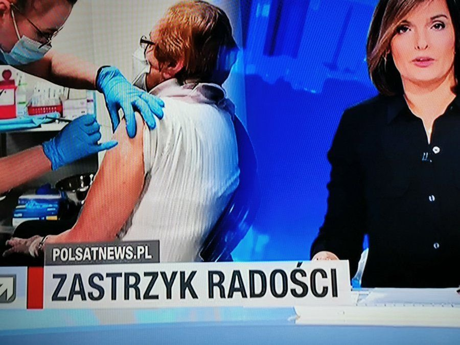
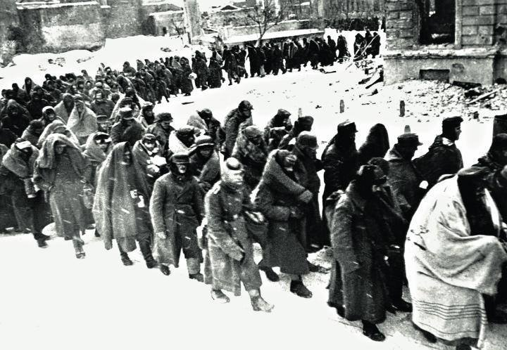

### 2022

> Posłowie tracą na Polskim Ładzie – i ponoć są zresztą zaskoczeni wysokością swoich wypłat. Byliby pewnie mniej, gdyby po prostu czytali ustawy, za którymi głosują. Teraz ponoć wszystko „odkręcać” próbuje Ministerstwo Finansów.

---

<!-- Mam na Facebooku kolegów, którzy oglądają rosyjską telewizję. Oni podrzucili informację o ponad 100 tysiącach żołnierzy, jakich Ukraina zgromadziła przy granicy z Donbasem celem ataku na zbuntowany region, zamieszkały przez Rosjan. Rosja straszy Ukrainę, że w razie ataku Ukrainy na Donbas ruszy na Kijów od północy.
Powyższa wersja jest dla mnie logiczna. Typowa anglosaska zagrywka. Walczyć ze swoimi wrogami cudzymi rękami. Grzegorz Braun wiele razy opisywał jak Anglosasi walczyli z Rosją polskimi rękami, co dla narodu polskiego kończyło się tragicznie. Dlatego kilka dni temu Grzegorz Braun zagłosował w Sejmie przeciw uchwale popierającej Ukrainę.
Anglosasi walczyli z Rosją polskimi rękami w czasie powstania listopadowego, powstania styczniowego, i próbowali w latach 70. XIX wieku. Tak twierdzi Grzegorz Braun. Moim zdaniem walczyli również po II wojnie światowej z Rosją polskimi rękami, wspierając tzw. żołnierzy wyklętych.
Anglosasi zachęcają Ukrainę do walki z Rosją, dają je broń, szkolą jej wojsko. Chcą ukraińskimi rękami walczyć ze swoim wrogiem.
Sam nie oglądam w Polsce rosyjskich telewizji. Na FB jestem zablokowany do połowy lutego za krytykę obowiązku noszenia masek. -->

Ewolucja nauki.

Przez wiele wiele lat uczono nas, że szczepionka chroni zaszczepionego przed chorobą. Nie chroni zaś sąsiada, który nie chce się zaszczepić. Wydawało się to logiczne i poparte nauką.

Ale nastała era COVIDU i dawne prawdy naukowe legły w gruzach. Okazało się bowiem, że szczepionka chroni nie tylko mnie osobiscie, ale również sąsiada - a może nawet głównie sąsiada. Mówiono nam, że szczepiąc siebie, chronimy sąsiada. Wydawało się to nielogiczne. Przecież sąsiad może się sam zaszczepić nie liczac na mnie.

Później okazało się, że moja szczpionka jednak nie chroni sąsiada, że jednak on sam musi się zaszczepić aby mieć ochronę.

Po jakimś czasie okazało się jednak, że moja szczepionka nie chroni nawet mnie przed chorobą, lecz jedynie przed ciężkim przebiegiem tej choroby. A co z sąsiadem? Jego chyba też moja szczpionka nie chroni? A może jego chroni, ale mnie nie chroni, bo on się nie zaszczepił? Skomplikowane się to zaczęło robić.

Zaczęto nam wmawiać kolejna naukową prawdę, że szczepionka chroni przed śmiercią, ale pod warunkiem, że wszyscy dookoła się zaszczepią. Tego póki co nie jesteśmy w stanie zweryfikować - dopóki będzie ktoś na świecie kto się nie zaszczepił. W takiej sytuacji zgony osób zaszczepionych mogą byc faktycznie skutkiem tego, że nie wszyscy się zaszczepili.

Problem w tym, że tej tezy chyba nigdy nie uda sie zweryfikować pozytywnie. No bo ciężko będzie doprowadzić do sytuacji gdy 100% populacji ludzkiej bedzie zaszczepione. A wedle tej tezy - tylko wtedy szczepionki zaczną poprawnie działać i chronić przed chorobą oraz przed zgonem.

Może robię błąd, że na drodze logiki matematycznej probuje rozwikłać ten problem. Może ten konkretny problem nie podlega logice matematycznej tylko jakiejś innej logice?

---

  

---

### 2021

Czy tylko ja uważam, że to traktowanie ludzi jak już totalne bydło?

  

---

### 1943

Feldmarszałek Friedrich Paulus poddał się dowódcy 64. Armii gen. Michaiłowi Szumiłowowi po klęsce dowodzonej przez siebie 6. Armii w bitwie stalingradzkiej.
10 stycznia 1943 r., wobec odrzucenia przez gen. Paulusa wezwania do kapitulacji, Sowieci przystąpili do ostatecznego pobicia zdziesiątkowanej 6 Armii. Realizację planu „Pierścień” powierzono Frontowi Dońskiemu dowodzonemu przez gen. Konstantego Rokossowskiego.
Do 23 stycznia Armia Czerwona zdobyła wszystkie lotniska zajęte uprzednio przez Niemców. Następnego dnia, wobec beznadziejności sytuacji frontowej, gen. Paulus zameldował Naczelnemu Dowództwu Wehrmachtu: „Wskutek szerokich włamań front przerwany w wielu miejscach. Punkty oparcia i możliwości osłony istnieją już tylko na terenie miasta, dalsza obrona jest pozbawiona sensu. Załamanie nieuniknione”. Także tym razem dowódca 6 Armii spotkał się z kategoryczną odmową na kapitulację. Jeszcze 30 stycznia w przemówieniu radiowym Goering zagrzewał Niemców do walki, porównując ich bohaterską postawę do Spartan, którzy zatrzymali Persów pod Termopilami.
Decyzję o zaprzestaniu walk gen. Paulus podjął samowolnie dopiero 31 stycznia. Do godzin popołudniowych 2 lutego broniły się jeszcze oddziały niemieckie walczące na północy miasta, do których nie dotarły na czas rozkazy o zakończeniu działań zbrojnych.
Dopiero 4 lutego niemieckie społeczeństwo, żyjące do tej pory w przekonaniu o sukcesach Wehrmachtu na Wschodzie, zostało poinformowane o porażce pod Stalingradem. Przez kolejne dwa dni trwała w Niemczech żałoba narodowa.
Hitler, który jeszcze w końcu stycznia awansował Paulusa na feldmarszałka licząc na to, że ten – w obliczu klęski – popełni samobójstwo, na wiadomość o jego kapitulacji wpadł w furię. „Tyle ludzi musiało zginąć, a potem jeden taki człowiek jak on, w ostatniej minucie, kala bohaterstwo tylu innych. Mógł uwolnić się od wszelkich zmartwień i odejść w nieśmiertelną wieczność narodowej pamięci, ale wolał udać się do Moskwy. Cóż to za wybór? To po prostu nie ma sensu”
2 lutego 1943 r. pod Stalingradem poddała się okrążona przez Sowietów 6 Armia niemiecka. Do niewoli poszło 91 tys. żołnierzy oraz 22 generałów na czele z feldmarszałkiem von Paulusem. Łącznie operacja stalingradzka przyniosła państwom Osi straty 1,5 mln poległych, rannych, pojmanych.

  

---

<a href="https://github.com/TomaszWaszczyk/historia.waszczyk.com/edit/master/src/content/january-31.md" target="_blank">Edytuj tę stronę dzieląc się własnymi notatkami!</a>
