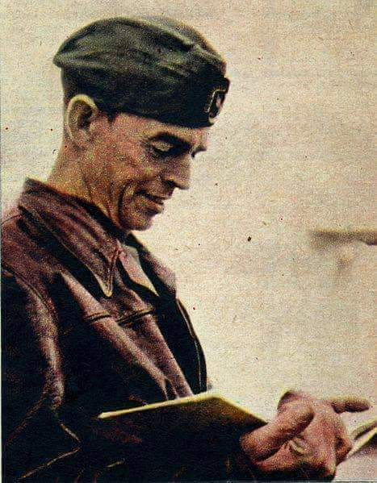
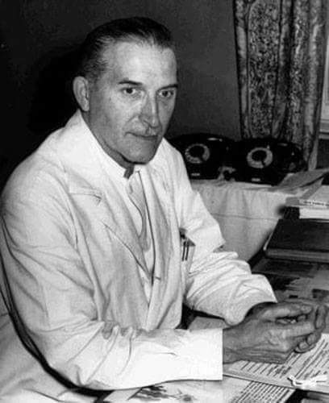
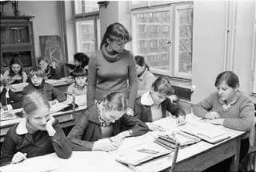
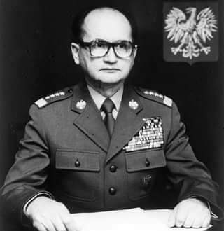
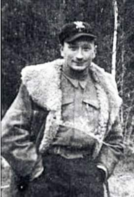
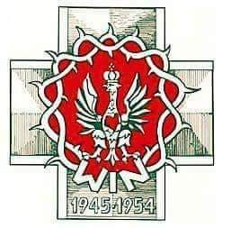
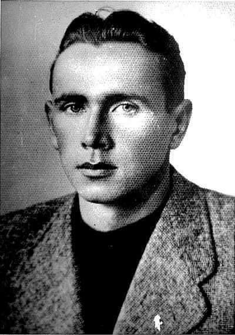
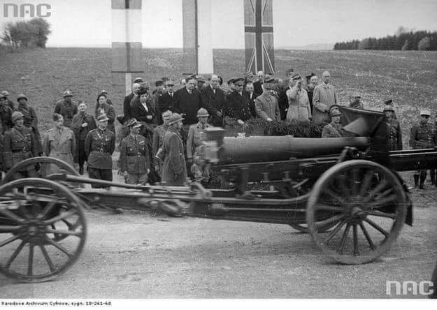
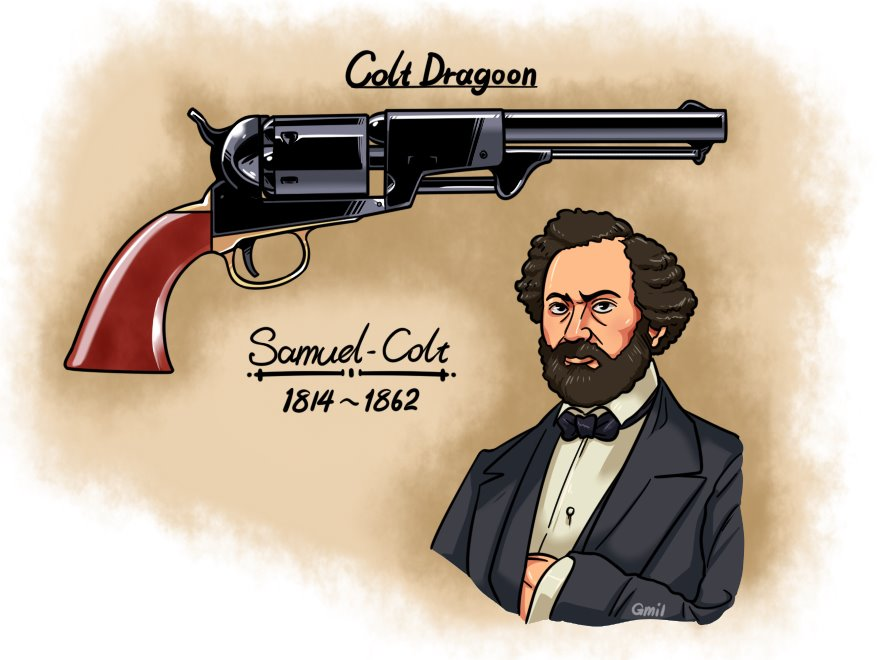
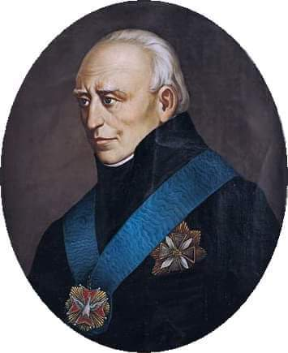

### 2010

W wieku 92 lat zmarł generał Tadusz Edward Góra (zdjęcie)-legendarny pilot RAF i szybownik.
Przygodę z lotnictwem zaczynał w Aeroklubie Wileńskim. W 1938 roku,jako pierwszy na świecie pilot został wyróżniony przez Międzynarodową Federację Lotniczą Medalem Lilienthala. Wyróżnienie to otrzymał za rekordowy przelot szybowcem. Udało mu się przelecieć 578 km z Bieszczad do Wilna.
W czasie okupacji niemieckiej służył w dywizjonach 306,315 i 316. Na swoim koncie miał 833 loty i 4 zestrzelenia niemieckich maszyn.
Po wojnie zajmował się szkoleniem młodych polskich pilotów. W 1962 roku zdobył tytuł Szybowcowego Mistrza Polski.
Za osiągnięcia w wypełnianiu zadań bojowych odznaczony został Krzyżem Srebrnym Orderu Wojennego Virtuti Militari i trzykrotnie Krzyżem Walecznych oraz brytyjskim The 1939-1945 Star , The War Medal 1939-1945 i The Defence Medal .
Za zasługi powojenne został odznaczony Krzyżem Komandorskim Orderu Odrodzenia Polski.

  

### 1969

Pionier polskiej kardiochirurgii profesor Jan Witold Moll przeprowadził pierwszą w Polsce próbę przeszczepienia serca, niestety próba zakończyła się niepowodzeniem. Było to trzynaście miesięcy po pierwszej na świecie transplantacji serca przeprowadzonej w Kapsztadzie przez prof. Christiaana Barnarda. Jan Moll był profesorem zwyczajnym, doktorem habilitowanym medycyny, torakochirurgiem, kardiochirurgiem, wieloletnim kierownikiem Kliniki Kardiochirurgii AM w Łodzi. W czasie okupacji niemieckiej pracował na Oddz. Chirurgicznym Szpitala Miejskiego w Radomiu, gdzie potajemnie operował żołnierzy Armii Krajowej.
Jego działalność w czasie okupacji została opisana w książce Hanny Krall pt. Zdążyć przed panem Bogiem. Po wojnie prowadził badania nad fizjopatologią krążenia pozaustrojowego, a efektem jego badań było skonstruowanie we współpracy z inżynierami Zakładów H. Cegielskiego pierwszego polskiego sztucznego serca w 1953 roku. Rok później przeprowadził pierwsze w Polsce lewostronne cewnikowanie serca. Na Oddziale Torakochirurgicznym przeprowadził pierwsze operacje na otwartym sercu. Był pionierem wymiany zastawek serca i chirurgii wieńcowej.
Zmarł 2 czerwca 1990 we Wrocławiu.

  

### 1982

Po trwającej 3 tygodnie przerwie wynikłej z powodu wprowadzenia w Polsce stanu wojennego wznowiona została nauka w szkołach podstawowych i średnich. Jednocześnie władze komunistyczne rozpoczęły akcję weryfikacji środowiska nauczycielskiego, której nie przeszło około 1200 nauczycieli.

  

---

1982 roku grupa intelektualistów wystosowała do generała Wojciecha Jaruzelskiego list otwarty, w którym domagała się natychmiastowego zaprzestania przemocy wojskowej i milicyjnej wobec bezbronnej ludności, zwolnienia aresztowanych i poręczenia praw ludzkich i obywatelskich zgodnie z obowiązującymi w PRL konwencjami międzynarodowymi.
Pod listem podpisali się Wanda Wiłkomirska, ksiądz Jan Zieja, doktor Józef Rybicki, doktor Marian Brandys, doktor Zofia Kuratowska, doktor Stanisław Broniewski, profesor Stafan Kieniewicz i Daniel Olbrychski.

  

### 1950

Wojskowy Sąd Rejonowy w Kielcach skazał na karę śmierci Antoniego Hedę "Szarego" (zdjęcie) dowódcę oddziałów partyzanckich Związku Walki Zbrojnej-Armii Krajowej, Ruchu Oporu Armii Krajowej, członka Delegatury Sił Zbrojnych, zrzeszenia Wolność i Niezawisłość, dowódcę oddziału, który rozbił ubeckie więzienie w Kielcach przy ulicy Zamkowej, uwalniając około 350 osób. Aresztowany przez UB w roku 1948. Wydany na niego wyrok śmierci został zamieniony na karę dożywotniego więzienia. Stało się to dzięki interwencji oficerów Armii Ludowej, z którymi Heda współpracował w roku 1944. Na wolność wyszedł w roku 1956. Zmarł 14 lutego 2008 roku w wieku 91 lat.

  

### 1947

1947 roku w Warszawie rozpoczął się proces przywódców antykomunistyczej organizacji Wolność i Niezawizłość. Na ławie oskarżonych z Zarządu Krajowego WiN. Byli to między innymi, założyciel i pierwszy prezes tej organizacji pułkownik Jan Rzepecki, podpułkownik Jan Szczurek Cergowski oraz szefowa łączności zagranicznej Emilia Malessa.
Oskarżono ich o organizowanie dywersji, akty terroru, morderstwa i rabunki, szpiegostwo, a także uchylanie się od powinności wojskowej.
Proces ten, szeroko relacjonowany przez ówczesne polskie media zakończył się 3 lutego 1945 roku. Pułkownik Rzepecki został skazany na 8 lat więzienia, Jan Szczurek Cergowski otrzymał wyrok 7 lat więzienia. Pozostałe osoby otrzymały kary od 2 do 12 lat więzienia, a jedna - karę śmierci. Zostali oni następnie ułaskawieni przez prezydenta Bolesława Bieruta. Potem jednak niektórzy byli ponownie aresztowani. Najtragiczniej potoczyły się losy Emilii Mallesy, która skazana na 2 lata więzienia nie wytrzymała psychicznie i popełniła samobójstwo 5 czerwca 1949 roku.

  

### 1944

https://pl.wikipedia.org/wiki/Akcja_%E2%80%9EBurza%E2%80%9D

### 1943

W ateńskiej dzielnicy Kesariani od niemieckiej kuli zginął Jerzy Iwanow Szajnowicz (zdjęcie) urodzony w Warszawie harcerz, sportowiec, agent brytyjskich i polskich służb specjalnych, żołnierz greckiego ruchu oporu, polski i grecki bohater narodowy.
Szajnowicz został aresztowany 8 września 1942 roku na skutek denuncjacji przez znajomego. 2 grudnia tego samego roku sąd niemiecki wydał na niego potrójny wyrok śmierci. Życie próbował uratować mu arcybiskup Aten Dymitrios Papandreu Damaskin, który regularnie odwiedzał go w więzieniu, a także interweniował u Niemców i Aliantów poddając propozycję wymiany ważnych jeńców, którą Alianci zignorowali, a do której pozytywnie odnieśli się Niemcy.
Szajnowicz został najpierw tylko raniony przez SS mana podczas próby ucieczki z miejsca egzekucji, a następnie rozstrzelany razem z innymi skazanymi.
Przed śmiercią wykrzyczał:
"Niech żyje Grecja, niech żyje Polska" - Ζήτω η Ελλάς! Ζήτω η Πολωνία!"
Miał 32 lata.

  

### 1940

1940 roku w Paryżu Naczelny Wódz generał Władysław Sikorski i francuski premier Eduard Daladier podpisali umowę o utworzeniu Wojska Polskiego we Francji.
Umowa ta regulowała zasady na jakich blisko pół miliona przebywających wówczas we Francji Polaków mogło wstąpić do wojska. Z całej tej liczby za zdolnych do służby uznano 140 tysięcy Polaków. Ostatecznie jednak do armii wcielono 50 tysięcy osób.
W ramach polskich sił we Francji powstały:

- 1. Dywizja Grenadierów (dowódca gen. Bronisław Duch);

- 2. Dywizja Strzelców Pieszych (gen. Bronisław Prugar-Ketling);

- X Brygada Kawalerii Pancernej (gen. Stanisław Maczek);
- Samodzielna Brygada Strzelców Podhalańskich
(gen. Zygmunt Szyszko Bohusz);
- Samodzielna Brygada Strzelców Karpackich
(sformowana w Syrii pod dowództwem gen.
Stanisława Kopańskiego).
W trakcie tworzenia była 3 Dywizja Piechoty
(gen. Rudolf Dreszer) i 4. Dywizja Piechoty (płk
Tadeusz Zieleniewski).

  

### 1923

Włodzimierz Lenin zakończył pisanie List do Zjazdu (tzw. „testamentu Lenina”), w którym negatywnie ocenił swych potencjalnych następców na przywództwie WKP: Trockiego, Zinowiewa, Kamieniewa, Piatakowa i „ulubieńca partii” Bucharina oraz zamieścił sugestię usunięcia Józefa Stalina ze stanowiska sekretarza generalnego partii.

Tę datę ma list napisany na rok przed śmiercią przez wodza rewolucji do delegatów XVIII zjazdu Wszechrosyjskiej Komunistycznej Partii (bolszewików): Stalin jest zbyt brutalny i wada ta, która jest całkiem do zniesienia w naszym środowisku i w stosunkach między nami, komunistami, staje się nie do zniesienia na stanowisku sekretarza generalnego. Wobec tego proponuję towarzyszom, by zastanowili się nad sposobem przeniesienia Stalina z tego stanowiska i wyznaczyli na to miejsce innego człowieka, który (...) charakteryzowałby się większą tolerancyjnością, większą lojalnością, większą uprzejmością (...) mniej kapryśnym usposobieniem itd.

List przeczytany jedynie w regionalnych grupach delegatów został utajniony. Kilka lat później już za samo jego posiadanie groziła kara śmierci.

### 1895

https://pl.wikipedia.org/wiki/Helena_Jab%C5%82onowska

### 1847

1847 r.

Samuel Colt sprzedał amerykańskiemu rządowi pierwszą partię rewolwerów własnej konstrukcji.

5 marca 1836 roku Samuel Colt (1814-1862) wyprodukował pierwszy seryjny model rewolweru o kalibrze 0.34 cala. Oprócz rewolwerów Ameryka zawdzięcza mu również pierwsze, kontrolowane na odległość materiały wybuchowe, a także pierwszy kabel telegraficzny rozciągnięty pod wodą.

Colt był jednak nie tylko pomysłowym wynalazcą, ale też zręcznym biznesmenem, który nie cofał się przed użyciem łapówek. Jego machlojki sprowokowały powołanie komisji, która zajęła się zbadaniem, w jaki sposób Colt zdobył milionową fortunę.

Pomysł na rewolwer przyszedł Samuelowi, kiedy miał 16 lat i służył na statku. Gdy uznał, że przyszedł czas na produkcję, zaczął organizować pokazy, podając się za Dr Coulta z Londynu, Nowego Jorku lub Kalkuty. Jego przedstawienia były całkiem zabawne, na niektórych rozpylał gaz, jak go nazywał, - gaz doktora Coulta - nitrous oxide. Bilety kosztowały 25 centów, a można było popatrzeć jak widownia wygłupia się pod wpływem gazu rozweselającego.

Gdy już zaoszczędził trochę pieniędzy, namówił rodzinę, by pomogła mu założyć Patent Arms Manufacturing Co., w Peterson w New Jersey. Miało to miejsce w 1836 roku. Colt przekupywał, oszukiwał, przymilał się i przesadzał w opowieściach, kiedy tylko było to potrzebne, by wprowadzić w błąd urzędników stanowych i sprowokować ich do zamówienia broni.

Komitet uznał, że Samuel Colt, twórca fortuny opartej na masowej produkcji broni palnej, zapłacił co najmniej 15 tysięcy dolarów Dickersonowi, jego prawnikowi i jednemu z lobbystów, by kupili opozycję w Kongresie, która sprzeciwiała się wspomnianej ustawie, podczas gdy prawa patentowe Colta już wygasły. Udowodniono, że zapłacił ponad 60 tysięcy dolarów, w celu zabezpieczenia ustawy pozwalającej na trwanie jego patentu. Inny lobbysta, Jere Clemens, również przyznał, że otrzymał od Colta pieniądze, jak też od innych osób, np. firm planujących zakup ziemi. Jeden przypadek był bardzo ciekawy i pokazuje, jak łatwo można było w ówczesnej Ameryce przegłosować, skrojoną na miarę ustawę. Clemens, pod przysięgą wyznał, że Cyrus H. McCormick, producent żniwiarek i twórca wielomilionowej fortuny, również chciał, by jego patent, podobnie jak w sprawie Colta, został przedłużony.

Nie można jednak odmówić Coltowi, że oprócz tego, że był świetnym wynalazcą, również doskonale radził sobie z rozpropagowaniem swoich produktów. Zaczął od rozdawania prezentów osobom wpływowym, wydającym ważne decyzje, w tym przedstawicielom armii i ludziom polityki, którzy według niego, mogli pomóc w uzyskaniu kontraktów rządowych. Płacił każdemu, kto wydawał się przydatny, nawet przyjaciołom, czy postronnym osobom mogącym poznać go z wpływowymi figurami. Zapraszał ich na pokazy, na których zachwalał rewolwer taką łatwością, jakby to była szczoteczka do zębów, rozdając swój produkt na lewo i prawo. Ocenia się, że Colt miał około dwóch i pół tysiąca prezentacji, na których często wręczał rewolwery o równowartości dzisiejszych 1.5 tysiąca dolarów.

Legendą owiane są jego stosunki z prasą, artystami i innymi, którzy wpływali na opinię publiczną i bez względu na to, że były to najzwyczajniejsze łapówki, to należy przyznać, że Samuel Colt opanował do perfekcji sztukę public relation.

Wbrew powszechnej opinii, przed 1850 roku tylko kilka firm produkowało broń. Posiadało ją 10-25 % białych obywateli. Stany, takie jak Massachusetts, prowadziły ścisła ewidencje prywatnej broni. Przed 1840 nie więcej niż 11 % jej mieszkańców miało broń, a należy tu zaznaczyć, że oprócz Connecticat, oba stany były centrum produkcji broni w Stanach Zjednoczonych.

Coltowi udało się stworzyć złudzenie, że rewolwer jest niezbędny dla każdego mieszkańca miasta i że potrzebują go do obrony mimo, iż statystyki nie potwierdzały wysokiej ilości przestępstw. W tamtym czasie Stany Zjednoczone nie posiadał policji innej niż tej potrzebnej do łapania zbiegłych niewolników, uzbrojonej najczęściej w pejcze. Nawet łowiectwo, podczas którego używano broni, bardziej brano za pozostałość po Anglikach i zabawę gentlemanów (wg Bellesilesa).

Colt to wszystko zmienił, doskonale zagrał na ludzkim strachu. To samo zrobił, ale na większą skalę, z rządami wielu krajów.

Kiedy w 1852 roku wyruszył do Rosji, powiedział carowi, że sułtan Turcji właśnie kupił 5 tysięcy pistoletów. Car się obruszył i również zamówił 5000 rewolwerów dla swoich żołnierzy. Kiedy interes był ubity, Colt pojechał do Konstantynopola, by powiedzieć, że car Rosji kupił właśnie 5 tysięcy rewolwerów. W ten sposób sprzedał ich 10 tysięcy.

Jeden z jego rewolwerów, produkowany w Anglii do 1872 roku, sprzedany w 42 tysiącach sztuk, był używany podczas brytyjskiej okupacji Hongkongu. Co więcej, w latach 1853-54 Colt podróżował po Europie, opierając się nawet o Konstantynopol, w nadziei na uzyskanie kontraktów na swoją broń. Bawił się nastawionymi do siebie wrogo głowami państw, używał łapówek i niby w dobrej wierze uchylał rąbka tajemnicy o mającym się sfinalizować kontrakcie w obozie wroga. W ten sposób uzyskał zamówienia od Turcji, która walczyła właśnie z Rosją i od Anglików, którzy również obawiali się Rosji i jej dominacji nad Bosforem. Podczas wojny krymskiej, która wybuchła w 1854 roku, Rosjanie, Anglicy i Turcy, strzelali do siebie z Coltów.

Nie tylko broń produkował Colt w swojej fabryce, ale także inne sprzęty domowego użytku. Na wszystkich umieszczał swój znak formowy "Colt", by utrzymywać uwagę społeczeństwa na odpowiednim poziomie. Z kolei, dla reklamy ofiarowywał nagrody za doniesienie mu o każdym przypadkowym, śmiertelnym wystrzale. Każde takie doniesienie za darmo robiło Coltowi reklamę.

Na pytania o podstawy moralne zawsze odpowiadał, że najbezpieczniej dla każdego jest, by wszyscy posiadali Colta. Jego ulubionym powiedzeniem było: "Uzbrojone społeczeństwo to pokojowe społeczeństwo". Społeczeństwo nie powinno oczekiwać od państwa, że je obroni, ale zrobić to samo, ponieważ nie istnieje kolektywne bezpieczeństwo. Po tym, jak armia Stanów Zjednoczonych złożyła ogromne zamówienia na nową broń, którą wykorzystała w wojnie z Meksykiem, jego pistolet stał się symbolem Dzikiego Zachodu.

  

### 1790

Stanisław Staszic (grafika) wydał anonimowo książkę pod tytułem "Przestrogi dla Polski".
W publikacji tej, będącej kontynuacją "Uwag nad życiem" Jana Zamoyskiego Staszic podjął próbę przekonania szlachty o konieczności zreformowania kraju. Na podstawie analizy sytuacji politycznej w Polsce postulował zniesienie Liberum Veto i głosowania jawnego w sejmikach, apelował o przyznanie praw obywatelskich mieszczanom, ustanowienie stałej pensji dla króla, podział władzy wykonawczej na ministerstwa, wolność osobistą dla chłopa, zniesienie pańszczyzny, system rządów oparty na współpracy szlachecko-mieszczańskiej, zawiązanie antymagnackiego sojuszu między szlachtą a mieszczanami. Staszic oskarżył również magnatów o bezmyślne przejmowanie cudzoziemszczyzny i zaniedbywanie polskich tradycji, a przede wszystkim o zdradę interesów narodu.

  

---

<a href="https://github.com/TomaszWaszczyk/historia.waszczyk.com/edit/master/src/content/january-4.md" target="_blank">Edytuj tę stronę dzieląc się własnymi notatkami!</a>
