### 2021

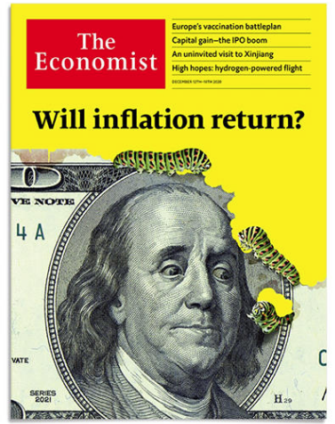  

> "When Chairman Powell, no matter how well-intentioned, says in June, “We’re not even thinking about thinking of raising rates,” at Stone Ridge we respond, “We’re not even thinking about thinking of not buying more #Bitcoin ,” and we did."

> Bitcoin is our peaceful weapon of choice against central bank driven time theft." - Stone Ridge 2020 Shareholder

  

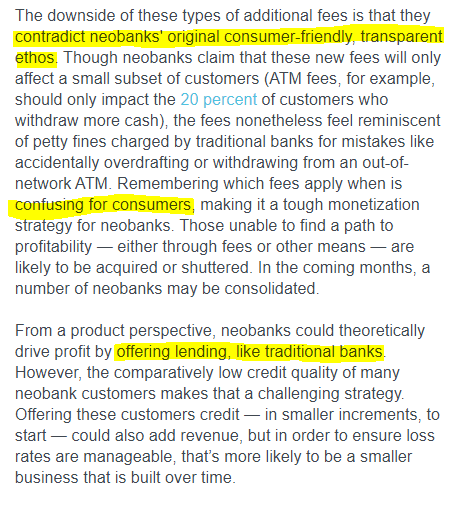  

### 2020

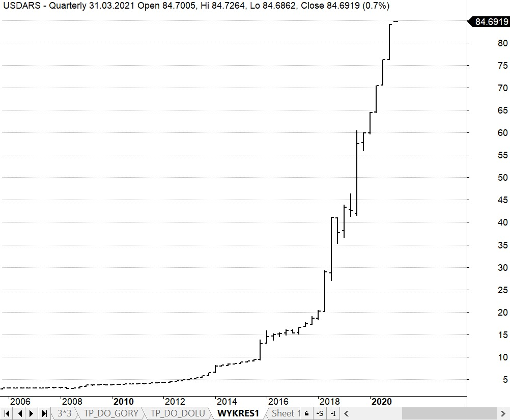  

---

Augustyn Pelanowski: W styczniu 2020 zostało wydane oświadczenie zakonu paulinów, podpisane przez sekretarza generalnego o. Pawła Przygodzkiego, w którym poinformowano, że zakon odcina się od niektórych błędnych doktrynalnie wypowiedzi Pelanowskiego oraz nie akceptuje jego braku szacunku dla papieża Franciszka. W dokumencie znajduje się także informacja, że zakonnik swoje najnowsze publikacje wydaje bez zgody przełożonych oraz bezprawnie przebywa od lutego 2019 poza wspólnotą zakonną, czym łamie złożone śluby zakonne.

W styczniu 2020 r. został wydalony z Zakonu św. Pawła I Pustelnika dekretem Generała Zakonu potwierdzonym przez Kongregację ds. Instytutów Życia Konsekrowanego i Stowarzyszeń Życia Apostolskiego kilka miesięcy później. 

---

### 2017

W wieku 96 lat zmarł Janusz Brochwicz-Lewiński (zdjęcie) generał brygady Wojska Polskiego, żołnierz batalionu AK "Parasol".

Urodził się 17 września 1920 roku w Wołkowysku na Białorusi. Służbę w polskiej armii rozpoczął w 1938 roku w 76 Pułku Piechoty w Grodnie. W stopniu kaprala podchorążego służył w czasie wojny obronnej w 1939 roku. Zaledwie w dzień po radzieckiej agesji na Polskę dostał się do sowieckiej niewoli, z której zbiegł.
Jako członek ZWZ-AK brał udział w konspiracji, a przez dwa lata od roku 1940 był pracownikiem administracyjnym i jednocześnie agentem wywiadu placówki w Puławach. W wyniku dekonspiracji przedostał się do Lublina, a następnie Janowa Lubelskiego, gdzie był dowódcą jednego z oddziałów partyzanckich. Jako uczestnik powstania warszawskiego walczył w Batalionie "Parasol", który zasłynął obroną Pałacyku Michla na Woli. Po zakończeniu powstania trafił do obozów przejściowych w Lamsdorf i Murnau,gdzie przebywał do momentu wyzwolenia przez Amerykanów.
Po zakończeniu II wojny światowej przebywał na emigracji w Wielkiej Brytanii. Wstąpił do armii brytyjskiej (III Pułk Królewski Huzarów), służył m.in. w gwardii przybocznej Jego Królewskiej Mości Jerzego VI. Działał również m.in. w Palestynie i Sudanie, jako agent wywiadu. Po opuszczeniu armii był przez 15 lat kwatermistrzem i oficerem.
24 maja 2007 Rada Miasta Stołecznego Warszawy przyznała mu tytuł honorowego Obywatela. Dyplom odebrał 31 lipca 2007 w przeddzień Dnia Pamięci Warszawy.

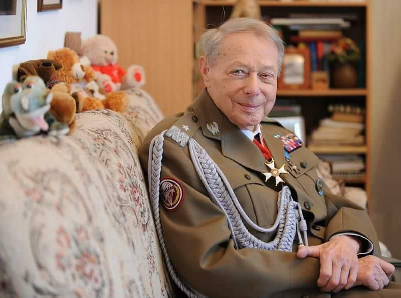  

### 2009

Brytyjski kanał BBC wyemitował film dokumentalny pt. ,,Ukryty pamiętnik holokaustu'' w reżyserii Alexandra Marengo. Film obejrzało dwa miliony osób. Tydzień później odbyła sie premiera w Izraelu. Film opowiadał przejmującą historię 14-letniej Rutki Laskier - żydowskiej dziewczynki z Będzina, która pod koniec swojego życia zaczęła prowadzić pamiętnik, w którym opisywała trudy życia w będzińskim getcie. Na krótko przed wysiedleniem z getta i zagazowaniem w KL Auschwitz-Birkenau w 1943 roku (Rutka zginęła w obozie zagłady wraz z mamą i bratem), Rutka ukryła swój pamiętnik w domu, w którym wtedy mieszkała. Informację, gdzie go może ukryć, uzyskała od swej starszej polskiej znajomej Stanisławy Sapińskiej, poprzedniej mieszkanki domu. I to ona odnalazła później i przechowała to cenne świadectwo przez ponad 60 lat, aby dziś podzielić się nim ze światem. Rutka Laskier jest często nazywana polską Anną Frank.

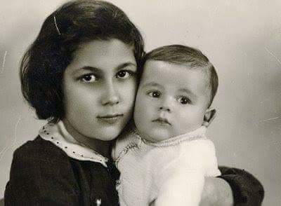  

### 1957

Została ogłoszona tzw. doktryna Eisenhowera dotycząca polityki USA wobec Bliskiego Wschodu.

Polityka zagraniczna USA w II poł. XX wieku: Wyścig zbrojeń:

Doktryna powstrzymywania ogłoszona przez Trumana w 1945 zakładała powstrzymywanie sił komunistycznych, które mogłyby zagrażać Ameryce lub innym demokratycznym państwom. Truman nie przewidział jednak komplikacji, jakie realizacja takiej polityki mogła przynieść - dawała ona przewagę Związkowi Radzieckiemu, który dowolnie mógł wybierać miejsce konfrontacji tak, by było one niekorzystne dla USA.

W cztery lata po ogłoszeniu doktryny Stany Zjednoczone stanęły przed dylematem interwencji w Korei - czy potraktować doktrynę dosłownie, czy uznać, że Korea leży poza amerykańską strefą wpływów i zainteresowań. Wybranie pierwszego wariantu, popartego przez Radę Bezpieczeństwa ONZ spowodowało, że Amerykanie wzięli na siebie olbrzymi ciężar utrzymania pokoju światowego. Doktrynę tą krytykował m.in. Walter Lippman (za brak skonkretyzowania obszaru działania, co prowadziło do ogromnych obciążeń militarnych i finansowych) i Winston Churchill (głównie za zbyt długie oczekiwanie na rozpoczęcie negocjacji).

Trumanowi zarzuca się także niewykorzystanie lat przewagi atomowej i niechęć do jednoczesnych nacisków militarnych i dyplomatycznych oraz oczekiwanie na niechybny upadek systemu komunistycznego. Takie podejście spowodowało, że Związek Radziecki już wkrótce zdobył technologie nuklearne stając się prawdziwym zagrożeniem dla bezpieczeństwa światowego. Brak sprecyzowania obszaru działań sprawił, że wojska amerykańskie toczyły walki tam, gdzie nie miały żadnych żywotnych interesów (np. w Korei, czy Wietnamie). Rosnące wydatki na zbrojenia, niezadowolenie społeczne wywołane wojną i strach przed zagrożeniem wojną nuklearną zdominował lata 60' w Ameryce. Praktyka tworzenia systemu sojuszy międzynarodowych, która miała osłabiać komunizm i izolować go na arenie międzynarodowej przyczyniła się do dalszego rozchodzenia dróg dwóch światowych mocarstw i ich państw satelickich. Ameryka potrzebowała prezydenta na miarę W.Wilsona, czy F.D. Roosevelta. Niestety, wybrała sobie najpierw D. Eisenhowera, generała wsławionego w wojnie, a później równie bezbarwnego członka wpływowego klanu Kennedy’ch - Johna Fitzgeralda. Pod ich prezydenturami społeczeństwo Stanów Zjednoczonych przeżyło chwile największej trwogi od lat wojny światowej.

Lata 60’ zaczęły się w Ameryce zmianą doktryny polityki zagranicznej. W latach 50’ obowiązywała doktryna zmasowanego odwetu - wybuch konfliktu z udziałem państw socjalistycznych gdzieś na świecie miał powodować natychmiastową reakcję Ameryki (przy zastosowaniu broni atomowej). Takie spojrzenie na świat mogło obowiązywać, ponieważ amerykańskie terytorium było poza zasięgiem socjalistycznych rakiet. Szok spowodowany rozwojem technologicznym Związku Radzieckiego (w 1949 roku ZSRR dokonał udanej próby z bronią atomową, cztery lata później z wodorową, w 1957 wystrzelił sputnika, a w 1961 wysłał człowieka w kosmos.) spowodował osłabienie mocarstwowej pozycji Ameryki w świecie. Osiągnięcie przez ZSRR takiego poziomu technologicznego oznaczało, że ocean nie stanowi przeszkody dla radzieckich pocisków i broni nuklearnej. Po raz pierwszy w czasie zimnej wojny Amerykanie zdali sobie sprawę, że ich terytorium nie jest nienaruszalne, co w krótkim czasie skutkowało zmianą doktryny militarnej.

W latach 60’, głównie w skutek przełamania monopolu państw kapitalistycznych na broń atomową, zaczęto odchodzić od „zmasowanego odwetu” w kierunku „elastycznego reagowania” (flexible response). Doktryna ta zakładała, że w przypadku wojny w Europie w pierwszym rzucie działania będą prowadzone z użyciem sił konwencjonalnych. Wykorzystanie broni jądrowej przewidywano w sytuacji, kiedy nie przyniosły by one skutku. Doktryny polityczne - powstrzymywania komunizmu i wyzwalania narodów spod jego panowania przyniosły efekt odwrotny od zamierzonego - zamiast rozbić blok państw socjalistycznych - skonsolidowały go.

Dwight Eisenhower był znanym przeciwnikiem komunizmu i miłośnikiem broni atomowej. Opowiadał się za rozwijaniem środków jej przenoszenia, inwestowaniem w tzw. bronie podwójnego przeznaczenia (do wykorzystania zarówno jako konwencjonalne, jak i nuklearne), Trumana uważał za zbyt pobłażliwego wobec komunizmu. Eisenhower powołał na swojego sekretarza zagorzałego antykomunistę - Johna Fostera Dullesa, nie potępił też jednoznacznie „polowania na czarownice” zorganizowanego przez senatora Mac Carty’ego.

Prezydent opowiadał się też za użyciem broni atomowej do rozwiązania konfliktu koreańskiego i przeciw ChRL, gdyby ta zajęła wyspy Quemoy i Matsu. Broń atomowa miałaby stać się wyposażeniem NATO i sojuszników Ameryki (m.in. RFN). Wierzył w umocnienie pokoju poprzez zbrojenia.

Na Bliskim Wschodzie Eisenhower nie odnotował zbytnich sukcesów - jego polityka nie różniła się od polityki poprzedników. W historii zapisał się jedynie ogłoszeniem bliskowschodniej doktryny, zwanej doktryna Eisenhowera.

Po kryzysie sueskim, kiedy Wielka Brytania i Francja wycofywały się z Bliskiego Wschodu, USA dostrzegło możliwość przejęcia ich miejsca w pokolonialnym porządku świata. Oprócz płynących z tego korzyści wzrost zaangażowania w tym regionie spowodowany był obawami o rozszerzanie wpływów państw komunistycznych. W orędziu do Kongresu z 5.01.1957 Ike wyłożył wytyczne swojej polityki wobec świata arabskiego. Zakładała ona przystąpienie Stanów Zjednoczonych do wszechstronnej pomocy państwom Bliskiego Wschodu, zapowiedź zbrojnej pomocy dla tych państw które poproszą o nią walcząc z agresją kraju kontrolowanego przez międzynarodowy komunizm oraz zwiększenie wydatków na Ustawę o Wzajemnym Bezpieczeństwie, tak by 200 mln dolarów można było przeznaczyć na pomoc wojskową dla Bliskiego Wschodu. Zgodę na pomoc wojskową państwom Bliskiego Wschodu miał wyrazić Kongres.

W przemówieniu wygłoszonym kilka dni później prezydent powiedział: „Po pierwsze, Ameryka ma życiowe interesy na całym świecie, na obu półkulach i na każdym kontynencie. Po drugie mamy wspólne interesy z każdym narodem wolnego świata (...)”. Wypowiedź ta nie pozostawiała żadnych wątpliwości, że w przypadku prób rozszerzenia radzieckiej strefy wpływów o Bliski Wschód USA będą temu stanowczo przeciwdziałały. Doktryna ta (podobnie jak układ z Arabią Saudyjską z 1950) pozwalała zachować Ameryce wpływy w regionie. Przetestowana praktycznie w Libanie w 1958 roku nie zmieniła jednak podejścia państw Bliskiego Wschodu do mocarstw zachodnich.

Podobnie przebiegała prezydentura J.F. Kennedy’ego. Brak zdecydowanej wizji polityki zagranicznej i nakręcenie spirali zbrojeń (zapoczątkowane już w czasach Eisenhowera) to główne zarzuty wobec JFK. Nieudana inwazja w Zatoce Świń (także przygotowywana za poprzednika) doprowadziła świat do najbardziej niebezpiecznego kryzysu zimnej wojny. In plus zapisuje się Kennedy’emu rozpoczęcie ograniczania doświadczeń z bronią jądrową, co później doprowadziło do zredukowania arsenałów atomowych obu supermocarstw.

Polityka wobec Bliskiego Wschodu także była daleka od skuteczności. Jednoznaczne poparcie dla Izraela (polityczne i militarne) oraz poparcie angielskiego lądowania w Kuwejcie w 1961 przekreśliły szansę na efektywną politykę wobec świata arabskiego. JFK odpowiada też za zwiększenie zaangażowania amerykańskiego w Azji Południowo - Wschodniej, co za Lyndona Johnsona zaowocowało wmieszaniem USA w wojnę wietnamską. W polityce zagranicznej Kennedy był całkowicie bezbarwną postacią. W historii zapisał się (niestety) tylko dzięki udanemu zamachowi w Dallas.

Po gwałtownej śmierci Kennedy’ego władzę przejął wiceprezydent Lyndon Johnson, który chciał zapisać się w historii walką o prawa murzynów, a ta - o ironio! - zapamiętała mu się jedynie wplątanie USA w wojnę wietnamską.

Johnson był kolejnym prezydentem, który nie dorównał zadaniom stawianym Ameryce przez sytuację międzynarodową. Polityka zagraniczna nie interesowała go (koncentrował się na wewnętrznej), nie potrafił wypracować stałych wytycznych w kontaktach międzynarodowych. Często zdarzało się, że działania całkowicie rozmijały się z ustnymi zapewnieniami o pokojowych zamiarach - w trakcie kampanii wyborczej opowiadał się silnie za pokojem, by po objęciu stanowiska prezydenta robić cos wręcz przeciwnego. Na Bliskim Wschodzie doprowadził do eskalacji konfliktu znosząc embargo na amerykańską broń, co nie przeszkadzało mu deklarować amerykańskiego poparcia dla poszanowanie niezależności politycznej i integralności terytorialnej wszystkich państw Bliskiego Wschodu. Brakło też jasnych działań wobec komunistycznych krajów azjatyckich i Ameryki Łacińskiej.

Doktryna którą sformułował (polegająca na uzurpowaniu sobie prawa do zbrojnej interwencji wszędzie tam gdzie wpływy USA są zagrożone, bez względu na to czy są to działania komunistów, czy liberałów, wykorzystanej do interwencji a Dominikanie przeciwko legalnie wybranemu rządowi) przeminęła wraz z jego prezydenturą. Doprowadziła ona do wplątania Ameryki w brudną wojnę, w którą Johnson brnął coraz dalej, wierząc ślepo w tzw. teorie domina (utrata Wietnamu spowoduje utratę wpływów w innych państwach azjatyckich). Wojna Wietnamska przyczyniła się bezpośrednio do jego politycznego upadku.

Tak wyglądała sytuacja polityki zagranicznej USA w chwili, kiedy po wybory prezydenckie wygrał Richard Nixon.

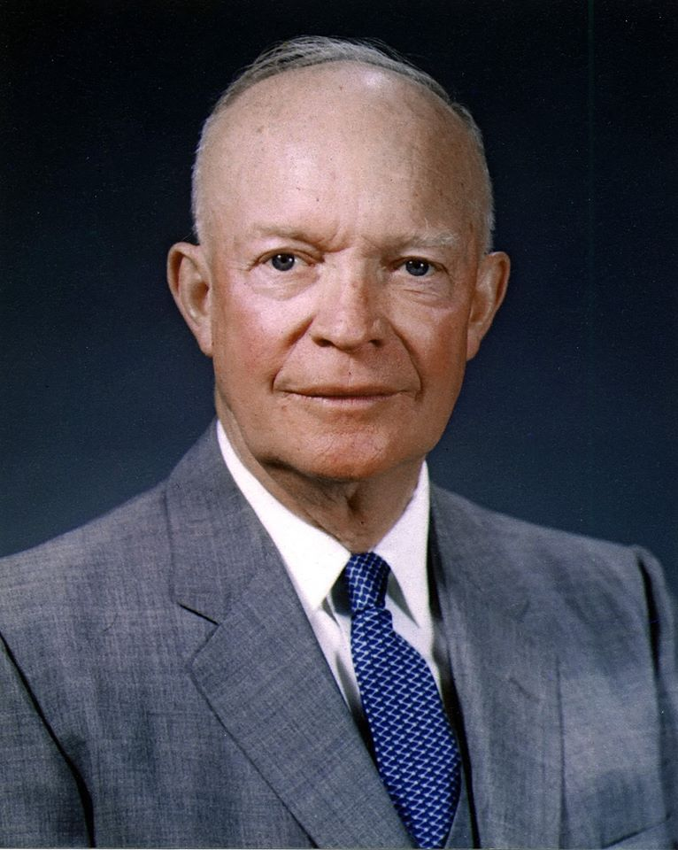  

### 1942

1942 roku powstała Polska Partia Robotnicza -polski organ władzy stalinowskiej w okupowanej Polsce.
Decyzja o utworzeniu PPR zapadła w 1941 roku w Moskwie po ataku Niemiec na Związek Radziecki. Stalin próbował w ten sposób doprowadzić do odtworzenia w nowych warunkach polityczno-militarych scentralizowanego ośrodka władzy komunistycznej w Polsce.
Pełnomocnictwa do utworzenia kierownictwa
partii otrzymali członkowie grup dywersyjnych – tzw. grup inicjatywnych – wyszkolonych pod
bezpośrednim nadzorem sowieckich służb
specjalnych, formalnie działających jako „szkoła partyjna Kominternu”. Mieli być zrzuceni na spadochronach na ziemie okupowanej Polski. Dowódcą przygotowanej do wysłania do Warszawy specjalnej grupy dywersyjnej mianowano Marcelego Nowotkę , ps. „Stary” – działacza Wszechzwiązkowej Komunistycznej Partii (bolszewików) , urzędnika administracji sowieckiej na ziemiach polskich okupowanych po 17 września 1939, wytypowanego wcześniej do udziału w specjalnych szkoleniach polityczno- dywersyjnych pod Moskwą.
Właśnie 5 stycznia 1942 roku dysponujący stalinowskimi wytycznymi założyciele PPR zorganizowali w Warszawie pierwsze spotkanie organizacyjne tej partii.

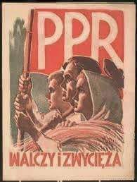  

### 1944

5 na 6 stycznia 1944 roku brytyjskie lotnictwo zbombardowało Szczecin.
Bomby spadły na Śródmieście i Nowe Miasto. 358 angielskich bombowców dokonało bombardowania, ponieważ Szczecin był ważnym dla Niemców portem, węzłem kolejowym i ośrodkiem przemysłowym.
Alianckie naloty na to miasto trwały od 1943 roku. W ich wyniku zniszczeniu uległo prawie 70 procent zabudowy miasta.

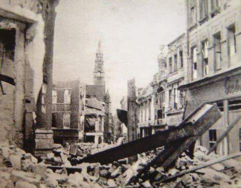  

### 1939

w Berchtesgaden miało miejsce spotkanie polskiego ministra spraw zagranicznych Józefa Becka z niemieckim kanclerzem Adolfem Hitlerem na którym strona niemiecka ponowiła wystosowane 24 pazdziernika 1938 roku żądania odnośnie Gdańska i budowy eksterytorialnej trasy przez Pomorze.
20 dni później podczas kolejnego spotkania tym razem z samym Ribbentropem Beck oznajmił:
"Tutaj mówi się już do nas wyraznie;
"Idzcie z nami, a wszystko będzie dobrze" Niemcy nie wymagają od nas udziału w wojnie przeciwko Francji czy Anglii, lecz neutralności w czasie takiej wojny i obserwacyjnego stanowiska przeciwko Rosji.
Beck, w zgodzie zresztą z całym narodem
polskim odpowiada: „ Nie ”.

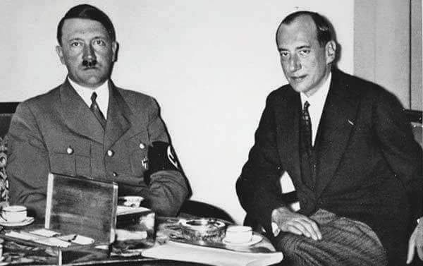  

### 1919

W Warszawie miała miejsce próba zamachu stanu dokonana na lewicowy rząd Jędrzeja Moraczewskiego przez grupę przywódców nieprzychylnej mu skrajnej prawicy.
Na czele zamachu stanęli ksiądz Eustachy Sapieha, pułkownik Marian Januszajtis-Żegota i Jerzy Zdziechowski.
Zamachowcy, mając do dyspozycji kompanię
wojska, opanowali w nocy komendę miasta
i ogłosili utworzenie Rewolucyjnego Rządu
Narodowego.
Aresztowano premiera i dwóch jego ministrów; Leona Wasilewskiego i Stanisława Thugutta.
Zamach się nie powiódł, ponieważ Szef Sztabu Generalnego Wojska Polskiego generał Stanisław Szeptycki przekonał, żołnierzy do zaniechania działań,a oddział pułkownika Leona Berbeckiego uwolnił uwięzionych ministrów.
Następstwem tych wydarzeń było zmuszenie przez samego Józefa Piłsudskiego rządu Moraczewskiego do dymisji 16 stycznia 1919 roku.
Na zdjęciu Pocztówka upamiętniająca głównych dowódców polskich z lat 1914-1918. W pierwszym rzędzie Józef Piłsudski i ówczesny pułkownik Stanisław Szeptycki (trzeci od lewej), w drugim rzędzie od lewej pułkownicy Berbecki i Żegota-Januszajtis.

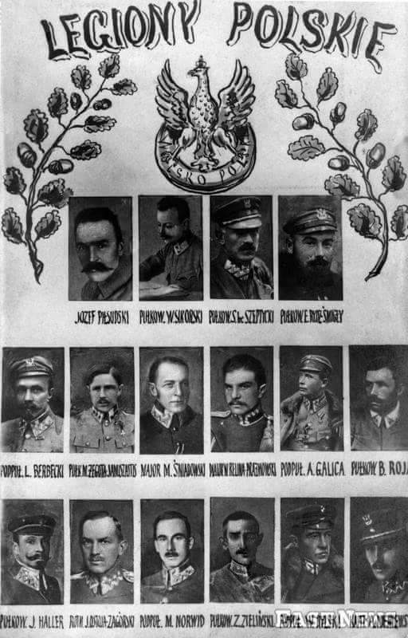  

### 1895

W Paryżu odbyła się publiczna degradacja kapitana pochodzenia żydowskiego Alfreda Dreyfusa, niesłusznie skazanego za zdradę państwa na dożywotnie pozbawienie wolności.

Na dziedzińcu Szkoły Wojskowej w Paryżu został zdegradowany kapitan Alfred Dreyfus. Po ceremonii polegającej m.in. na złamaniu jego szpady odpłynął na Wyspę Diabelską w Gujanie Francuskiej, gdzie miał odsiadywać dożywocie za szpiegostwo na rzecz Niemiec. Oskarżenie oparto jednak na wątpliwych dowodach, a na przebieg procesu i towarzyszącą mu atmosferę miało wpływ żydowskie pochodzenie Dreyfusa. Francuski kontrwywiad szybko się zorientował, że kapitan nie zdradził, co dowództwu armii nie było na rękę. Wyżsi oficerowie najpierw zataili ustalenia kontrwywiadu, a potem spreparowali dowody winy Dreyfusa. Dopiero w 1899 r. pod naciskiem opinii publicznej, m.in. słynnego artykułu Emila Zoli pt. „Oskarżam”, Dreyfus odzyskał wolność.

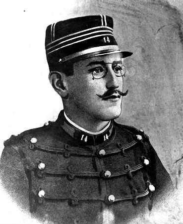  

### 1866

Władze rosyjskie wprowadziły na terenach przez siebie zagarniętych oraz w Królestwie, Polskim trwający przez wiele lat system rusyfikacji,który polegał w znacznym stopniu na obowiązkowej nauce języka rosyjskiego.
Działanie to miało na celu rusyfikację Polaków poprzez narzucenie obcego języka, kultury, sztuki i religii prawosławnej, a także rosyjskich zwyczajów.
Na zdjęciu tekst pieśni "Kiedy ranne wstają zorze" pisany cyrylicą.

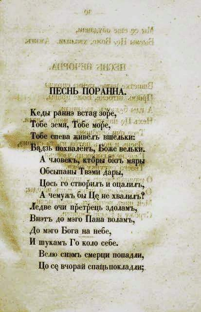  

### 1818

W Sewerynach koło Nowogrodu na Wołyniu urodził się Ernest Malinowski (zdjęcie)-słynny polski inżynier budowlany, profesor Uniwersytetu w Limie i bohater narodowy Peru.
Największym jego dziełem jest linia kolejowa biegnąca z Callao przez Limę do Huamcayo, która w najwyższym punkcie osiąga wysokość prawie 4800 metrów ponad poziom morza.
Do 2005 roku, kiedy to w Chinach pobito ten rekord była to najwyżej położona kolej na świecie.
Malinowski zmarł w 1899 roku.

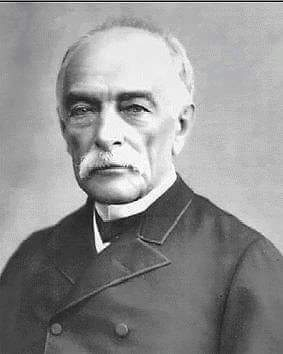  

### 1769

James Watt opatentował maszynę parową.

Wynalezienie maszyny parowej było o tyle ważne, że od tego czasu wszelką pracę ludzkich rąk można było ulepszyć dzięki temu, że zastąpiono ją pracą maszyn. Dzięki temu też ludzie mogli poczuć się dogodniej i nie przemęczać się aż tak w trakcie wykonywania różnego rodzaju czynności. Za twórcę maszyny parowej uważa się Jamesa Watta, który to w 1763 roku udoskonalił atmosferyczny silnik parowy. Tymczasem, pierwsze urządzenia oparte na sile sprężonej pary znane były już w pierwszym wieku naszej ery. Dzięki wynalazkowi maszyny parowej mogła rozpocząć się rewolucja przemysłowa. Pod napełnionym wodą kotłem spalano drewno lub węgiel, doprowadzając wodę do wrzenia. Wytworzona w taki sposób para była doprowadzana przez układ rozrządu do cylindra. Tłok został wprawiony w ruch przez naprzemienne wpuszczenie pary do przedniej i tylnej części cylindra. Następnie, za pośrednictwem korbowodu przenoszono wytworzoną energię na wał karbowy i koło zamachowe. Jedna maszyna mogła napędzić nawet i sto warsztatów tkackich. Zastąpienie siły mięśni przez urządzenia mechaniczne wpłynęło na upadek niewolnictwa i zwiększyło świadomość ludzi, nie tylko w aspektach typowo technicznych. Nastąpił wzrost świadomości społeczeństw. I chociaż maszyny parowe nie są już od dawna produkowane, to śmiało można stwierdzić, że rzeczywiście ich wpływ na postęp techniczny był nieoceniony. Nie ma drugiej takiej maszyny z tamtych czasów, która aż tak odbiłaby się na przemyśle. Dlatego wynalazek maszyny parowej jest tak ważny.

Maszyna parowa zmieniła ludzkość Początek osiemnastego wieku bardzo zmienił naszą historię. Zaczęło się to od pomysłu pewnych dwóch mężczyzn. Jednym z nich był kowal a drugim szklarz. Wynaleźli oni maszynę parową. Początkowo maszyna ta składała się jedynie z prostego cylindra, w którym poruszał się tłok. Prosta z pozoru budowa miała jednak skomplikowany (jak na te czasy) mechanizm działania. Zasilane urządzenie było parą wodną, a właściwie ciśnieniem tej pary wodnej. Na początku nie bardzo zdawano sobie sprawę, jak zmieni przyszłość to niewielkie urządzenie. Jak zmieni się życie na ziemi, kiedy człowiek zacznie korzystać z wynalazku dwóch ludzi. Maszyna na początku była bardzo żarłoczna, pochłaniała wielkie ilości węgla. Późniejsze unowocześnienia spowodowały, że maszyna nabierała właściwych kształtów oraz funkcji. Jeśli zastanawiacie się, jakie skutki wynalezienia maszyny parowej widoczne są w naszym codziennym życiu, to czytajcie dalej. Najważniejszy to rozwinięcie transportu na szeroką skalę. Na początku transportowano głównie materiały, surowce. Dopiero po pewnym czasie zaczęto budować i konstruować pociągi osobowe, służące do podróżowania. Chyba wszyscy kojarzymy romantyczne filmy, gdzie pasażerowie podróżowali wolnymi lokomotywami, które niemiłosiernie kopciły. Warto też podkreślić, że zaczął zmieniać się przemysł na świecie. Praca stawała się bardziej wydajna, co zwiększało płace - zmniejszył się koszt pracy i uzyskania produktu. A to spowodowało, że produkty były dostępne dla większej ilości ludzi! Sklepy zaczęły powstawać i oferować swoje produkty, to wszystko wpłynęło na komfort życia. Maszyny wykorzystywano w górnictwie oraz w przemyśle włókienniczym. Po pewnym czasie powstała jednak rewolucja przemysłowa, niektórzy ludzie nie byli zadowoleni ponieważ tracili swoje miejsca pracy. Wynalezieniu maszyny parowej przypisuje się również wystąpienie grup społecznych. Ludność zaczęła się dzielić na burżuazję oraz klasę robotniczą, tak zwany proletariat. Takie rozwarstwienie zakończone zostało dopiero po wojnie.

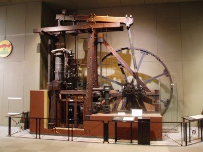  

### 1580

Król Stefan Batory zdecydował o ujednoliceniu systemu monetarnego w Królestwie Polskim i Wielkim Księstwie Litewskim.
Dwa lata wcześniej uruchomiono w Olkuszu w której powstawały ówczesne monety.
Zdjęcie przedstawia Talara Miasta Gdańska wybitego w 1577 roku podczas oblężenia miasta przez wojska Batorego.

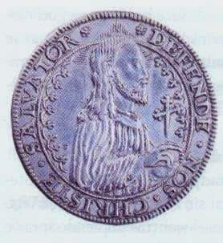  

Król Stefan Batory wprowadził polski system pieniężny w Wielkim Księstwie Litewskim.

Stosowana w późnym średniowieczu i później metoda bicia monety. Potężne ramiona machiny pozwalały wytworzyć znaczną siłę niezbędną do precyzyjnego odbicia stempla. Rzecz jasna tempo takiej produkcji nie było zbyt imponujące- pozwalało na wybicie kilkudziesięciu monet w ciągu dnia.

Okres denarowy:

Denary wybite przez Mieszka I to właśnie pierwsze polskie pieniądze. Choć pojawiły się w obiegu na ponad tysiąc lat przed wprowadzeniem euro, można było nimi płacić... w całej Europie. System denarowy nie dość bowiem, że nie był polskim wynalazkiem, to we wczesnym średniowieczu miał charakter uniwersalny. Ba, od tego, w jakim kraju wypuszczono dany rodzaj denara, znacznie większe znaczenie miała jego jakość. Denar był podstawową monetą obiegową jeszcze w cesarstwie rzymskim. Ale jego wartość określił na nowo pierwszy cesarz średniowiecza, czyli Karol Wielki. System monetarny Karola Wielkiego opierał się na funcie, który odpowiadał dokładnie funtowi (karolińskiemu - było to 367,2 g) srebra. Funt dzielić się miał na 12 solidów (lub szylingów) i na 240 denarów. Tym samym denar Karola Wielkiego to moneta średniej wartości, o masie ok. 1,52 g srebra.

Denar Mieszka I spełnia właśnie ten standard - pierwsze polskie monety ważyły mniej więcej 1,5 g. Wybito je z dobrej jakości srebra, bez "oszczędnościowych" domieszek. Mieszko I wybił zaledwie ok. 30 tys. monet denarowych - z łącznie ok. 50 kg srebra. Do dzisiejszych czasów zachowało się około 50 tych monet - wartość pojedynczej sztuki przekracza 25 tys. zł.

Denary były bite przez kolejnych polskich władców jeszcze przez 300 lat po Mieszku I. Cały ten czas nazywamy okresem denarowym.

System ten nosi pozory uniwersalnego porządku - w rzeczywistości był jednak raczej gigantycznym bałaganem. W obiegu w całej Europie krążyły denary z setek różnych emisji różnych władców, różnych krajów. Różniły się między sobą wręcz gigantycznie. Porządne denary Karola Wielkiego czy Mieszka I (czyli monety z VIII i X w.) ważyły nawet 10 razy więcej niż "kryzysowe" denary bite w XIIIw. Część z nich była stemplowana tylko z jednej strony - były tak cienkie, że nawet najzdolniejszy mincerz nie byłby w stanie wybić i awersu, i rewersu. Takie denary nazywano brakteatami (od łacińskiego słowa "brakteas" -czyli "blaszka").

Świadome działania władców psujących monetę, by z tej samej ilości srebra wypuścić większą liczbę monet, to jeszcze nie wszystko. W roku 1200 nawet wybity według najlepszych standardów mieszkowy denar mógł już ważyć zauważalnie mniej - powszechna była bowiem praktyka zeszlifowywania części srebra z lepszych monet po to, by zachować ją dla siebie. Jeszcze większe było jednak prawdopodobieństwo, że ten dobry mieszkowy denar został już dawno przetopiony, a z pozyskanego w ten sposób (z tego jednego denara) srebra któryś z przedsiębiorczych władców wypuścił od 7 do 10 brakteatów.

Okres groszowy:

U progu XIV w., gdy cała Europa zmagała się z problemami wynikającymi z kompletnego zepsucia systemu denarowego, nie mogło być lepszego interesu niż wprowadzenie do obiegu nowego, porządnego pieniądza. W naszej części kontynentu pierwszy zrozumiał to czeski król Wacław II, który w 1300 r. rozpoczął bicie nowej srebrnej monety - grosza praskiego. Grosz był monetą grubą. W pierwszej emisji ważył 3,78 g i odpowiadał aż 12 tzw. małym denarom. Wszystkie monety spełniały te same standardy i były bite z wysokojakościowego srebra bez domieszek. Natychmiast więc to grosz przejął rolę monety rozliczeniowej w całym regionie. Tym bardziej że jakościowych praskich groszy nie brakowało.

Wacław był posiadaczem potężnych - jak na ówczesne możliwości - złoży srebra w Kutnej Horze. Pozwalały one na bicie kilkudziesięciu milionów groszy rocznie - już w pierwszych dekadach XIV w. grosz praski określił więc nowy monetarny standard w całej Europie - także w Polsce. Wacław II zgromadził w ten sposób ogromny majątek. W średniowieczu monety w momencie wprowadzania do obiegu były własnością władcy. Mógł on za ich pomocą zarówno regulować zobowiązania własne i państwa, jak też skupować ziemię, złoto i inne kosztowności. Wacław i jego następcy nie stronili od takich inwestycji. Dość szybko -zapoczątkował to już Wacław II - także grosze zaczęły być psute.

Śladem Wacława II próbował pójść Kazimierz Wielki. Bił on własne grosze -krakowskie. Odpowiadały one w pełni groszom praskim. Ambicje Kazimierza powstrzymały jednak realia - w Polsce niemal nie było złóż srebra, a do bicia groszy krakowskich wykorzystywano srebro z rynku wtórnego. To zaś oznaczało, że na emisji monet nie tylko nie da się zarobić, ale trzeba wręcz do niej dokładać. Dlatego też groszy krakowskich wybito stosunkowo niewiele. Nie miały specjalnego wpływu ani na zasobność skarbca Kazimierza Wielkiego, ani na funkcjonowanie gospodarki. Z pewnością natomiast bicie własnej monety przynosiło Kazimierzowi korzyści polityczne i wizerunkowe. Było świadectwem zjednoczenia państwa po okresie rozbicia dzielnicowego.

Realnie jednak podstawową monetą pozostającą w Polsce w obiegu w czasach Kazimierza i przez następnych dwieście lat był importowany grosz praski.

W tym samym mniej więcej czasie w Polsce funkcjonował jeszcze jeden importowany, lecz z innego niż Czechy kraju, pieniądz.

Był to dukat - czyli moneta złota. Pierwsze polskie dukaty -w bardzo symbolicznych ilościach - wybił już Władysław Łokietek. Dukaty Łokietka ważyły 3,43 g, mieszcząc się w ówczesnych europejskich standardach. Dukaty bite były w wielu krajach.

Kazimierz Wielki, który i tak musiał dopłacać do emisji srebrnych groszy krakowskich, nawet nie próbował eksperymentować z biciem złotej monety. Wybrał jednak całkiem sprytne rozwiązanie, dzięki któremu w polskim obiegu pojawiły się masowo dukaty pochodzące z Węgier. Podstawowym bogactwem kopalnym XIV-wiecznej polski nie było ani srebro, ani tym bardziej złoto, lecz sól. A jednym z głównych jej importerów - Węgry. Właśnie w złocie pobierano od węgierskich kupców opłaty za kolejne partie soli - tak węgierskie dukaty trafiały do państwowej kasy, a następnie do obiegu. Węgierskiego dukata ze względu na charakterystyczny ciemniejszy odcień większości nazywano czerwonym złotym. Stąd wywodzi się późniejsza nazwa już stricte polskiej waluty.

Na srebrnych groszach i czerwonych złotych opierał się polski system walutowy do końca dynastii Jagiellonów. Rolę większej jednostki przeliczeniowej spełniała natomiast grzywna krakowska - odpowiadająca 196 g srebra i (początkowo) 48 groszom praskim. W miarę deprecjacji i psucia groszy praskich zmieniała się oczywiście liczba groszy składających się na jedną grzywnę - w ostatecznym rachunku liczyła się masa srebra.

W połowie XVw. do akcji wkracza także złoty polski - jest to jednak początkowo tylko inny niż grzywna (bo oparty na liczbie, a nie na wadze) rodzaj jednostki obliczeniowej -złoty polski równał się zawsze 30 srebrnym groszom i był ekwiwalentem jednego czerwonego złotego.

Droga do złotego:

XVI i XVIIw. to czas dość radosnej twórczości kolejnych władców w zakresie kreacji monet i nominałów. W czasach Zygmunta Augusta oprócz dukatów i groszy bito w Polsce między innymi obole, dwudenary, dwugrosze, trojaki, czworaki i szóstaki. Coraz ważniejszą rolę odgrywały też talary, czyli srebrne monety o znacznej wartości iznacznej masie -28 g. Na początku XVIw. jeden talar odpowiadał 45 groszom - co zresztą nieźle ilustruje spadek jakości, zawartości srebra i realnej wartości tych ostatnich. Gdyby grosze zachowały standard z czasów Wacława II i Kazimierza Wielkiego, talar wart byłby nieco ponad 7groszy. W rzeczywistości jednak wartość grosza spadła przez dwa stulecia ponadsiedmiokrotnie.

W połowie XVIIw. na dobre (choć, bądźmy szczerzy, kiepsko) zaczyna się historia złotego jako realnego pieniądza - już nie tylko jednostki obliczeniowej. Pierwszym fizycznym złotym jest kryzysowa trzy¬dzie¬stogroszówka ochrzczona mianem tymfa (więcej w ramce obok), bita na polecenie JanaII Kazimierza Wazy. Choć debiut monet o wartości jednego złotego trudno uznać za udany, to jednak wygoda związana z takim rozwiązaniem przeważyła. Różne typy monet złotowych są bite przez cały XVIIIw. W czasach saskich są one jednak mocno niepełnowartościowe. Sytuację polskiej waluty dodatkowo pogarsza to, że na zlecenie rządów państw ościennych - przede wszystkim Prus - jest ona fałszowana na skalę wręcz przemysłową. Cel takich działań był dość oczywisty - chodziło o destabilizację polskiego państwa i gospodarki.

Ostatnia szansa?

Odwrócić ten los próbował Stanisław August Poniatowski. Ostatni król polski - będący zresztą zapalonym numizmatykiem i posiadaczem jednej z największych kolekcji monet w ówczesnej Europie - przeprowadził gruntowną reformę monetarną. Za podstawę systemu przyjął grzywnę kolońską (233,8 g srebra). Bito z niej 10 talarów lub 80 złotych polskich. Dodatkowo, na znacznie mniejszą skalę, bito też złote dukaty -odpowiadające 16,75 złotego polskiego. W czasach Stanisława Augusta Poniatowskiego po raz pierwszy rozważano też wprowadzenie do obiegu banknotów -ostatecznie pokusił się o to (bez sukcesu) dopiero rząd insurekcji Kościuszkowskiej.

Złoty i zaborcy:

W okresie zaborów złoty stał się na powrót walutą przede wszystkim rozrachunkową -na którą przeliczano waluty zaborców. Ale w Królestwie Polskim bito także monety złotowe. W latach 1815-1834 bito 84 złote z jednej grzywny kolońskiej, później kurs złotego został sztywno związany z carskim rublem. Jeden złoty był wart piętnaście kopiejek. Od roku 1841 złote pozostawały w Królestwie Polskim w obiegu jednocześnie z rublem.

Właśnie dzięki temu złoty pozostał obecny w powszechnej świadomości jako podstawowa - mimo wszystko - polska waluta. Ale to, że złoty był pod zaborami emitowany pod carskim patronatem, było główną przyczyną, dla której w pierwszym Sejmie wolnej Polski całkiem serio debatowano nad całkowicie nową nazwą dla polskiego pieniądza.

### 1173

Rozbicie dzielnicowe: po śmierci księcia mazowieckiego, sandomierskiego i krakowskiego oraz księcia zwierzchniego Polski Bolesława IV Kędzierzawego nowym księciem zwierzchnim został książę wielkopolski Mieszko III Stary.

W wieku 51 lub 52 lat zmarł Bolesław Kędzierzawy, princeps, czyli książę zwierzchni Polski. Był jednym z sześciu synów Bolesława Krzywoustego i jego drugiej żony Salomei z Bergu (mieli też sześć córek). Księciem krakowskim (dzielnica senioralna), a także śląskim został w 1146 r., gdy z braćmi wygnał z kraju dotychczasowego seniora Władysława, który zyskał przydomek Wygnańca. Władysław był przyrodnim bratem Kędzierzawego, jedynym synem Krzywoustego z pierwszego małżeństwa ze Zbysławą. Oprócz ziemi krakowskiej i śląskiej Kędzierzawy od 1138 r. władał także Mazowszem przyznanym mu w testamencie przez ojca, a od 1166 r. księstwem sandomierskim, które objął po śmierci brata Henryka. Seniorem po Bolesławie został jego młodszy brat Mieszko Stary.

---

<a href="https://github.com/TomaszWaszczyk/historia.waszczyk.com/edit/master/src/content/january-5.md" target="_blank">Edytuj tę stronę dzieląc się własnymi notatkami!</a>
