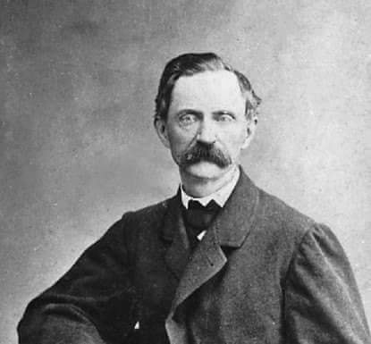

### 1942

Radzieckie ministerstwo spraw zagranicznych wysłało do wszystkich państw, z którymi utrzymywało stosunki dyplomatyczne opis bestialstw niemieckich dokonanych na terytorium ZSRR. Co ciekawe Rosjanie oprócz Litwy, Łotwy i Estonii wymienili tam również zajęte przez siebie terytoria Polski.

### 1913

W Porąbce (obecnie dzielnica Sosnowca ) urodził się Edward Gierek.
Pochodził z rodziny o tradycjach robotniczych. Jego ojciec Adam był Górnikiem Kopalni Kazimierz. Zginął w 1917 roku podczas katastrofy górniczej. Matka Paulina wyszła potem drugi raz za mąż za Antoniego Jarosa, którego nazwisko młody Edward przyjął na kilka lat. Małżeństwo Pauliny i Antoniego zakończyło się gdy ten zmarł na gruźlicę. Jakiś czas później Paulina została żoną Władysława Koziaka, z którym wyemigrowała do Francji, zabierając ze sobą 16 letniego wtedy Edwarda. W czasie pobytu w tym kraju Gierek pracował razem z ojczymem w kopalni potasu, z której następnie został zwolniony z powodu złego stanu zdrowia. W roku 1931 zasilił szeregi polskiej sekcji Francuskiej Partii Komunistycznej, by w roku 1934 zorganizować strak solidarnościowy ze zwalnianymi polskimi górnikami z kopalni Leforest za co został karnie deportowany do Polski. W listopadzie tego samego roku rozpoczął służbę wojskową w I Pułku Artylerii Motorowej, która trwała 2 lata, a po zakończeniu której wyemigrował do Belgii, gdzie podjął pracę w kopalni węgla kamiennego w Eisden w Limburgii oraz ponownie rozpoczął działalność komunistyczną. To właśnie wtedy nauczył się płynnie mówić po francusku i flamandzku.
W roku 1946 został członkiem Komitetu Polskiej Partii Robotniczej w Belgii. Do Polski powrócił w roku 1948, by rok później osiedlić się w Katowicach. Trzy lata później po raz pierwszy został posłem na Sejm, a w roku 1954 sekretarzem Komitetu Wojewódzkiego Polskiej Zjednoczonej Partii Robotniczej w Katowicach. W 1956 roku stanął na czele komisji badającej przyczyny wybuchu "poznańskiego czerwca". W roku 1957 został I sektetarzem tym razem już Komitetu Wojewódzkiego PZPR w Katowicach.
Pod koniec lat sześćdziesiątych wyrósł na naturalnego przywódcę partii komunistycznej i po krwawo stłumionym wystąpieniu robotników w grudniu 1970 zastąpił skompromitowanego Gomułkę na stanowisku I sekretarza KC PZPR, z poparciem Piotra Jaroszewicza i Władysława Kruczka i Józefa Tejchmy.
Okresem w jego życiorysie budzącym do tej pory największe emocje, kontrowersje, a w wielu przypadkach entuzjazm, a nawet sentyment są lata 1970-1980, kiedy to sprawował funkcję I sektetarza Komitetu Centralnego Polskiej Zjednoczonej Partii Robotniczej. Okres ten jest postrzegany przez jednych jako czas wielkiego prosperity polskiej gospodarki, a przez innych jako wstęp do późniejszego kryzysu gospodarczego. To wtedy zostało ukute słynne hasło "Pomożecie?".
Zawirowania gospodarcze i polityczne takie jak Radom 1976 doprowadziły do podważenia mocnej do tej pory pozycji Gierka w PZPR.
Początek lat 80 tych, kiedy to powstawała Solidarność był dla Gierka końcem jego kariery politycznej. Jeszcze przed podpisaniem
porozumień sierpniowych oficjalne komunikaty prasowe podawały, że Edward Gierek przekazał tymczasowo władzę Stanisławowi Kani ze względu na chorobę serca i konieczność hospitalizacji. 5 września trafił do kliniki w Aninie z objawami zawału. 6 września 1980, na VI Plenum PZPR, formalnie zdecydowano o odebraniu Edwardowi Gierkowi stanowiska I Sekretarza KC PZPR i wybrano w jego miejsce Stanisława Kanię. W lipcu tego samego roku Gierek został ostatecznie wyrzucony z partii, a w czasie stanu wojennego, na rozkaz generała Jaruzelskiego został aresztowany i osadzony w ośrodku rządowym w Głębokiem koło Koszalina. 6 stycznia 1982 prokuratura generalna wydała komunikat o prowadzeniu 218 postępowań karnych przeciwko byłym członkom kierownictwa PZPR . Został zwolniony z internowania w grudniu 1982 roku, był otoczony został stałą obserwacją.
Lata osiemdziesiąte spędził w gronie rodzinnym. Pogarszał się także jego stan zdrowia, ujawniła się nabyta pylica. W listopadzie 1989 udzielił Januszowi Rolickiemu wywiadu, na podstawie którego powstała pierwsza książka Edward Gierek. Przerwana dekada.
Edward Gierek zmarł 29 lipca 2001 roku w Cieszynie.
Poniżej przedstawiam dający chyba wiele do myślenia fragment wspomnianego już wywiadu Przerwana dekada.
" Obecna Polska przeżywa zachłyśnięcie się Zachodem i amerykańskimi rozwiązaniami ekonomicznymi. Wiem jednak, czym jest kapitalizm. W odróżnieniu od większości współczesnych Polaków żyłem w nim i poznałem jego zalety i wady. Kapitalizm jest jednak zaprzeczeniem etosu równości społecznej i sprawiedliwości. Demokratyczna zasada równości złożona na ołtarzu pieniądza jest niestety tylko pozorna. Czeka nas straszne rozwarstwienie społeczne, bezrobocie i niestety raczej nie europeizacja lecz latynizacja czyli kapitalizm nędzy. Jeszcze ciągle ludzie zaczadzeni hasłami antykomunistycznymi nie uświadamiają sobie w pełni, że nie tylko zyskali wiele dzięki ostatnim zmianom ale też wiele stracili. Przede wszystkim stracili spokój socjalny i poczucie bezpieczeństwa (…) Ciekawy jestem jak długo starczy ludziom wiary w lepsze jutro w sytuacji, gdy polityka rządowa polega na gwałtownej pauperyzacji społeczeństwa. Równowagę gospodarczą obecna władza chce uzyskać drogą bezprzykładnego ubożenia społecznego (…) Oby wokół naszych miast nie pojawiły się slumsy a sklepy nie były pełne drogich towarów niedostępnych dla nędzarzy snujących się po ulicach. Znam to z czasów przedwojennych apoteozowanych dziś, jakże niesłusznie na wszystkie możliwe sposoby. Boję się też, że gdy sięgniemy po pomoc ale nie bezinteresowną, nadejdzie z Zachodu - z sytych i zamożnych Niemiec. I znowu jak przed laty na tej ziemi pojawią się panowie, którzy będą za bezcen wykupywali polską własność. Oby nie powróciła sytuacja sprzed wojny gdy zarządy fabryk należały do cudzoziemców, głównie Niemców a Polacy byli robolami (…) Z nową siła wracają nasze stare sentymenty do Zachodu, do Ameryki. O jakże naiwni jesteśmy wierząc w szczerą bezinteresowność Jankesów (…) Wierzcie mi, rozmawiałem z trzema amerykańskimi prezydentami i wiem, że dla nich jesteśmy tylko pionkami na wielkiej szachownicy światowej polityki. Pionkiem o tyle ważnym o ile można go wykorzystać do ruchu przeciwko "czerwonej" Rosji. Może to zabrzmi obrazoburczo ale o ile upadnie na trwałe światowy system socjalistyczny rola Polski w świecie spadnie katastrofalnie. Staniemy się wielką prowincją Europy i magazynem taniej siły roboczej"

### 1813

W Ławkach koło Trzemeszna urodził się Hipolit Cegielski - wielkopolski przemysłowiec i działacz społeczno-kulturalny, dziennikarz, doktor filozofii, nauczyciel łaciny, greki, języka polskiego, historii i geografii. Autor dwóch książek: „Gramatyka języka greckiego” oraz „Nauka poezji”. Hipolit Cegielski założył w 1855 roku fabrykę narzędzi i machin rolniczych w Poznaniu oferującą 106 rodzajów maszyn i narzędzi, usytuowaną przy ul. Koziej 7 (obecnie Zakłady Przemysłu Metalowego „H. Cegielski”, HCP). Był redaktorem naczelnym Gazety Polskiej, ukazującej się w Poznaniu od 22 marca 1848 do czerwca 1850 roku, która stanowiła organ Komitetu Narodowego. W 1858 roku zakupił 2 ha gruntu przy ul. Strzeleckiej i wybudował na nim nową fabrykę, gdzie zatrudnienie znalazło ponad 1000 osób. Nowa fabryka wyposażona była m.in. w 10-konną maszynę parową poruszającą machiny warsztatowe oraz we wszelkie udoskonalenia mechaniczne. W kompleksie fabrycznym powstała również nowa odlewnia. W 1861 roku powołał do życia pierwszą na obszarze Księstwa Poznańskiego spółkę kredytową.
Pod koniec życia podjął się budowy nowego gazometru, który miał obejmować 112 tysięcy stóp kubicznych.
Zmarł 30 listopada 1868 roku.

  

### 1573

Po śmierci króla Zygmunta II Augusta, w Warszawie zebrał się po raz pierwszy poprzedzający wolną elekcję Sejm konwokacyjny.

Po bezpotomnej śmierci króla Zygmunta Augusta w Warszawie po raz pierwszy rozpoczął obrady sejm konwokacyjny, poprzedzający niezbędną w sytuacji braku następcy wolną elekcję. Miał on ustalić listę kandydatów do tronu oraz termin i miejsce elekcji, a także określić kształt pacta conventa obowiązujących przyszłego monarchę. Brani pod uwagę byli m.in. Ernest Habsburg, król Jan III Waza i car Iwan Groźny. Najpoważniejszym kandydatem okazał się Henryk Walezy, brat króla Francji Karola IX, i to on kilka miesięcy później został wybrany na króla. 21 lutego następnego roku odbyła się jego koronacja. Niecałe cztery miesiące później uciekł do Francji.

  

---

<a href="https://github.com/TomaszWaszczyk/historia.waszczyk.com/edit/master/src/content/january-1.md" target="_blank">Edytuj tę stronę dzieląc się własnymi notatkami!</a>
