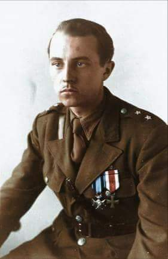
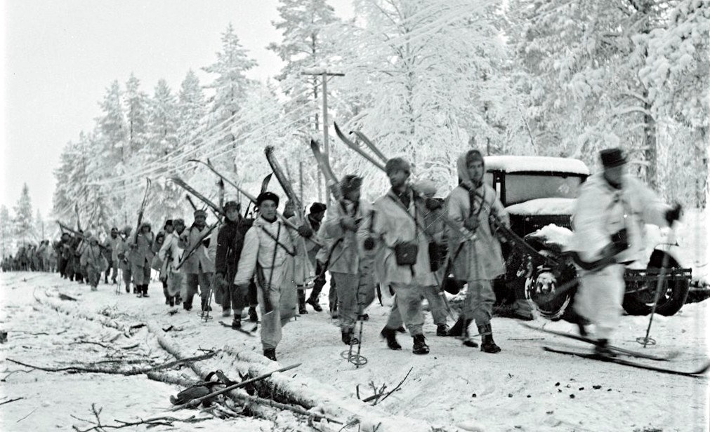
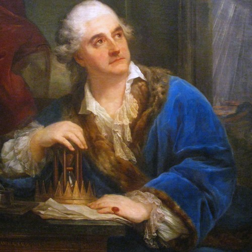

### 1949

W gmachu Ministerstwa Bezpieczeństwa Publicznego przy Koszykowej róg al. Ujazdowskich w Warszawie został zamordowany w czasie śledztwa Jan Rodowicz ,,Anoda'' - harcerz 21. Warszawskiej Drużyny Harcerzy im. gen. Ignacego Prądzyńskiego oraz słynnej „Pomarańczarni” (23 WDH im. Króla Bolesława Chrobrego), student Politechniki, żołnierz oddziału harcerskiego Grup Szturmowych Szarych Szeregów, w Powstaniu warszawskim zastępca dowódcy plutonu ,,Felek'', kompanii ,,Rudy'', batalionu ,,Zośka'', w akcji pod Arsenałem dowódca sekcji ,,butelki'', sierżant podchorąży - porucznik rezerwy piechoty ZWZ-AK, odznaczony Virtuti Militari V-ej klasy i dwukrotnie Krzyżem Walecznych . Jan Rodowicz został aresztowany w Wigilię 1948 roku. Aresztowanie Anody zainicjowała podpułkownik Julia Brystiger, ale formalny nakaz aresztowania wydał w tej sprawie major Wiktor Herer, czyli ówczesnym naczelnik Wydziału IV Młodzieży Departamentu V MBP, który po wielu latach usiłował wytłumaczyć swoją decyzję tym,, że aresztując „Anodę”, chcieli wraz z Brystigier uchronić go przed o wiele groźniejszym w skutkach dostaniem się w ręce słynącego z sadyzmu szefa Departamentu Śledczego, Józefa Różańskiego.
Najbardziej prawdopodobną przyczyną aresztowania Anody był donos złożony przez konfidenta UB, który potajemnie działał w środowisku ,,zośkowców''. Prokuratura i UB oficjalnie ogłosiły, że przyczyną śmierci "Anody" był krwotok z tętnicy głównej spowodowany samobójczym upadkiem z okna IV piętra budynku. Ekshumacja przeprowadzona przez rodzinę Anody wykazała na jego ciele wgniecenia klatki piersiowej oraz niewielki otwór po postrzale znajdujący się za uchem.

  

### 1940

Wojna zimowa: zdecydowanym zwycięstwem wojsk fińskich zakończyła się bitwa na drodze Raate.

W zakończonym tego dnia starciu, które przeszło do historii jako bitwa na drodze Raate, Finowie zmasakrowali radziecką dywizję. Zastosowali taktykę, którą nazwali „motti” - polegającą na okrążaniu sił nieprzyjaciela posuwających się leśnymi duktami, rozdzielaniu ich na mniejsze grupy, zamykaniu w kotłach i w końcu niszczeniu głodem i ogniem. Fińscy historycy szacowali sowieckie straty w tej bitwie na 17 tys. ludzi. W ten sposób Finowie wielokrotnie zadawali Sowietom potężne straty. Wojna radziecko-fińska rozpoczęta atakiem Armii Czerwonej 30 listopada 1939 r., a zakończyła się 13 marca 1940 r. Finowie musieli oddać ZSRR część terytorium, ale straty Sowietów oraz ich sposób dowodzenia wskazywały, że w przyszłej wojnie Armia Czerwona będzie miała ogromne problemy.

  

### 1795

Ostatni król Polski Stanisław August Poniatowski został wywieziony na zesłanie do Grodna.

Niespełna dwa miesiące po upadku insurekcji kościuszkowskiej król Stanisław August Poniatowski pod eskortą rosyjskich żołnierzy wyjechał z Warszawy do Grodna. Caryca Katarzyna II zdecydowała, że to miasto będzie miejscem jego zesłania. Król próbował odwlec wyjazd, ale dowódca wojsk rosyjskich gen. Aleksander Suworow zignorował jego prośby, by poczekać na lepszą pogodę, i zmusił go do opuszczenia Zamku Królewskiego, jak się okazało, na zawsze. W Grodnie nadzorcą króla był książę Mikołaj Repnin. 24 października 1795 r. Rosja, Austria i Prusy podpisały traktat w sprawie III rozbioru Polski, a miesiąc później uwięziony król abdykował. W Grodnie przebywał dwa lata, zmarł w Petersburgu w 1798 r.

  

---

<a href="https://github.com/TomaszWaszczyk/historia.waszczyk.com/edit/master/src/content/january-7.md" target="_blank">Edytuj tę stronę dzieląc się własnymi notatkami!</a>
