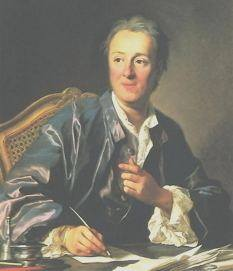

### 2023

Nowa dywizja Wojska Polskiego na Podlasiu.

  

Szef MON przedstawi koncepcję utworzenia 1 Dywizji Piechoty Legionów. Żołnierze w niej służący będą stacjonować na Podlasiu i Mazowszu.

We wrześniu 2022 roku wicepremier i minister obrony narodowej Mariusz Błaszczak podjął decyzję o powołaniu pełnomocnika MON ds. sformowania nowego - piątego związku taktycznego Wojska Polskiego - 1 Dywizji Piechoty Legionów. Swoim zasięgiem obejmie ona obszar pomiędzy terenem odpowiedzialności 16 i 18 Dywizji Zmechanizowanej, czyli między Warmią i Mazurami a Lubelszczyzną. W październiku w Ciechanowie szef MON ogłosił powstanie nowego batalionu czołgów, który będzie częścią nowo formowanego związku taktycznego. W miejscowości tej zostanie również ulokowane dowództwo dywizji.

Minister gościł też w Kolnie i Grajewie w Podlaskiem. Mają tam zostać utworzone nowe jednostki wojskowe.

„Wnioski z przeprowadzonych ćwiczeń i symulacji doprowadziły do decyzji o formowaniu dywizji, która pod kątem struktury będzie podobna do funkcjonujących już 16 i 18 Dywizji Zmechanizowanej. Nowa dywizja zostanie wyposażona w najlepszy sprzęt wojskowy, którym już dysponuje Wojsko Polskie oraz który będzie niebawem pozyskany (m.in. czołgi, haubice, wyrzutnia Langusta i moździerz Rak). Pozwoli to skuteczniej odstraszać potencjalnego agresora i przygotować skuteczniejszą obronę w razie ataku. Nazwa dywizji nawiązuje do historycznego związku taktycznego, który zapisał się najdłuższą walką o niepodległości Polski w okresie I i II wojny światowej" - przypomina MON.

### 2022

> Morawiecki: Obniżymy VAT na paliwa z 23 proc. do 8 proc.

Podatki stopniowo (prawdopodobnie) będą zmniejszane, podatki związane z konsumpcją.

---

> Gomułka: RPP powinna podnieść stopy do 6-8 proc.

  

> Inflacja ma w tym roku wynieść średniorocznie blisko 8 proc. - przewiduje NBP. Aby spowolnić wzrost cen i przeciwdziałać utrwaleniu groźnego trendu, Rada Polityki Pieniężnej rozpoczęła cykl podwyżek, podnosząc stopę referencyjną z 0,1 proc. do 2,25 proc. Zdaniem głównego ekonomisty BCC Stanisława Gomułki to zdecydowanie za mało.

---

### 2021

Historia zatacza koło. Kto by kiedyś pomyślał, że Ameryka, stawiana za wzór demokracji, w niektórych elementach upodobni się do bolszewickiej Rosji. Oczywiście ni wprost. Mamy XXI wiek.
Przez jednego szaleńca żądnego władzy, cały amerykański mit runął jak House of Cards.
Łatwo sobie wyobrazić dzisiaj nastrój Putina na Kremlu czy Łukaszenki na Białorusi. Jak oni się zachowają po przegranych wyborach? Łukaszenka już dał przykład. A teraz, po takiej inspiracji?
Czy Polska i świat pójdą tą drogą?
Mam nadzieję, że prawdziwi Republikanie odetną się od Trumpa i jego bandy, a amerykańska demokracja się jednak obroni, czego szczerze im życzę.

  

### 1947

W Londynie w wieku 61 lat zmarł Tadeusz Kutrzeba (zdjęcie) kapitan Sztabu Generalnego cesarskiej i królewskiej Armii, generał dywizji Wojska Polskiego II RP , dowódca Armii „Poznań” podczas wojny obronnej 1939 roku.
Był synem Tomasza Kutrzeby-kapitana armii austriackiej. W wieku 10 lat rozpoczął naukę w szkole realnej w Fischau kołi Wiener Neustadt. W 1903 roku zdał egzamin maturalny w Państowym Gimnazjum Realnym w Wiedniu, by później zostac studentem Wojskowej Akademii Technicznej w Mödling koło Wiednia. W latach 1906-10 służył w 9 Krakowskim Batalionie Saperów. Od 1910 roku studiował w Akademii Sztabu Generalnego w Wiedniu i ukończył wyższy kurs inżynierii. W 1911 roku został porucznikiem. Podczas służby w Sarajewie był świadkiem zamachu na księcia Ferdynanda. W czasie pierwszej wojny światowej służył na fronie włoskim i rosyjskim. W kwietniu 1920 jako szef sztabu 3 Armii
uczestniczył w wyprawie wojsk polskich na Kijów. Podczas odwrotu sprawował od czerwca do sierpnia funkcję szefa sztabu
Frontu Południowo-Wschodniego. W czasie bitwy warszawskiej kierował sztabem Frontu Środkowego, a następnie od sierpnia
do stycznia 1921roku został szefem sztabu nowo utworzonej 2 Armii, która uczestniczyła w walkach o Białystok i pościgu za wojskami sowieckimi w kierunku na Grodno i Lidę . W tym czasie awansował do stopnia podpułkownika.
16 marca 1927 r. Prezydent RP Ignacy Mościcki na wniosek Ministra Spraw Wojskowych, Pierwszego Marszałka Polski
Józefa Piłsudskiego awansował go na generała brygady ze starszeństwem z 1 stycznia 1927 r. i 3. lokatą w korpusie
generałów. W czasie wojny obronnej w 1939 roku przeszedł cały szlak jako dowódca Armii "Poznań". W czasie bitwy nad Bzurą dowodził połączynymi Armiami "Poznań " i "Pomorze". To także on z upoważnienia dowódcy Armii "Warszawa" Julisza Rómmla podpisał 28 września 1939 roku Akt Kapitulacji Stolicy. Trafił do niemieckiej niewoli. Przebywał w obozach : Hohnstein, Königstein i Murnau. Organizował tam tajne kursy oficerskie. Z niewoli wyszedł w 1945 roku . Wkrótce wyjechał do Londynu, gdzie między innymi uczestniczył w organizowaniu Instytutu Władysława Sikorskiego. Zmarł na raka

  

### 1943

Do obozu kobiecego w Ravensbrück trafiła Karolina Lanckorońska (zdjęcie) polska arystokratka, historyk i mecenas sztuki, administratorka dóbr rodzinbych Lanckorońskich w Komarnie i Rozdole, żołnierz Armii Krajowej w stopniu porucznika.
Zesłanie do obozu było zamianą wyroku śmierci wydanego na nią przez Niemców 12 maja 1942 roku. W obozie pomimo grozy samego miejsca nie załamała się, lecz podtrzymywała na duchu współwięźniarki, organizując potajemnie wykłady z historii sztuki. Po długich interwencjach wpływowej rodziny została w końcu z obozu uwolniona 5 kwietnia 1945 roku. Po uwolnieniu z obozu zdołała wywieźć listę 60 operowanych kobiet i przekazać Czerwonemu Krzyżowi.
W swojej książce pt "Wspomnienia wojenne" tak pisała o Ravensbrück:
"Stałyśmy na bardzo placu czy dziedzińcu, otoczonym niskimi drewnianymi barakami o barwie szarozielonej. Wszystkie te budynki nie różniły się niczym jeden od drugiego, tylko dom, przy którym nas ustawiono był murowany, większy i wyższy. Po placu kręciły się kobiety, ubrane tak samo jednolicie, jak jednolite były budynki, które widniały z daleka."

  

### 1920

https://en.wikipedia.org/wiki/Roaring_Twenties

### 1918

Prezydent USA Woodrow Wilson przedstawił swój czternastopunktowy plan pokojowy, z których trzynasty mówił o utworzeniu niepodległego państwa polskiego.

Prezydent USA Woodrow Wilson zgłasza swe 14 punktów, które okazały się jego najsławniejszą propozycją pokojową. Nie zostały jednak zaakceptowane - po pokonaniu Rosji państwa centralne liczyły, że mimo zaangażowania się Amerykanów po stronie ententy wygrają wojnę we Francji. 13. punkt mówił o utworzeniu państwa polskiego z dostępem do morza, przez co do tej pory Wilson jest w Polsce jednym z najpopularniejszych prezydentów USA i ma w Warszawie swój plac. Po pokonaniu Niemiec, Austro-Węgier i Turcji wiele z propozycji Wilsona zostało zrealizowanych, m.in. powstała Liga Narodów, Belgia i Polska odzyskały niepodległość, a Alzacja i Lotaryngia wróciły do Francji. Jednak uznanie Niemcy za winne wojny i zmuszenie ich do płacenia ogromnych odszkodowań było zarzewiem kolejnego konfliktu. W 13 punkcie tego przemówienia Wilson powiedział:

>Należy stworzyć niezawisłe państwo polskie, które winno obejmować terytoria zamieszkane przez ludność niezaprzeczalnie polską, któremu należy zapewnić swobodny i bezpieczny dostęp do morza i którego niezawisłość polityczną i gospodarczą oraz integralność terytorialną należy zagwarantować paktem międzynarodowym

  

### 1900

W czasie spisu ludności w USA z 1900 r. co szóste dziecko w wieku od pięciu do dziesięciu lat pracowało. W rzeczywistości w tamtym czasie pracujące dzieci stanowiły 20 procent całej siły roboczej. Większość z nich nie chodziła do szkoły i była analfabetami, ponieważ ich rodzice nie mieli innego wyjścia, jak wysłać ich do pracy, aby mogli pomóc w utrzymaniu swoich rodzin.

  

### 1848

Urodził się Jakub Jodko -Narkiewicz (zdjęcie) polski szlachcic, pianista, lekarz, wynalazca, fotografik, badacz elektromagnetyzmu, nazywany "drugim Teslą" lub "elektrycznym człowiekiem"
Był absolwentem uczelni w Paryżu, Rzymie i Florencji. Początkowo nic nie zapowiadało jego naukowej kariery. Rozpoczynał jako pianista. Odbył nawet dwuletnie tournee po Europie. Do podjęcia działań w dziedzinie nauki skłoniła go choroba ojca oraz siostry Anieli cierpiącej na gruźlicę. Mieszkając w okolicach Mińska (obecnie Białoruś) rozpoczął badania w dziedzinie fizyki, bilogii, meteorologii, psychologii, medycyny, rolnictwa. Założył również pierwszą w Polsce stację meteorologiczną. Prowadził badania nad fotografią wysokonapięciową. W roku 1889 zaprezentował pierwsze fotografie elektrograficzne przedstawiające głównie rośliny. W 1896 roku pokazał swoje pierwsze urządzenie umożliwiająceobserwowanie promieniowania elektrycznego całego ciała ludzkiego. Narkiewicz prowadził również badania nad telegrafią bez druta”. Jego prace budziły zainteresowanie w całej Europie. W roku 1898 Francuskie Towarzystwo Naukowe potwierdziło jego pierwszeństwo w dziedzinie radiotelegrafii. Nie został jednak uznany jako pierwszy w historii wynalazca radia, ponieważ nie był w stanie w dostatecznym stopniu wytłumaczyć działania swego aparatu.
Zmarł w roku 1905.

  

### 1697

W Edynburgu wykonano wyrok śmierci przez powieszenie na skazanym za bluźnierstwo studencie teologii Thomasie Aikenheadzie.
Wypowiadał się on przeciwko religiom objawionym, w szczególności Biblii; był ostatnim człowiekiem w Wielkiej Brytanii straconym za bluźnierstwo, jest uważany za męczennika w obronie rozumu. Było to 85 lat po śmierci ostatniego człowieka spalonego na stosie za herezję w Wielkiej Brytanii – Edwarda Wightmana (1612).

  

---

<a href="https://github.com/TomaszWaszczyk/historia.waszczyk.com/edit/master/src/content/january-8.md" target="_blank">Edytuj tę stronę dzieląc się własnymi notatkami!</a>
