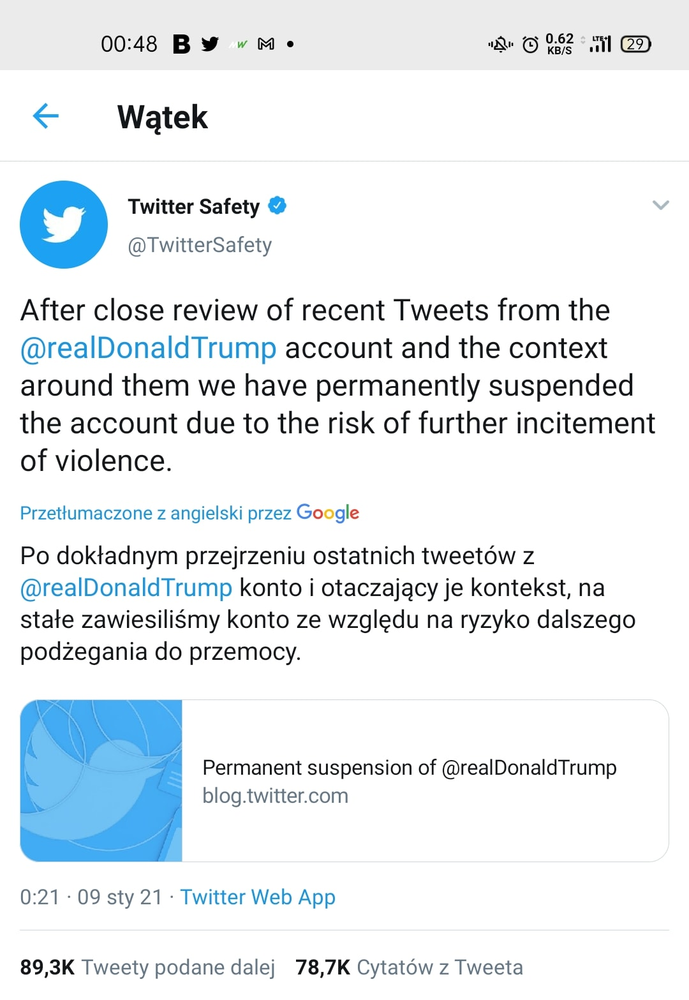
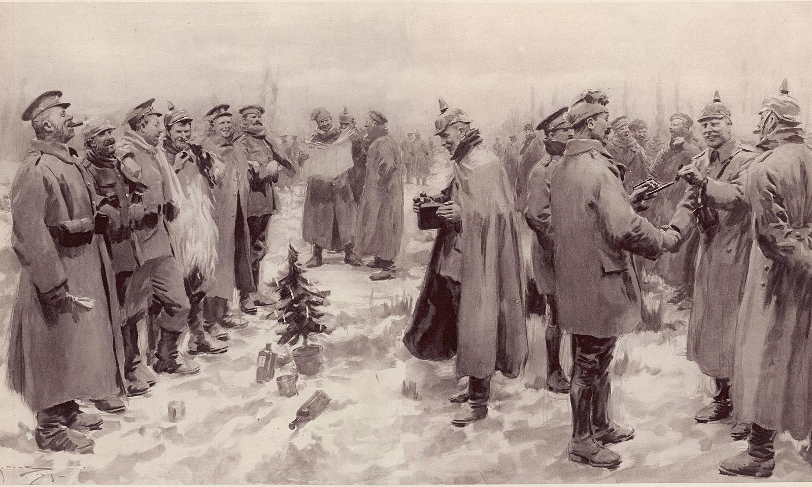

### 2021

Polityczna poprawność w internecie, początki(zaawansowane):

  

---

Bardzo rozsądny komentarz: Przemek Gdański, prezes BNP Paribas: Gospodarka skorzystałaby na zmianach w podatku bankowym

Działamy w środowisku zerowych stóp procentowych, spadku PKB w 2020 r., wzrostu kosztów ryzyka, dużej niepewności, która wiąże się z pandemią. Mamy więc efekt imadła, sektor jest ściskany z wielu różnych stron i warto, żeby rządzący spojrzeli na działania, które mogłyby ten efekt imadła bankom złagodzić - mówi Interii w cyklu "Rozmowy na Nowy Rok" Przemek Gdański, prezes BNP Paribas Bank Polska.

Paweł Czuryło, Interia: Instynkt szachisty pomaga w rozwiązywaniu kryzysowych wyzwań sektora bankowego?

Przemek Gdański, prezes BNP Paribas Bank Polska: Szachy uczą przede wszystkim myślenia do przodu i przewidywania przyszłości, konsekwencji własnych decyzji i radzenia sobie w sytuacjach, które powstają na szachownicy, a które nie do końca były przewidziane, szukania alternatywnych rozwiązań. Więc tak, oczywiście przydaje się (śmiech). Choć, podobnie jak w życiu zawodowym czy prywatnym, szachistom też brakuje dziś, w czasach pandemii i dystansu społecznego, realnego kontaktu z przeciwnikiem, gdzie wyczuwamy napięcie, obserwujemy mowę ciała, jesteśmy w stanie wywierać wpływ na przeciwnika.

Komentarz Tomka: Świat w erze cyfrowej potrzebuje bankowości, ale nie banków, dwa może trzy zbiory DLT zastąpią banki jakie znamy obecnie.

---

Papież powiedział: Zaszczepię się w przyszłym tygodniu. Mocnymi słowami określił odrzucanie szczepionki. "Jest samobójczy negacjonizm, którego nie potrafię wyjaśnić. Bo dzisiaj trzeba przyjąć szczepionkę".

---

### 2015

Umiera Józef Oleksy.

Józef Oleksy były premier, który zmarł w szpitalu, to postać barwna i kontrowersyjna. Komunistyczny aparatczyk w czasach PRL, polityk postkomuny, szef rządu, człowiek oskarżany o współpracę z rosyjskimi służbami. [Słabo współpracował, zerowe efekty, Żydunia rządzi… – admin]
Choć uchodził za osobę sympatyczną, która umiała się dogadać z każdym, przez całe życie działał w formacjach politycznych szkodzących Polsce. Sam Oleksy ma jednak przynajmniej jedną zasługę dla Polaków.

To dzięki jego szczerości w rozmowie z Aleksandrem Gudzowatym opinia publiczna mogła poznać wiele ciekawych faktów i opinii o lewicy oraz III RP. Przypomnijmy kilka z nich:

> Przekręty szły, tak (…) w bankach zrobiono krętactwo, tylko naukowe. (…) W całej Europie nie ma drugiego kraju, który by tak lekkomyślnie sprzedał banki. (…) Gangi kosmopolityczne rozkradły Polskę. (…) Ja zajmowałem się tym, co do mnie należało. Natomiast w otoczeniu moim bez przerwy tylko gry, sitwy i układy, i pokłony — mówił o przemianach w Polsce Oleksy.

Dodawał, że „przekręty szły”.

Dlatego ci powiem, że jak patrzę na tę (bankową) komisję śledczą. To tak frontalny atak na nią nie jest przypadkowy — mówił Gudzowatemu.

Wiele miejsca poświęcił swoim politycznym znajomym:

> Olejniczak (ówczesny lider SLD – red.) był w moim zarządzie i słowa nie słyszałem przez dwa lata, żeby mu się jakieś aferki w SLD nie podobały. Wszystko mu się w SLD podobało. A teraz wielki nowy Sojusz. A ten cały [Grzegorz] Napieralski [sekretarz generalny SLD – red.] był u mnie wiceprzewodniczącym z mojej rekomendacji. K…, nikt tego nie pamięta.

O Leszku Balcerowiczu wspominał:

> Przecież on był zwykłym doktorem, jak pracował w KC PZPR. My byliśmy bliskimi kolegami. Ostatnie spotkanie było 3 maja, jak go spałowali gdzieś na Starym Mieście. I on następnego dnia zadzwonił, i był cały wzburzony: Józek, ty wiesz, nic nie zrobiłem, byłem tam tylko i mnie do suki zaciągnęli. A ja mu mówię: „Lesiu, a na ch… tam szedłeś. Wiedziałeś, że będą pałować”. (…) Zanim go wylegitymowali, to spałowali. Przyszedł się do mnie żalić. A ja mu mówię: „Po coś tam kur…szedł?!”. Robienie z niego idola, przecież on kopiował…

Jeszcze ciekawiej było, gdy rozmowa zeszła na Aleksandra Kwaśniewskiego i jego żonę:

> Tych zegarków miał od cholery i nosił je kur…, nie wiadomo po co. (…) Wszyscy się dziwią, że chodzą tam wycieczki i oglądają to jego mieszkanie. To jest 400 metrów kwadratowych. (…) Apartament na rogu, przy samej szosie, bez kawałeczka ogródka, to jest były prezydent. (…) I jaka chodzi wersja? Że dostał w prezencie od Krauzego. Nie miał wyboru i lada moment to sprzeda po prostu. Jego sprawa, ale głupio wybrał, bo musi budzić zdziwienie, że były prezydent bierze ci apartament tak ch… jak ten. Co z tego, że duży, jak niemieszkalny? (…)

> Kupili przecież w Kazimierzu całe wzgórze od Jaśka Wołka. To jest ten artysta. Byłem tam. Piękne. Też nie wiem na kogo, bo nie na siebie, ale sam Jasio wybierał, przyjaciel mojej żony. Ale ich sprawa, ja nikomu nie zazdroszczę. Tylko że gdyby ktoś się zawziął, to apartament u Krauzego to jest minimum 4,5 mln zł. Przecież to jest 400 m, tam chodzi po 11 tys. metr, to policz sobie, ile to kosztuje, ten 400-metrowy apartament. Dom w Kazimierzu – nie umiem tego wycenić, ale na pewno jest to droga sprawa. Jazgarzew 6 ha działki z asfaltową drogą zrobioną do samego domu przez pola. I to nie jest wszystko.

> Ma tego majątku trochę. Jak zderzysz jego wynagrodzenia prezydenckie, a nawet Joli dochody, no to co z tego, że ona ma 100 tys. za ten program w telewizji (TVN Style), by się wstydziła tam występować. (…) Nie, do grudnia. Za całość kontraktu. I robi takie pierdoły, rozumiesz. Raz oglądaliśmy to z Majką i więcej nie oglądam. Siedzi wyfiokowana Jola i gada. Przez 15 minut czy więcej uczy obywateli, jak jeść bezę. Że bezy nie można kroić nożem i widelcem, bo może trysnąć. Że trzeba zdjąć kapelusik od bezy. I to jest k… program pierwszej damy! By się wstydziła takie programy prowadzić.

> Teraz on (Kwaśniewski) ma dołączyć jeszcze na kolejne 10 tys., ale nie uzbiera, żeby nie wiem jak się naharował, to nie uzbiera tyle, ile potrzebuje na wylegitymizowanie tego. (…) Oluś zawsze był krętaczem, i to małym krętaczem. Za co się brał, zawsze spier…. I to zjednoczenie lewicy też spier…

O sposobie zarządzania finansami SLD również nie miał dobrego zdania.

> Nie zwróciłeś uwagi, bo co ci to obchodzi, że Borowski wyciągnął koszty kampanii prezydenckiej, pięćset tysięcy, a SLD cztery i pół miliona. Tylko, że Cimoszewicz miał trzy tygodnie kampanii, a Borowski trzy miesiące — mówił biznesmenowi.

Słuchacze rozmów Oleksego z Gudzowatym mogli również przekonać się, jak działa otoczenie byłego premiera Leszka Millera:

> Sławomir Miller (przyrodni brat Leszka Millera – red.) działał samodzielnie korupcyjnie. Bo do mnie po wyborach poprzednich przyszło dwóch facetów których przyprowadził (Mieczysław) Gawor, szef BOR-u, prosząc mnie żebym ich wysłuchał, bo nikt w SLD nie chce ich wysłuchać. I oni mi przedstawili i oni proszą tylko, żeby potwierdzić, że 200 tys. dol. dotarło do pana Leszka Millera. Bo pan Sławomir Miller z dwoma BOR-owcami, którzy zostali wyrzuceni z BOR-u przez Gawora, wzięli 200 tys. dol. „A dlaczego panowie pytacie?” „A dlatego, że pan Sławomir Miller wziął sobie z tego 50 tys. dla siebie i powiedział nam to”. Poszedłem do (Edwarda) Kuczery (skarbnika SLD), mówię: Panowie, jest taki wątek, powiedz to Leszkowi, że chodzą tacy faceci, którzy twierdzą, że dali. (On na to): „A ja nie chcę o tym słyszeć, idź do Leszka”. Ja stwierdziłem, że mam to w d… Co ja będę do Leszka chodził, jak Kuczera kasę wyborczą trzyma. I zostawiłem ten temat. Ale oni (biznesmeni, którzy mieli dać 200 tys.) mówią nam: Chodzi tylko o to, czy nie zmarnowały się pieniądze. Bo były dawane na kampanię.

Również ciekawy jest wątek dotyczący syna Leszka Millera:

> W każdym razie rzecz idzie o to, kto powiedział, że Młody bierze [chodzi o syna Leszka Millera]. Bo to, że bierze to chodziło powszechnie, że nagabuje, że jest natrętny. A Miller [ojciec] moim zdaniem musi być w to zamieszany, bo on wybiela Młodego. Albo wyczuł, że jeszcze może wrócić temat Młodego. Bo skąd na przykład się Młody wziął przy rozmowie Belki z Wieczerzakiem, co telewizja pokazała. Późna pora, Pałac Prezydencki, idzie na spacer nad Wisłę Belka, Wieczerzak i Młody Miller. I żaden dziennikarz o to nie zapyta.

> Młody (Leszek, syn premiera Millera – red.) miał być aresztowany po powrocie ze Stanów na lotnisku (jesienią 2001 roku – red.). Woźniakowski (Józef, wiceminister skarbu, przyjaciel Millerów – red.) zap… do Stanów, żeby go powstrzymać. Wrócił (młody Miller) cztery miesiące później, jak Leszek był już premierem. A co robił w Stanach? Kto mu organizował? Kto się nim opiekował? Za co tam był? Sam pamiętam parę spotkań towarzyskich, na których młody gówniarz był oblegany przez Krauzego, Kulczyka, Staraka i to łasili się do niego, że aż żal było patrzyć.

Rozmowa Gudzowaty Oleksy przez chwilę stała się tematem numer jeden polskiej debaty publicznej. Jednak jak zwykle skupiano się na wątkach pobocznych. Rzetelnej analizy tego, co o polskiej lewicy oraz III RP powiedział Oleksy zabrakło. A szkoda.

Ujawnione przez Oleksego mechanizmy działania lewicy, podejrzenia, zarzuty i opinie są warte nagłaśniania i wyjaśniania. Pokazują one zdaje się rzetelniejszy obraz III RP niż oficjalny przekaz.

### Jesteśmy krajem postkolonialnym, bo "Balcerowicz realizował klasyczny plan Międzynarodowego Fundusz Walutowego"

Ryszard Bugaj w rozmowie z Aleksandrą Rybińską mówi wprost "Powstał w Polsce kapitalizm, ale w wersji niekoniecznie odpowiadającej interesom dużych grup społecznych. To jest bezsporne. Prawda jest taka, że my nie za dużo rozumieliśmy, i mówię to o obu stronach barykady, nie za dużo rozumiał także Leszek Balcerowicz. Byliśmy zauroczeni wolnym rynkiem. I ten start zdeterminował dalsze losy Polski."

Bugaj mówi również, że przy Okrągłym Stole ustalono zupełnie inny wariat przekształcenia systemu w system kapitalistyczny:
- Zakładano przebudowę gospodarki na modłę kapitalizmu demokratycznego. Z tym, że to miał być model bliski temu, co wykształciło się po wojnie w Europie Zachodniej. (...) Przewidywana była droga bardziej ewolucyjna, mniej szokowa. Po wyborach 4 czerwca zarówno Obywatelski Klub Parlamentarny, jak i partnerzy PRL-owscy porzucili jednak te wytyczne (...). Przy Okrągłym Stole, i to po obydwu stronach, byli bowiem zwolennicy wówczas silnie dominującej ekonomii neoliberalnej.

I jak mówi Bugaj nastąpiła później "terapia szokowa i przekształcenia według wskazań modelu ekonomii neoliberalnej". Aleksandra Rybińska zauważa, że nie byliśmy jako kraj suwerenni w decyzjach dotyczących przemian gospodarczych. I pyta Bugaja:
- Narzucono nam taką, a nie inną wersję kapitalizmu?
- Bez wątpienia tak. (...) Balcerowicz realizował klasyczny plan MFW i to całkowicie dobrowolnie. Nikt się temu nie sprzeciwiał, chociaż często kraje buntują się przeciwko zabiegom proponowanym przez MFW (...). U nas takiego oporu nie było. Przyjechał Jeffrey Sachs i mówił nam, co robić, i wszyscy byli zachwyceni.

Według Bugaja Leszek Balcerowicz "właściwie nie próbował reformować przedsiębiorstw publicznych. Zakładał, że ta reforma się dokona poprzez prywatyzację. Najpierw upadną, potem zostaną przejęte i odbudowane". Przez taką "reformę" według Bugaja mamy teraz strukturę peryferyjną gospodarki, czyli "usługową wobec krajów zachodnich. Sześćdziesiąt parę procent przedsiębiorstw w Polsce jest pod kontrolą kapitału zagranicznego".

Efekty tamtych decyzji przekładają się na zamożność Polaków. Jak mówi Bugaj:
- Wykształca się powoli taka grupa ludzi, która zawsze istniała w USA, ale nigdy w Europie. Są to tzw. „pracujący biedni”, (...) posiadający formalnie pełnoetatową pracę, ale otrzymujących tak niskie wynagrodzenia, że spadają poniżej minimum socjalnego. W Polsce powoli powstaje taka grupa ludzi.

### 1915

  

---

<a href="https://github.com/TomaszWaszczyk/historia.waszczyk.com/edit/master/src/content/january-9.md" target="_blank">Edytuj tę stronę dzieląc się własnymi notatkami!</a>
