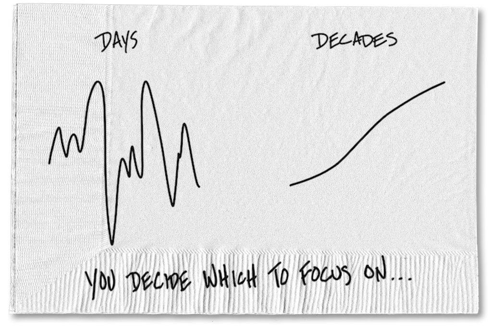

### 2020

  

### 1976

Po 5 latach życia na kredyt, ceny żywności zaczęły drastycznie wzrastać ("70-procentowy wzrost cen produktów").
Sygnałem pogarszającej się sytuacji był powrót do obiegu (po 23 latach) kartek.

### 1945

Ogłoszony został ostatni akt Polskiego Państwa Podziemnego. Manifest do Narodu Polskiego i Narodów Zjednoczonych, zakończony Testamentem Polski Walczącej. Dokument autorstwa Jerzego Brauna, ostatniego Delegata Rządu na Kraj, był wyrazem sprzeciwu wobec bezprawnego przejmowania władzy przez komunistów w Polsce.

Polskie Państwo Podziemne, organizowane od pierwszych dni niemieckiej okupacji, było fenomenem na skalę światową. W konspiracji przez wszystkie lata II wojny światowej kierowano walką o niepodległość Polski w kraju i na uchodźstwie. W żadnym innym kraju opór wobec okupanta nie był tak silny i zorganizowany. Udało się też, w miarę możliwości, zachować ciągłość prawną państwa polskiego, działalność administracyjną i sądowniczą. Liczne ugrupowania tworzyły podziemną scenę polityczną.

### 1944

W ciągle przywoływanym Bretton Woods w stanie New Hampshire rozpoczęła się konferencja, w której uczestniczyli przedstawiciele 44 państw alianckich. W wielkim skrócie skutkiem konferencji było powołanie Międzynarodowego Funduszu Walutowego, Banku Światowego, Międzynarodowego Banku Odbudowy i Rozwoju, GATT (WTO) oraz przede wszystkim uporządkowanie światowych kursów walutowych. Konferencję zwołał Franklin Delano Roosevelt, a jej celem – pomimo trwania na świecie działań zbrojnych (ledwo trzy tygodnie wcześniej nastąpiło lądowanie w Normandii) – było omówienie problemów finansowych, z którymi spotka się światowa gospodarka po zakończeniu wojny. Ameryka wygrywała wszystko militarnie i gospodarczo, 60% produkcji na świecie pochodziła z USA – Ameryka mogła wówczas narzucić dużo.

Wszyscy dobrze pamiętali hiperinflację w Republikę Weimarską i wywołany tym bunt Niemców przeciwko traktatom wersalskim, wojny walutowe okresu międzywojnia i niekończące się dewaluacje. I kto wtedy dewaluował - Wielka Brytania tylko w 1931 r. zawiesiła wymienialność GBP na złoto i obniżyła wartość funta o 30%. Kongres USA w 1933 r. dzięki poprawce Thomasa zdewaluował dolara o 50%. Francja oczywiście w 1936 również dołączyła do ciągłych wojen handlowych i walutowych i od razu przystąpiła do serii dumpingowych dewaluacji. Nikt już wtedy nie pamiętał o zapaści monetarnej Francji z XVIII w., kiedy John Law emitował banknoty oparte na kruszcu królewskim, a następnie je dewaluował po 300%. Po wygnaniu Lawa do Wenecji, skarb królewski stabilizował francuskiego liwra siedem długich lat… Wojny walutowe teraz miały nie wrócić, bo stabilny system kursów miał wspierać uczciwy handel, podczas gdy Europejska Wspólnota Węgla i Stali (początek UE), miała za zadanie włączyć na zawsze Rzeszę Niemiecką w struktury europejskie oraz bezkrwawo zapewniać zasoby wszystkim krajom, by terror i hekatomba kolejnej wojny światowej już nigdy na kontynent nie powróciły.

### 1940

https://pl.wikipedia.org/wiki/Francja_Vichy

### 1935

https://en.wikipedia.org/wiki/Ahnenerbe

### 1916

https://pl.wikipedia.org/wiki/Bitwa_nad_Somm%C4%85

---

<a href="https://github.com/TomaszWaszczyk/historia.waszczyk.com/edit/master/src/content/july-1.md" target="_blank">Edytuj tę stronę dzieląc się własnymi notatkami!</a>
