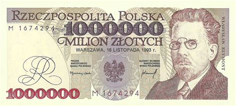
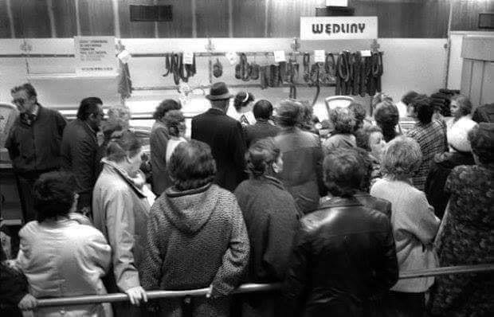
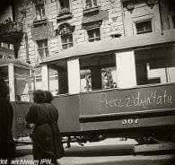
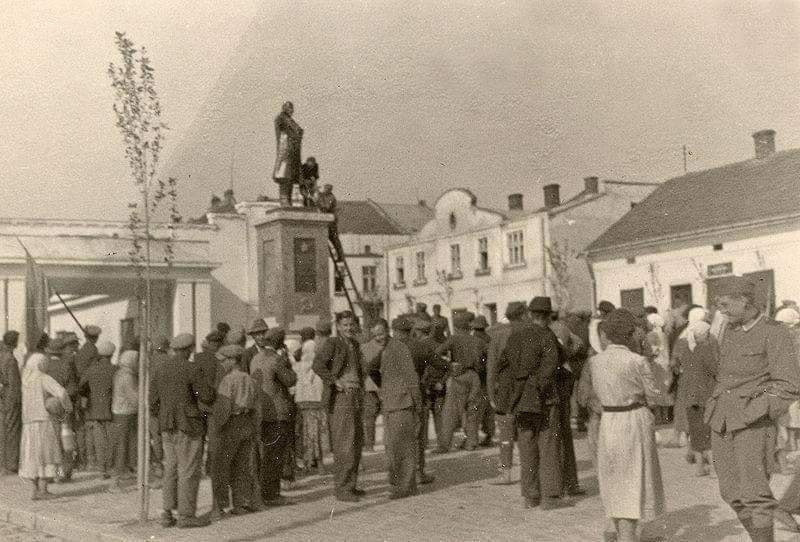
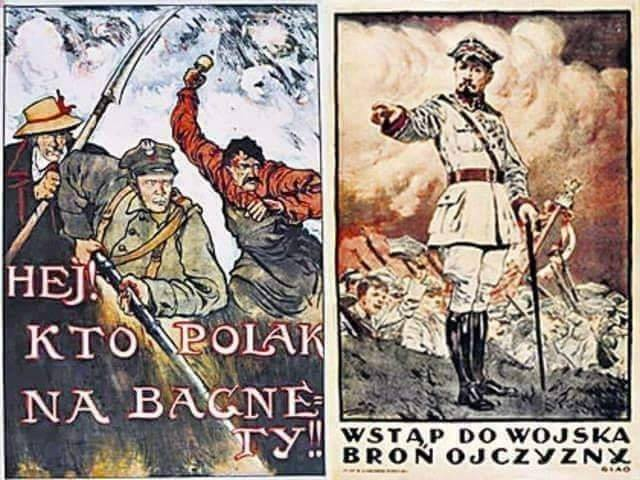
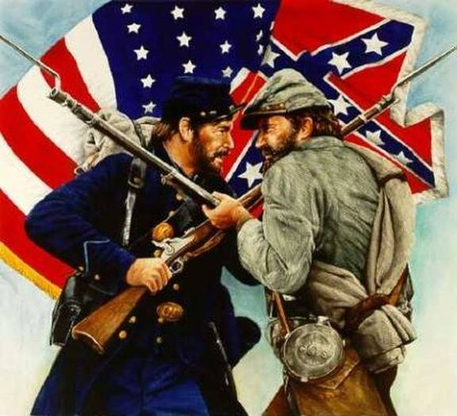
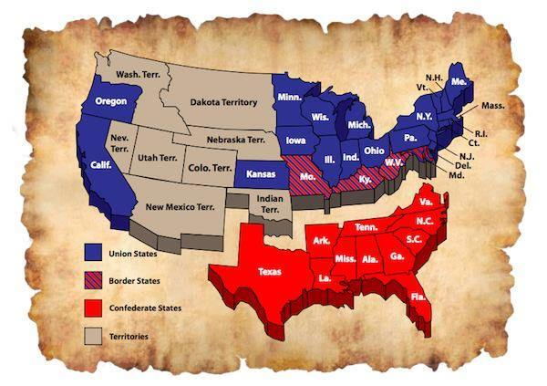

### 2020

  

---

Na Allegro można kupić banknot 1 000 000 zł za 150 zł 🙂

Kupiliśmy sobie jeden do biura, będzie bardzo fajnym przypomnieniem, że inflacja (między innymi) wymusza coraz wyższe nominały na banknotach. Ale nic nie szkodzi, wystarczy zrobić denominację (jak w 1995 roku) i można zaczynać od początku 🙃

No i przy okazji warto przypomnieć, że ostatnio wprowadzono w Polsce do użytku banknot 500 zł 😉

  

---

### 1991

W Pradze odbyło się ostatnie posiedzenie Doradczego Komitetu Politycznego i podpisanie protokołu o likwidacji Układu Warszawskiego.

Układ Warszawski był organizacją o charakterze sojuszu politycznym i wojskowym. Zawarto go 14 maja 1955 roku w Warszawie. W skład układu weszły Albania (wystąpiła w 1968), NRD, Polska, Rumunia, Czechosłowacja, Bułgaria, Węgry i ZSRR. Powołanie Układu było reakcją na układy paryskie z 1954 roku przewidujące remilitaryzację Niemiec Zachodnich oraz włączenia ich do struktur NATO. Głównym organem Układu był DKP (Doradczy Komitet Polityczny) i Zjednoczone Dowództwo Sił Zbrojnych z siedzibą sztabu w Moskwie. Struktura umożliwiała ZSRR kontrolę nad siłami zbrojnymi i polityką obronną państw członkowskich. W 1968 roku wojska UW interweniowały zbrojnie ( bez Rumunii) w Czechosłowacji. W sezonie 1989/90 nastąpiły zmiany polityczne w państwach członkowskich. W lutym 1991 roku rozwiązano struktury wojskowe UW.

Foto: Insygnia. 30 lat Układu Warszawskiego (1985 r)

### 1980

Obradujące w Warszawie Biuro Polityczne Komitetu Centralnego Polskiej Zjednoczonej Partii Robotniczej podjęło decyzję o podwyżce cen podstawowych artykułów spożywczych.
Manewr ten, mający na celu zahamowanie narastającego kryzysu nie został jednak podany do oficjalnej wiadomości, ponieważ obawiano się gwałtownej reakcji i tak już poirytowanego społeczeństwa.
Nie udało się jednak uniknąć napięć społecznych. Jeszcze tego samego dnia rozpoczęły się strajki między innymi w zakładach PZL Mielec, Ursus Warszawa, Autosan Sanok i Ponar Tarnów.

  

### 1976

Po 5 latach życia na kredyt, ceny żywności zaczęły drastycznie wzrastać ("70-procentowy wzrost cen produktów").
Sygnałem pogarszającej się sytuacji był powrót do obiegu (po 23 latach) kartek.

### 1956

Dzień po brutalnym stłumieniu przez władze demonstracji robotniczych ruszyła w Poznaniu ponownie komunikacja tramwajowa.
Poznańscy tramwajarze zostali do tego zmuszeni (według ówczesnej propagandy poproszeni) przez przybyłego dzień wcześniej przedstawiciela władz centralnych o przystąpienie do pracy.
Na zdjęciu tramwaj Heidelberg typ H.

  

### 1945

Ogłoszony został ostatni akt Polskiego Państwa Podziemnego. Manifest do Narodu Polskiego i Narodów Zjednoczonych, zakończony Testamentem Polski Walczącej. Dokument autorstwa Jerzego Brauna, ostatniego Delegata Rządu na Kraj, był wyrazem sprzeciwu wobec bezprawnego przejmowania władzy przez komunistów w Polsce.

Polskie Państwo Podziemne, organizowane od pierwszych dni niemieckiej okupacji, było fenomenem na skalę światową. W konspiracji przez wszystkie lata II wojny światowej kierowano walką o niepodległość Polski w kraju i na uchodźstwie. W żadnym innym kraju opór wobec okupanta nie był tak silny i zorganizowany. Udało się też, w miarę możliwości, zachować ciągłość prawną państwa polskiego, działalność administracyjną i sądowniczą. Liczne ugrupowania tworzyły podziemną scenę polityczną.

### 1944

W ciągle przywoływanym Bretton Woods w stanie New Hampshire rozpoczęła się konferencja, w której uczestniczyli przedstawiciele 44 państw alianckich. W wielkim skrócie skutkiem konferencji było powołanie Międzynarodowego Funduszu Walutowego, Banku Światowego, Międzynarodowego Banku Odbudowy i Rozwoju, GATT (WTO) oraz przede wszystkim uporządkowanie światowych kursów walutowych. Konferencję zwołał Franklin Delano Roosevelt, a jej celem – pomimo trwania na świecie działań zbrojnych (ledwo trzy tygodnie wcześniej nastąpiło lądowanie w Normandii) – było omówienie problemów finansowych, z którymi spotka się światowa gospodarka po zakończeniu wojny. Ameryka wygrywała wszystko militarnie i gospodarczo, 60% produkcji na świecie pochodziła z USA – Ameryka mogła wówczas narzucić dużo.

Wszyscy dobrze pamiętali hiperinflację w Republikę Weimarską i wywołany tym bunt Niemców przeciwko traktatom wersalskim, wojny walutowe okresu międzywojnia i niekończące się dewaluacje. I kto wtedy dewaluował - Wielka Brytania tylko w 1931 r. zawiesiła wymienialność GBP na złoto i obniżyła wartość funta o 30%. Kongres USA w 1933 r. dzięki poprawce Thomasa zdewaluował dolara o 50%. Francja oczywiście w 1936 również dołączyła do ciągłych wojen handlowych i walutowych i od razu przystąpiła do serii dumpingowych dewaluacji. Nikt już wtedy nie pamiętał o zapaści monetarnej Francji z XVIII w., kiedy John Law emitował banknoty oparte na kruszcu królewskim, a następnie je dewaluował po 300%. Po wygnaniu Lawa do Wenecji, skarb królewski stabilizował francuskiego liwra siedem długich lat… Wojny walutowe teraz miały nie wrócić, bo stabilny system kursów miał wspierać uczciwy handel, podczas gdy Europejska Wspólnota Węgla i Stali (początek UE), miała za zadanie włączyć na zawsze Rzeszę Niemiecką w struktury europejskie oraz bezkrwawo zapewniać zasoby wszystkim krajom, by terror i hekatomba kolejnej wojny światowej już nigdy na kontynent nie powróciły.

### 1941

Fragment wspomnień Almy Heczkowej z dnia 1 lipca 1941 roku pochodzący z książki "Mój pamiętnik":
" Wygląda na to, że rozpoczął się
pogrom Żydów we Lwowie. Przed
południem byliśmy u Marychy,
aby jej opowiedzieć, co się
wczoraj działo w mieście. Do
domu wracaliśmy ulicą
Pierackiego i Leona Sapiehy.
Dochodziliśmy do ulicy
Kopernika. Coś się działo.
Musieliśmy się zatrzymać, bo nie
było przejścia. Inni przechodnie
też stanęli. U wylotu ulic
Sapiehy, Kopernika, Tomickiego,
a z drugiej strony Łąckiego,
znajduje się potężny gmach z
głównym wejściem od ulicy
Leona Sapiehy. Przed wojną w
gmachu tym mieściła się
Wojewódzka Komenda Policji. Po
wybuchu wojny, od czerwca 1941
urzędowało tu NKWD. Jest to
więzienie „na Łąckiego". To,
czego byliśmy mimowolnymi
świadkami przechodziło wszelkie
wyobrażenie. Sceny, Jakie
rozgrywały się przed naszymi
oczami były makabryczne. Przed
główną bramą wejściową na teren
więzienia ustawili się Niemcy w
podwójny szpaler. W tym
„korytarzu", wywlekani z domów
biegli Żydzi trzymając ręce nad
głowami. Bito ich pałkami
niemiłosiernie, gdzie popadło.
Przed samą bramą kazano im
czołgać się na kolanach, nie
zaprzestając katowania.
Pokrwawieni, zmasakrowani, już
na stojąco wpadali do bramy.
Od strony ulicy Łąckiego,
zakratowane okna więzienia były
otwarte. Zaglądnęliśmy przez nie.
To, co zobaczyliśmy, było
przerażające. Zrobiło mi się
niedobrze. Pomordowani ludzie!
Pomordowani! W krwi! Krew
wszędzie - na ścianach, sufitach,
podłodze. Zgroza! Nie, to nie do
pojęcia.
Gdy ochłonęliśmy z pierwszego
potwornego wrażenia, poszliśmy
dalej ulicą Łąckiego. Przez szpary
parkanu otaczającego więzienny
dziedziniec, zobaczyliśmy na
placu poukładane rzędy trupów i
krążących między nimi ludzi,
poszukujących swoich bliskich.
Zdaliśmy sobie sprawę z tego, że
zostai popełniony straszny,
zbiorowy mord. Za co? Przez
kogo? Dotarła do nas wiadomość,
że taki sam los spotkał więźniów
w „Brygidkach" przy ulicy
Kazimierzowskiej i w więzieniu
przy ulicy Zamarstynowskiej.
Wtedy zrozumieliśmy wszystko.
NKWD przed swoją ucieczką,
wymordowało więzionych tam
przez siebie ludzi.
A Żydzi bici i katowani na ulicy,
zostali zapędzeni przez Niemców i
Ukraińców do porządkowania
więzień.
Do domu wróciliśmy roztrzęsieni.
O potwornościach, które działy
się na terenach okupowanych
przez Niemców, wiedzieliśmy z
opowiadań ludzi
przekraczających linię
demarkacyjną oraz z prasy
podziemnej, którą przynosił
Lolek, i z londyńskiego radia.
Teraz przekonaliśmy się, że to
samo robią sowieci.
- Tego samego dnia po południu.
Tego samego dnia po południu
przeżyłam podobną scenę po raz
drugi. Lolek był w pracy, a ja
sama wyszłam do miasta.
Minęłam Teatr Wielki.
Usłyszałam krzyki od strony ulicy
Kazimierzowskiej. Zobaczyłam
długi, podwójny szpaler Niemców
i Ukraińców, którzy ustawili się
od ulicy Rzeźnickiej, wzdłuż ulicy
Kazimierzowskiej, aż do bramy
więzienia „Brygidki". Powtórzyła
się makabra z ulicy Sapiehy.
Wyciągano Żydów z okolicznych
domów i pędzono w kierunku
więzienia. Biegnących bito
pałkami po głowie, plecach,
nogach. Upadali, wstawali i
zalani krwią biegli dalej w
kierunku bramy więziennej."

  

### 1940

https://pl.wikipedia.org/wiki/Francja_Vichy

---

Rozkaz Naczelnego Wodza generała Władysława Sikorskiego do Armii Polskiej z dnia 1 lipca 1940 roku.

ŻOłnierze ! Zaczynacie nowy okres waszej twardej służby. Poraz drugi od chwili opuszczenia kraju zbieracie
się na obcej ziemi w szeregach jako wojsko polskie niezmożone, nie ugięte, nie dające się przeciwnościom, wierne do ostatniego tchu świętej sprawie naszej.

Armia polska, odrodzona na ziemiach Francji w niezwykle szybkim terminie, jak najchlubniej wypełniła swój obowiązek żołnierski. Wsławiła oręż polski, walcząc na polach Norwegii, a we Francji samej wśród katastrofalnego załamania się wojennego Armij, w których składzie były nasze wojska, dowiodła ona wspaniałego hartu, męstwa bojowego i woli zwycięstwa.
Składamy hołd towarzyszom broni, którzy krwią przelaną stwierdzili swoje serdeczne przywiązanie do Ojczyzny i do tych ideałów, których symbolem stała się Polska.
Z bólem wspominamy tych towarzyszy broni, którzy nie mogli się do nas przedostać, którzy w niewoli u wroga, czy w przyjaciejskiej Szwajcarii, czy w rozproszeniu pozostali za morzem.
Walka trwa. Miejsce nasze jest dzisiaj przy tych sprzymierzeńcach, którzy walczą dalej. Dzięki naszej energii własnej i znakomitej pomocy
Królewskiej Marynarki Brytyjskiej ocalała ogromna część naszych sił powietrznych i lądowych. Nowe zastępy towarzyszy broni staną niebawem przy nas. Mamy jeszcze zastępy tęgich żołnierzy. Walczyć będziemy dalej z uporem i żelazną wolą aż do zwycięstwa.
Stając na ziemi Wielkiej Brytanii pozdrawiamy siły zbrojne tego wielkiego narodu, związanego z nami nie tylko sojuszem, ale, co ważniejsza, węzłami braterstwa broni niewzruszalnymi, bo zadzierzgniętymi w bojach i trudach, na morzach i na polach bitew w walce o wspólną świętą sprawę.
Liczę, Żołnierze, nada na wasze poświęcenie, ofiarność i męstwo.
Żądam od was wzorowej karności, nienagannego porządku i takiego sprawowania się, by budziło szacunek
u naszych przyjaciół. Pamiętajcie, że od waszego zachowania się zależy, co wszystkie narody Imperium Brytyjskiego sądzić będą o Polakach. Wiem, że nie sprawicie mi zawodu.

Narodowi Polskiemu ślubuję,a żołnierzom internowanym w licznych obozach oświadczam, że ten obowiązek
nasz, który wypełniliśmy w ostatnim przełomie , wypełnimy nadal, aż do chwili zupełnego wyzwolenia męczeńskiej ojczyzny.

---

Władze niemieckie utworzyły na terenie byłej fabryki włókienniczej Samuela Rabbego więzienie Radogoszcz (Polizeigefangnis Radegast) Komendantem więzienia był Walter Penzhauser.
Więzienie radogoskie, wbrew obiegowej opinii szczególnie intensywnie propagowanej w pierwszym dziesięcioleciu powojennym, która się niestety utrwaliła w powszechnym mniemaniu na następnych kilkadziesiąt lat, nie było miejscem masowej zagłady. Nie było tu komory gazowej ani krematorium. Zasadniczą
funkcją tego obiektu było grupowanie
więźniów w większe transporty w celu
wywożenia ich do właściwych więzień,
najczęściej do Sieradza, Łęczycy czy
Wielunia, do obozów koncentracyjnych
(najpierw KL Dachau – przede wszy
około tysięczna grupa łódzkiej młodzieży, w ramach dużej akcji represyjnej skierowanej przeciwko niej w maju 1940 r., potem KL Auschwitz-Birkenau , a ostatecznie i przede
wszystkim do KL Gross-Rosen i
Mauthausen-Gusen ) oraz do obozu pracy karnej w Ostrowie Wielkopolskim (do czasu powstania w Łodzi, w marcu 1943 roku podibnego obozu na Sikawie).
Radogoszcz stała się w styczniu 1945 roku miejscem kaźni 1500 więźniów, których uciekający przed Armią Czerwoną Niemcy zostawili w podpalonych budynkach.

---

### 1935

https://en.wikipedia.org/wiki/Ahnenerbe

### 1920

Powstała Rada Obrony Państwa. Był to organ stworzony do ratowania trudnej sytuacji Polski, której niepodległość za sprawą zbliżającej się w kierunku Wisły Armii Czerwonej stanęła pod znakiem zapytania.
W jej skład weszli: Naczelnik Państwa Józef Piłsudski jako przewodniczący oraz przedstawiciele sejmu, rządu i armii. Miała ona koordynować wszelkie poczynania polityczne i militarne. Na mocy decyzji Rady już na pierwszym posiedzeniu powołano Armię Ochotniczą, do której w ciągu kilku tygodni zaciągnęło się 105 tys.żołnierzy.

  

### 1916

https://pl.wikipedia.org/wiki/Bitwa_nad_Somm%C4%85

### 1863

Wojna secesyjna: rozpoczęła się bitwa pod Gettysburgiem (wątek będzie podzielony na 4 części które będą publikowane przez 3 dni. W dzisiejszym przedstawię Państwu prolog oraz 1 dzień bitwy).

Prolog:

Decydująca bitwa wojny secesyjnej pod Gettysburgiem, która miała miejsce w dniach 1–3 lipca 1863 r. – nie była batalią tak wielką, jak niedawne chronologicznie bitwy okresu napoleońskiego: Austerlitz, Jena, Lipsk, czy Borodino. Szereg innych wielkich starć ówczesnych kampanii wojennych gromadził znacznie większe siły. Były one też bardziej krwawe. Jednak bitwa pod Gettysburgiem była największym starciem na kontynencie amerykańskim.

Wynik tej batalii gettysburskiej zdecydował o kierunkach rozwoju Stanów Zjednoczonych, czyli pośrednio również o losach świata. To po wojnie secesyjnej, zwanej też w historiografii amerykańskiej „drugą wojną o niepodległość” nastąpił gwałtowny rozwój tego państwa. Progres był tak szybki, że już w Wielkiej Wojnie to właśnie Stany Zjednoczone odegrały rolę podmiotu numer jeden. Bez wojsk amerykańskich, które począwszy od 1917 roku masowo przybywały na kontynent europejski, wspomagając Ententę przeciwko Państwom Centralnym, zwycięstwo byłoby niemożliwe.

Historia późniejsza to już etap coraz większej dominacji USA na świecie. W kontekście tym należy postawić dwa pytania. Po pierwsze, co byłoby, gdyby bitwa pod Gettysburgiem skończyła się wynikiem odwrotnym? Odpowiedz nie jest zupełnie prosta, ale przewidywalna. Znakomity dowódca gen. Robert Lee doskonale zdawał sobie sprawę z tego, że w wojnie ekonomicznej, czyli na wyczerpanie zasobów, jego armia może tylko przegrać. Dlatego przede wszystkim właśnie w lecie 1863 roku zamierzał podjąć ofensywę a w jej ramach stoczyć i wygrać dużą bitwę. W odległych planach leżało też zajęcie Waszyngtonu. Tuż po wygranej wielkiej bitwie prezydent Skonfederowanych Stanów Ameryki Jefferson Davis miał zwrócić się do swego alter ego, czyli Abrahama Lincolna z propozycją zawarcia pokoju... na kompromisowych warunkach. Zapewne w takim wypadku na terenie USA powstałaby znacznie luźniejsza federacja. Czy drogi Północy i Południa, rozdzieliłyby się?

Zapewne nie. Jednak tu już wchodzimy w typowe gdybanie, czyli modną aktualnie historię alternatywną. Rozważania te można tylko dopełnić stwierdzeniem, że zarówno gen. R. Lee, jak też sam prezydent J. Davis wcale nie byli zwolennikami niewolnictwa…

Po zwycięstwie nad podstawową unijną Armią Potomaku w bitwie pod Chancellorsville w dniach 1-3 maja 1863 roku, dowódca podstawowej, konfederackiej Armii Wirginii Północnej, gen. R. Lee zdecydował się na drugą w wojnie secesyjnej inwazję na terytoria stanów Północy. Liczył, że odpowiednio wielka i intensywny najazd na zasadnicze terytorium Unii będzie również ważnym zwycięstwem propagandowym konfederatów, wzmacniając znacząco stronnictwo pokojowe na Północy. Dodatkowo konfederaci chcieli przenieść aktywność zbrojną na terytorium zasobnego unijnego stanu Pensylwania, dotychczas niedotkniętego działaniami wojennymi i dać odpocząć ekonomicznie i socjalnie ludności konfederackiego stanu Wirginia – do tego momentu głównego teatru walk. Bogata Pensylwania byłaby też doskonałym źródłem darmowego zaopatrzenia dla armii konfederackiej.

Należy w tym miejscu wyraźnie podkreślić, że metoda dowodzenia w armii konfederackiej była anachroniczna. Dowódcy poszczególnych korpusów ustalali na naradzie plany przyszłych bitew. Podejście to miało swoje źródło tworzeniu poszczególnych korpusów przez odmienne stany. Tym samym dowódca konkretnej jednostki podlegał znacznie bardziej pod władze swojego stanu niż pod bardzo teoretycznego dowódcę wojsk Konfederacji. Anachronizmy te do pewnego stopnia nie tyle likwidowała, ile raczej poważnie spłaszczała osoba gen. R. Lee. Był on słusznie uważany za najbardziej wybitnego ówcześnie dowódcę w USA. Cieszył się też ogromnym szacunkiem.

W tym miejscu należy przypomnieć jeszcze niewielki, ale bardzo ważny epizod z początku secesji. Prezydent Unii A. Lincoln, zwrócił się do gen. R. Lee z prośbą o objęcie dowództwa nad armią federalną. Była to propozycja bardzo pragmatyczna. Gdyby R. Lee przejął to dowodzenie, to zapewne olbrzymia większość oficerów a również żołnierzy poszłaby wprost za nim. Jednak wojskowy skierował w odpowiedzi znamienny list. Pisał w nim m.in., że uważa się rzecz jasna za obywatela Stanów Zjednoczonych i jest wobec USA lojalny, ale znacznie bardziej musi uważać się za obywatela Wirginii. Zatem postąpi tak, jak uchwali stanowy kongres. W tym wypadku sytuacja była jednoznaczna. Wirginia jako jedna z pierwszych, wypowiedziała Unię i ogłosiła secesję.

W najbardziej optymistycznym wariancie wydarzeń gen R. Lee miał nadzieję zmusić Armię Potomaku do bitwy na korzystnych dla siebie warunkach. Wskutek jej zniszczenia (a być może i zagrożenia potem Waszyngtonowi, Filadelfii lub Baltimore) chciał zmusić Unię do rozpoczęcia rokowań pokojowych. Kolejne sukcesy militarne mogły również doprowadzić do uznania formalnego przez Wielką Brytanię i Francję państwowości i podmiotowości Konfederatów Południa. 
3 czerwca 1863 r. Armia Wirginii Północnej opuściła swoje obozy naprzeciwko unijnej Armii Potomaku pod Fredricksburgiem i pomaszerowała w sposób skryty na zachód do doliny rzeki Shenandoah, a stamtąd na północ do granicy ze stanem Maryland.

Tam gen. R. Lee przeprawił swoją armię przez graniczną rzekę Potomak w przedziale między 15 i 20 czerwca 1863 r. W tym samym czasie wysłał większą część swojej kawalerii, ok. 9 tys. ludzi pod dowództwem znakomitego kawalerzysty ale tylko na szczeblu taktycznym, gen. mjr Jamesa Ewella Browna Stuarta na daleki rajd na głębokie tyły Unii, w celu spowodowania ogólnego zamieszania u przeciwnika. Jak powszechnie przyjmuje się, odłączenie się jazdy od sił głównych miało decydujące i negatywne konsekwencje. Związane to było z faktem, iż oddziały federalne były rozciągnięte poszczególnymi korpusami na bardzo szerokim froncie, przez co J.E.B. Stuart nie zdołał szybko dołączyć z powrotem do głównych sił armii . Jego ruchy utrudniała również kawaleria federalna, która od czasu bitwy pod Brandy Station (9 czerwca), stawiała dużo bardziej skuteczny opór przeciwnikowi. Jeb Stuart stracił kontakt z R. Lee i nie mógł przekazywać mu żadnych informacji o posunięciach przeciwnika. Jest też prawdopodobne, że generał planował na początku swojego rajdu, zając nagłym manewrem Waszyngton.

Było to oczywiście nierealne, ale gen. J.E.B. Stuart był co prawda znakomitym taktykiem, ale strategiem już marnym.
W pogoni za armią konfederatów, Armia Potomaku pomaszerowała z opóźnieniem około trzech dób, na północ i przeprawiła się przez rzekę Potomak między 25 i 27 czerwca, starając się później trzymać się między armią konfederatów a Waszyngtonem. W tym bardzo niebezpiecznym dla Unii, momencie 28 czerwca, dowodzący do tej pory wojskami federalnymi gen. mjr Joseph Hooker podał się do dymisji z powodu permanentnych sporów w kwestiach dowodzenia, jakie toczył on i jego poprzednicy zarówno z prezydentem A. Lincolnem, jak i gen. mjr Henrym W. Halleckiem, który był swego rodzaju mentorem militarnym prezydenta. Następcą H.W. Hookera został mianowany gen. mjr George Meade, dotychczas jeden z dowódców korpusu. Ta nagła zmiana dowódcy kilka dni przed bitwą zwiększyła jeszcze bardziej i tak już dużą pewność siebie pośród konfederatów. Nie było bowiem pewne czy G. Meade zdąży przejąć pełne i skuteczne dowództwo nad armią przed rozpoczęciem starcia. W dodatku ten dowódca nie wyróżnił się dotychczas niczym szczególnym i uważany był za aż za bardzo bardzo ostrożnego.

R. Lee dowiedział się o przeprawie armii Unii przez Potomak stosunkowo późno, bo dopiero 29 czerwca od jednego z konfederackich szpiegów. Tu uwidocznił się bardzo wyraźnie i negatywnie, brak jednostek kawalerii, która przy normalnym biegu wydarzeń przekazałaby mu informacje niezbędne ok. dwóch dni wcześniej. W tym czasie kawalerzyści, obok wykonywania zadań bojowych, byli też swego rodzaju „oczami armii”. Gen. R. Lee był zatem zaskoczony niespodziewaną bliskością Armii Potomaku, w momencie gdy jego armia była zdekoncentrowana i rozrzucona szerokim łukiem na sporym obszarze Pensylwanii. W zaistniałej sytuacji wydał rozkaz natychmiastowej koncentracji swoich rozrzuconych korpusów. Patrząc na mapę, najlepszym miejscem do osiągnięcia tego celu były okolice miasteczka Gettysburg. Korpusy konfederatów rozpoczęły więc koncentryczny marsz na Gettysburg od północy i zachodu. Dowódca Armii Północnej Wirginii liczył, iż uda mu się całością sił czyli ok. 70 tys. żołnierzy, uderzyć na przeciwnika, znajdującego się jeszcze w marszu i zepchnąć jego jednostki na siebie.

W tym samym czasie Armia Potomaku maszerowała na północ za armią Konfederatów, podchodząc do Gettysburga od południa. G. Meade, nie wiedząc dokładnie, gdzie są siły gen. R. Lee, planował stoczenie bitwy wzdłuż linii rzeczki Pipe Creek. W okolicach Gettysburga miało działać lewo skrzydło jego armii czyli I, III i XI korpus... i tak się zaczęło...

  

  

---

<a href="https://github.com/TomaszWaszczyk/historia.waszczyk.com/edit/master/src/content/july-1.md" target="_blank">Edytuj tę stronę dzieląc się własnymi notatkami!</a>
