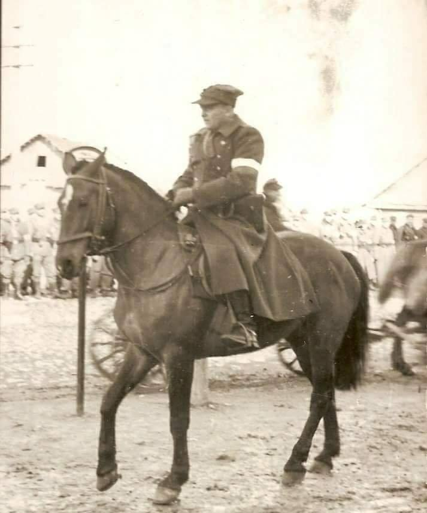

### 2023

<video width="640" height="480" controls>
<source src="./movies/july/yellen.mp4" type="video/mp4">
Your browser does not support the video tag.
</video>

(Why the U.S. banking system is near collapse)

What Xi told the gulf alliance (their leaders); We will be invoicing everything (your oil) in renminbi. You will have surpluses with us, and we will have deficits with you. We will have surpluses with you and you will have deficits with us. How we resolve those differences will be through an interstate means. (Coordinated monetary sovereign bond deflation).

What this implies is that you will hold renminbi in our bond market or you will have the means to convert that into gold. 
In August of 1971, President Nixon ended the gold standard, which basically meant we needed a soft default, because having a gold standard limits the amount of currency a sovereign may emit into existence. Then no one wanted to hold dollars. 
Then Henry Kissinger made the petrodollar deal with Saudi Arabia which all oil exports would be invoiced in U.S. dollars. The dollar got a much-needed lift. 
Where the world prior to the petrodollar wanted to hold no dollars, and then in August of 1973, everyone was required to hold dollars.
Now that all global oil trade will be invoiced in renminbi, and dollars will need to be exchanged for yuan currency to acquire oil on the global market.
Who then sets the exchange rate of dollars to yuan?
On June 2nd, ’23 after the debt ceiling was lifted, the Treasury through the ON RRP (reverse repo) emitted over $1 trillion dollars into the U.S. economy in 35 days. (SEE CHART BELOW)

  

The U.S. Treasury is spending money from the reverse repo to finance government expenditures. Janet Yellen is draining all the liquidity from the ON RRP, and the MBS held on the Federal Reserve balance sheet are now in deep negative equity (due to higher interest rates to tame inflation).
What happens when the ON RRP goes to zero (is drained by Yellen) and the banks have no “good” collateral on their (asset side) balance sheet to hedge against all the banks liabilities that were printed out of thin air, because interest rates rising reflects all financial assets including the equity markets are in deep (fill in the blank)?
The Fed is using the BTFP to lift all the collateral in deep negative equity from the asset side of the bank balance sheet and injecting dollars where SOFR will drive interest rates even higher.
The banks have no collateral but dollars at a time when bank credit is massively contracting, where they can no longer draw an interest rate compensation from the ON RRP that is actively being drained.
Now, lets go back to all global oil trade now being invoiced in renminbi; are the U.S. banks then insolvent?

---

  

  

<video width="640" height="480" controls>
<source src="./movies/july/export.mp4" type="video/mp4">
Your browser does not support the video tag.
</video>

---

<video width="640" height="480" controls>
<source src="./movies/july/to-ojro.mp4" type="video/mp4">
Your browser does not support the video tag.
</video>

---

### 2021

Metropolita katowicki, arcybiskup Wiktor Skworc złożył rezygnację z ważnych funkcji. To efekt śledztwa Watykanu.

### 2020

Po wspolnej decyzji Eurogrupy, EBC oraz Danii i po akcetacji programu konwergencji, Bulgaria i Chorwacja weszly do przedsionka strefy euro, przylaczajac sie do ERM 2. Musza tu pozostac, zgodnie z obowiazujacymi wciaz regulacjami, co najmniej 2 lata, przy stabilnych kursach walutowych, zanim beda mogly wprowadzic euro.
Kurs centralny lewy wobec euro wyniosl 1.95583; kurs chorwackiej kuny 7.53450.
Oba kraje dolaczyly rownoczesnie do Unii Bankowej, co oznacza - miedzy innymi - przejecie przez EBC od 1 pazdziernika bezposredniego nadzoru nad bankami bulgarskimi i chorwackimi uznanymi za "systemowo wazne".
Trzymajmy kciuki za przyjaciol z naszego regionu. I gratulacje za odwage, upor i konsekwencje.
Czy decyzja Bulgarow i Chorwatow ma jakies znaczenie dla walut innych krajow ESW, pozostajacych poza mechanizmem stabilizacji kursowej, wspieranym przez EBC?
Oczywiscie, ze tak, bo zwieksza tu ryzyko zmiennosci.
A tak sie sklada, ze w naszym regionie najwiekszym i najbardziej plynnym rynkiem walutowym jest rynek zlotego.
Czy ktos z polskich politykow zarzekajacych sie na wyprzodki, ze nam sie do euro nie spieszy, ze nam ze zlotym doskonale, ma w ogole na uwadze rosnace ryzyko takich deklaracji?

### 2015

> Zgodnie z nową regulacją Sejmu RP, dźwignia rachunków polskich inwestorów zostanie ograniczona do 100:1. W wyniku tego dźwignia Twojego rachunku inwestycyjnego AAAFx zostanie ograniczona do 100:1 po zamknięciu rynku w piątek, 10 lipca 2015.

### 1992

Hanna Suchocka uzyskała poparcie Sejmu, obejmując urząd Prezesa Rady Ministrów, a już dzień później Sejm powołał jej koalicyjny rząd, który tworzyło siedem partii o charakterze centrowym i prawicowym w skład których wchodziły: Unia Demokratyczna, KLD, ZChN, PPG, SLCh, PChD i PSL-PL. Gabinet nowej Pani premier uzyskał również poparcie m.in. posłów NSZZ „Solidarność” oraz Mniejszości Niemieckiej. Rząd został odwołany przewagą jednego głosu 28 maja 1993 w wyniku tzw. niekonstruktywnego wotum nieufności zgłoszonego przez Alojzego Pietrzyka z NSZZ „S”. Funkcję premiera RP Hanna Suchocka sprawowała do października 1993. Była pierwszą w historii kobietą sprawującą urząd premiera RP, a drugą w regionie (po Kazimierze Prunskienė). Jej rząd przyczynił się do opracowania Programu Powszechnej Prywatyzacji, reformy samorządowej, która zakładała m.in. wprowadzenie powiatów i dużych województw, ustawę o restrukturyzacji finansowej przedsiębiorstw i banków, a także wynegocjował Pakt o Przedsiębiorstwie Państwowym w Trakcie Przekształcania.

  

### 1948

Został aresztowany przez łódzki Urząd Bezpieczeństwa Gracjan Fróg "Szczerbiec" (zdjęcie) kapitan piechoty Wojska Polskiego, w czasie wojny obronnej dowódca szwadronu techniczno-gospodarczego 33 Dywizjonu Pancernego Wileńskiej Brygady Kawalerii, żołnierz 6. Wileńskiej Brygady Armii Krajowej, dowódca 3 Wileńskiej Brygady Armii Krajowej.
Komuniści postawili mu fałszywy zarzut współpracy z Niemcami w zwalczaniu działającej na Wileńszczyźnie partyzantki sowieckiej oraz zarzut prowadzenia działalności konspiracyjnej w ramach Ośrodka Mobilizacyjnego Wileńskiego Okręgu AK mjr Antoniego Olechnowicza ps. „Pohorecki”.
W wyniku brutalnego śledztwa Wojskowy Sąd Rejonowy w Warszawie 13 lutego 1951 roku skazał go na karę śmierci, którą wykonano 11 maja 1951 w areszcie na Mokotowie.

  

### 1947

https://en.wikipedia.org/wiki/Morgenthau_Plan

### 1943

Podczas II WŚ, moim zdaniem bardziej niż w przypadku toczonych wcześniej konfliktów, bardzo dużą rolę odegrały służby wywiadowcze. Szczególną rolę miały do odegrania podczas działań mających na celu wprowadzenie przeciwnika w błąd. Stworzenie na tyle wiarygodnej historii i podrzucenie planów i danych, które były w stanie zdezorientować służby wywiadowcze przeciwnika, było nie lada sztuką. Z punktu widzenia sztabowców planujących ofensywę, możliwość dezinformacji przeciwnika co do miejsca i sił planowanego ataku, była atutem nie do pogardzenia i ważniejszym niż kilka dodatkowych dywizji. Jedną z takich operacji przeprowadzonych ze 100% skutecznością była Operacja “Mincemeat”. Była częścią operacji brytyjskiego MI5 o kryptonimie “Barclay”, która miała za zadanie kompleksową dezinformację dowództwa wojsk Osi odnośnie dalszych posunięć Aliantów w rejonie Morza Śródziemnego.
Operacja “Husky” została zaplanowana jeszcze przed kapitulacją wojsk Osi w Afryce Północnej. Jej celem była Sycylia. Operacja “Barclay” miała przekonać Niemców, że rzeczywistym celem Aliantów jest Sardynia, Korsyka, Kreta i Peloponez, a lądowanie na Sycylii jest tylko operacją pozoracyjną. Otwartą pozostawała kwestia w jaki sposób skutecznie wprowadzić NIemców w błąd. Na pomysł podrzucenia Niemcom zwłok z odpowiednimi dokumentami wskazującymi na inne cele operacji militarnych, wpadł porucznik pilot Charles Christopher Cholmondeley - oficer MI5. Początkowo zaproponował, żeby nad terenem Francji zrzucić martwego skoczka z radiostacją i kompletem szyfrów, za pomocą której przesłano by Niemcom fałszywe informacje. Pomysł ten jednak zarzucono, gdyż istniało podejrzenie (okazało się, że słuszne), że Abwehra zna tajną dyrektywę, która zabraniała latać samolotom z tajnymi dokumentami nad terytorium kontrolowanym przez wroga. Pomysł ze zwłokami spodobał się jednak kierownictwu MI5 i pod kryptonimem “Mincemeat” został zlecony sekcji B1, w której funkcjonował niewielki zespół wywiadowczy Twenty Committee; którym kierował komandor por. Even Montague. Do zespołu dołączył oczywiście pomysłodawca- Cholmodeley i prawdopodobnie późniejszy autor książek o przygodach Jamesa Bonda; Ian Flemming (z ramienia kontrwywiadu marynarki).
Zwłoki z dokumentami postanowiono podrzucić w Hiszpanii w rejonie rybackiego miasteczka Heulva, gdzie działał bardzo aktywny agent Abwehry Adolf Clauss i ponadto układ prądów morskich sprzyjał przedsięwzięciu.
Tearaz jedynym problem było znalezienie odpowiednich zwłok. Z pomocą doświadczonego patologa przeszukiwano wszystkie kostnice we wschodnie Anglii. Potrzebowali ciała mężczyzny, który prawdopodobnie umarł z powodu utonięcia lub hipotermii, ponieważ plan polegał na stworzeniu scenariusza katastrofy lotniczej, która miała miejsce nad morzem. Jednak znalezienie ciała wystarczająco “użytecznego” wydawało się prawie niemożliwe. By uniknąć komplikacji, zwłoki musiały należeć do osoby samotnej.
Agenci MI5 właściwie mieszkali w kostnicach i te wysiłki w końcu zostały nagrodzone. Agenci znaleźli ciało 34-letniego Walijczyka zwanego Glyndwr Michael. Mężczyzna był alkoholikiem, który stracił oboje rodziców i zmarł na zapalenie płuc. Zapalenie płuc daje takie same objawy jak utonięcie.. Skonstruowano fałszywą tożsamość. Nadano mu imię William Martins, majora Royal Marines.
Ranga, nazwa i oddział wojskowy pasowały do ​​profilu człowieka, który był wystarczająco ważny, aby uwiarygodnić dokumenty, ale również wystarczająco “pospolity”, aby być całkowicie nieznanym wrogowi. „Major Martin” był bardzo powszechny w armii brytyjskiej, ponieważ było kilku mężczyzn o tym samym nazwisku i randze co fikcyjny oficer. Sprzyjającą okolicznością był z pewnością fakt, że rzekomy major Martin był rzymskokatolikiem z Walii. Spodziewano się, że Hiszpania, w przeważającej mierze kraj katolicki, uszanuje zmarłych, unikając sekcji zwłok.
„Major Martin” otrzymał nawet narzeczoną Pam. Jej zdjęcie wsadzono do jego kieszeni. „Pam” była w rzeczywistości urzędnikiem MI5 o imieniu Nancy Jean Leslie. Do zwłok dołączono również dwa listy miłosne.
Ciało umieszczono w stalowym zasobniku z suchym lodem, aby zatrzymać rozkład. Zasobnik był opisany “Sprzęt Pomiarowy”. Następnie załadowano go na okręt podwodny, HMS “Seraph”, który wypłynął z Holy Loch 19 kwietnia 1943. W pobliże Huelvy dotarto 30 kwietnia . Okręt wynurzył się o godz 4:30. Zasobnik umieszczono na pokładzie po czym wszyscy członkowie załogi oprócz kapitana i dwóch oficerów, zeszli pod pokład. Ciało​​ ubrano w kamizelkę ratunkową i wrzucono do morza. Kapitan okrętu przeczytał fragment Psalmu 39. Zrobił to z własnej inicjatywy; nie było rozkazu uhonorowania ciała w ten sposób.
Zgodnie z przewidywaniami ciało zostało znalezione tego samego dnia przez rybaka w pobliżu miasta Huelva. Ciało zostało następnie zgłoszone do niemieckiego konsulatu i dokumenty zostały zajęte. Ponieważ „major Martin” nosił srebrny krucyfiks i tablicę św. Krzysztofa, władze hiszpańskie natychmiast uznały go za katolika. W ten sposób przeprowadzono jedynie badanie, które wykazało, że przyczyną śmierci było utonięcie i że ciało znajdowało się na morzu przez trzy lub pięć dni. Ponieważ hiszpański patolog potwierdził autentyczność zwłok, nie przeprowadzono dalszych badań dotyczących tego, czy dokumenty na ciele zostały posadzone, czy nie.
Dokumenty były bardzo przekonujące. Wspomnieli o wielu typowych tematach, takich jak rekomendacje medali i zmiana dowódców istniejących jednostek. Wśród dokumentów był list opatrzony autentycznym podpisem szefa COHQ (Dowództwa Połączonych Operacji) lorda Mountbattena. Niemieccy grafolodzy potwierdzili autentyczność podpisu co jeszcze bardziej utwierdziło Niemców w przekonaniu, że dokumenty znalezione przy ciele mjr Martinsa są autentyczne. Treść pozostałych dokumentów wskazywała również bardzo wyraźnie, że inwazja odbędzie się głównie na Krecie, a następnie na wyspie Sardynii. W raporcie wspomniano również, że alianci chcieli przekonać Niemców, że lądowania mają się odbyć na Sycylii, aby pozostawili Kretę i Sardynię niestrzeżone. O znalezisku poinformowano oczywiście Hitlera, który zapoznawszy się z nimi pozostał głuchy na prośby Mussoliniego, żeby wzmocnić obronę Sycylii.
Operacja “Husky” przeprowadzona 10 lipca - 17 sierpnia 1943 zakończyła się sukcesem. Skutkiem “ ubocznym” całej Operacji “Barclay” było również to, że Hitler rozkazał wycofać z frontu wschodniego 2 dywizje pancerne i włoski II Korpus. Jednostki te trafiły na Peloponez. Z Francji do Grecji przerzucono 1 Dywizję Pancerną. Erwin Rommel został skierowany do Aten z zadaniem utworzenia tam sztabu armii odpowiedzialnej za obroną Bałkanów. Pamiętajmy, że był to okres “Operacji Cytadela” i te jednostki bardziej przydałyby się Niemcom pod Kurskiem. Kto wie? Może Operacja “ Barclay” i “Mincemeat” w większym stopniu wpłynęła na przebieg II WŚ niż tylko na wynik Operacji “Husky”.

  

### 1940

https://pl.wikipedia.org/wiki/Anatol_Lawina

### 1871

https://pl.wikipedia.org/wiki/Marcel_Proust

---

<a href="https://github.com/TomaszWaszczyk/historia.waszczyk.com/edit/master/src/content/july-10.md" target="_blank">Edytuj tę stronę dzieląc się własnymi notatkami!</a>
