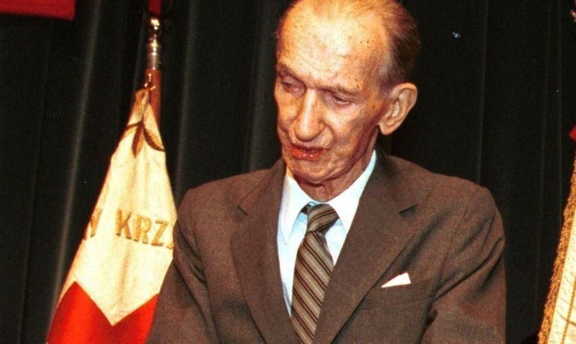
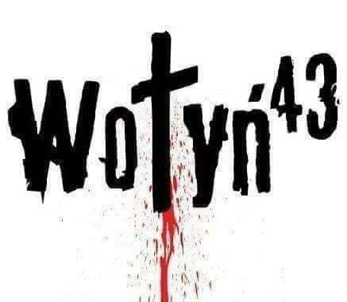
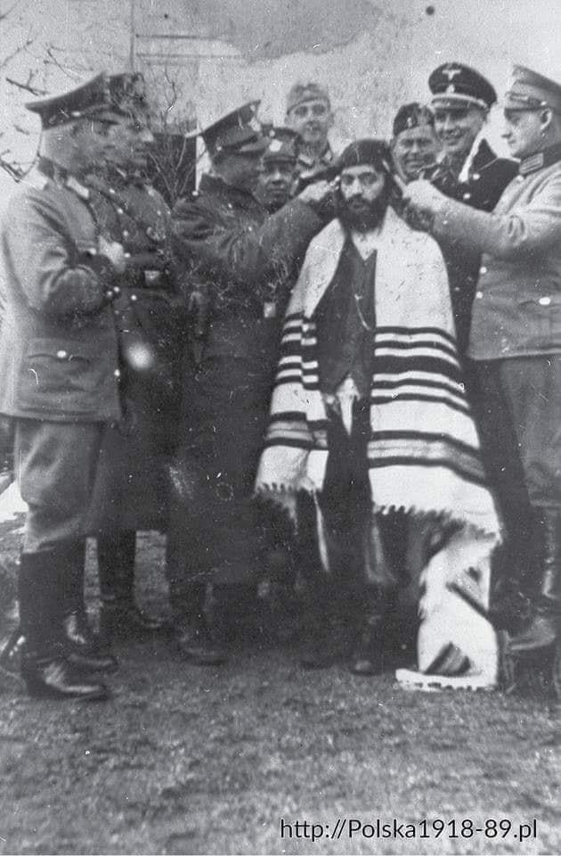
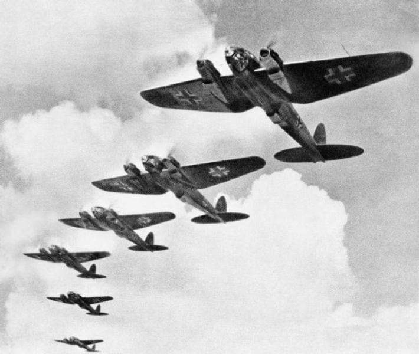
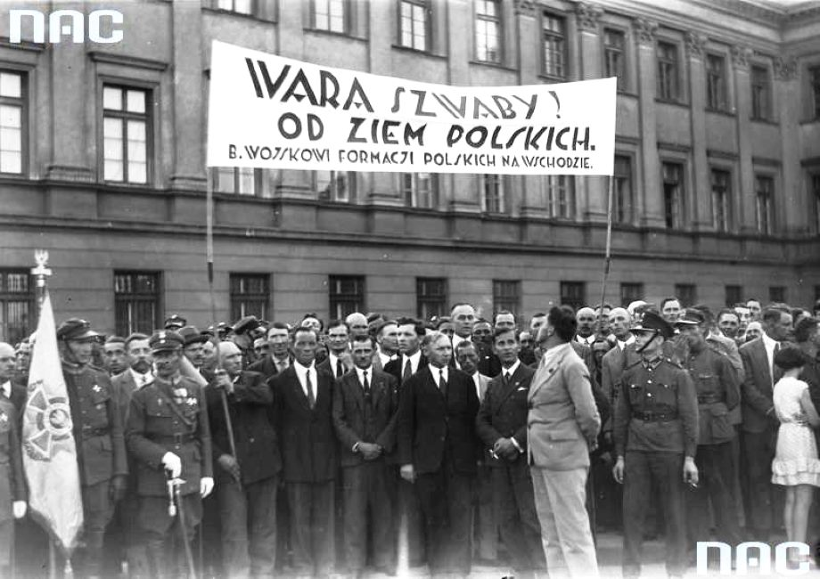

### 2020

Minister gospodarki Peter Altmaier zapowiedział, że Niemcy będą obejmować udziały w kolejnych firmach walczących o przetrwanie z powodu kryzysu wywołanego przez pandemię, pisze Reuters.

Altmaier powiedział, że prawdopodobnie kilkadziesiąt firm może pójść śladem Lufthansy, która zgodziła się na wejście państwa do akcjonariatu w zamian za pomoc.

- W tej bardzo ograniczonej liczbie przypadków wykorzystamy możliwości oferowane przez fundusz stabilizacji gospodarczej, w tym objęcie udziałów, gdzie to będzie właściwe – powiedział Altmaier w wywiadzie dla gazety Frankfurter Allgemeine.

Minister gospodarki nie wykluczył także objęcia przez państwo udziałów w strategicznie ważnych firmach, jak było to w przypadku producenta szczepionek CureVac.

### 2000

Zmarł emisariusz Polskiego Państwa Podziemnego, świadek Zagłady, a po II wojnie światowej profesor Georgetown University. Jan Karski za swoją działalność został uhonorowany najwyższymi odznaczeniami państwowymi – polskim Orderem Orła Białego, dwukrotnie Orderem Virtuti Militari, amerykańskim Medalem Wolności, a także tytułem Sprawiedliwy wśród Narodów Świata.
Jan Karski, właściwie Jan Romuald Kozielewski, urodził się 24 czerwca 1914 r. w Łodzi. Z wykształcenia prawnik, był też dyplomatą, historykiem i wykładowcą akademickim. Podczas II wojny światowej jako działacz polskiego ruchu oporu z narażeniem życia przedostał się do warszawskiego getta oraz do obozu przejściowego w Izbicy.
Będąc świadkiem Zagłady, jako emisariusz Polskiego Państwa Podziemnego spotykał się z głowami państw i politykami, próbując nakłonić ich do zdecydowanych działań by uratować miliony Żydów.
Jego apele o ratunek dla narodu żydowskiego nie przyniosły jednak rezultatów.

  

### 1995

https://en.wikipedia.org/wiki/Srebrenica_massacre

### 1943

11-12 lipca 1943 roku doszło do kulminacji rzezi wołyńskiej. W tych dniach szowiniści ukraińscy z OUN-UPA opętani zbrodniczą ideologią napadli na 99 polskich wsi na Wołyniu, mordując co najmniej 3 tysiące bezbronnych osób. Historycy oceniają, że liczba ofiar była znacznie wyższa. Według szacunków polskich historyków ukraińscy szowiniści wymordowali w latach 1943-1945 na Wołyniu i w Galicji Wschodniej ponad 100 tysięcy Polaków.
Oto kilka przykładów, które obrazują do czego dochodzi, gdy opętańcza ideologia zabija w człowieku wszelkie ludzkie odruchy i zagłusza sumienie:
11 lipca 1943 roku (niedziela, prawosławne święto Piotra i Pawła) >

· w majątku Biskupicze Górne pow. Włodzimierz Wołyński upowcy zgromadzili osobno w domach mężczyzn i osobno kobiety z dziećmi, a następnie wyprowadzali ich i zarąbywali siekierami; tak wymordowali 70 Polaków

· w osadzie Chrynów pow. Włodzimierz Wołyński upowcy wymordowali w kościele i koło kościoła podczas ucieczki około 150 Polaków; w tym zastrzelili księdza Jana Kotwickiego (W. i E. Siemaszko..., s. 827)

· w kol. Gucin pow. Włodzimierz Wołyński upowcy dokonali rzezi 146 Polaków, w tym 40 osób spalili żywcem w kościele oraz około 15 rodzin w stodole; ukraiński nauczyciel Peter Muzyka ukrył 18-letnią Polkę i nie chciał jej wydać, więc oprawcy zastrzelili go (W. i E. Siemaszko...., s. 829)

· w kol. Gurów (Górów) pow. Włodzimierz Wołyński upowcy o godz. 2,30 otoczyli każdy polski dom; mordowali za pomocą siekier, noży, wideł i innych narzędzi; ciężko ranni konali po 2 – 3 dni; rozgrabili cały dobytek Polaków i gospodarstwa spalili; wymordowali wg W. i E. Siemaszków około 200 Polaków (s. 829 – 830); Wojciech Wybranowski w „Naszym Dzienniku” (nr 4/2002), w artykule: „Smert’, smert’ Lachom” podaję, że w Gurowie mieszkało 480 Polaków, ocalało 70 Polaków, więc ofiarą rzezi padło 410 Polaków; potwierdzil to Stanisław Filipowicz, mieszkaniec Porycka, w przemówieniu w Porycku (Pawliwce) 11 lipca 2003 r. podczas obchodów 60. rocznicy rzezi

· we wsi i majątku Janiewicze pow. Włodzimierz Wołyński upowcy obrabowali i spalili polskie gospodarstwa oraz zamordowali kilka rodzin polskich, imiennie znane jest tylko 9 ofiar, w tym spalili żywcem siostry-bliźniaczki (W. i E. Siemaszko..., s. 831)

· w kol. Jerzyn pow. Włodzimierz Wołyński upowcy zamordowali co najmniej 51 Polaków, m.in. do studni wrzucili 5-osobową rodzinę z dziećmi lat 6, 8 i 12

· w miasteczku Kisielin pow. Horochów w kościele i poza nim Ukraińcy zamordowali około 100 Polaków

· we wsi Liniów pow. Horochów Ukraińcy zamordowali około 70 Polaków

· w kol. Nowiny pow. Włodzimierz Wołyński upowcy napadli o 8,oo rano na kolonię, obrabowali polskie gospodarstwa i przy użyciu rożnych narzędzi zamordowali około 80 Polaków (W. i E. Siemaszko...., s. 833)

· w osadzie Orlęta pow. Włodzimierz Wołyński Ukraińcy zamordowali około 50 Polaków, całe rodziny

· w kol. Orzeszyn pow. Włodzimierz Wołyński upowcy zamordowali co najmniej 306 Polaków, majątek zrabowali i spalili całą kolonię

· w miasteczku Poryck pow. Włodzimierz Wołyński upowcy zamordowali około 220 Polaków, w tym w kościele podczas mszy około 100 Polaków; dwóch upowców chodziło po kościele i strzelali do Polaków mierząc dokładnie, potem dobijali rannych; zamordowali ks. Bolesława Szawłowskiego; w dole przy dzwonnicy zakopali co najmniej 100 Polaków

· we wsi i majątku Poryck Stary pow. Włodzimierz Wołyński Ukraińcy zamordowali nie ustalona liczbę Polaków, co najmniej kilka rodzin; imiennie znane jest 5 ofiar: matka z 2 dzieci oraz małżeństwo

· w kol. Stasin pow. Włodzimierz Wołyński upowcy oraz okoliczni chłopi ukraińscy okrążyli o świcie kolonię a w godzinach popołudniowych spędzili Polaków do dwóch stodół: osobno mężczyzn, osobno kobiety i dzieci, potem ostrzelali te grupy a rannych dobijali siekierami i bagnetami, tak zamordowali 105 osób.

Nie chcąc jednak propagować nienawiści na tle narodowościowym przytaczamy również w miarę możliwości pozytywne postawy Ukraińców, którzy pomagali Polakom. Skala pomocy udzielonej Polakom przez Ukraińców przedstawia się następująco: Siemaszkowie odnotowali na Wołyniu 242 przypadki pomocy udzielonej Polakom przez ok. 350 Ukraińców (225 wymienionych z nazwiska), z czego 313 poniosło śmierć. W opracowanym przez Eugeniusza Różańskiego (głównie na podstawie materiałów SUOZUN i książki Leona Karłowicza Ludobójcy i ludzie) wykazie Ukraińców pomagających Polakom na Wołyniu i w Galicji Wschodniej figuruje ponad 700 osób, w tym ok. 430 o ustalonym nazwisku. Kresowa księga sprawiedliwych 1939–1945 podaje, że na terenie województw wołyńskiego, poleskiego, tarnopolskiego, lwowskiego, stanisławowskiego, rzeszowskiego i lubelskiego odnotowano lącznie 882 akty pomocy, w wyniku których uratowało się 2527 Polaków, ratujący Ukraińcy to 1341 osób, z czego ratujący znani z nazwiska stanowili grupę 896 osób, ratujący zamordowani za udzielenie pomocy Polakom to 384 osób.
Poniżej relacja mieszkanki Radziłowa Stanisławy Roztropowicz-Szkubel:
"Żadna z otaczających nas kobiet nie wyjaśniła, dlaczego są tak zdenerwowane, ani nie powiedziała, że z ich strony była to akcja ratowania naszego życia. W kilka godzin po naszym wyjeździe nasze byłe domostwo zostało obsadzone przez oddział UPA i zaczęło się wyczekiwanie na nasz ponowny przyjazd. Na targu w Radziwiłłowie mama dowiedziała się, że nasz dom na działce został spalony. Ostrzeżono też mamę bez szczegółowych wyjaśnień, by nikt z nas nie przyjeżdżał na działkę aż do odwołania. Ostrzeżenie to przekazała mamie Ukrainka mieszkająca około pół kilometra od naszego spalonego domostwa.
W trakcie pozorowanego targowania się o cenę sprzedawanego towaru powiedziała, że będzie przyjeżdżać na targ dwa razy w tygodniu i o ściśle określonej godzinie, i w wyznaczonym miejscu będą mijać się z mamą: ona jadąc furmanką, a mama idąc chodnikiem z przeciwnej strony. Bez zatrzymywania się, zobaczywszy mamę, kiwnie głową przecząco lub potwierdzająco. Jeśli przecząco, to znaczy, że nie wolno nam jeszcze przyjeżdżać na działkę, a jeśli potwierdzająco, to znaczy, że można.
Przez około dwa tygodnie przekazywała sygnał oznaczający zakaz przyjeżdżania, aż wreszcie któregoś dnia spokojnie kiwnęła głową potakująco. Następnego dnia ojciec pojechał na działkę sam, młodzież została w mieście. Obejrzał spalony dom i cztery gniazda wygniecione w wysokim zbożu otaczającym siedlisko. Dniem i nocą koczowali tam upowcy, czekając na nasz przyjazd. W taki to sposób bezimienna Ukrainka uratowała nas od krwawej tragedii”.

  

### 1941

Poniższy tekst to tajny rozkaz pułkownika Maxa Montuy z Centralnego Pułku Policji SS o sposobie mordowania ludności żydowskiej datowany na 11 lipca 1941 roku.
"Poufne! 
Zgodnie z rozkazem Wysokiego Dowódcy SS i Policji […] wszyscy Żydzi płci męskiej w wieku od siedemnastu do czterdziestu pięciu lat uznani za winnych szabrowania mają zostać rozstrzelani zgodnie z prawem stanu wojennego. Egzekucje mają odbyć się poza miastami, wioskami i głównymi drogami. Groby zostaną zamaskowane w taki sposób, aby nie powstał w ich rejonie punkt docelowy pielgrzymek. Zakazuję fotografowania egzekucji i udzielania zgody na obecność widzów. Zarówno informacje o egzekucjach, jak i o miejscach pochówku mają zostać utrzymane w tajemnicy.
Na komendantach batalionów i kompanii ciąży szczególna odpowiedzialność za duchową opiekę nad osobami biorącymi udział w tego typu działaniach. Przykre wrażenia z codziennych zajęć powinny zostać zneutralizowane przez zapewnianie im wieczornych atrakcji. Oprócz tego funkcjonariuszy należy stale utwierdzać w przekonaniu o politycznej konieczności takich rozwiązań".

  

### 1940

Rozpoczęła się bitwa o Anglię- wydarzenie tak samo ważne tak dla Brytyjczyków jak i dla nas z uwagi na to, że znaczną część pilotów latajacych po brytyjskim niebie stanowili właśnie Polacy.
W trwającej do 31 października 1940 roku bitwie udział wzięły dwa polskie dywizjony myśliwskie : 302 i 303 oraz dwa dywizjony bombowe: 300 i 301. Polacy zestrzelili 203 maszyny Luftwafe, co stanowiło prawie 12% procent całego niemieckiego lotnictwa użytego nad Anglią.

  

### 1932

Manifestacja antyniemiecka na placu Piłsudskiego w Warszawie. Delegacja byłych wojskowych z polskich formacji na wschodzie. W tle fasada Pałacu Saskiego.

 

### 1920

https://pl.wikipedia.org/wiki/Linia_Curzona

### 1562

Król Zygmunt II August powierzył dawnemu poczmistrzowi augsburskiemu Christophowi Taxisowi przywilej zorganizowania poczty na Litwie. Wcześniej król wypowiedział umowę na współpracę Włochowi Prosperowi Provanie.
W skład nowej poczty wchodziły tak zwana "część włoska" i "część litewska". Kurierzy pracowali na dwóch traktach wiodących z Krakowa do Wilna i przez Wiedeń do Wenecji. Korespondencja z Krakowa do Wenecji docierała w ciągu 10 dni, z Krakowa do Wilna natomiast w ciągu 7, a nawet 5 dni. Warto dodać, że usługi świadczone wówczas przez pocztę nie należały do tanich i stać na nie było wyłącznie osoby majętne. Przykładowo za przesłanie listu o wadze około 13 gramów wypadło zapłacić 6 groszy.

---

<a href="https://github.com/TomaszWaszczyk/historia.waszczyk.com/edit/master/src/content/july-11.md" target="_blank">Edytuj tę stronę dzieląc się własnymi notatkami!</a>
