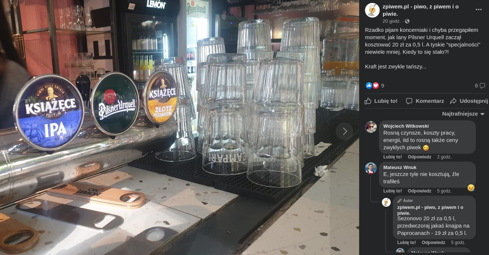
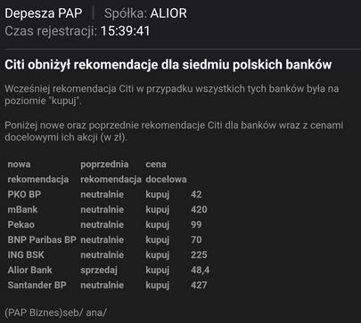

### 2023

Widać już efekty programu "Bezpieczny kredyt". Mieszkania, które rok temu kosztowały 500-600 tys., dziś kosztują 700-800 tys. złotych. Podrożały dokładnie do limitu ceny "z dopłatą".

  

---

  

---

  

---

  

---

  

---

### 2021

The Central Banksters engineered Asset Bubble to end all Asset Bubbles via the Cantillon Effect and its pandemic debt monitorization..

The central banksters money printing via debt monitorization is happening in a moment of severe deflation. So the issue is not that prices will rise, though of course they could. And we do see shortages in certain products, which is a form of inflation. I suspect purchasing power will matter more in who can afford to hold financial assets, not who can afford McDonalds. But the basic outline of the Cantillon Effect, that some people have more purchasing power and others have less in the same economy, if the channels of money creation make it so, is still operative.

<a href="./documents/july/assetbubble.pdf" target="_blank">Asset bubble</a>

---

Zamieszki i demonstracje na Kubie. Reżim wzywa do obrony komunizmu

W kilku miastach Kuby doszło w niedzielę do antyrządowych demonstracji – według opozycyjnych portali internetowych – największych od 1994 roku. Kubańskie władze oskarżyły Stany Zjednoczone o ich wywołanie.
Agencja Reutera napisała, że tysiące Kubańczyków wyszło w niedzielę na ulice, aby by wyrazić frustrację z powodu ograniczeń pandemicznych, tempa szczepień przeciwko Covid-19 i zaniedbań rządu.
Uczestnicy demonstracji wznosili m.in. okrzyki „Wolność” i „Precz z dyktaturą”.
Podczas protestów nie odnotowano poważniejszych incydentów. Policja i wojsko nie interweniowały.
Uczestnicy demonstracji protestowali przeciwko brakom w zaopatrzeniu w żywność i artykuły pierwszej potrzeby. Sytuację szybko pogarsza spadająca ze względu na pandemię liczba zagranicznych turystów oraz kryzys gospodarczy w Wenezueli, która jest dla Kuby głównym dostawcą ropy naftowej.
Prezydent Kuby i szef Partii Komunistycznej Miguel Diaz-Canel wezwał w niedzielnym wystąpieniu telewizyjnym zwolenników rządu, aby również wyszli na ulice i „dali odpór” przeciwnikom rewolucji.
– Wzywamy wszystkich rewolucjonistów, wszystkich komunistów, aby ruszyli na ulice i pojawili się w miejscach tych wszystkich prowokacji – apelował Diaz-Canel.
Na ulicach doszło do starć przeciwników i zwolenników reżimu.

---

### 2020

Zysk sektora bankowego w pierwszych miesiącach br. spadł o ponad 40 proc. Jest bardzo źle - ocenia prof. Marian Noga, były członek Rady Polityki Pieniężnej.
Największym zagrożeniem dla banków jest w tej chwili upadłość, chociażby jednego z nich, bo to wywoła efekt domina i może pociągnąć za sobą upadek kolejnych – mówi ekspert.
W nadchodzących miesiącach banki będą musiały zmierzyć się z wieloma czynnikami, które zagrażają stabilności sektora. Jednym z głównych są niskie stopy procentowe (RPP obniżyła główną stopę referencyjną do 0,1 proc. i była to już trzecia obniżka w czasie pandemii) oraz znaczny wzrost ryzyka kredytowego.
To spowodowało, że bankom komercyjnym w Polsce w ogóle nie opłaca się akcja kredytowa. Zabezpieczenia kredytu są w tej chwili tak skomplikowane i wywindowane, że właściwie aż niemożliwe do spełnienia i w efekcie akcja kredytowa się zmniejsza, a nie zwiększa. Banki będą teraz uciekać od kredytowania, będą kupować złoto, obligacje, dokonywać inwestycji zagranicznych – prognozuje prof. Marian Noga.

---

Polska jest stracona niezależnie od wyniku wyborów.

Na świecie rozpoczęła się rewolucja lewicowo-bezideowa. To rewolucja, która kontestuje naukę, własne autorytety jak Chomsky, wyznaje jakieś dogmaty zawarte w kilku zdaniach i z którymi nie znosi polemiki i niszczy wszystko na swojej drodze. A nader wszystko nienawidzi sprzeciwu, innego zdania, innych poglądów i chce cenzurować, a nawet eliminować z przestrzeni publicznej wszystko z czym się nie zgadza.

Obserwujemy to wszystko dziś na zachodzie, przede wszystkim w USA i UK, ale też np. w do niedawna konserwatywnych bastionach jak Hiszpania czy Irlandia. Trwa negowanie wszystkiego, bezmyślne niszczenie pomników i symboli, brak wiedzy, agresja wobec ludzi którzy się nie zgadzają na narzucanie poglądów. Niestety zaprzęgnięte w to zostały także instytucje publiczne, które ścigają ludzi za przestępstwa „motywowane nienawiścią” typu ślad opon na tęczowym przejściu dla pieszych przy jednoczesnym przymykaniu oczu na prawdziwe przestępstwa, jeśli tylko oskarżony należy do grupy, której skazać nie wypada. Nie będziemy tu pisać o jakie grupy chodzi bo i tak dobrze wiecie.

O właśnie, to też jest element tej całej imprezy, postępująca cenzura internetu (w tym autocenzura z obawy przed usuwaniem treści) oraz, w jeszcze wiekszym stopniu, medialna hipokryzja, manipulacje i przede wszystkim sterowanie opinią publiczną, przez nagłaśnianie jednych tematów i wyciszanie innych. Przez odpowiednie kreowanie jednych spraw na ważne i skandaliczne i marginalizowanie innych, niejednokrotnie groźniejszych czy bardziej oburzających. Nie liczą się czyny ani słowa, liczy się tylko czy coś pomaga lub szkodzi „naszej sprawie”.

Ta rewolucja nie ma na razie nazwy, nie ma chyba nawet celu poza zniszczeniem obecnego jakiegoś porządku, czy też resztek tego porządku. To rewolucja inna niż wszystkie, bo zazwyczaj buntowali się głodni i słabi przeciw sytym. A tutaj buntują się wielkomiejskie masy, które żyją w dostatku przeciw... no właśnie, przecie czemu? Przeciw zastanemu porządkowi, który ani ich nie uciska ani nawet nie przeszkadza wieść dostatnie życie. No bo czym innym jest piosenka Taco Hemingwaya (trzeba przyznać, że muzycznie świetna a tekstowo bardzo dobrze zbudowana) jak nie buntem młodych ze Starbunia przeciw reszcie kraju, który rzekomo im w czymś przeszkadza i dlatego trzeba go potraktować z buta? Czym innym są protesty bananowych dzieciaków w Stanach z iPhonami w dłoni robiących relacje na insta z tego, że demolują miasta?

Wracając do początku. Tak, Polska też już przegrała. Jesteśmy dokładnie w tym miejscu, gdzie Hiszpania była 10 lat temu. I ta zmiana jest nieunikniona. Od nas tylko zależy czy przesuniemy to choć odrobinę w czasie, licząc na jakiś cud, w postaci takiej, że gdzieś na zachodzie przegną tak bardzo, że Polska zdąży to zobaczyć zanim oszaleje jak zachód. Ale szanse na to są minimalne i raczej jedyne co nam pozostało, to zyskać jeszcze te kilka lat zanim mix wściekłej lewicy i cynicznych bezidowców, zgotuje nam to co widzimy na ulicach miast zachodu.

Jeśli dotarłeś do tego miejsca, to znaczy że widzisz co się dzieje i masz świadomość zagrożenia.
I to o tym są te wybory, a nie o tym czy np. podatki będą niższe czy wyższe, bo to ideologie i emocje napędzają 95% wyborców. I choćbyś na głowie stawał, to właśnie dominuje przy urnie wyborczej.

Glosuj świadomie, zanim będziesz zdziwiony, że ten pierdolnik przyszedł i do nas. Bo przyjdzie na pewno.
Od Ciebie tylko zależy kiedy.

---

  

---

### 1981

Rada Ministrów podjęła uchwałę o zmniejszeniu norm kartkowych na mięso i jego przetwory o 20% w sierpniu i wrześniu.
Czytamy w niej:
"Na skutek znacznego przejściowego niedoboru mięsa i jego przetworów normy zaopatrzenia wymienione w ust. 1 pkt. 2, 3 i 6 obniża się w sierpniu i wrześniu 1981 roku o 20%. Obniżenie norm nie dotyczy górników i zatrudnionych pod ziemią oraz dzieci i młodzieży w wieku 10-18 lat otrzymujące kartę zaopatrzenia "R" ".

  

### 1943

https://en.wikipedia.org/wiki/Battle_of_Prokhorovka

 

 

---

<a href="https://github.com/TomaszWaszczyk/historia.waszczyk.com/edit/master/src/content/july-12.md" target="_blank">Edytuj tę stronę dzieląc się własnymi notatkami!</a>
