### 2023

Google's new Quantum Computer can finish 47 years of computing tasks in just 6 seconds. Here's how it could change EVERYTHING:

1. Quantum computing blows conventional computing out of the water. It harnesses strange, counterintuitive quantum physics principles to exponentially boost computational power. Imagine solving complex problems in seconds that conventional supercomputers would take millions of years to crack.

Quantum computing isn't just an upgrade on conventional computing. It's going to redefine what computing can do.
________

2. But why is quantum computing so much better than regular computing?

Think of classical computing like flipping a coin: heads or tails, 0 or 1, it can only be one or the other. Quantum computing, on the other hand, is like spinning a coin. It can be heads, tails, or anywhere in between all at once.

This lets quantum computers explore many possibilities simultaneously, providing a massive speed boost for certain problems.
________

3. Google's new quantum computer is 241 million times faster than the one it released in 2019.

Google claims to be the first company to achieve Quantum Supremacy: a milestone point at which quantum computers surpass existing machines.
________

4. Quantum computing could do some crazy things that aren't currently possible:

• Discover new medical drugs and vaccines by running molecular simulations that are impossible with our current computing ability.

• Increase global trade and reduce climate emissions by optimizing complex trading routes and supply chain logistics.

• Discover new materials through analyzing different molecular structures. This could transform industries like energy storage.
________

5. Google is currently using its quantum computer to solve optimization problems like finding the best outcome given a set of data.

One application could be increasing efficiency and saving billions in global supply chain costs by finding the best routes.
________

6. What's next:

• Investment in quantum computing has gone from almost 0 to over $2 billion per year in the last decade.

• Competitors like IBM are rushing to launch their own quantum computers.

  

________

### 2022

> Morawiecki: Postarajcie się ocieplić swoje domy jeszcze przed sezonem grzewczym

Na długo przed wojną starałem się zwrócić uwagę, że Energiewende to faktycznie podział Europy na strefę wpływów DE i RU. W skrócie, NS1 i NS2, zakaz aut spalinowych, ekspansja uprawnień do emisji na kolejne sfery życia, omijanie przez nowe rurociągi PL/UA, torpedowanie Baltic Pipe/atomu w PL, wyłączanie Turowa to była wyrachowana polityka mocarstw, gdzie:

📌 Europa Śr-Wsch. jest dalej rezerwuarem taniej siły roboczej (ale bez prawa do konkurowania na Zachodzie, por. dyrektywa transportowa)
📌 RU zasila DE w tanią ropę/gaz, a te ostatnie (mając przepustowość 250% konsumpcji i monopol w UE) mogłyby tą energią dzielić się z "praworządnymi" krajami
(w zamian UA/BL pozostawałyby rosyjską strefą wpływów, a Nawalny i inni w kolonii karnej)
📌 Chiny pozostają tanią fabryką wszystkiego, co napędza konsumpcję i nie pozwala na większą refleksję mas nad życiem i światem
📌 W końcu UE mając sojusz z Moskwą i interesy z Pekinem, mogą równoważyć globalne wpływy USA i jeszcze liczyć się na świecie.

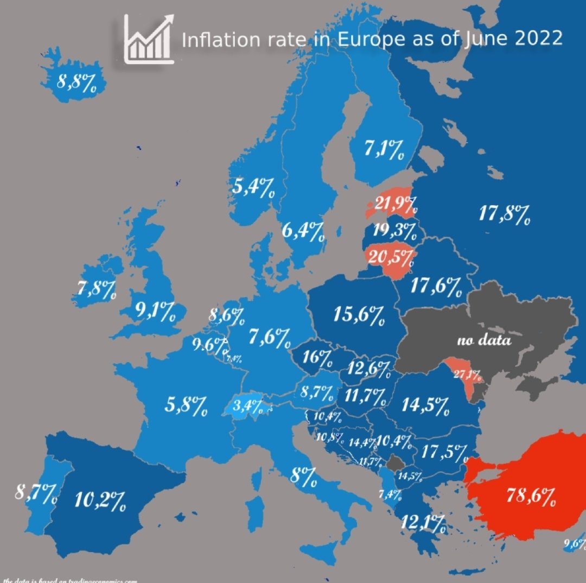  

Paryż pozwalał na linię Curzona i nowe Rapallo, bo sam będąc potentatem atomowym, kwestiami węgla/gazu nie zajmował się, ale popierał w zamian za poparcie Berlina w kluczowych dla FR sprawach, jak Wspólna Polityka Rolna. Wszystko szło jak po sznurku, TSUE orzekał jak trzeba, nowy POTUS Biden zgodził się na NS2 i zdjął z niego sankcje, lecz DE popełniły katastrofalny błąd.
Odrzuciły propozycję sojuszu z USA (te już zaczęły mówić o reżimie w W-wie...) i zwróciły się ponownie ku Rosji. A to wykorzystał Putin atakując UA - licząc na Blitzkrieg i obojętność świata.

💡 Tymczasem misterny plan szlag trafił, bo Ukraińcy byli na wojnę przygotowani i heroicznie zaczęli się bronić - nie po myśli ww. mocarstw z UE. Na domiar złego Polacy i Polska stanęła na wysokości zadania, udaremniła kryzys migracyjny i przeszła do politycznej/militarnej ofensywy, będąc dziś drugim po USA dostawcą broni na UA.

Rok 2022 przypomina 1939 r 📌 Tak jak we wrześniu PL dawała UK czas na przygotowania do niemieckiej inwazji, Bitwy o Anglię, tak dziś UA swoją krwią i swoich dzieci dają czas do namysłu Zachodowi. USA otrzeźwiały natychmiast, syta UE na oko jeszcze potrzebuje czasu.

Zdaje się jednak, że rzeczy przyspieszają, bo w DE trwa już rządowa kampania ostrzegająca przed największym kryzysem od 1945, o zapaści PKB, o przestojach, brakach prądu/gazu/ciepłej wody, ogrzewania.
CZ ogarnęli się i pomimo Turowa przylecieli do W-wy z prośbą o podłączenie ich gazociągów z naszego gazoportu. DE, całkowicie uzależnieni od woli Putina też dostrzegli, że ich dominacja bez energii może się zakończyć tej zimy, więc podobnie postanowili zadbać o dostawy gazu i z typowo pruską elegancją i swadą rzucili w PE pomysł, że kraje, które nie ufały Rosji i na własną rękę budowały niezależność energetyczną... muszą z DE się podzielić swoimi zapasami. Świnoujście najbliżej, tylko KPO solidarnie wciąż czeka 😁

### 2021

<video width="640" height="480" controls>
  <source src="./movies/july/zaszczepsieloteria.mp4" type="video/mp4">
  Your browser does not support the video tag.
</video>

Cezary Pazura również brał udział w reklamie szczepień.

---

Fabryka maszyn rolniczych Ursus upada na wniosek banku PKO BP.

---

### 2020

Dnia 13 czerwca zmarł Jean Raspail. Jeden z najgłośniejszych  pisarzy francuskich XX wieku. Prywatnie rojalista, konserwatysta, tradycjonalista, katolik, pesymista i katastrofista. Wieszczący dekady przed Houellebecq upadek zachodnioeuropejskiej cywilizacji.

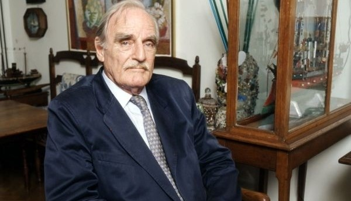  

### 2000

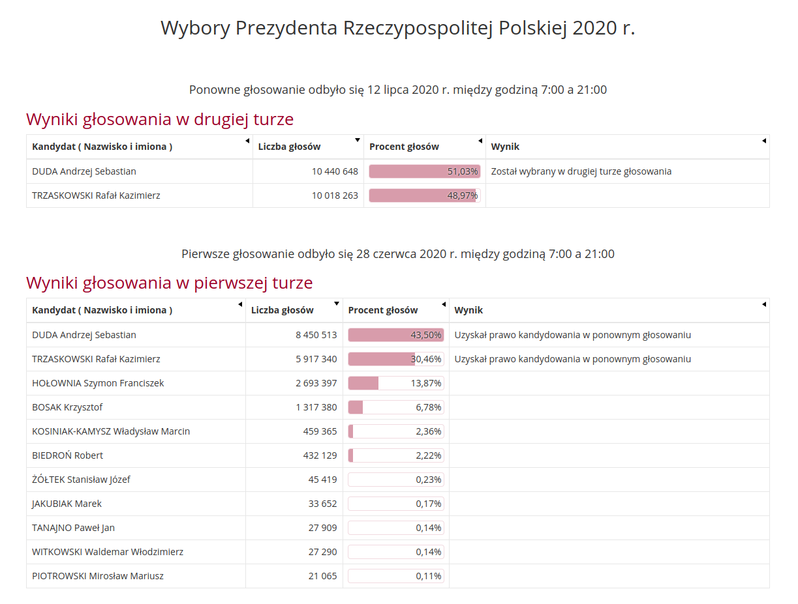  

---

W Waszyngtonie zmarł Jan Karski - obywatel Polski i Stanów Zjednoczonych, honorowy obywatel Izraela,
prawnik i dyplomata, historyk, od 1939 w
konspiracji, kurier i emisariusz władz
Polskiego Państwa Podziemnego, świadek
Holokaustu . Za swoją działalność został
odznaczony najwyższymi odznaczeniami
państwowymi – polskim Orderem Orła
Białego i amerykańskim Medalem Wolności
Jan Karski był kurierem i emisariuszem
politycznym. W podziemiu znany był pod
pseudonimem „Witold”. Używał także
innych: „Piasecki”, „Kwaśniewski”,
„Znamierowski”, „Kruszewski”, „Kucharski”.
Dwukrotnie, w tajemnicy przed
administracją niemiecką, udawał się do
getta warszawskiego. Aby zebrać dalsze
materiały, w przebraniu niemieckiego
żołnierza wszedł do obozu zagłady, który
później zidentyfikował jako Bełżec . Po
wojnie przyznał, że był to obóz przejściowy
dla Żydów w Izbicy.
W 1982 roku
otrzymał tytuł Sprawiedliwego wśród
Narodów Świata i posadził drzewko na
terenie Yad Vashem w Jerozolimie . Przyjął
go prezydent Izraela . W 1994 roku otrzymał
honorowe obywatelstwo państwa Izrael. W
1995 roku otrzymał Order Orła Białego.

  

### 1949

Papież Pius XII wydał dekret potępiający komunizm, grożąc ekskomuniką wszystkim katolikom należącym do partii komunistycznych lub je wspierającym.

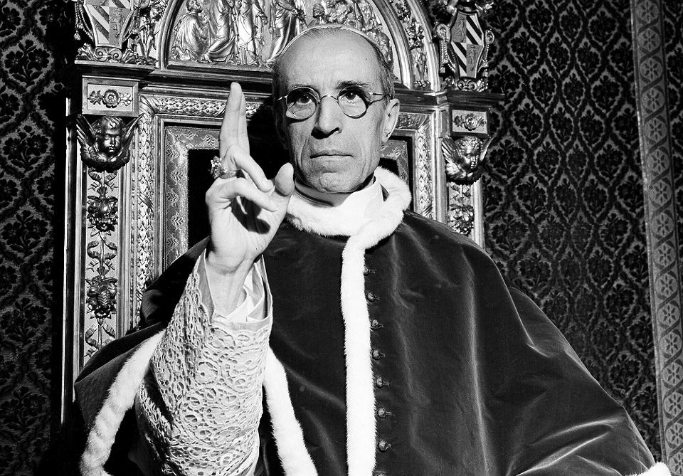  

### 1945

W Kielcach odbył się mecz piłki nożnej pomiędzy drużyną pułku Armii Czerwonej, który w styczniu tego samego roku wszedł do tego miasta, a reprezentacyjną drużyną z Kielc. Kielczanie wygrali ten mecz 3:0.

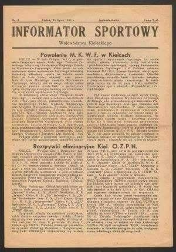  

### 1943

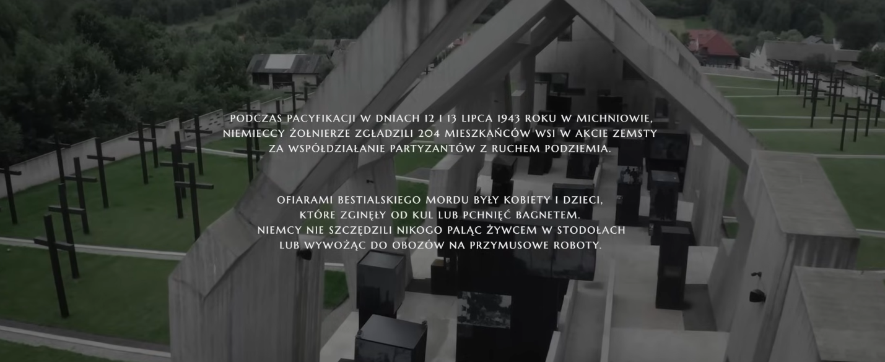  

### 1936

Premier rządu polskiego Felicjan Sławoj -Składkowski wydał okólnik, w którym wprowadził odgórnie kult generała Edwarda Rydza-Śmigłego (zdjęcie) jako "pierwszej w Polsce osoby po Panu Prezydencie". Dokument ten był sprzeczny z tzw Konstytucją Kwietniową.

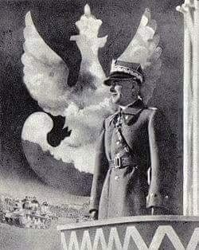  

### 1919

Do Polski przybyła amerykańska komisja pod po przewodnictwem senatora Henry'ego Morgenthaua. Jej zadaniem było zbadanie sytuacji ludności żydowskiej w Polsce. Komisja przyjechała nad Wisłę na skutek nadchodzących ze Stanów Zjednoczonych i Europy Zachodniej sygnałów o rzekomych pogromach i prześladowaniach Żydów.
W wyniku przeprowadzonych przez nią prac sporządzony został raport, w którym zawarto informacje ośmiu ekscesach, w których śmierć miało ponieść 280 obywateli żydowskich. Określenie "eksces" ma tu fundamentalne znaczenie, ponieważ członkom komisji nie udało potwierdzić okoliczności, które dałoby się opisać słowem "pogrom". Podkreślono również, iż w znacznej mierze przypadki te wynikały z warunków wojennych na Kresach, gdzie toczył się konflikt z Ukraińcami i bolszewikami, których tak jednych jak u drugich wspierali Żydzi i ich organizacje. 
Zaprzeczono również wysuwanej przez USA tezie, iż to polskie władze są inicjatorami zajść i konfliktów na tle semickim. 
Zdjęcie; Żydzi wracający z synagogi w Myślenicach.

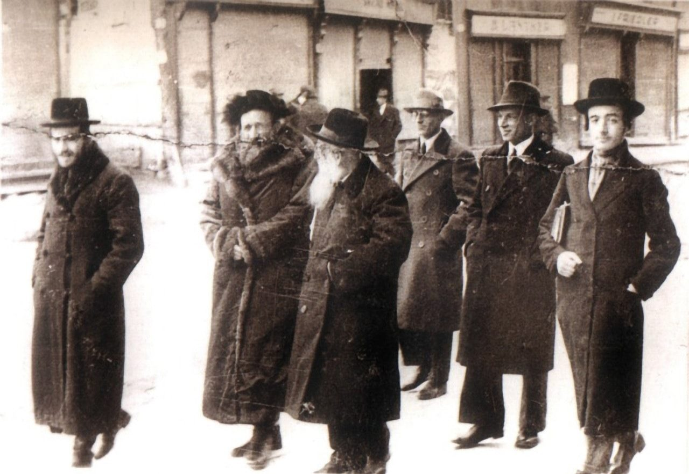  

### 1904

W czasie wojny rosyjsko-japońskiej Józef Piłsudski (zdjęcie) złożył w japońskim Ministerstwie Spraw Zagranicznych memoriał, w którym napisał:
"(...) głównymi czynnikami rozkładowymi państwa rosyjskiego są: Polska, Finlandia i Kaukaz, a raczej dwa główne jego narody-Gruzini i Ormianie. Przy tym zauważyć należy, że wpływy polskie są decydujące na Litwie i katolickiej Białorusi (...), a Gruzini i Ormianie mogą mieć wpływy na półdzikie plemiona górskie na Kaukazie".

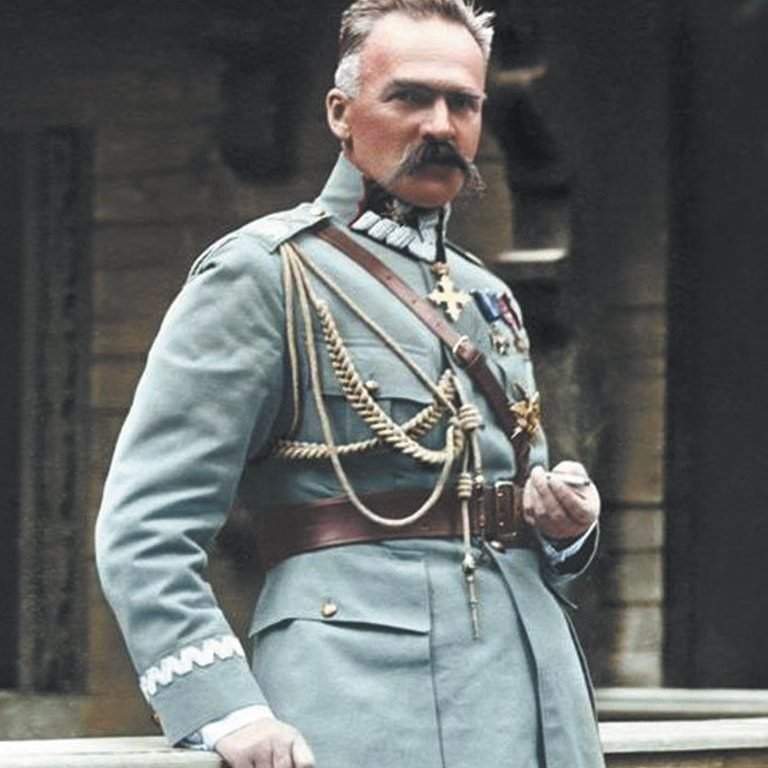  

### 1794

W czasie insurekcji kościuszkowskiej rozpoczęło się rosyjsko -pruskie oblężenie Warszawy.
Umocnienia stolicy zostały przygotowane przez Korpus inżynierów pułkownika Karola Sierakowskiego i generała Józefa Orłowskiego.
Choć umocnienia Warszawy nie zostały wykończone przed dotarciem pod stolicę Polski armii pruskiej i rosyjskiej pod dowództwem króla Fryderyka Wilhelma II, to dzięki mężnej postawie obrońców kierowanych przez Naczelnika Najwyższego Siły Zbrojnej Narodowej Tadeusza Kościuszki, miasto wytrzymało blisko dwumiesięczne oblężenie.
Dzięki sprawnemu kierowaniu administracją stołeczną przez Ignacego Wyssogotę Zakrzewskiego w oblężonej stolicy nie zabrakło żywności ani amunicji.
Wojska prusko-rosyjskie odeszły spod oblężonego miasta 6 września.

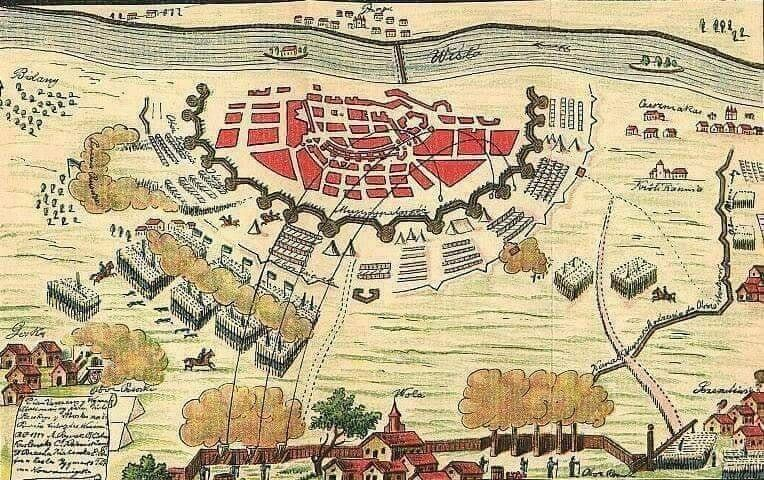  

### 1769

W czasie Konfederacji barskiej rozegrała się bitwa pod Białymstokiem znana też jako bitwa pod Olmontami.
Wojska Rzeczpospolitej pod dowództwem Kazimierza Pułaskiego i Józefa Bierzyńskiego spotkały się w walce z wojskami Imperium Rosyjskiego dowodzonymi przez Aleksandra Golicyna.
Niestety na skutek źle obranej przez Polaków taktyki,w której nie uwzględniono szarży na szable bitwa ta zakończyła się zwycięstwem czterokrotnie mniejszych oddziałów rosyjskich.

### 1666

W czasie tak zwananego rokoszu Lubomirskiego miała miejsce bratobójcza bitwa pod Mątwami nad Notecią (obecnie dzielnica Inowrocławia).
Po przeciwnych stronach stanęło 20 tysięcy żołnierzy króla Jana Kazimierza i 16 tysięcy wojsk rokoszan Jerzego Sebastiana Lubomirskiego.
Rokosz ten, nazwany jego imieniem był zbrojnym protestem w znacznym stopniu wspieranym przez szlachtę i magnaterię, która obawiała się umocnienia władzy królewskiej, a co za tym idzie utraty wpływów.
Sama bitwa rozpoczęła się nad bagnistymi brzegami Noteci, co okazało się śmiertelną pułapką dla wojsk królewskich. Dodać do tego należy, że żołnierze ci nie chcieli strzelać do swoich rodaków, którzy walczyli nawet w takich samych mundurach odróżniających się jedynie przepasaną na rękawie białą chustą. W szeregach wojsk królewskich doszło jeszcze do kolejnego zamieszania, które wywołał hetman Jan Sobieski, który nakazał odwrót, co z kolei spowodowało sytuację, w której jedni żołnierze wycofywali się, a drudzy...ruszali do ataku.
Uwięzieni na bagnach żołnierze królewscy poddali się wierząc, że skoro oddają się w ręce swoich rodaków zostaną godnie potraktowani. Nic bardziej mylnego nie mogło ich spotkać. Trafiwszy w ręce rokoszan padli ofiarami ich wielkiego okrucieństwa, które później Jan Sobieski opisał w jednym z listów wspominając:
"Z tej okazji najwięcej zginęło ludzi, że skoro z błota uszli, wywoływali ich, dając im parol a potem, zawiódłszy na górę, nie ścinali ale rąbali na sztuki. Nie tylko Tatarowie, nie tylko Kozacy nigdy nie czynili takiego tyraństwa ale we wszystkich historiach o takim od najgrubszych narodów nikt nie słyszał okrucieństwie. Jednego nie znajdują ciała żeby nie mieć w sobie czterdziestu razów, bo i po śmierci nad ciałami się pastwili".
W bitwie i w masakrze, która po niej nastąpiła zginęło, według różnych szacunków ok. 4000-5000 żołnierzy królewskich. Zdecydowana większość (tylko ok. 300-400 padło w boju) została zamordowana w wyjątkowo okrutny sposób przez swoich współbraci.

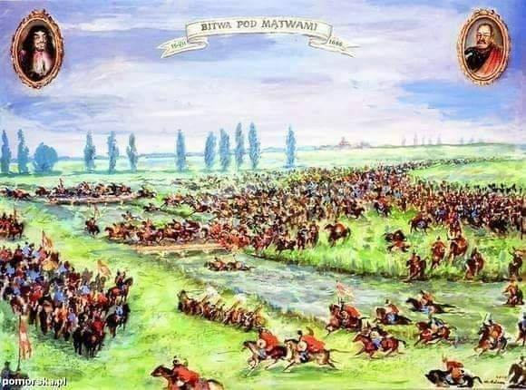  

---

<a href="https://github.com/TomaszWaszczyk/historia.waszczyk.com/edit/master/src/content/july-13.md" target="_blank">Edytuj tę stronę dzieląc się własnymi notatkami!</a>
