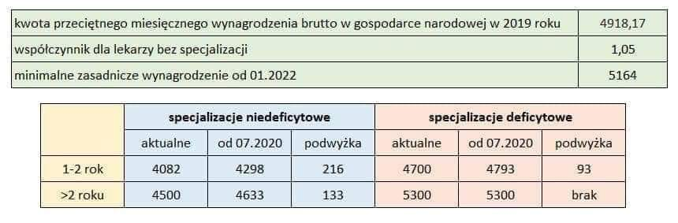
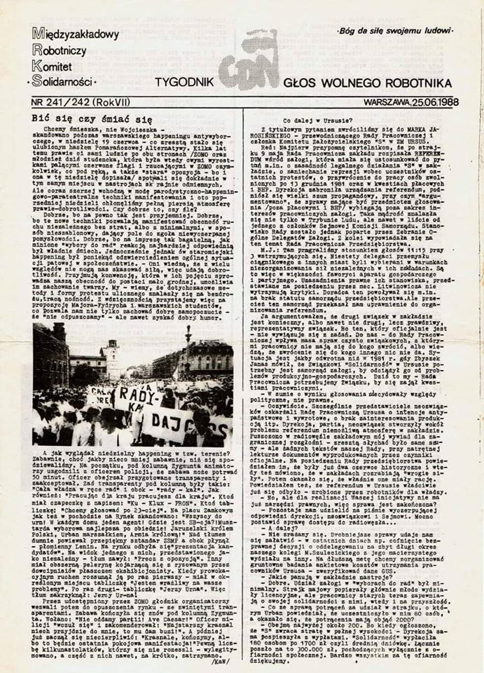
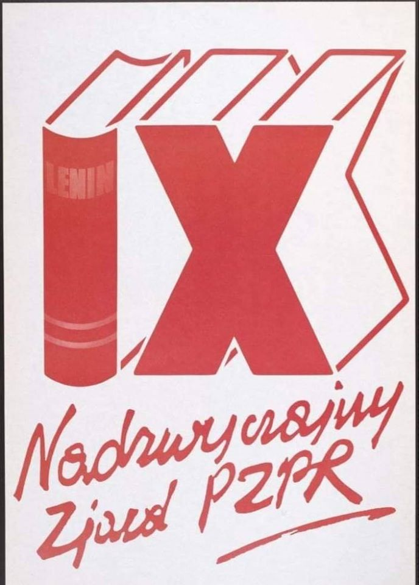
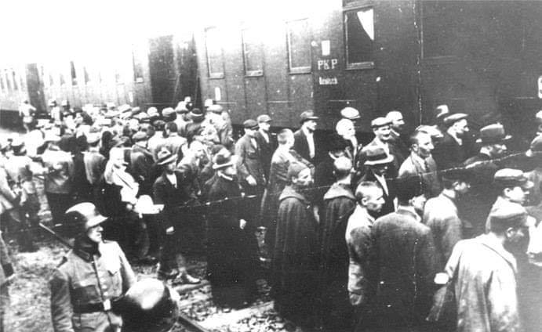
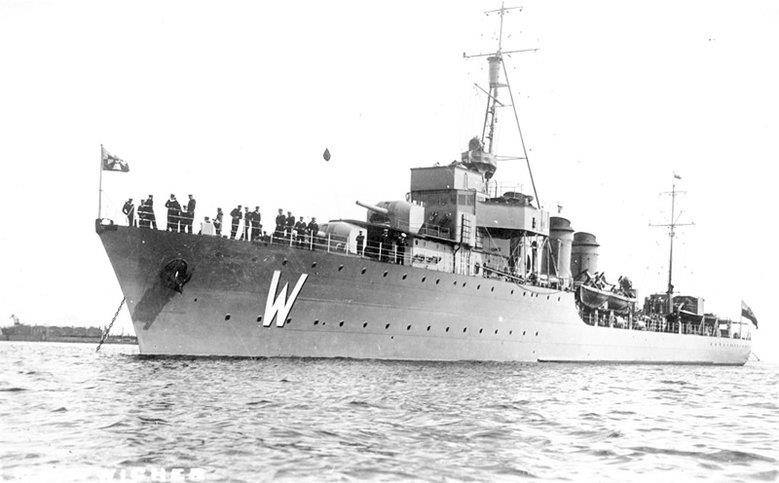
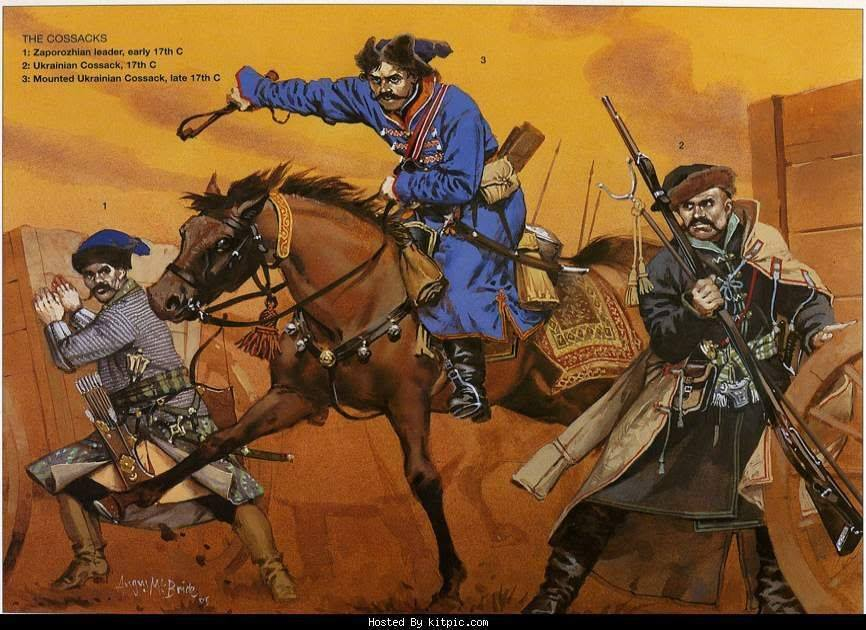
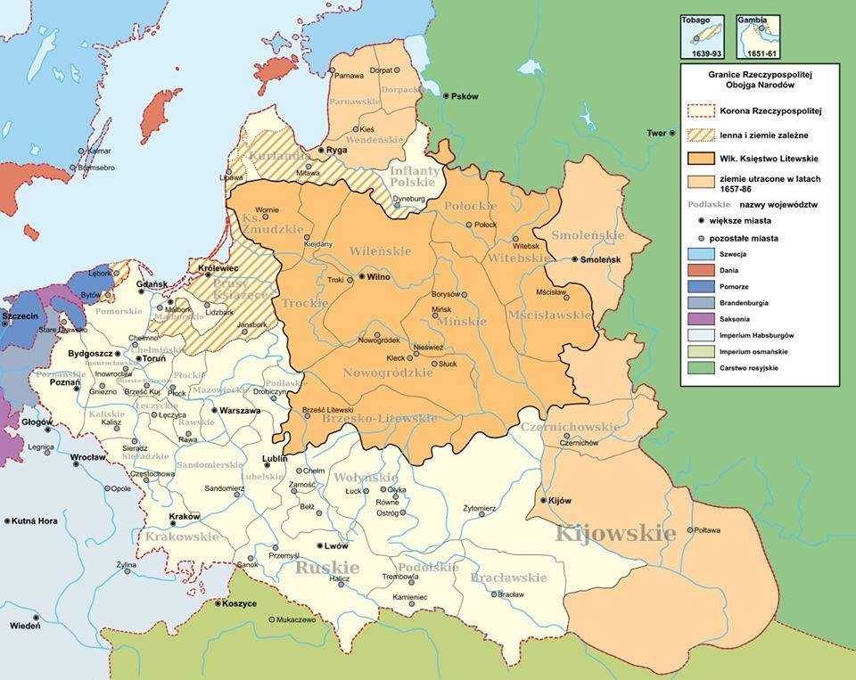
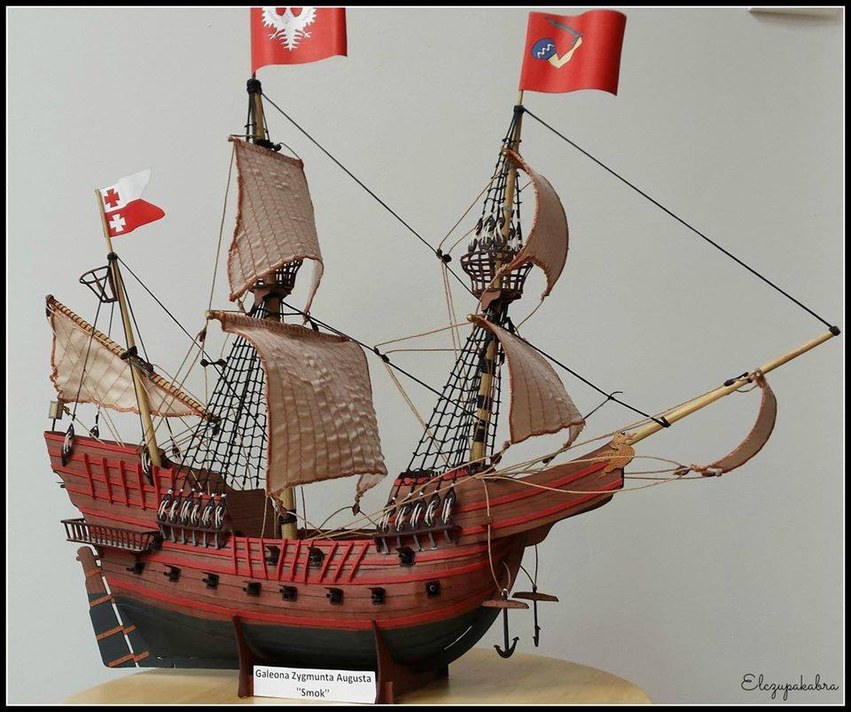

### 2021

NBP dołączył do grona innych banków centralnych, które kupują akcje oraz futures na akcje i na indeksy już od kilku lat. Bank centelny drukuje z powietrza gotówkę i za te gotówkę kupuje udziały w firmach.

### 2020

  

> Rząd wydaje 200mln na respiratory. Producent nic o tym dealu nie wie. Jedynej umowy nie ma bo „pracownik zabrał ją do domu”. Mediom rzuca się pewniaka: lgbtqwerty. Biskup nazywa premiera ewangelistą. Kraj się kłóci. Monty Python w 2020 kręciłby reportaże.

### 1982

W Warszawie powstała Komisja Współpracy Pism Niezależnych. Był to organ zrzeszający wydawców pism podziemnych. Jego twórcami byli przedstawiciele takich wydawnictw jak"CDN-Głos Wolnego Robotnika", "KOS", "Tygodnik Wojenny", "Wolę".

  

### 1981

W Warszawie rozpoczęły się trwające sześć dni obrady IX Nadzwyczajnego Zjazdu Polskiej Zjednoczonej Partii Robotniczej.
W obliczu rosnącego w Polsce kryzysu gospodarczego i społecznego niezadowolenia było to wydarzenie przełomowe. Delegacji podjęli dyskusję o rozwoju socjalistycznej demokracji. Rozmawiano również o umocnieniu przewodniej roli PZPR w budownictwie socjalistycznym i stabilizacji społeczno-gospodarczej kraju. Jednak zasadniczym punktem obrad było usunięcie z szeregów partii Edwarda Gierka, Edwarda Babiucha, Jerzego Łukaszewicza, Tadeusza Pyki, Jana Szydlaka i Zdzisława Żandarowskiego.

  

### 1940

„Wszyscy fachowcy polskiego pochodzenia mają być wykorzystani w naszym przemyśle wojennym. Później Polacy znikną ze świata.[...] Godzina każdego Niemca zbliża się. Dlatego jest rzeczą konieczną, by wielki naród niemiecki widział swe główne zadanie w zniszczeniu wszystkich Polaków”. Heinrich Himmler
14 czerwca 1940 roku do obozu koncentracyjnego Auschwitz dotarł z Tarnowa pierwszy transport 728 polskich więźniów politycznych.
Wśród więźniów byli żołnierze polskiej wojny obronnej, członkowie podziemnych organizacji niepodległościowych, gimnazjaliści i studenci, a także mała grupa polskich Żydów. Otrzymali oni numery od 31 do 758. Na okres kwarantanny zostali umieszczeni w budynku dawnego Polskiego Monopolu Tytoniowego, nieopodal terenu dzisiejszego Państwowego Muzeum Auschwitz-Birkenau. Wojnę przeżyło jedynie 298 więźniów, zginęło 272, a w przypadku 158 los jest nieznany.
Od 2006 roku, decyzją Sejmu RP, 14 czerwca obchodzony jest jako Narodowy Dzień Pamięci Ofiar Nazistowskich Obozów Koncentracyjnych.

  

### 1932

Doszło do tzw. kryzysu gdańskiego. Niszczyciel ORP Wicher, wymuszając prawa port d'attache dla Polski, wszedł do miejscowego portu.
Polska nie mogła pozostać obojętna na groźny dla interesów kraju wzrost nastrojów nacjonalistycznych wśród niemieckich mieszkańców Wolnego Miasta Gdańska. By przeciwdziałać niekorzystnemu dla II Rzeczpospolitej rozwojowi wypadków, Marszałek Józef Piłsudski rozkazał niszczycielowi ORP Wicher wpłynięcie do portu.
Przypomnijmy, że na mocy traktatu wersalskiego Gdańsk - wcześniej w granicach niemieckich - został przekształcony w wolne miasto pod zwierzchnictwem Ligi Narodów. Podpisana wówczas konwencja polsko-gdańska przyznawała Polsce prawo do prowadzenia polityki zagranicznej miasta, obrony jego terytorium, które jednocześnie należało do obszaru celnego II Rzeczpospolitej.
Mający przewagę w gdańskim senacie Niemcy od początku prowadzili antypolską politykę. Jej kulminacją był zakwestionowanie prawa Polski do korzystania z portu.
Gdy w czerwcu 1932 roku do gdańskiego portu miały wpłynąć trzy brytyjskie okręty, Marszałek Piłsudski postanowił skorzystać z okazji i powitać gości wprowadzając do portu niszczyciel ORP "Wicher". Stosowny rozkaz, wydany po konsultacjach Piłsudskiego z dowódcą polskiej floty komandorem Józefem Unrugiem, ukazał się 14 czerwca.
Okręt 15 czerwca znalazł się w Wolnym Mieści Gdańsk. ORP "Wicher" oczywiście nie wpłynął do portu, by kurtuazyjnie powitać Brytyjczyków, ale by "przycisnąć" krnąbrny senat gdański. Wybrano do tego idealny okręt - jak pisał w "Okręty Rzeczpospolitej Polskiej 1920-1946" Stanisław M. Piaskowski, niszczyciel odznaczał się "groźnym wyglądem".
ORP "Wicher" miał straszyć nie tylko sylwetką. Dowódca okrętu komandor porucznik Tadeusz Podjazd-Morgenstern otrzymał wyraźny rozkazy, "gdyby władze Gdańska poważyły się na obrazę polskiej bandery", ostrzelać najbliższy budynek należący do jakiegokolwiek urzędu miejskiego.
Władze Wolnego Miasta Gdańska, mając w porcie gotowy do akcji okręt wojenny II Rzeczpospolitej, nie odważyły się na jakąkolwiek antypolską manifestację. Natomiast dowódca brytyjskiej eskadry komandor Henry Daniel Pridham-Wippell, który odwiedził komandora Podjazd-Morgensterna na ORP "Wicher", musiał odnieść wrażenie, że Gdańsk jest polski.
Manifestacja niszczyciela przyniosła też inny wymierny skutek. 14 sierpnia władze Gdańska zgodziły się na korzystanie z portu przez okręty znajdujące się pod polskimi banderami.

  

### 1931

https://de.wikipedia.org/wiki/Deutsche_Bankenkrise

https://de.wikipedia.org/wiki/Darmst%C3%A4dter_und_Nationalbank

### 1860

Urodził się Jan Rządkowski - jeden z bohaterów Bitwy Warszawskiej.
13 sierpnia 1920 r. Bolszewicy zdobyli miasto Radzimin, przełamując linię obrony Warszawy. Po południu 14 sierpnia 1. dywizja litewsko-białoruska (dowódca dywizji - Jan Rządkowski) zaatakowała wojska bolszewickie i strąciła je z Radzimina, ale nie była w stanie zorganizować obrony miasta. Kontratak wojsk rosyjskich odepchnął polskie jednostki z powrotem. Rano 1. dywizja litewsko-białoruska zaatakowała Radzymin z frontu. Ważną rolę w tym frontalnym ataku odegrały czołgi Renault FT, które przedarły się przez pozycje rosyjskie, a 85 pułk strzelców wileńskich zmusił jednostki bolszewickie do opuszczenia Radzimina. Kontratak rosyjskiej 61. i 62. brygady piechoty spowodował jednak przesunięcie 85. pułku na pierwotną pozycję.W tym samym czasie 28. i 29. pułki 10. Dywizji Piechoty z północy okrążyły Radzymin i zdobyły wieś Mokre, położoną na tyłach Rosjan. Próby bolszewików odepchnięcia Polaków nie powiodły się. 1. dywizja litewsko-białoruska ponownie rozpoczyna atak na Radzimin.W tej sytuacji rosyjskie brygady, bojąc się środowiska, wycofały się z Radzimina. 16 sierpnia Rosjanie próbowali ponownie schwytać Radzimina i Mokrego. Ale ich ataki zakończyły się niepowodzeniem. Tego samego dnia rozpoczął się kontratak 3 i 4 polskiej armii od południa na tyły rosyjskiej 16 armii, która opowiedziała się za polską drogą wojny.
Jan Rządkowski to były rosyjski oficer, który dokonywał wyczynów w armii rosyjskiej. 1 sierpnia 1915 r. podczas rekolekcji w pobliżu wsi Olshanka ppłk. Jan Rządkowski, który dowodził 739. Nowoaleksandryjskiej jednostką milicji dowiedziała się, że żołnierze niemieccy odkryli niezabezpieczony odcinek rosyjskiej linii obrony i i zbliżali się tam, grożąc otaczają rosyjskie części. W tej sytuacji Rządkowski, osobiście dowodzący oddziałem, zajął opuszczoną linię obrony i spotkał się z Niemcami z karabinem maszynowym i ostrzałem z karabinu, odpychając ich ofensywę. Za ten wyczyn Jan Rządkowski otrzymał broń św. Jerzego.

  

### 1775

Wojska rosyjskie rozpoczęły likwidację Siczy Zaporoskiej.
Czym była Sicz zaporoska? Była stolicą kozaczyzny. Nikt nie zapisał, kiedy powstała i są, co do tego, najrozmaitsze koncepcje. Najbardziej rozpowszechniona, przyjmująca, że Sicz została założona przez księcia Dymitra Wiśniowieckiego i sugerująca, że przed przybyciem księcia na Zaporoże niczego tam nie było, jest najpewniej nieprawdziwa.
Teraz już wiadomo, że książę Wiśniowiecki, zakładając w roku 1553 na wyspie Mała Chortyca umocnioną osadę kozacką, co najwyżej rozbudował i zinstytucjonalizował już istniejące organizacje kozackie z dotychczasowym centrum położonym na wyspie Tomakiwka.
Można jednak przyjąć, że to od czasu objęcia władzy na Zaporożu przez księcia Wiśniowieckiego, Sicz zaczęła organizować się w coraz bardziej skomplikowany twór polityczny i ekonomiczny. Wśród zamieszkujących ją Kozaków powstawał też, typowy tylko dla Siczy żargon, nazewnictwo, tworzone oczywiście na bazie języka ukraińskiego, ale zawierające w sobie elementy, zaczerpnięte z języka tatarskiego i tureckiego.
Trzeba przyznać, że Polacy jakoś nigdy nie mieli talentu do obu tych języków, przekręcając zawsze tatarskie i tureckie słowa i pojęcia w nich zawarte do tego stopnia, że stawały się kompletnie niezrozumiałe.
Najlepszy przykład i to z naszych czasów dotyczy nazwiska tureckiego zamachowca, który postrzelił Ojca Świętego 13 maja 1981 roku. Wszyscy nazywają go Ali Aqca, lub Agca i tak pisząc i czytając jego nazwisko, nie omijając przy tym w wymowie żadnej z zapisanych liter, dławią się i czkają wytwornie, sami nie wiedząc, że ich wysiłki są zupełnie niepotrzebne.
W alfabecie tureckim nie ma litery „q”. Istnieje tam za to litera „g” z umieszczonym nad nią małym „ptaszkiem”, podobnym do tych, jakie widać w alfabecie czeskim. Żeby było śmieszniej, tak zmodyfikowana litera „g” nie jest literą, ale znakiem dla czytającego, mówiącym, że poprzedzająca go samogłoska ma być czytana przeciągle. Tego znaku w Turcji się nie czyta. Z braku w naszych czcionkach tureckiego „g”, przyjęto zastępować ten znak literą „q”, lub po prostu polskim „g”. Tak to z Alego A (g z daszkiem) ca, powstał Ali Aqca, albo Agca.
Dodatkowego smaku nadaje sprawie turecka litera „c”, którą się powinno czytać nie „c”, ale „dż”. No, więc jak w końcu nazywa się ten cholerny Turek!? – Turek się nazywa Ali Aadża. Ciężkie życie mamy z tym tureckim i dlatego, gdy, Państwo gdzieś usłyszycie, że kozacki „kosz” jest słowem pochodzenia tureckiego, oznaczającym wielkie stada owiec, to lepiej nie wierzcie temu.
To prawda, że kosz jest słowem tureckim i jest słowem, używanym wszędzie, gdzie kiedyś panowali Turcy. Do dzisiaj cała Północna Afryka wymawia to słowo jako „chosz” i określa nim warowny obóz, zagrodę, albo ogrodzone i pilnowane miejsce postoju. W Libii chosz, oznacza po prostu – dom.
Kozacy tym słowem określali stacjonarny garnizon wojsk kozackich na Siczy. Sama Sicz była pojęciem warownego grodu, otoczonego drewnianymi umocnieniami w postaci palisad i wież wartowniczych, ustawionych na wałach z ziemi i kamienia. Kosz natomiast, był raczej instytucją i tym odróżniał się od swojego tureckiego pierwowzoru.
Jak każdy garnizon, czyli miejsce długotrwałego przebywania różnych jednostek wojskowych, tak i kozacki kosz posiadał swoje wojskowe władze garnizonowe, zajmujące się sprawami wojska stacjonującego w garnizonie.
Dowódcą kosza był ataman koszowy, a jego zastępcą esauł, odpowiednik dowódcy żandarmerii, dbający o spokój i porządek. Dalej sędzia – prowadził sprawy karne i cywilne oraz pisarz, będący szefem kancelarii. Jeszcze: dobosz, tłumacze i kantorzysta, który kontrolował wagi i miary, zaś opłaty za przeprawę przez rzekę pobierali od podróżujących kupców koszowi szafarze.
Wszystkie te stanowiska były wybierane przez ogół mieszkańców Siczy. Stanowiły one stacjonarną władzę kozackiego garnizonu i nie miały niczego wspólnego z dowodzeniem kozackim wojskiem w czasie wyprawy wojennej. Stała załoga Siczy liczyła około 500 zaporożcow, ugrupowanych w tak zwane kurenie. Wokół tego słowa narosły niesłychane opowieści, podczas gdy kureń był zwyczajnym barakiem, taką zagłębioną w ziemi półziemianką, gdzie mieszkali zaporożcy.
Kureń, czyli sypialnia, coś, co dzisiaj nazwano by zapewne blokiem, tworzył jednocześnie podstawową jednostkę wojska zaporoskiego, liczącą około 10 żołnierzy. Kozacy dobierali się między sobą do wspólnego kurenia, preferując swoich znajomych, albo chłopaków z jednej miejscowości, czy okolicy, bo tak im się po prostu lepiej mieszkało i służyło.
Kozakami byli najczęściej młodzi ochotnicy, nieco tylko powyżej dwudziestoletni. Początkowo nowicjusze, pełne uprawnienia uzyskiwali dopiero po przesłużeniu trzech lat. Kureniem dowodził ataman kurenny.
W czasie wojny struktura kureni pozostawała nienaruszona, ale wchodziły one teraz w skład dużej jednostki bojowej, jaką był kozacki pułk. Pułk kozacki podobny był do ówczesnego polskiego pułku dragonii, lub dużo późniejszego polskiego pułku kawalerii, bo stanowił właściwie oddział piechoty, jedynie dla szybkości manewru poruszającej się na koniach.
Pułk kozacki liczył około 2000 ludzi. Po wielu formach przejściowych pułk ustabilizował się według następującej struktury. – Cztery roty po 500 kozaków w każdej. Rota składała się z pięciu setek (sotni), a każda z nich utworzona była z 10 kureni. Pułkiem dowodził pułkownik, mający przy sobie: oboźnego, pułkowego esauła, chorążego, sędziego i pisarza. Rotami dowodzili porucznicy.
Pułk mógł tworzyć pół roty po 250 żołnierzy, których oddawano wtedy pod komendę esaułów. Zwykle jednak rota składała się z pięciu setek dowodzonych przez setników, a te z 10 kureni dowodzonych przez swoich atamanów. Dodatkowo w pułku służyło 4 chorążych, 4 trębaczy i 4 doboszów. „Roku pamiętnego” 1648 przyszło Polakom rozbijać 23 takie pułki kozackie.
Całością wojsk zaporoskich dowodził hetman, mający do dyspozycji sztab, składający się z generalnego sędziego, generalnego oboźnego, pisarza, podskarbiego, generalnego esauła i chorążego.
W wojsku zaporoskim przewidziane były stopnie nakaźne, to znaczy, przeznaczone dla wykonania jakiegoś zadania ekstra, pojawiającego się nagle i niespodziewanie. Nieodłącznym elementem stopnia nakaźnego była jego tymczasowość. Mogło, więc, powstać stanowisko tak zwanego hetmana nakaźnego, albo pułkownika nakaźnego, czyli kogoś, kto tymczasowo zastępował hetmana, lub pułkownika w wykonywaniu jakichś ważnych obowiązków. Właściwie każdy wyższy stopień wojskowy w sytuacji awaryjnej mógł być dublowany przez oficera niższej rangi, czasowo przeniesionego do wyższej, z zaznaczeniem nakaźności tego mianowania.
Chciałbym Państwu zwrócić uwagę na bardzo rozbudowane, chyba bardziej niż w innych armiach tamtego czasu, służby administracyjne wojska zaporoskiego. Łatwo można się dowiedzieć, jak bardzo cenione i szanowane było wtedy stanowisko pisarza-kancelisty i sędziego, którzy znajdowali się w wojsku zaporoskim właściwie na każdym szczeblu dowodzenia.
O czym to świadczy? – Przede wszystkim, chyba o tym, że wojsko zaporoskie nie było jednak dziką bandą pijanego pospólstwa, jak to niejednokrotnie usiłowano nam przedstawiać. Zaporożcy mieli dla siebie czas zabawy, dzikiej czasami i wrzaskliwej, w trakcie której tańczono wariackiego kozaka, pito, a często po prostu chlano wódkę, piwo i miody. Ale przychodził koniec zabawy, straż esauła rozbijała beczki z wódką i „Towarzystwo” trzeźwiało w mgnieniu oka.
Szymon Starowolski, który w czasie wspólnej, polsko-kozackiej obrony Chocimia był sekretarzem hetmana Chodkiewicza, będący świadkiem naocznym wydarzeń, tak pisze o wojsku kozackim:
„W swoich obozach mają dyscyplinę starożytnych Rzymian, a męstwem wojennym i spraw żołnierskich znajomością żadnej w świecie nacji nie ustępują”. – Czy tak prezentuje się armia alkoholików i zboczeńców? A przecież, jako takich właśnie, bardzo często przedstawiali zaporożców ludzie im niechętni.
O homoseksualizm, jaki rzekomo szerzył się wśród nich, podejrzewano Kozaków z dwóch powodów. Pierwszym z nich był zakaz przebywania na Siczy kobiet, naprawdę przestrzegany bardzo surowo, zaś drugim powodem była częsta u Kozaków instytucja tak zwanego pobratymstwa. Czemu zabraniano kobietom wstępu na Sicz? Chyba samo życie pokazało, że tak będzie lepiej. Nie dawało to pretekstu do zatargów i bójek między Kozakami.
A pobratymstwo? Proszę Państwa! Kozacy żyli z wojny i dla wojny. Zdarzało się, że nie tylko codziennie, ale co godzinę ryzykowali zdrowiem i życiem. W takim permanentnym stanie zagrożenia człowiek instynktownie szuka oparcia w najbliższym koledze. I takie zespoły się tworzyły.
Znalazło to swój wyraz w folklorze Zaporoża i ubrane zostało w rytuał, odbywający się w cerkwi. Ale, na litość Boską! Jeśli dwóch Kozaków ślubowało sobie w cerkwi pobratymstwo, nie świadczyło to o tym, że dwóch pederastów dopełnia właśnie homoseksualnego ślubu! Pobratymstwo nie miało nic wspólnego z seksem, czy to tym zwyczajnym, czy tym inaczej.
Dwaj żołnierze przysięgali sobie bezgraniczną pomoc we wszystkich okolicznościach, jakie mogą ich spotkać, i to było wszystko, czym było kozackie pobratymstwo. Ale ludzie, Kozakom niechętni, mieli doskonały powód do snucia robaczywych opowieści.
Zarzucanie Kozakom pijaństwa w warunkach, kiedy wszyscy inni dookoła chodzili wiecznie „na bani”, jest faryzejstwem najwyższego gatunku. Szlachta polska na trunki, czasami bardzo drogie i najczęściej sprowadzane z zagranicy, wydawała majątek. Małmazja była najdroższym w Rzeczypospolitej winem greckim, sprowadzanym z peloponeskiej Morei. Było ono wyrabiane ze specjalnego szczepu winogron, zwanego Malvasia. Garniec (prawie cztery litry) „małmazyi” kosztował trzy polskie złote. Dużo! Dużo więcej niż garniec „węgrzyna”. Ogromna beczka małmazji o pojemności 13,58 hektolitra, zwana z niemiecka drajling, albo kufa, kosztowała 50 talarów!
Stan duchowny w Polsce też lubił sobie wypić coś dobrego, czego przykładem niech będzie sam papież Klemens VIII (Hipolit Aldobrandini), przed wyborem na papieża, w latach 1588 – 1589 przebywający w Polsce jako nuncjusz Apostolski. Podczas tych dwóch lat do tego stopnia polubił smak wareckiego piwa, że leżąc już na łożu śmierci, w marcu 1605 roku w Rzymie, musiał sobie o nim przypomnieć, bo naraz zawołał, i to po polsku: – Piwa!... – Piwa!...
Otaczający umierającego papieża prałaci, odmawiający monotonną litanię do wszystkich świętych – Sancta Anna, Sancta Maria Magdalena, Sancta Agata – przerwali modlitwę i ze zdziwieniem popatrzyli na papieża nie rozumiejąc niczego. – Piwa! – powtórzył papież. – Piwa di Warka! – Sancta Piva di Varka ora pro eo – podjęli prałaci...
Każdy, kto zarzucać będzie Kozakom pijaństwo, podobny będzie panu Zagłobie odstawiającemu „akta strzeliste” nad dzbankiem kozackiego miodu: – Chamy taki miód piją! Boże, Ty to widzisz i nie grzmisz? To rzekłszy przechylił kwartę i wypróżnił ją do dna. (Kwarta, to nie była ćwiartka! Kwarta, to był prawie litr!).
Żeby zapewnić wojsku zaporoskiemu odpowiednią dyscyplinę, sędziowie kozaccy posiadali duży arsenał kar, od wyliczenia których mogą czytelnikowi zbieleć włosy na głowie, ale w kontekście kar stosowanych w innych armiach, prawo zaporoskie nie wydaje się być jakoś specjalnie okrutne. Zarówno system prawny, jak i sam zestaw kar nie był spisany. Istniał tylko, jako prawo zwyczajowe.
Zestaw kar zaczynał się od przykucia do armaty. Była to kara pręgierza, ale zawierała w sobie bardzo niepokojący element oddania przykutego w ten sposób na łaskę i niełaskę zaporożców. Ktoś, do którego wielu z nich miało jakieś pretensje, przykuty do armaty mógł zostać zatłuczony na śmierć. Kary chłosty wykonywano pod szubienicą. Wyższą karą było obcięcie palca, ucha, lub dłoni. Jako karę można też było stosować odbierania majątku. Za zabójstwo, kradzież i gwałt karano śmiercią. Wieszało się wtedy delikwenta, zakopywało żywcem, wydawało tłumowi na zlinczowanie, zabijało kijem, wbijało na pal, albo zaczepiało na haku. No, nie było lekko!
Sicz była głównie obozem szkoleniowym dla wojska zaporoskiego i przebywali w niej raczej Kozacy najmłodsi, uczący się dopiero wojskowego rzemiosła. Ale nie zawsze tak było. Załoga Siczy wymieniała się według przyjętego systemu, mającego w razie długotrwałego pokoju zapewnić Kozakom nieprzerwany kontakt ze sprawami wojskowymi.
Pomiędzy okresami służby na Siczy, Kozacy mieszkali głównie poza Siczą, w specjalnych osadach kozackich, słobodach, powstałych na zasiedlonych przez Kozaków pustkowiach Dzikich Pól. Kozacy krzepli liczebnie, ale i majątkowo, opanowując wciąż nowe, puste dotychczas tereny. Powstawały okręgi administracji kozackiej zwana pałankami, bardzo aktywne gospodarczo, oparte na gospodarstwach rolnych typu farmerskiego, na najemnej sile roboczej, na handlu i wytwarzaniu lokalnych towarów przemysłowych.
Kozacy mieszkali też w tej części Ukrainy, która była zasiedlona od lat. Zamieszkiwali też w miastach, gdzie zwano ich Kozakami grodowymi. Wynajmowali się chętnie jako ochroniarze, żołnierze w prywatnych związkach militarnych, czasami – jako stajenni i woźnice. Polska administracja bardzo ich nie lubiła, bo Kozacy lekceważyli ją sobie i posłuszni byli tylko swojej zwierzchności siczowej. Tego rodzaju Kozacy najchętniej zaciągaliby się do rejestru Wojska Polskiego, które to rejestry były jednak zwykle przed nimi zamknięte.
Kozaczyzna rozwijała się bardzo aktywnie, denerwując tym administrację polską, nieprzywykłą do sytuacji, kiedy to nie ona, a ktoś inny zaczyna decydować o sprawach na podległym jej terenie. Oto wypowiedź króla Zygmunta III, z naganą na to, co dzieje się na Ukrainie: „...zupełnie zapomniawszy o wierności i poddaństwie, kozacy uważają siebie odrębną Rzeczą Pospolitą... Cała Ukraina w ich rękach, szlachcice niewolni w swoim domu, w miastach i miasteczkach JKM cały zarząd, cała władza u kozaków, przywłaszczają jurysdykcję, ustanawiają prawa...”
W utyskiwaniu króla Zygmunta było wiele prawdy. Kozacy zaczynali coraz mniej pasować do stosunków społecznych, jakie panowały w Rzeczypospolitej. W społeczeństwie stanowym, położeni gdzieś pomiędzy chłopstwem, szlachtą, a zaciężnymi żołnierzami, samym swoim istnieniem stanowili destabilizację zastanego porządku i obowiązujących w Rzeczypospolitej praw.
Sytuacja pogorszyła się jeszcze bardziej, odkąd Sicz zaporoska zaczęła prowadzić swoją własną politykę zagraniczną. Okoliczne państwa wykorzystywały dziwną pozycję, jaką Sicz zajmowała w Rzeczypospolitej i rozpoczęły z nią bezpośrednie rozmowy, poza kontrolą rządu w Warszawie.
Kozacy, bez porozumienia z Polską, zaczęli brać udział w dynastycznych walkach Tatarów krymskich o władzę nad Chanatem. Zdarzało się im też występować w roli interwentów w podobnych rozróbach na terenie państwa moskiewskiego.
Bardzo dobre stosunki łączyły Sicz z księstwami Gruzji, gdzie Kozacy wynajmowali się do ochrony gruzińskiego handlu morskiego, a perski szach Abbas proponował im korzystne przeniesienie się na tereny jego imperium. Ożywiona korespondencja dyplomatyczna toczyła się też w rzadkich chwilach spokoju, pomiędzy Siczą i imperium Tureckim. Doszło też do nawiązania stosunków dyplomatycznych pomiędzy Kozakami i cesarstwem Austrii.
W roku 1594 na Sicz udał się austriacki poseł wysłany przez cesarza Rudolfa II, Erich Lassota von Steblau. Kozacy w zamian za obietnicę napaści na Turcję, otrzymali sztandary cesarskie i 8 tysięcy dukatów. O co szło cesarzowi? – Chyba o to, by poprzez Kozaków, wciągnąć Polskę do wojny z Turcją, co wzmocniłoby pozycję Austrii. Nie wiadomo, czy Kozacy połapali się, że ktoś nimi manipuluje.
Korespondencja dyplomatyczna Kozaków nie zawsze była prowadzona językiem dyplomacji. Kozacy mieli gęby niewyparzone i, jeśli kogoś nie lubili, „bluzgali” takiemu mową okropną. Zapewne Państwo pamiętacie znany obraz Ilji Riepina namalowany (w kilku wersjach) w latach 1878 – 1891, i nazwany – „Zaporożcy piszą list do sułtana tureckiego”.
Zaporożcy byli takimi, jakimi byli. Wielokrotnie dawali dowody na swoje pozytywne nastawienie do Polaków. Szukali do nich dojścia. W tym dążeniu byli przez Polaków najczęściej odpychani. Mówiono nam, że powodem tego była wielka jakoby różnica cywilizacyjna pomiędzy Polakami i Kozakami. Ale w tamtych czasach nikt nie powoływał się na różnice cywilizacyjne, bo takich różnic po prostu nie było.
Prawdziwy powód konfliktu tkwił w czymś zupełnie innym. Polska szlachta już nie chciała pamiętać, dlaczego i w jakich okolicznościach stała się szlachtą. A zaczynała mniej więcej z tego samego poziomu, z którego startowali obecnie Kozacy.
Też była to kiedyś grupa niezależnych i bitnych wojowników, trochę żołnierzy, a trochę bandziorów, którzy byli gotowi dla swojego księcia, na jeden jego gest dokonywać czynów chwalebnych, ale i niegodziwych, a cały czas w nadziei książęcej nagrody. I książę im płacił. Ziemią, którą zrabowano sąsiadom, herbem, albo tytułem.
Teraz, na Ukrainie, na oczach szlachty polskiej powstawała nowa szlachta. I ten proces postępował bardzo szybko! Czy to świadomie, czy instynktownie, szlachta polska wyczuwała w Kozakach swojego konkurenta. Polacy, przyzwyczajeni do niewolniczej uległości chłopów polskich, tylko takie zachowanie uważali za normalne, a kozacka niezależność denerwowała ich i budziła agresję.
Nigdy nie próbowano wciągnąć Kozaków do współpracy, poza okazjonalnym rejestrem wojskowym, bo to wymagało działania z pewnym rozmachem, z jakąś wizją przyszłości. A tymczasem Polacy zdawali się być raczej przytłoczeni ogromem problemów, jakie stwarzała im wielka prowincja i przez cały czas nie dopracowali się koncepcji rozwoju Ukrainy i harmonijnego włączenia jej do organizmu Rzeczypospolitej.
Sicz powstawała i rozrastała się poza ich kontrolą, bo do takiej kontroli Polacy nie mieli ani sił, ani środków. Nawet chyba nie mieli na to ochoty, ograniczając się do incydentalnych pacyfikacji zbyt zrewoltowanej kozaczyzny. Taka polityka musiała skończyć się tragedią.
Przyłączając się do Rosjan, Kozacy zyskali niewiele. O ile w Polsce kozacka samodzielność i odrębność, aczkolwiek niemile widziana, była jednak tolerowana, to w państwie moskiewskim o jakiejkolwiek samodzielności mowy być nie mogło. Minęły długie lata względnego spokoju, ale Rosjanie zdecydowali się ostatecznie na zniszczenie kozackiej enklawy.
15 czerwca 1775 roku rosyjski generał Piotr Tekely otoczył umocnienia Siczy wojskiem w ilości: 13 pułków kozaków dońskich, 10 pułków piechoty oraz 8 pułków kawalerii. Przedstawił Kozakom rozkaz carycy Katarzyny II o likwidacji Siczy zaporoskiej. Przewaga wojska rosyjskiego była tak wielka, że nikt z Kozaków nie próbował nawet myśleć o obronie.
Nocą, wielu Kozaków uciekło łodziami na ziemie Chanatu Krymskiego. Po zajęciu Siczy Rosjanie zburzyli wszystkie jej umocnienia i budynki; archiwum i skarbiec zostały wywiezione do Moskwy, a starszyzna kozacka aresztowana, by potem zostać skazaną na więzienie i zesłanie. Ziemie, należące do Zaporoża rozdano carskim dworzanom: Potiomkinowi, Wiaziemskiemu, Prozorowskiemu i Razumowskiemu.

  

### 1634

Rzeczpospolita Obojga Narodów i Carstwo Rosyjskie zawarły pokój wieczysty w Polanowie kończący wojnę smoleńską (1632-34), a w praktyce podsumowujący wojny polsko-rosyjskie toczone w I poł. XVII wieku.
Od czasu rozejmu w Dywilinie (11 grudnia 1618 r.), przyznającego Rzeczypospolitej ziemie smoleńską, siewierską i czernihowską, Rosja podjęła próbę modernizacji swej armii, opartej wciąż na średniowiecznych wzorach. Jej wojsko szkolili w tym czasie zachodnieuropejscy oficerowie-instruktorzy, dbano również o odpowiednią, nowoczesną broń (artyleria, broń palna). Rosjanie zamierzli wszcząć walkę wraz z wygaśnięciem rozejmu w 1633 r., jednakże śmierć króla Zygmunta okazała się o wiele sposobniejszą okolicznością, dlatego też już rok wcześniej wkroczyli bez problemu na teren państwa polskiego.
Armią moskiewską cara Michała I Romanowa dowodził wówczas Michał Szein, znany przede wszystkim ze swojej bohaterskiej obrony Smoleńska w latach 1609-1611 - to właśnie ta twierdza stanowiła strategiczny punkt działań, dlatego też od początku przystąpiono do jej oblężenia. Przy okazji pozajmowano wiele mniejszych miast w ziemi smoleńskiej i siewierskiej, które nie stawiały większego oporu. Twierdzy w Smoleńsku broniło ok. 2 tysięcy żołnierzy, wspomaganych przez mieszczan; obrońców z sukcesem udało się dodatkowo wspomóc posiłkami i zaopatrzeniem wysłanymi przez hetmana polnego litewskiego Krzysztofa Radziwiłła. Sytuacja rysowała się bardzo niebezpiecznie nie tylko dla samej twierdzy, ale i dla polsko-litewskiego stanu posiadania w tym rejonie. Dlatego też nowo wybrany król Władysław IV od razu zobowiązał się do uwolnienia Smoleńszczyzny od moskiewskich wojsk.
Król dotarł tam we wrześniu 1633 r. - udało się przerwać blokadę, a następnie zamknąć nieprzyjaciół w oblężeniu. W końcu Szein postanowił skapitulować, co też nastąpiło 25 lutego 1634 r. Wojsko moskiewskie otrzymało mozliwość powrotu do domu, musiało jedynie pozostawić na miejscu artylerię. Wojna właściwie trwała jeszcze jakiś czas, choć Polakom nie udało się nic więcej odzyskać, król chciał więc podjąć rokowania z Moskwą. W ich wyniku 14 czerwca 1634 r. podpisano pokój w Polanowie, który właściwie sankcjonował status quo na tym terenie, z niewielkimi korzyściami terytorialnymi dla strony moskiewskiej. Uznano legalność wyboru cara Michała, a król polski zrzekł się swoich praw, otrzymując tytułem rekompensaty 20 tysięcy rubli. Ponadto wprowadzono wolny handel i ustanowiono sądy pograniczne. Zmagania polsko-rosyjskie zostały przerwane na pewien czas, a wznowiono je dopiero w czasie kozackich niepokojów w połowie stulecia.

  

### 1572

Morskie aspiracje Rzeczpospolitej: W Elblągu zwodowano galeon Smok.
Galeon "Smok", znany też jako "galeona Zygmunta Augusta", był pierwszym okrętem wojennym budowanym z przeznaczeniem dla polskiej floty. Zwodowano go 443 lat temu - 14 czerwca 1572, nie został nigdy dokończony z powodu śmierci Zygmunta II Augusta.
Okręt zamówiony został razem z dwiema małymi jednostkami pomocniczymi (jednomasztową fregatą i batem) przez króla Zygmunta II Augusta. Miał to być zalążek przyszłej floty, dla której powołano pierwszą polską Komisję Morską. Projektem i budową kierował sprowadzony z Wenecji mistrz budowy okrętów Domenico Zaviazello z pomocnikiem Giocomo Salvadore, nadzorem budowy zajmował się Jan Bąkowski z Komisji Morskiej. Stępkę położono 21 czerwca 1570 w Elblągu. Prace przerwano na okres zimowy, od 25 listopada 1570 do marca 1571 r. Zwodowano go 14 czerwca 1571 r.
Rok później - 15 marca 1572 r. Jan Bąkowski rozliczył rachunki z budowy, okręt jednak nie był jeszcze gotowy, nadal prowadzono prace wykończeniowe pod kierunkiem Salvadore. Budowę przerwała śmierć Zygmunta II Augusta 7 lipca 1572 r. - głównego orędownika budowy floty. Dalsze jego losy nie są znane, według jednej wersji, galeon ten miał zostać następnie spalony podczas ataku gdańszczan na Elbląg w 1577 roku.
Według nowszych ustaleń J. Pertka, galeon został wówczas wycofany w górę rzeki Elbląg i uniknął zniszczenia. Podczas wycofania zrąbano jego maszty, a ostatecznie rozebrano go pomiędzy 1584 a 1588 rokiem. Los dwóch zbudowanych jednostek pomocniczych nie jest znany. Wiadomo jednak, że obie służyły w 1572 roku.
Do dziś nie ma pewności, odnośnie typu tej jednostki - czy był to galeon, czy trzyrzędowa galera. Podobnie jest z jego nazwą - "Smok" jest jedynie domniemaną, ponieważ okręt ten miał na dziobie galion w formie głowy smoka. Niewątpliwym jest fakt, że była to jednostka imponujących rozmiarów, potwierdzają to relacje XVI-wiecznych mieszkańców Elbląga, który uważali okręt za znacznie większy od tych, które znali. W polskiej flocie dominowały podówczas statki 200-łasztowe, galeony weneckie miały prawie dwukrotnie większą nośność. Część badaczy uważa, że okręt mógł mieć nawet 350-389 łasztów. Najprawdopodobniej była to jednostka o dwóch głównych pokładach bateryjnych, do budowy której użyto głównie drewna dębowego (szkielet), klonowego oraz sosnowego (poszycie). Spoiny klepek burtowych i pokładowych "udychtowane" były włóknem z konopii a całość smołowano na gorąco i zużyto do tego celu 36 beczek smoły.
Załoga okrętu miała liczyć ok. 350 ludzi, w tym 240 piechoty morskiej uzbrojonej w hakownice, arkebuzy i muszkiety. Przyjmuje się, że głównym uzbrojeniem okrętu były:

- artyleria główna, burtowa: 12 feldszlang 8- funtowych, 14 kwaterszlang 2,5-funtowych

- działa pościgowe, dziobowe: 2 notszlangi 16-funtowe

- działa rejtaredowe, rufowe: 2 kartauny 25-funtowe

- artyleria pokładowa, burtowa: 6 folgerzy 9-funtowych

- artyleria flankująca: 4 kwaterszlangi 2,5-funtowe, 8 folgerzy 1- i 2-funtowych.

  

---

<a href="https://github.com/TomaszWaszczyk/historia.waszczyk.com/edit/master/src/content/july-14.md" target="_blank">Edytuj tę stronę dzieląc się własnymi notatkami!</a>
