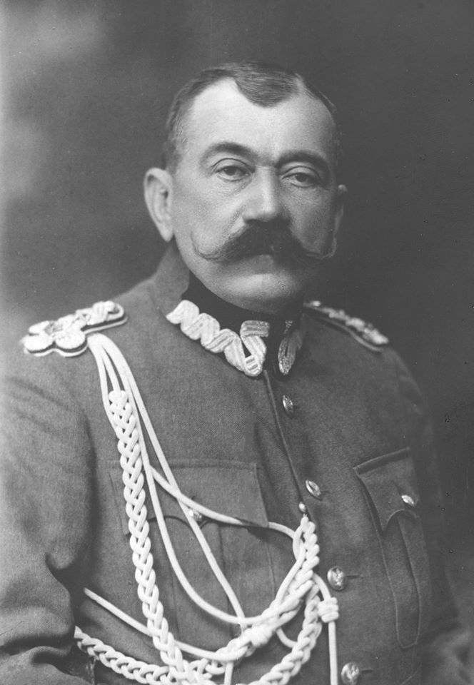

### 2020

  

### 1982

W Warszawie powstała Komisja Współpracy Pism Niezależnych. Był to organ zrzeszający wydawców pism podziemnych. Jego twórcami byli przedstawiciele takich wydawnictw jak"CDN-Głos Wolnego Robotnika", "KOS", "Tygodnik Wojenny", "Wolę".

  

### 1981

W Warszawie rozpoczęły się trwające sześć dni obrady IX Nadzwyczajnego Zjazdu Polskiej Zjednoczonej Partii Robotniczej.
W obliczu rosnącego w Polsce kryzysu gospodarczego i społecznego niezadowolenia było to wydarzenie przełomowe. Delegacji podjęli dyskusję o rozwoju socjalistycznej demokracji. Rozmawiano również o umocnieniu przewodniej roli PZPR w budownictwie socjalistycznym i stabilizacji społeczno-gospodarczej kraju. Jednak zasadniczym punktem obrad było usunięcie z szeregów partii Edwarda Gierka, Edwarda Babiucha, Jerzego Łukaszewicza, Tadeusza Pyki, Jana Szydlaka i Zdzisława Żandarowskiego.

  

### 1860

Urodził się Jan Rządkowski - jeden z bohaterów Bitwy Warszawskiej.
13 sierpnia 1920 r. Bolszewicy zdobyli miasto Radzimin, przełamując linię obrony Warszawy. Po południu 14 sierpnia 1. dywizja litewsko-białoruska (dowódca dywizji - Jan Rządkowski) zaatakowała wojska bolszewickie i strąciła je z Radzimina, ale nie była w stanie zorganizować obrony miasta. Kontratak wojsk rosyjskich odepchnął polskie jednostki z powrotem. Rano 1. dywizja litewsko-białoruska zaatakowała Radzymin z frontu. Ważną rolę w tym frontalnym ataku odegrały czołgi Renault FT, które przedarły się przez pozycje rosyjskie, a 85 pułk strzelców wileńskich zmusił jednostki bolszewickie do opuszczenia Radzimina. Kontratak rosyjskiej 61. i 62. brygady piechoty spowodował jednak przesunięcie 85. pułku na pierwotną pozycję.W tym samym czasie 28. i 29. pułki 10. Dywizji Piechoty z północy okrążyły Radzymin i zdobyły wieś Mokre, położoną na tyłach Rosjan. Próby bolszewików odepchnięcia Polaków nie powiodły się. 1. dywizja litewsko-białoruska ponownie rozpoczyna atak na Radzimin.W tej sytuacji rosyjskie brygady, bojąc się środowiska, wycofały się z Radzimina. 16 sierpnia Rosjanie próbowali ponownie schwytać Radzimina i Mokrego. Ale ich ataki zakończyły się niepowodzeniem. Tego samego dnia rozpoczął się kontratak 3 i 4 polskiej armii od południa na tyły rosyjskiej 16 armii, która opowiedziała się za polską drogą wojny.
Jan Rządkowski to były rosyjski oficer, który dokonywał wyczynów w armii rosyjskiej. 1 sierpnia 1915 r. podczas rekolekcji w pobliżu wsi Olshanka ppłk. Jan Rządkowski, który dowodził 739. Nowoaleksandryjskiej jednostką milicji dowiedziała się, że żołnierze niemieccy odkryli niezabezpieczony odcinek rosyjskiej linii obrony i i zbliżali się tam, grożąc otaczają rosyjskie części. W tej sytuacji Rządkowski, osobiście dowodzący oddziałem, zajął opuszczoną linię obrony i spotkał się z Niemcami z karabinem maszynowym i ostrzałem z karabinu, odpychając ich ofensywę. Za ten wyczyn Jan Rządkowski otrzymał broń św. Jerzego.

  

---

<a href="https://github.com/TomaszWaszczyk/historia.waszczyk.com/edit/master/src/content/july-14.md" target="_blank">Edytuj tę stronę dzieląc się własnymi notatkami!</a>
