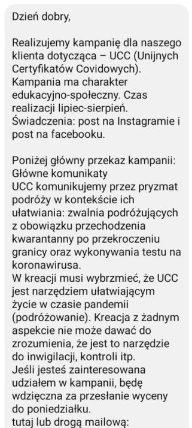
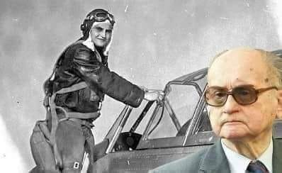
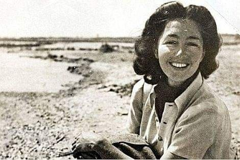
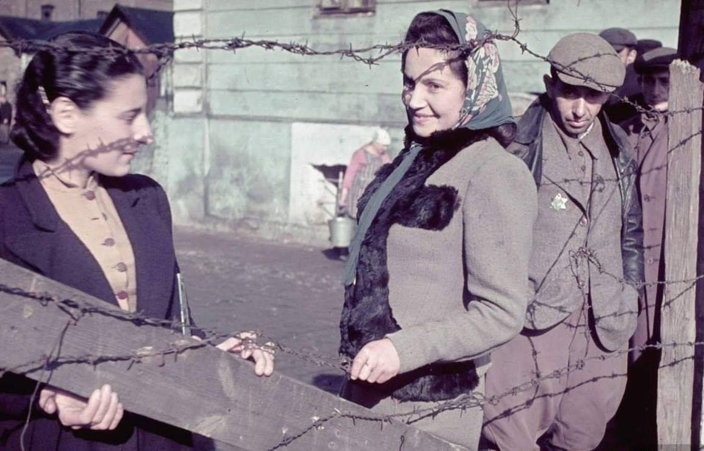
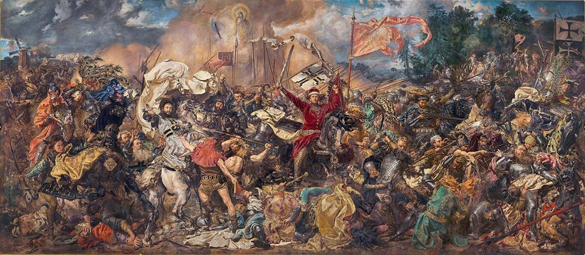

### 2021

  

### 2020

NBP: Recesja może być znacznie głębsza, niż się spodziewacie.

---

Twórca wskaźnika Altmana oczekuje serii wielkich bankructw

Edward Altman, twórca wskaźnika sygnalizującego możliwością upadłości firmy, ostrzega amerykańskich inwestorów z rynku kredytu, że seria wielkich bankructw w USA właśnie się rozpoczęła.
Altman zauważył, że od stycznia już ponad 30 amerykańskich firm z długiem przekraczającym 1 mld USD wystąpiło o ochronę przed roszczeniami wierzycieli. Jego zdaniem, ich liczba przekroczy 60 do końca tego roku, bo firmy nagromadziły olbrzymie ilości długu podczas pandemii. Z wyliczeń Bloomberga wynika, że globalne firmy emitowały obligacje rekordowej wartości 2,1 bln USD w tym roku, z czego połowa przypadła na emitentów z USA.

<!-- Na skutek pandemii, w samym kwietniu wyrejestrowano z ZUS ponad 165 tysięcy pracowników etatowych (czytaj: zwolniono). O statystykach zwolnień ludzi na umowach o dzieło i zleceniach się nie mówi.
Szacuje się, że stopa bezrobocia w Polsce wzrośnie (w lipcu) z 5% do 10% (dlaczego lipiec? bo ludzie mają trzymiesięczny okres wypowiedzenia).
W marcu zamknięto ponad 60 tysięcy firm. W kwietniu około 32 tysiące. W maju na szczęście tendencja jest wzrostowa (więcej rejestracji niż zamknięć).
Rząd zadłużył państwo jeszcze bardziej przez walkę z pandemią (nie mieli wyboru - to było konieczne).
A teraz zbliżają się wybory prezydenckie i prezydent będzie miał zadanie, jakiego za mojego życia nie miał żaden inny człowiek na jego miejscu - będzie (wraz z rządem) musiał odbudować polską gospodarkę.
Potrzeba nam więc kogoś, który zna się na ekonomii i sprawach gospodarki i kogoś, kto skoncentruje się na naprawieniu tego, co 'pandemia zepsuła'.
To są PRAWDZIWE problemy, jakie teraz ma nasz kraj.
A tymczasem media przedstawiają nam swoją wersję prawdziwych problemów i swoje podpowiedzi, jak należy wybrać prezydenta.
Według mediów nasz kraj zmaga się obecnie z ogromnym problemem związanym z ideologią LGBT. Straszną rzeczą jest też to, że niektórzy kandydaci na prezydenta nie są katolikami, a niektórzy nawet nie ochrzcili swoich dzieci.
Bardzo ważnym elementem odbudowy gospodarki jest także dofinansowanie wakacji dla dzieci z biedniejszych rodzin. 
Super ważną kartą przetargową jest także sprawa legalizacji aborcji, w której nic nie zmieniło się od 1993 roku, ale teraz jest akurat idealny czas, aby do niej wrócić, bo lepszego momentu nie było w ciągu ostatnich 27 lat 🤷‍♂️ 
Po prostu głowa mi eksploduje od tych głupot 🤯
Same tematy odwracające uwagę od realnych problemów.
Będziemy mieć super prezydenta, który jest prawdziwym Polakiem, nie lubi LGBT, chodzi do kościoła, ma ochrzczone dzieci i nawet nie jada śniadań z grupą Bilderbergów 💪
Przy okazji będzie bieda, bezrobocie, a gospodarka się zawali... ale za to dostaniemy 500zł na wakacje nad polskim morzem! Akurat wystarczy na Pendolino i dwa kawałki ryby w nadmorskiej restauracji.
1) Przeraża mnie to pranie mózgów przez media.
2) Smuci mnie, że kandydaci, zamiast skupić się na realnych problemach, dyskutują o tym, co podrzucają im media, bo to są chwytliwe tematy i tylko one mogą pomóc zdobyć poparcie -->

---

### 1975

Podczas próby ucieczki z Polski do Austrii czechosłowacki myśliwiec zestrzelił AN-2, którego pilotem był emerytowany pilot Ludowego Wojska Polskiego Dionizy Bielański. Do incydentu doszło zaledwie 8 km od granicy z Austrią. Bielański zginął na miejscu. Zostawił żonę i dwie małe córki.
Według śledztwa prowadzonego przez IPN, czechosłowaccy wojskowi mieli zeznać, że rozkaz zestrzelenia Bielańskiego wydał ówczesny minister obrony narodowej generał Wojciech Jaruzelski. Ma to również potwierdzać notatka służbowa wysokiego rangą funkcjonariusza wrocławskiej Służby Bezbieczeństwa. 
Ówczesne władze Czechosłowacji i Polski starały się wyciszyć sprawę zestrzelenia An-2 i śmierci Bielańskiego, nazywając to awarią.

Dionizy Bielański miał 36 lat.

  

### 1963

https://de.wikipedia.org/wiki/Neues_%C3%96konomisches_System_der_Planung_und_Leitung

### 1952

W londyńskim hotelu „Shelbourne” zamordowana została Krystyna Skarbek - polska agentka w służbie brytyjskiej SOE podczas II wojny światowej.
Krystyna Skarbek została zamordowana, ponieważ odrzuciła oświadczyny Dennisa Muldowneya, który był jej fanatycznym wielbicielem. Dennis został ujęty i skazany na śmierć.
Krystyna Skarbek pochowana została na katolickim cmentarzu Kensal Green St. Mary w Londynie.
Została uhonorowana francuskim Croix de Guerre, Orderem Imperium Brytyjskiego oraz Medalem Jerzego.

  

### 1940

Niemcy założyli getto żydowskie w Kutnie. Powstało ono na terenie dawnej cukrowni "Konstancja".
Określenie "założyli getto" to bardzo łagodny opis tego wydarzenia,za którym kryje się bardzo brutalna akcja przesiedlania tych mieszkańców Kutna i okolic,którzy mieli pochodzenie żydowskie. Przesiedlono tam 8 tysięcy ludzi.
Nie trzeba chyba dodawać,że panujące tam warunki sanitarne i socjalne urągały ludzkiej godności.
Zimą 1940/1941 i 1941/1942 roku getto
zostało całkowicie pozbawione opału. Zaczęły szerzyć  się epidemie tyfusu i gruźlicy. Ludzie umierali z głodu, zamarzali, popełniali samobójstwa.
Władze na terenie getta, w imieniu okupanta niemieckiego, sprawowała Rada Żydowska – Judenrat.  Na jej czele stali: Bernard Holcman,
Sender Falz, Opoczyński. W powszechnej opinii rada ta uchodziła za wyjątkowo skorumpowaną. 
19 marca 1942 rozpoczęła się równie brutalna akcja likwidacyjna getta. Więźniów mordowano na miejscu,a tych,których nie zdołano zlikwidować wywożono do Chełmna nad nad Nerem,gdzie mordowano ich w tamtejszym lesie.
W ostatnią drogę Żydzi kutnowscy nie mogli zabierać ze sobą bagaży, za sam przejazd natomiast musieli zapłacić po 12 – 20 marek.
Po likwidacji getta sprowadzono na jego teren czterdziestu  Żydów z łódzkiego getta, którzy przez pół roku segregowali pozostawione mienie i sprzątali teren.

  

### 1410

Miała miejsce jedna z największych bitew w historii średniowiecznej Europy, to bez wątpienia jedna z najbardziej znanych dat polskiej historii. Na Polach Grunwaldu połączone siły Królestwa Polskiego i Wielkiego Księstwa Litewskiego pod dowództwem króla Polski Władysława II Jagiełły, starły się z elitą wojsk Zakonu Krzyżackego wspartą przez ciężkozbrojne rycerstwo z całej Europy Zachodniej pod dowództwem wielkiego mistrza Ulricha von Jungingena. Miażdżące zwycięstwo wojsk polsko-litewskich złamało potęgę Zakonu i przeszło do historii jako jedno z najwspanialszych zwycięstw oręża polskiego.

  

---

<a href="https://github.com/TomaszWaszczyk/historia.waszczyk.com/edit/master/src/content/july-15.md" target="_blank">Edytuj tę stronę dzieląc się własnymi notatkami!</a>
