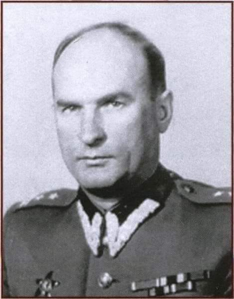

### 2020

"Jestem zdegustowana. Ja, symbol Francji, ledwo rozpoznaję moją ojczyznę, którą najechała banda obcych łajdaków zagrażających autentycznemu Francuzowi. Znaczna część Francji nie należy już do Francuzów. To jest paskudne". Po czym jeszcze dodała: "Jestem zniesmaczona i przerażona. Francja jest dziś rządzona przez tchórzy bez jaj. To rząd pantoflarzy, wystraszonych królików, srających w gacie kastratów". Jeden z wiecznych symboli Francji, symboli kina i sexu lat 60'- Brigitte Bardot.

### 2001

https://en.m.wikipedia.org/wiki/Public_Finance_Balance_of_Smoking_in_the_Czech_Republic

### 1996

W wieku 84 lat zmarł Hipolit Duljasz (zdjęcie ) pułkownik Milicji Obywatelskiej, dyrektor Centralnego Zarządu Więziennictwa MSW, dyrektor Departamentu VI Ministerstwa Bezpieczeństwa Publicznego, kierownik Wojewódzkiego Urzędu Bezpieczeństwa Publicznego w Kielcach i Bydgoszczy.
Z wykształcenia był ślusarzem- mechanikiem . W wieku 19 lat został skazany na osiem lat pozbawienia wolności za prowadzenie działalności komunistycznej. Po agresji niemiecko-sowieckiej we wrześniu 1939 roku uciekł do Łucka, gdzie brał udział w organizowaniu tam władzy sowieckiej. Rok później przeniósł się do Lwowa, gdzie został racjonalizatorem i przewodniczącym Komitetu Fabrycznego w Remontowej Bazie Samochodów i Czołgów. We wrześniu 1943 roku podjął służbę w 2. Dywizji Piechoty imienia Jana Henryka Dąbrowskiego, w której pełnił funkcję zastępcy dowódcy do spraw polityczno-wychowawczych. W roku 1944 objął tę samą funkcję w sowieckim oddziale partyzanckim dowodzonym przez majora Czesława Klima. W sierpniu tego samego roku został kierownikiem kieleckiej placówki UB. W 1956 roku ukończył Centralną Szkołę Partyjną.  Został pochowany na Cmentarzu Komunalnym Północnym w Warszawie.
Odznaczony Krzyżem Kawalerskim Orderu Odrodzenia Polski i Krzyżem Walecznych.

  

### 1949

Wpisywało się w szerszy kontekst komunistycznego planu podporządkowania sobie świata, a także w opresyjną ideologię, na którą składały się m.in. szpiegomania, zastraszanie obywateli, stosowanie odpowiedzialności zbiorowej❓

Noc z 16 na 17 lipca 1949 r. stała się dla wielu mieszkańców Elbląga początkiem życiowego dramatu. Pożar hali nr A20 Zakładów Mechanicznych im. Karola Świerczewskiego oznaczał dla nich aresztowania, wyroki sądowe i więzienną gehennę.

⚠️ #WładzeKomunistyczne szybko uznały, że za pożar odpowiadają francuscy szpiedzy. Tyle wystarczyło, żeby przeprowadzić masową akcję represji wobec Elblążan, niemających często żadnego związku z „Zamechem”. Podejrzanym mógł zostać każdy, nie tylko reemigranci z Francji.

Tak zwana #SprawaElbląska z czasów stalinowskich przez cały #PRL była dumą bezpieki z wykrycia „szpiegów” i „sabotażystów”. Nie przeszkadzał fakt uniewinnienia w 1956 r. większości z torturowanych oskarżonych. Jeszcze dziś według prawa niektórzy są szpiegami....

  

  

### 1942

"Szykują się do utworzenia nowej formacji policji żydowskiej, która ma już nawet trafną nazwę: „KOP” (Korpus Ochrony Pogranicza – dawna polska straż graniczna). Zadaniem tej formacji byłoby strzeżenie getta przed przedostawaniem się szmuglowanych towarów. Mury getta zostaną oznaczone wielkimi białymi numerami (każde 50 metrów będzie miało numer). Policjanci spod murów będą mieli oddzielne rejony i otrzymają specjalne wynagrodzenie: 10 zł dziennie oraz większy przydział chleba i innych produktów. […] Ochotników zgłosiło się mało, wyznaczono więc policjantów, którzy zostaną odkomenderowani do tej paskudnej i niebezpiecznej roboty (każdy policjant będzie odpowiedzialny za szmugiel na swoim odcinku). Jest to szatański plan, który zmierza do wygłodzenia getta przy pomocy samych Żydów. Nie po raz pierwszy zresztą okupant zmusza ludność żydowską do wykopania sobie grobu, postępuje tak stale."
Emanuel Ringelblum, 16 czerwca 1942, Warszawa.

---

<a href="https://github.com/TomaszWaszczyk/historia.waszczyk.com/edit/master/src/content/july-16.md" target="_blank">Edytuj tę stronę dzieląc się własnymi notatkami!</a>
