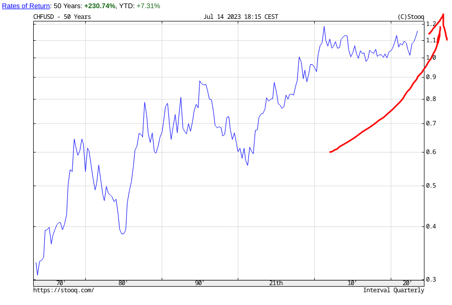
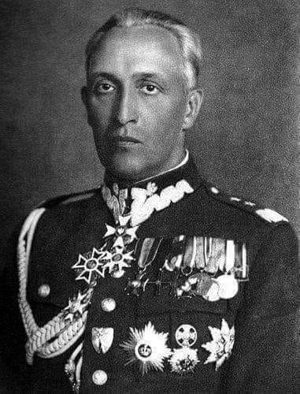
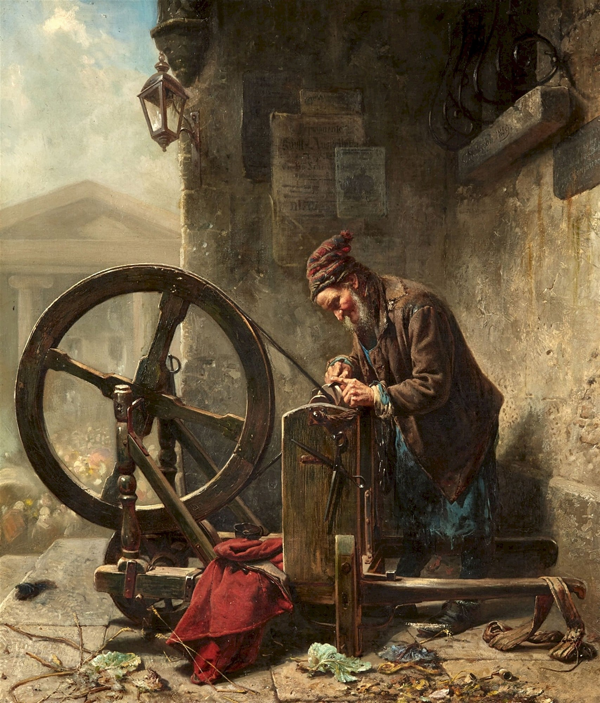
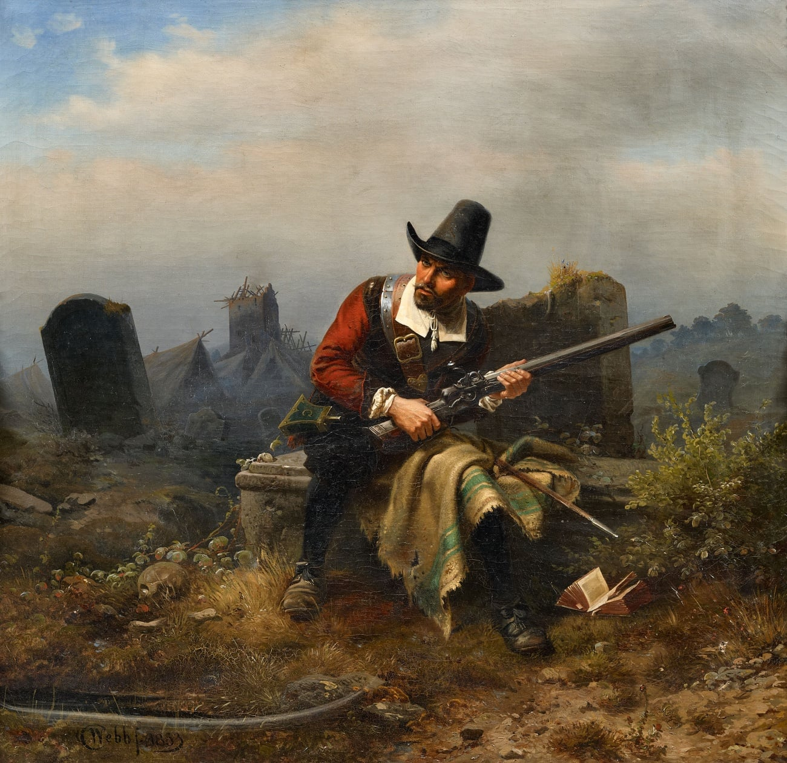
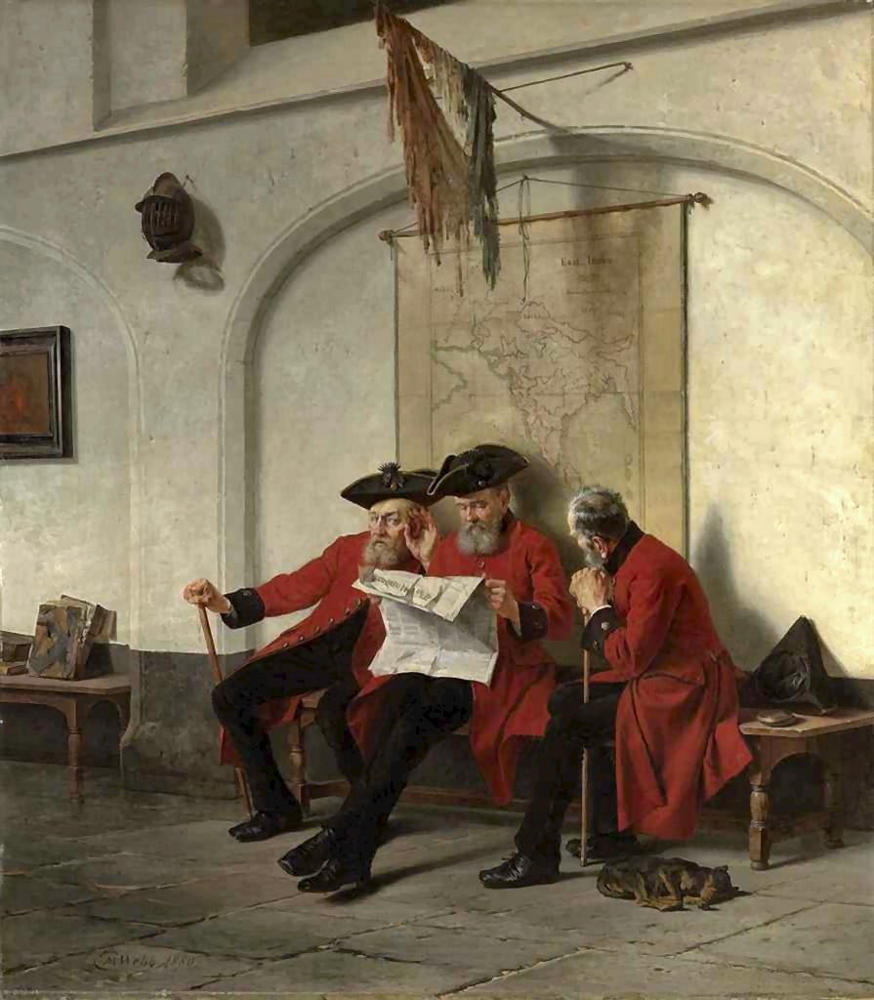
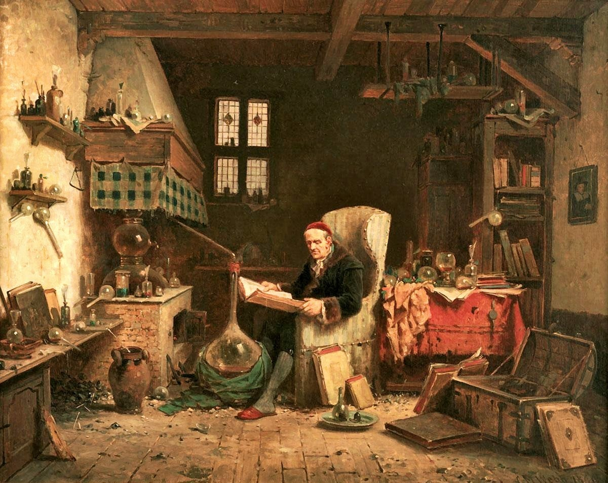

### 2023

CURRENCY WARS: the swiss franc, after years of accumulation is climbing

  

---

  

---

Relationships in China on the one vid:

<video width="640" height="480" controls>
<source src="./movies/july/china.mp4" type="video/mp4">
Your browser does not support the video tag.
</video>

---

### 2022

> “We are facing the biggest crisis the country has ever had. We have to be honest and say: First of all, we will lose the prosperity that we have had for years,” Dulger told the Süddeutsche Zeitung regarding the consequences of a gas shortage to everyone.

### 2021

Jane Goodall in Davos: "All these [environmental] things we talk about wouldn’t be a problem if there was the size of population that there was 500 years ago.”

The world population 500 years ago is estimated between 420 and 540 million —  6.7 billion fewer people than today.

---

Ludzkość stoi w obliczu epokowych wyzwań. Sprostanie im wymusza zmiany stylu życia, z czym skorelowane musi być odmienne niż dotychczas funkcjonowanie gospodarki. To wszystko zaś determinuje konieczność zredefiniowania celu gospodarowania. Te epokowe wyzwania wynikają z nakładania się siedmiu mega-trendów znamiennych dla współczesności:

1. przemian demograficznych, zwłaszcza starzenie się ludności i ogromnego rozstrzelenia współczynników dzietności,
2. zmian środowiskowych, zwłaszcza wyczerpywania się nieodnawialnych zasobów i ocieplanie klimatu,
3. rewolucji naukowo-technologicznej, zwłaszcza cyfryzacji gospodarki i kultury oraz automatyzacji,
4. nieinkluzywnej globalizacji, zwłaszcza narastania obszarów wykluczenia i nierówności,
5. ogólnego kryzysu neoliberalnego kapitalizmu, zwłaszcza strukturalnej nierównowagi gospodarczej,
6. kryzysu liberalnej demokracji, zwłaszcza towarzyszącej mu polaryzacji społeczeństw,
7. drugiej zimnej wojny, zwłaszcza konfliktu USA – Chiny.  

Kapitalizm nie radzi sobie sam z sobą. Niedostatek uczciwej konkurencji, zła regulacja, korupcja polityków i biurokracji, prywata elit biznesowych i finansowych, zachłanność i chciwość do tego stopnia, że w najlepszych szkołach biznesu uczono, iż chciwość jest cnotą, oszustwa producentów, dystrybutorów i usługodawców od sektora bankowego poprzez motoryzacyjny po farmaceutyczny, nakręcanie konsumpcjonizmu śrubującego kapitalistyczne zyski, sprzedajne media z ich manipulacjami opinią publiczną, cynizm elit politycznych – to wszystko musiało przynieść zgniłe żniwo. Skażony rynkowym fundamentalizmem kapitalizm bez zmiany swej istoty, a więc przyświecającego mu systemu wartości oraz zasad funkcjonowania, może nie przetrwać obecnego dziejowego zakrętu. To o tyleż ciekawe, co trudne i niebezpieczne, bo od razu wyłania się masa pytań. Co dalej? Co w zamian? Jeśli zaiste postkapitalizm, to jaki? Na czym pożądane zmiany mają polegać, skoro pozostaje tylko ucieczka do przodu? Nie ma bowiem do czego wracać. Nie można stosować starych technologii do budowy nowego gmachu na nowej planecie. A Ziemia XXI wieku to zgoła inna planeta w porównaniu do tej z poprzednich wieków.
Dobra gospodarka musi być efektywna i konkurencyjna, ale to tylko środki, których nie należy mylić z celem – zaspokajaniem potrzeb. Dobra gospodarka wymaga dobrej polityki. Dobra polityka zaś polega na tym, aby dawać ludziom nie to, czego chcą, lecz to, czego potrzebują. To imperatyw gospodarki umiaru, którą opisuje i której ma służyć ekonomia umiaru. Bynajmniej nie chodzi tu o narzucanie przez uzurpatorów siłą wymyślonych przez nich wzorców konsumpcji i stylu życia, ale o wpływanie nań w publicznym, demokratycznym dyskursie. Musi on cechować się odpowiedzialnością i opierać na wynikach badań naukowych, które mówią, co obiektywnie jest zdrowe oraz korzystne indywidualnie i społecznie. Tak więc realna polityka ma nie tylko trafnie wychwytywać preferencje społeczne, lecz również sensownie je stymulować. Dobre wychowywanie oraz społeczne oddziaływanie na pożądane z punktu widzenia zrównoważonego rozwoju i poprawy dobrostanu wzorce konsumpcji polegać muszą na takim kształtowaniu preferencji konsumpcyjnych, aby ludzie jak najczęściej chcieli tego, co im dobrze służy. Ogrom wiedzy, której dostarcza ekonomia behawioralna, ułatwia pracę na tym polu. Niestety, wiedza ta jakże skutecznie wykorzystywana jest w przeciwstawnym celu.
W minionych dekadach wiele szkód w myśli ekonomicznej poczyniła neoliberalna doktryna, która przyjmuje kilka iluzorycznych założeń. Pierwsze z nich to że rynek funkcjonuje w warunkach pełnej konkurencji. W jakimś stopniu zawsze tak, nigdy przy konkurencji doskonałej, bo w ogromnej mierze rynki mają charakter oligopolistyczny – od wielkich sieci handlu detalicznego i linii lotniczych poprzez banki i agencje ubezpieczeniowe po firmy farmaceutyczne i media społecznościowe. Naciski kręgów neoliberalnych na deregulację w istocie polegają na domaganiu się – i często uzyskiwaniu – pożądanych przez nie przepisów nie tyle pogłębiających środowisko konkurencyjne, ile ułatwiających im maksymalizację własnych korzyści poprzez pogoń za zyskiem. Nie raz i nie dwa deregulacja sprowadza się do ułatwienia wycięcia z rynku relatywnie słabszych konkurentów niewygodnych dla silniejszych firm. W wielu przypadkach sprzyja temu obłudna polityka, która co innego głosi, a co innego robi. To musi ulec zmianie, a sposobem na to jest ewolucja w stronę społecznej gospodarki rynkowej oraz szersze uwzględnianie interesów średnich i małych przedsiębiorstw oraz ich interesariuszy.
Nie starcza też racjonalności podmiotów gospodarczych, zarówno przedsiębiorstw, jak i gospodarstw domowych. Racjonalny jest ten, kto działa na własną korzyść, zważywszy na informacje. Przyjmując przez chwilę, że ludzie dobrze wiedzą, co jest dla nich korzystne w ich rozmaitych rolach ekonomicznych – a jeśli nie wiedzą, to wiedzą, gdzie i od kogo mogą się tego dowiedzieć – decydują informacje. Często występuje tu asymetria – nierównowaga na korzyść z reguły lepiej poinformowanych producentów i sprzedawców. Nabywcy i konsumenci mają słabszą pozycję. Świadomie jest ona jeszcze dodatkowo pogarszana przez siły manipulujące nabywcami i dezinformujące ich poprzez marketing i reklamę tak, aby sądząc, że działają na własną korzyść, w rzeczywistości dostarczali dochody i generowali zyski komuś innemu.
Chronić konsumenta, wspierać konkurencję
Potężne siły triady: władza – kapitał – informacje (albo inaczej: polityka – pieniądze – media) działają jakże często po to, aby człowiek na rynku był nieracjonalny. To potęga obywatelskiego państwa – z jego regulacją rynków – ma temu przeciwdziałać. Rynek, nawet gdyby był w pełni konkurencyjny, nigdy sam z siebie tego syndromu nie rozwiąże. Potrzebna tu jest edukacyjna i instytucjonalna interwencja państwa. To jego obowiązek. Wolność zaiste polega na możliwości dokonywania wyboru, ale autentyczna wolność występuje jedynie wtedy, gdy wyborcy – tu nabywcy i konsumenci – są rzetelnie poinformowani, co kupują i co spożywają.
Trzeba dokonać ogromnego wysiłku w tworzeniu właściwej instytucjonalnej obudowy rynku, aby w jak największym stopniu zbliżyć realia współczesnej gospodarki rynkowej do ideału pełnej konkurencji w warunkach doinformowania podmiotów gospodarujących. Bez postępu na tym polu także suwerenność konsumenta będzie iluzoryczna. Jej warunkiem jest świadomość wariantów wyboru i związanej z nimi użyteczności krańcowej. Kierunki niezbędnych na tych polach reform strukturalnych wymagają zasadniczego systemowego i politycznego wzmocnienia publicznych urzędów nadzorujących rzetelną konkurencję i chroniących interesy konsumentów. 
To oczywiste, że gospodarka nadal opierać musi się na dominacji prywatnych przedsiębiorstw, tyle że ich funkcjonowanie i ekspansja muszą być przez państwo regulowane w interesie ogólnospołecznym. Celem przedsiębiorcy pozostaje maksymalizacja stopy zwrotu z zaangażowanego kapitału, czemu państwo stosowną obudową instytucjonalną ma sprzyjać, natomiast ma ono utrudniać mu śrubowanie własnych korzyści poprzez bezwzględny wyzysk interesariuszy i przerzucanie na nich części ponoszonych kosztów oraz przechwytywanie w różnych fazach i kanałach dystrybucji dochodów wypracowanych przez kogo innego. Państwo właściwą regulacją rynków, w tym troską o obieg informacji i walką z dezinformacją, ma zachęcać do rozkwitu przedsiębiorczości i skłaniać do inwestycji, ale zarazem tak wpływać na gospodarowanie, aby było ono zbieżne z makroekonomicznym celem poprawy dobrobytu społeczeństwa. Tam gdzie możliwe jest instytucjonalne i polityko-gospodarcze zgrywanie interesów akcjonariuszy oraz interesariuszy, należy to konsekwentnie czynić. Dobre praktyki w tym zakresie wnosi ordoliberalizm i społeczna gospodarka rynkowa, w tym kierunku zmierza nowy pragmatyzm.
Współcześnie istotnym nowym elementem składowym gospodarowania jest to, że na formowanie i alokację kapitału niekiedy wpływ bardziej znaczący niż własność ma dostęp do rzetelnej informacji. Kwestia ta ma tak swój wymiar techniczny, jak i moralny. Tym bardziej trzeba zabiegać o rzetelność w gospodarowaniu, o wysokie standardy etyczne w biznesie i w polityce gospodarczej. Aby gospodarka była dobra, musi być uczciwa, co raz jeszcze dotyka kwestii zdrowej konkurencji rynkowej i dobrej regulacji państwowej.
Kapitaliści, wystraszywszy się fali populizmu, chaotycznych reakcji niektórych polityków i antyestablishmentowych sentymentów, deklarują gotowość zatroszczenia się o interesy innych, nie tylko swoje. Nie można dać się temu łatwo zwieść, bo to nic innego jak swoista taktyka w obliczu obawy utraty własnej potężnej pozycji. Ogłoszenie przez ponad 180 top-menedżerów wielkich firm na spotkaniu America Business Roundtable, że to nie maksymalizacja wartości dla akcjonariuszy jest ich głównym celem, a satysfakcjonowanie wszystkich interesariuszy, to mydlenie oczu, które ma odsuwać determinację polityki, by zmienić regulacje na bardziej uwzględniające cele społeczne. Gdy wielki business – zwłaszcza ten, który nie ma ani czystych rąk, ani czystego sumienia – słyszy zapowiedzi prezydenta Joe Bidena co do planowanych zmian systemowych i przewartościowań polityki gospodarczej, to jest skłonny deklarować niemal przejście na pozycje quasi-socjalistyczne. Na krótko i na papierze. Chyba że…
Może być lepiej, nie musi
Chyba że zaiste nadchodzi kolejna wielka zmiana pod wpływem koincydencji rosnącej oddolnej presji znaczących odłamów społeczeństw niezadowolonych z istniejącego stanu rzeczy i determinacja niektórych światłych przywódców politycznych, iż powinno i może być inaczej niż dotychczas, iż może być lepiej. Historia zna przecież takie przypadki. Pod rosnącą presją coraz lepiej zorganizowanego ruchu robotniczego i widma komunizmu, które krążyło po Europie, kapitalizm końca XIX wieku stał się mniej paskudny niż ten z jego początków, aczkolwiek nadal trzeba było walczyć o zakaz pracy dzieci czy też o ośmiogodzinny dzień pracy. Później, w latach 1960., niebłahym pchnięciem kapitalizmu na nowe, lepsze tory był program prezydenta Lyndona B. Johnsona Great Society. Było to uwarunkowane zbiegiem masowych protestów przeciwko jaskrawej niesprawiedliwości wyrażającej się w występowaniu olbrzymich obszarów wykluczenia społecznego i biedy oraz dyskryminacji rasowej, z jednej strony, oraz presji wynikającej z percepcji pozytywnych przykładów płynących z gospodarki socjalistycznej charakteryzującej się pełnym zatrudnieniem, bezpłatną ochroną zdrowia, powszechną edukacją, państwową promocją kultury i bezpieczeństwem na ulicach, z drugiej strony. Postępowe zmiany, które wówczas wprowadzono w Stanach Zjednoczonych, a które naśladowano również w niektórych innych krajach, z czasem nabierały trwałego charakteru.
Czy podobnie będzie i tym razem? Protestów przeciwko nieakceptowanemu stanowi rzeczy nie brakuje, ale już jakby zapominano o głośnych kilka lat wcześniej akcjach Occupy Wall Street i Occupy London. Czy starcza światłych przywódców dążących do autentycznych zmian pro publico bono? Czy mają oni do czego sięgnąć? Czy są idee i programy polityczne, które są dostatecznie atrakcyjne, ale zarazem – co najważniejsze – pragmatyczne? Czy są nowe teorie ekonomiczne, na których praktyczne programy mogą się oprzeć? Czy uda się je przeforsować, łamiąc konserwatyzm i opór grup specjalnych interesów?
To jest czas przełomowy i trzeba bardzo uważać, by ani nie dać się zwieść obłudzie części elit biznesu i polityki, ani nie popaść na bezdroża populizmu. Jeśli to się uda, to kapitalizm przetrwa, choć być może z czasem będzie to na tyle nowa jakość, że trzeba będzie nań wymyślić nowy termin. Ale trzeba bardzo uważać, bo dwa razy do tej samej rzeki wejść nie sposób, ale dwa razy wdepnąć w to samo bagno można.

### 2020

"Jestem zdegustowana. Ja, symbol Francji, ledwo rozpoznaję moją ojczyznę, którą najechała banda obcych łajdaków zagrażających autentycznemu Francuzowi. Znaczna część Francji nie należy już do Francuzów. To jest paskudne". Po czym jeszcze dodała: "Jestem zniesmaczona i przerażona. Francja jest dziś rządzona przez tchórzy bez jaj. To rząd pantoflarzy, wystraszonych królików, srających w gacie kastratów". Jeden z wiecznych symboli Francji, symboli kina i sexu lat 60'- Brigitte Bardot.

### 2012

<a href="./documents/july/Prezentacje-AI.2012.rar" target="_blank">Prezentacje-AI.2012</a>

### 2001

https://en.m.wikipedia.org/wiki/Public_Finance_Balance_of_Smoking_in_the_Czech_Republic

### 1996

W wieku 84 lat zmarł Hipolit Duljasz (zdjęcie ) pułkownik Milicji Obywatelskiej, dyrektor Centralnego Zarządu Więziennictwa MSW, dyrektor Departamentu VI Ministerstwa Bezpieczeństwa Publicznego, kierownik Wojewódzkiego Urzędu Bezpieczeństwa Publicznego w Kielcach i Bydgoszczy.
Z wykształcenia był ślusarzem- mechanikiem . W wieku 19 lat został skazany na osiem lat pozbawienia wolności za prowadzenie działalności komunistycznej. Po agresji niemiecko-sowieckiej we wrześniu 1939 roku uciekł do Łucka, gdzie brał udział w organizowaniu tam władzy sowieckiej. Rok później przeniósł się do Lwowa, gdzie został racjonalizatorem i przewodniczącym Komitetu Fabrycznego w Remontowej Bazie Samochodów i Czołgów. We wrześniu 1943 roku podjął służbę w 2. Dywizji Piechoty imienia Jana Henryka Dąbrowskiego, w której pełnił funkcję zastępcy dowódcy do spraw polityczno-wychowawczych. W roku 1944 objął tę samą funkcję w sowieckim oddziale partyzanckim dowodzonym przez majora Czesława Klima. W sierpniu tego samego roku został kierownikiem kieleckiej placówki UB. W 1956 roku ukończył Centralną Szkołę Partyjną.  Został pochowany na Cmentarzu Komunalnym Północnym w Warszawie.
Odznaczony Krzyżem Kawalerskim Orderu Odrodzenia Polski i Krzyżem Walecznych.

  

### 1949

Wpisywało się w szerszy kontekst komunistycznego planu podporządkowania sobie świata, a także w opresyjną ideologię, na którą składały się m.in. szpiegomania, zastraszanie obywateli, stosowanie odpowiedzialności zbiorowej❓

Noc z 16 na 17 lipca 1949 r. stała się dla wielu mieszkańców Elbląga początkiem życiowego dramatu. Pożar hali nr A20 Zakładów Mechanicznych im. Karola Świerczewskiego oznaczał dla nich aresztowania, wyroki sądowe i więzienną gehennę.

⚠️ #WładzeKomunistyczne szybko uznały, że za pożar odpowiadają francuscy szpiedzy. Tyle wystarczyło, żeby przeprowadzić masową akcję represji wobec Elblążan, niemających często żadnego związku z „Zamechem”. Podejrzanym mógł zostać każdy, nie tylko reemigranci z Francji.

Tak zwana #SprawaElbląska z czasów stalinowskich przez cały #PRL była dumą bezpieki z wykrycia „szpiegów” i „sabotażystów”. Nie przeszkadzał fakt uniewinnienia w 1956 r. większości z torturowanych oskarżonych. Jeszcze dziś według prawa niektórzy są szpiegami....

  

  

### 1942

"Szykują się do utworzenia nowej formacji policji żydowskiej, która ma już nawet trafną nazwę: „KOP” (Korpus Ochrony Pogranicza – dawna polska straż graniczna). Zadaniem tej formacji byłoby strzeżenie getta przed przedostawaniem się szmuglowanych towarów. Mury getta zostaną oznaczone wielkimi białymi numerami (każde 50 metrów będzie miało numer). Policjanci spod murów będą mieli oddzielne rejony i otrzymają specjalne wynagrodzenie: 10 zł dziennie oraz większy przydział chleba i innych produktów. […] Ochotników zgłosiło się mało, wyznaczono więc policjantów, którzy zostaną odkomenderowani do tej paskudnej i niebezpiecznej roboty (każdy policjant będzie odpowiedzialny za szmugiel na swoim odcinku). Jest to szatański plan, który zmierza do wygłodzenia getta przy pomocy samych Żydów. Nie po raz pierwszy zresztą okupant zmusza ludność żydowską do wykopania sobie grobu, postępuje tak stale."
Emanuel Ringelblum, 16 czerwca 1942, Warszawa.

### 1936

W katastrofie lotniczej przy molo w Orłowie zginął Gustaw Orlicz-Dreszer -  generał dywizji Wojska Polskiego, Inspektor Obrony Powietrznej Państwa oraz jeden z najbliższych współpracowników marszałka Józefa Piłsudskiego. Do tragedii doszło o godzinie 14.14, gdy generał chciał powitać swoją małżonkę Elwirę, która wracała statkiem z Nowego Jorku do portu w Gdyni. Generał zaplanował, że w sposób romantyczny powita swoją żonę i z awionetki rzuci na pokład statku bukiet czerwonych róż. Silny podmuch wiatru spowodował, że lecąca nisko awionetka runęła do morza. Pomimo natychmiastowej akcji ratunkowej nikogo nie udało się uratować. Razem z generałem śmierć ponieśli pilot kpt. Aleksander Łagiewski i płk dypl. Stefan Loth. 20 lipca generał spoczął na Cmentarzu Marynarki Wojennej w Gdyni.

  

### 1830

Charles Meer Webb 🎨  English painter (1830-1895)

  

  

  

  

  

---

<a href="https://github.com/TomaszWaszczyk/historia.waszczyk.com/edit/master/src/content/july-16.md" target="_blank">Edytuj tę stronę dzieląc się własnymi notatkami!</a>
