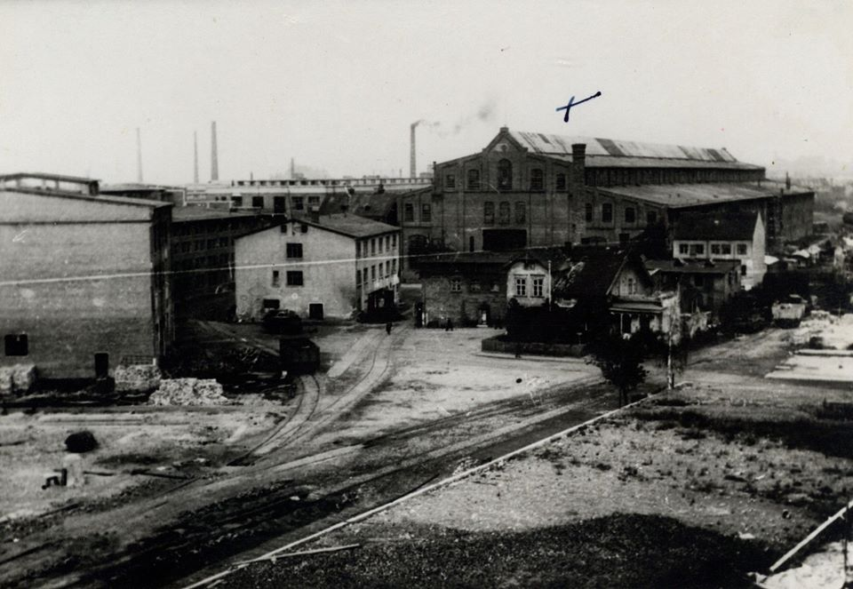
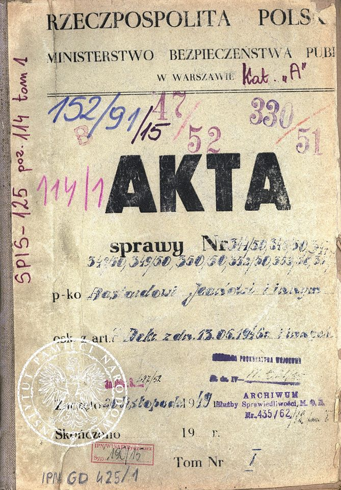

### 1949

Wpisywało się w szerszy kontekst komunistycznego planu podporządkowania sobie świata, a także w opresyjną ideologię, na którą składały się m.in. szpiegomania, zastraszanie obywateli, stosowanie odpowiedzialności zbiorowej❓

Noc z 16 na 17 lipca 1949 r. stała się dla wielu mieszkańców Elbląga początkiem życiowego dramatu. Pożar hali nr A20 Zakładów Mechanicznych im. Karola Świerczewskiego oznaczał dla nich aresztowania, wyroki sądowe i więzienną gehennę.

⚠️ #WładzeKomunistyczne szybko uznały, że za pożar odpowiadają francuscy szpiedzy. Tyle wystarczyło, żeby przeprowadzić masową akcję represji wobec Elblążan, niemających często żadnego związku z „Zamechem”. Podejrzanym mógł zostać każdy, nie tylko reemigranci z Francji.

Tak zwana #SprawaElbląska z czasów stalinowskich przez cały #PRL była dumą bezpieki z wykrycia „szpiegów” i „sabotażystów”. Nie przeszkadzał fakt uniewinnienia w 1956 r. większości z torturowanych oskarżonych. Jeszcze dziś według prawa niektórzy są szpiegami....

  

  

---

<a href="https://github.com/TomaszWaszczyk/historia.waszczyk.com/edit/master/src/content/july-16.md" target="_blank">Edytuj tę stronę dzieląc się własnymi notatkami!</a>
